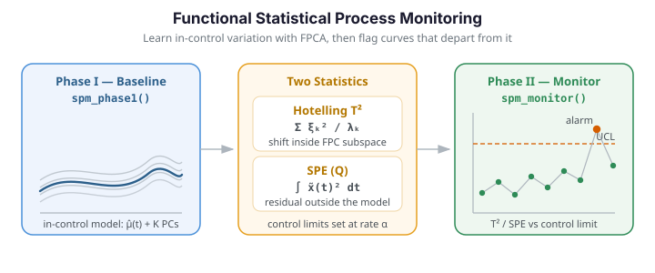

# Statistical Process Monitoring

Statistical Process Monitoring (SPM) extends the classical Shewhart control chart to
functional data. When the quantity under surveillance is a whole *curve* -- a spectral
profile, a temperature trajectory, a wafer-thickness scan -- collapsing it to a scalar
summary and charting that summary throws away most of the information about *how* the
curve is shaped. Functional SPM keeps the curve intact: it learns a low-dimensional model
of in-control variation with FPCA, then measures how far each new curve departs from that
model. The workflow has two phases:

1. **Phase I** -- Estimate the in-control distribution from historical "good" data and
   compute control limits at a false-alarm rate $\alpha$.
2. **Phase II** -- Project each incoming observation onto the learned subspace and check
   whether its $T^2$ or SPE statistic exceeds the limits; an **alarm** fires on a crossing.

### When to reach for functional SPM

| Situation | Approach |
|---|---|
| A single functional characteristic per unit | `spm_phase1` + `spm_monitor` (this page) |
| Small, slow drifts you want to catch early | EWMA / run rules -- see [advanced monitoring](advanced-spm.md) |
| A fault confined to a short sub-interval | slice the domain -- see [profile & partial monitoring](profile-partial-monitoring.md) |
| You need to know *why* a point alarmed | per-PC contributions -- see [advanced monitoring](advanced-spm.md) |

This page covers the core two-phase workflow. The [advanced](advanced-spm.md) and
[profile / partial](profile-partial-monitoring.md) pages build on the exact same Phase I
model for drift-sensitive charts, fault diagnosis, and localised monitoring.

---

{ .fdars-diagram }

## Concepts

### FPCA-based monitoring

Each curve $x_i(t)$ is centered by subtracting the mean $\hat\mu(t)$ and projected onto the first $K$ functional principal components, yielding a score vector $\boldsymbol\xi_i \in \mathbb{R}^K$. Two complementary statistics capture different kinds of departure:

| Statistic | What it measures | Formula |
|---|---|---|
| **Hotelling $T^2$** | Systematic shift in the FPC subspace | $T^2 = \sum_{k=1}^{K} \xi_k^2 / \lambda_k$ |
| **SPE (Q)** | Residual variation outside the subspace | $\mathrm{SPE} = \int [\tilde x(t)]^2 \, dt$ where $\tilde x$ is the reconstruction residual |

Control limits for both are estimated from the Phase I data so that the in-control false-alarm rate is approximately $\alpha$.

The figure below shows a Phase I reference sample (grey) together with a Phase II stream that contains two kinds of injected faults: a set of **amplitude-inflated** curves (which shift the $T^2$ statistic inside the FPC subspace) and a set of **oscillatory** curves carrying high-frequency structure the model cannot reconstruct (which inflates the SPE residual).

```python exec="1" html="1"
import numpy as np
from docs_fig import fig, render
from fdars.simulation import simulate

argvals = np.linspace(0, 1, 80)
ic  = np.asarray(simulate(120, argvals, n_basis=6, seed=7))       # Phase I baseline
ok  = np.asarray(simulate(24,  argvals, n_basis=6, seed=21))      # in-control Phase II
amp = np.asarray(simulate(3,   argvals, n_basis=6, seed=33)) * 3.0            # amplitude fault
osc = np.asarray(simulate(3,   argvals, n_basis=6, seed=41)) + 3.5 * np.sin(15 * argvals)  # oscillatory fault

f, ax = fig()
ax.plot(argvals, ic.T, color="#6c757d", lw=0.6, alpha=0.35)
ax.plot(argvals, ok.T, color="#3f51b5", lw=0.8, alpha=0.55)
ax.plot(argvals, amp.T, color="#e8710a", lw=1.6, label="amplitude fault")
ax.plot(argvals, osc.T, color="#dc3545", lw=1.6, label="oscillatory fault")
# de-duplicate legend labels
h, l = ax.get_legend_handles_labels()
seen = dict(zip(l, h))
ax.legend(seen.values(), seen.keys(), loc="upper right")
ax.set(title="Phase I baseline (grey) and Phase II stream with injected faults",
       xlabel="t", ylabel="x(t)")
print(render(f))
```

---

## Phase I -- estimating the baseline

```python
import numpy as np
from fdars import Fdata
from fdars.simulation import simulate
from fdars.spm import spm_phase1

# Generate 80 in-control curves on a 100-point grid
argvals = np.linspace(0, 1, 100)
fd_ic = Fdata(simulate(80, argvals, n_basis=5, seed=1), argvals=argvals)

# Phase I estimation (3 components, alpha = 0.05)
p1 = spm_phase1(fd_ic.data, fd_ic.argvals, ncomp=3, alpha=0.05)
```

`spm_phase1` returns a dictionary with the following keys:

| Key | Shape | Description |
|---|---|---|
| `t2` | `(n,)` | $T^2$ statistic for every Phase I observation |
| `spe` | `(n,)` | SPE statistic for every Phase I observation |
| `t2_limit` | scalar | Upper control limit for $T^2$ |
| `spe_limit` | scalar | Upper control limit for SPE |
| `mean` | `(m,)` | Estimated mean function $\hat\mu(t)$ |
| `loadings` | `(m, ncomp)` | FPCA rotation matrix (eigenfunctions) |
| `weights` | `(m,)` | Integration weights for the inner product |
| `eigenvalues` | `(ncomp,)` | Eigenvalues $\lambda_1, \dots, \lambda_K$ |

### Choosing `ncomp`

Retaining the right number of components balances two failure modes: too few and genuine
modes of variation leak into the residual, making the SPE chart over-sensitive; too many
and noise dimensions inflate the $T^2$ chart. `select_ncomp` turns the Phase I eigenvalues
into a recommendation under one of three classic criteria:

```python exec="1" html="1" source="above"
import numpy as np
from fdars.simulation import simulate
from fdars.spm import spm_phase1, select_ncomp

argvals = np.linspace(0, 1, 100)
p1 = spm_phase1(np.asarray(simulate(120, argvals, n_basis=6, seed=1)),
                argvals, ncomp=6, alpha=0.05)
eig = np.asarray(p1["eigenvalues"])

print("eigenvalues:", np.round(eig, 3))
print("cumulative_variance (95%):", select_ncomp(eig, "cumulative_variance", 0.95))
print("kaiser (eig > mean)      :", select_ncomp(eig, "kaiser"))
print("elbow (scree bend)       :", select_ncomp(eig, "elbow"))
```

| `method` | Rule | When it helps |
|---|---|---|
| `"cumulative_variance"` | Smallest $K$ reaching `threshold` of total variance (default 0.95) | The general-purpose default |
| `"kaiser"` | Keep components with eigenvalue above the mean | Quick, threshold-free screen |
| `"elbow"` | Locate the bend in the scree curve | When variance is concentrated in a few modes |

!!! tip "When in doubt, keep one more"
    Retaining slightly *more* components is the safer error: a missed mode of variation
    surfaces as a harder-to-interpret SPE alarm that a $T^2$ chart could have localised.

---

## Phase II -- monitoring new observations

```python
from fdars.spm import spm_monitor

# Simulate 20 new in-control observations + 10 faulty ones
data_new_ic = simulate(20, argvals, n_basis=5, seed=2)

# Inject a mean shift into the last 10 curves
data_fault = simulate(10, argvals, n_basis=5, seed=3) + 2.0
fd_new = Fdata(np.vstack([data_new_ic, data_fault]), argvals=argvals)

# Monitor
p2 = spm_monitor(
    mean=p1["mean"],
    loadings=p1["loadings"],
    weights=p1["weights"],
    eigenvalues=p1["eigenvalues"],
    t2_limit=p1["t2_limit"],
    spe_limit=p1["spe_limit"],
    new_data=fd_new.data,
    argvals=fd_new.argvals,
)
```

The returned dictionary contains:

| Key | Shape | Description |
|---|---|---|
| `t2` | `(n_new,)` | $T^2$ for each new observation |
| `spe` | `(n_new,)` | SPE for each new observation |
| `t2_alarm` | `(n_new,)` bool | `True` where $T^2$ exceeds the limit |
| `spe_alarm` | `(n_new,)` bool | `True` where SPE exceeds the limit |

```python
# How many faults were caught?
n_t2_alarms = int(p2["t2_alarm"].sum())
n_spe_alarms = int(p2["spe_alarm"].sum())
print(f"T2 alarms: {n_t2_alarms}, SPE alarms: {n_spe_alarms}")
```

---

## Hotelling $T^2$ from scores

`spm_monitor` returns the $T^2$ / SPE statistics and alarm flags, but *not* the raw FPC
scores. When you need the scores themselves -- to feed an EWMA chart, to break $T^2$ down
by component, or to compute $T^2$ by hand -- project the centered curves onto the Phase I
loadings. With integration weights $w(t)$ the score of curve $i$ on component $k$ is

$$
\xi_{ik} = \int \bigl[x_i(t) - \hat\mu(t)\bigr]\,\phi_k(t)\,dt
        \;\approx\; \sum_t \bigl[x_i(t) - \hat\mu(t)\bigr]\,\phi_k(t)\,w(t),
$$

which in NumPy is simply `((X - mean) * weights) @ loadings`. Passing the result to
`hotelling_t2` reproduces `spm_monitor`'s internal $T^2$ to machine precision:

```python exec="1" html="1" source="above"
import numpy as np
from fdars.simulation import simulate
from fdars.spm import spm_phase1, spm_monitor, hotelling_t2

argvals = np.linspace(0, 1, 80)
p1 = spm_phase1(np.asarray(simulate(120, argvals, n_basis=5, seed=1)),
                argvals, ncomp=3, alpha=0.05)
new = np.asarray(simulate(20, argvals, n_basis=5, seed=2))

# recover scores by projection, then compute T2 directly
scores = ((new - np.asarray(p1["mean"])) * np.asarray(p1["weights"])) @ np.asarray(p1["loadings"])
t2_manual = np.asarray(hotelling_t2(scores, np.asarray(p1["eigenvalues"])))

# compare against the monitor's own T2
p2 = spm_monitor(mean=p1["mean"], loadings=p1["loadings"], weights=p1["weights"],
                 eigenvalues=p1["eigenvalues"], t2_limit=p1["t2_limit"],
                 spe_limit=p1["spe_limit"], new_data=new, argvals=argvals)
print("scores shape           :", scores.shape)
print("max |manual - monitor| :", np.max(np.abs(t2_manual - np.asarray(p2["t2"]))))
```

The $T^2$ statistic itself is just a Mahalanobis distance in score space,
$T^2_i = \sum_k \xi_{ik}^2 / \lambda_k$. `hotelling_t2(scores, eigenvalues)` computes it for
any score matrix you already have, whether from `fdars` FPCA or an external decomposition.

---

## Full worked example

The script below ties everything together: simulate in-control data, run Phase I, introduce a fault, monitor in Phase II, and visualize the control chart.

```python
import numpy as np
from fdars import Fdata
from fdars.simulation import simulate
from fdars.spm import spm_phase1, spm_monitor

# ── 1. Simulate in-control data ──────────────────────────────
argvals = np.linspace(0, 1, 100)
fd_ic = Fdata(simulate(100, argvals, n_basis=5, seed=10), argvals=argvals)

# ── 2. Phase I ───────────────────────────────────────────────
p1 = spm_phase1(fd_ic.data, fd_ic.argvals, ncomp=3, alpha=0.05)
print(f"T2 limit : {p1['t2_limit']:.3f}")
print(f"SPE limit: {p1['spe_limit']:.3f}")

# ── 3. Simulate Phase II data (in-control + fault) ──────────
data_ok  = simulate(30, argvals, n_basis=5, seed=20)
data_bad = simulate(20, argvals, n_basis=5, seed=30) + 3.0  # mean shift
fd_new = Fdata(np.vstack([data_ok, data_bad]), argvals=argvals)

# ── 4. Phase II monitoring ───────────────────────────────────
p2 = spm_monitor(
    mean=p1["mean"],
    loadings=p1["loadings"],
    weights=p1["weights"],
    eigenvalues=p1["eigenvalues"],
    t2_limit=p1["t2_limit"],
    spe_limit=p1["spe_limit"],
    new_data=fd_new.data,
    argvals=fd_new.argvals,
)

# ── 5. Report ────────────────────────────────────────────────
obs_ids = np.arange(1, len(fd_new) + 1)
alarm_idx = obs_ids[p2["t2_alarm"] | p2["spe_alarm"]]
print(f"Alarm observations: {alarm_idx}")

# ── 6. Visualize (optional, requires matplotlib) ─────────────
try:
    import matplotlib.pyplot as plt

    fig, axes = plt.subplots(2, 1, figsize=(10, 6), sharex=True)

    axes[0].plot(obs_ids, p2["t2"], "o-", markersize=3)
    axes[0].axhline(p1["t2_limit"], color="red", linestyle="--", label="UCL")
    axes[0].set_ylabel("Hotelling T²")
    axes[0].legend()

    axes[1].plot(obs_ids, p2["spe"], "o-", markersize=3)
    axes[1].axhline(p1["spe_limit"], color="red", linestyle="--", label="UCL")
    axes[1].set_ylabel("SPE (Q)")
    axes[1].set_xlabel("Observation index")
    axes[1].legend()

    fig.suptitle("FPCA-based Control Charts")
    plt.tight_layout()
    plt.savefig("spm_control_chart.png", dpi=150)
    plt.show()
except ImportError:
    pass
```

### Control charts

Running the workflow above on the two-fault Phase II stream produces the pair of control charts below. Each point is one observation; points below the upper control limit (dashed) are in-control (indigo), those above are flagged (red). The $T^2$ chart catches the amplitude faults, while the SPE chart catches the oscillatory faults the FPC subspace cannot reconstruct -- together they cover both failure modes.

```python exec="1" html="1"
import numpy as np
from docs_fig import fig, render, plt
from fdars import Fdata
from fdars.simulation import simulate
from fdars.spm import spm_phase1, spm_monitor

argvals = np.linspace(0, 1, 80)

# Phase I baseline
fd_ic = Fdata(simulate(120, argvals, n_basis=6, seed=7), argvals=argvals)
p1 = spm_phase1(fd_ic.data, fd_ic.argvals, ncomp=4, alpha=0.01)

# Phase II: 24 in-control + 3 amplitude + 3 oscillatory faults
ok  = np.asarray(simulate(24, argvals, n_basis=6, seed=21))
amp = np.asarray(simulate(3,  argvals, n_basis=6, seed=33)) * 3.0
osc = np.asarray(simulate(3,  argvals, n_basis=6, seed=41)) + 3.5 * np.sin(15 * argvals)
fd_new = Fdata(np.vstack([ok, amp, osc]), argvals=argvals)

p2 = spm_monitor(
    mean=p1["mean"], loadings=p1["loadings"], weights=p1["weights"],
    eigenvalues=p1["eigenvalues"], t2_limit=p1["t2_limit"],
    spe_limit=p1["spe_limit"], new_data=fd_new.data, argvals=fd_new.argvals,
)

obs = np.arange(1, len(fd_new) + 1)
t2, spe = np.asarray(p2["t2"]), np.asarray(p2["spe"])
t2_alarm, spe_alarm = np.asarray(p2["t2_alarm"]), np.asarray(p2["spe_alarm"])

f, (ax1, ax2) = plt.subplots(2, 1, figsize=(7.5, 5.2), sharex=True)
for ax, stat, alarm, lim, name in [
    (ax1, t2,  t2_alarm,  p1["t2_limit"],  "Hotelling $T^2$"),
    (ax2, spe, spe_alarm, p1["spe_limit"], "SPE (Q)"),
]:
    ax.vlines(obs, 0, stat, color="#c7cbe0", lw=1)
    ax.scatter(obs[~alarm], stat[~alarm], s=22, color="#3f51b5", zorder=3, label="in-control")
    ax.scatter(obs[alarm],  stat[alarm],  s=34, color="#dc3545", zorder=3, label="out-of-control")
    ax.axhline(lim, color="#e8710a", ls="--", lw=1.3, label="control limit")
    ax.set_ylabel(name)
    ax.set_ylim(bottom=0)
ax1.legend(loc="upper left", ncol=3)
ax2.set_xlabel("observation index")
f.suptitle("FPCA-based control charts (Phase II)", y=0.98)
print(render(f))
```

!!! info "Performance note"
    Both `spm_phase1` and `spm_monitor` delegate all linear algebra to Rust. Phase I on 500 curves of length 200 typically completes in under 10 ms.

---

## See also

The two-phase workflow above is the foundation; the companion pages extend it without
changing the Phase I model:

- [Advanced Statistical Process Monitoring](advanced-spm.md) -- EWMA charts for slow
  drifts, Nelson / Western Electric run rules, Monte-Carlo **ARL** analysis, and per-PC
  **contribution** diagnosis to locate the mode of variation behind an alarm.
- [Profile and Partial-Domain Monitoring](profile-partial-monitoring.md) -- restrict the
  chart to a critical sub-interval to catch localised faults, and monitor curves that are
  only partially observed.

!!! note "Method coverage in `fdars` Python"
    The Rust core exposes the core two-phase workflow (`spm_phase1`, `spm_monitor`),
    the individual chart statistics (`hotelling_t2`, `t2_control_limit`,
    `spe_control_limit`, `ewma_scores`), the run-rule and contribution diagnostics
    (`nelson_rules`, `western_electric_rules`, `t2_pc_contributions`,
    `t2_pc_significance`), and the Monte-Carlo ARL estimators (`arl0_t2`, `arl1_t2`,
    `arl0_spe`, `arl0_ewma_t2`). Some techniques shown in the R vignettes -- CUSUM,
    MEWMA/AMEWMA, iterative Phase I cleaning, and multivariate FPCA -- do not yet have a
    dedicated Python binding; the pages here show how to reproduce the most common of
    those (EWMA, run rules, partial-domain charts) directly from the exposed primitives.
