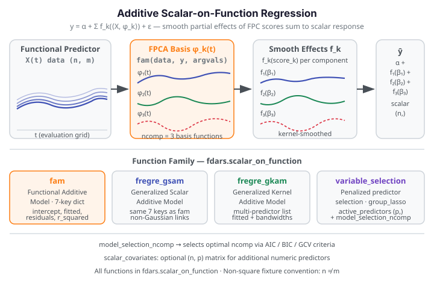

# Additive Scalar-on-Function Regression

Additive Scalar-on-Function (SoF) regression predicts a **scalar response** from one or
more functional predictors by decomposing the functional effect into a sum of smooth
component functions. This is a nonparametric generalization of the classical linear SoF
model that allows each predictor to contribute a non-linear partial effect while keeping
the model interpretable.

{ .fdars-diagram }

## Core Concept

Let $y_i$ be a scalar response and $X_{ij}(t)$ be the $j$-th functional predictor for
observation $i$. The additive SoF model takes the form:

$$
y_i = \alpha + \sum_{j=1}^{p} f_j\!\left(\langle X_{ij}, \phi_j \rangle\right) + \varepsilon_i
$$

where $\phi_j$ are the leading FPCA basis functions for predictor $j$ and each $f_j$ is a
smooth function of the corresponding FPC scores. The **Functional Additive Model (FAM)**
estimates these smooth components jointly, providing a flexible alternative to simple
linear projection while remaining far more parsimonious than a fully nonparametric approach.

```python exec="1" source="above"
import numpy as np
from fdars.scalar_on_function import fam

rng = np.random.default_rng(42)
n, m = 25, 30    # non-square: n observations, m grid points
t = np.linspace(0, 1, m)
data = np.array([np.sin(2 * np.pi * t + rng.uniform(0, 0.5)) for _ in range(n)])
y = np.array([np.trapezoid(data[i], t) for i in range(n)])

result = fam(data, y, t, ncomp=3, bandwidth=0.5, kernel="gaussian", n_grid_bandwidth=5)
print(f"r_squared:       {result['r_squared']:.4f}")
print(f"fitted shape:    {np.asarray(result['fitted_values']).shape}")
print(f"ncomp used:      {result['ncomp']}  FDARS_FENCE_OK")
```

The model extracts `ncomp=3` FPCA components and fits a smooth additive effect for each.
`fitted_values` has shape `(n,)` — one scalar prediction per observation.

## API Reference

### `fam` — Functional Additive Model

```python
from fdars.scalar_on_function import fam

result = fam(data, y, argvals, scalar_covariates=None,
             ncomp=3, bandwidth=0.5, kernel="gaussian", n_grid_bandwidth=10)
```

| Parameter | Type | Description |
|-----------|------|-------------|
| `data` | `np.ndarray` (n, m) | Functional predictor observations |
| `y` | `np.ndarray` (n,) | Scalar response vector |
| `argvals` | `np.ndarray` (m,) | Evaluation grid |
| `scalar_covariates` | `np.ndarray` (n, p) or `None` | Optional matrix of additional scalar predictors |
| `ncomp` | `int` | Number of FPCA components (default: 3) |
| `bandwidth` | `float` | Bandwidth for the smooth component estimator |
| `kernel` | `str` | Kernel type: `"gaussian"`, `"epanechnikov"`, etc. |
| `n_grid_bandwidth` | `int` | Number of bandwidth grid points for selection |

| Key | Meaning |
|-----|---------|
| `intercept` | Model intercept scalar |
| `fitted_values` | Fitted scalar responses, shape `(n,)` |
| `residuals` | Residuals, shape `(n,)` |
| `r_squared` | Global R² |
| `ncomp` | Number of FPCA components used |
| `bandwidths` | Selected bandwidths per component |
| `component_fits` | List of smooth component fit arrays, one per FPC score |

---

### `fregre_gsam` — Generalized Scalar Additive Model

`fregre_gsam` fits the same 7-key additive model structure as `fam` but uses a
generalized additive framework that can accommodate non-Gaussian responses through a
link function. The returned dict has the same seven keys as `fam`.

```python
from fdars.scalar_on_function import fregre_gsam

result = fregre_gsam(data, y, argvals, ...)
```

---

### `fregre_gkam` — Generalized Kernel Additive Model

`fregre_gkam` fits additive effects using kernel regression directly on the functional
data without requiring an FPCA step. Suitable when the FPCA truncation is not appropriate.
Accepts a list of functional predictors for multi-predictor additive models.

```python
from fdars.scalar_on_function import fregre_gkam

result = fregre_gkam(predictors, y, argvals_list, ...)
```

| Key | Meaning |
|-----|---------|
| `fitted_values` | Fitted scalar responses, shape `(n,)` |
| `bandwidths` | Selected bandwidth per predictor |
| `converged` | Whether the backfitting algorithm converged |

---

### `variable_selection` — Predictor Selection

For multi-predictor settings, `variable_selection` identifies which functional predictors
are relevant using a penalized regression approach.

```python
from fdars.scalar_on_function import variable_selection

sel = variable_selection(predictors, y, argvals_list,
                         penalty="group_lasso", ncomp=3, ...)
```

| Key | Meaning |
|-----|---------|
| `active_predictors` | Boolean array, shape `(p,)` — True for selected predictors |
| `coefficients` | Estimated coefficient list (one per predictor + intercept) |

Supported penalties: `"group_lasso"`, `"ls"`. Penalties `"group_mcp"` and `"group_scad"`
raise `ValueError` (not yet exposed in fdars-core 0.33).

---

### `model_selection_ncomp` — Component Count Selection

Selects the optimal number of FPCA components using information criteria.

```python
from fdars.scalar_on_function import model_selection_ncomp

ms = model_selection_ncomp(data, y, argvals, ncomp_max=6, ...)
```

| Key | Meaning |
|-----|---------|
| `best_ncomp` | Optimal component count |
| `aic` | AIC criterion values across candidate counts |
| `bic` | BIC criterion values across candidate counts |
| `gcv` | GCV criterion values across candidate counts |

All functions are importable from `fdars.scalar_on_function`.

## References

- Müller, H.-G. and Yao, F. (2008). Functional additive models.
  *Journal of the American Statistical Association* 103(484), 1534–1544.
- Fan, J. and Zhang, J.-T. (2000). Two-step estimation of functional linear models with
  applications to longitudinal data. *Journal of the Royal Statistical Society B* 62(2), 303–322.
- Marx, B. D. and Eilers, P. H. C. (1999). Generalized linear regression on sampled signals and
  curves: A P-spline approach. *Technometrics* 41(1), 1–13.
