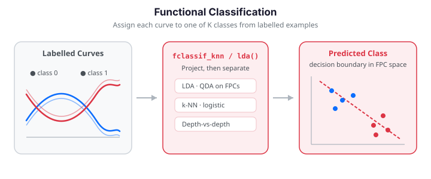
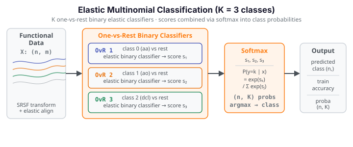

# Classification

Functional classification assigns a class label $g_i \in \{0, 1, \dots, K-1\}$ to
each functional observation $x_i(t)$. Two things make this harder than ordinary
classification:

- **Curse of dimensionality.** With $m$ grid points (often 100–1000), standard
  classifiers break down when $n \ll m$: covariance matrices become singular and
  decision boundaries overfit.
- **Ignoring smoothness.** Treating $x_i(t_1)$ and $x_i(t_2)$ as unrelated
  features discards the continuity that makes the data functional.

`fdars` resolves this by projecting curves onto a low-dimensional FPC basis and
classifying in that reduced space (LDA, QDA, k-NN, logistic), or by working
directly in function space with a proper functional distance or depth (kernel,
depth-vs-depth). All of these are available, plus cross-validated model
comparison.

Classification exploits differences in the class-mean curves. Below, two classes
are separated by a phase difference (a sine vs. a cosine); the bold curves are
the per-class mean functions the classifiers learn to distinguish.


{ .fdars-diagram }

```python exec="1" html="1"
import numpy as np
from docs_fig import fig, render
from fdars.classification import fclassif_lda

np.random.seed(0)
n, m = 40, 101
t = np.linspace(0, 1, m)
raw = np.zeros((n, m))
labels = np.zeros(n, dtype=np.int64)
for i in range(n):
    if i < n // 2:
        raw[i] = np.sin(2 * np.pi * t) + 0.3 * np.random.randn(m)
    else:
        raw[i] = np.cos(2 * np.pi * t) + 0.3 * np.random.randn(m)
        labels[i] = 1

res = fclassif_lda(raw, labels, ncomp=3)

f, ax = fig()
for cls, color, name in [(0, "#3f51b5", "class 0"), (1, "#e8710a", "class 1")]:
    ax.plot(t, raw[labels == cls].T, color=color, lw=0.7, alpha=0.25)
    ax.plot(t, raw[labels == cls].mean(0), color=color, lw=2.6, label=f"{name} mean")
ax.set(title=f"Class-mean curves (LDA accuracy {res['accuracy']:.0%})",
       xlabel="t", ylabel="X(t)")
ax.legend()
print(render(f))
```

The two bold class-mean curves are cleanly offset — a sine against a cosine — so
even though individual noisy realisations overlap, LDA reaches near-perfect
accuracy by projecting onto the FPC directions that capture this mean difference.

---

## Discriminant analysis

Both discriminant methods work on the FPC scores $\xi_i \in \mathbb{R}^K$ and
model each class as Gaussian in that space.

### LDA (Linear Discriminant Analysis)

LDA assumes a **shared** covariance $\Sigma$ across classes. Each observation is
assigned to the class maximising the log-posterior discriminant

$$
\delta_g(\xi) = \log \pi_g - \tfrac12 (\xi - \mu_g)^\top \Sigma^{-1} (\xi - \mu_g),
$$

which produces **linear** decision boundaries.

```python
import numpy as np
from fdars import Fdata
from fdars.classification import fclassif_lda

# --- Simulate two-class functional data ---
np.random.seed(0)
n, m = 80, 101
t = np.linspace(0, 1, m)

raw = np.zeros((n, m))
labels = np.zeros(n, dtype=np.int64)
for i in range(n):
    if i < n // 2:
        raw[i] = np.sin(2 * np.pi * t) + 0.3 * np.random.randn(m)
        labels[i] = 0
    else:
        raw[i] = np.cos(2 * np.pi * t) + 0.3 * np.random.randn(m)
        labels[i] = 1
fd = Fdata(raw, argvals=t)

result = fclassif_lda(fd.data, labels, ncomp=3)
print(f"LDA accuracy: {result['accuracy']:.2%}")
print(f"Predictions:  {result['predicted'][:10]}")
```

| Key | Type | Description |
|-----|------|-------------|
| `predicted` | `ndarray (n,)` | Predicted class labels |
| `accuracy` | `float` | Resubstitution accuracy |

### QDA (Quadratic Discriminant Analysis)

QDA relaxes the shared-covariance assumption, estimating a separate $\Sigma_g$
per class. The extra $-\tfrac12\log|\Sigma_g|$ term makes the boundaries
**quadratic** (ellipsoidal), at the cost of needing more observations per class.

```python
from fdars.classification import fclassif_qda

result = fclassif_qda(fd.data, labels, ncomp=3)
print(f"QDA accuracy: {result['accuracy']:.2%}")
```

!!! tip "LDA vs. QDA"
    Use LDA when classes share similar covariance structure and sample sizes are
    small. Use QDA when class covariances differ substantially and you have
    enough observations per class ($n_g > K(K+1)/2$).

---

## k-Nearest Neighbors

k-NN makes no distributional assumption. It classifies each observation by a
majority vote among its $k$ nearest neighbours in FPC score space, using the
Euclidean distance $\lVert \xi_i - \xi_j \rVert_2$.

```python
from fdars.classification import fclassif_knn

result = fclassif_knn(fd.data, labels, ncomp=3, k=5)
print(f"k-NN accuracy (k=5): {result['accuracy']:.2%}")
```

Small $k$ gives a flexible but noisy boundary; large $k$ gives a smooth but
possibly biased one. Choose $k$ (and `ncomp`) by cross-validation.

---

## Kernel classifier

A fully nonparametric classifier that operates **directly on the curves** via an
$L^2$ functional distance, skipping the FPC projection. For a query curve $X$ it
sums Gaussian kernel weights $K(d, h) = \exp(-d^2/2h^2)$ over each class and picks
the class with the largest total weight:

$$
\hat g(X) = \arg\max_g \sum_{j:\,y_j = g} K\big(d(X, X_j), h\big).
$$

```python
from fdars.classification import fclassif_kernel

result = fclassif_kernel(fd.data, fd.argvals, labels, h_func=1.0, h_scalar=1.0)
print(f"Kernel accuracy: {result['accuracy']:.2%}")
```

| Parameter | Description |
|-----------|-------------|
| `h_func` | Bandwidth for the functional distance kernel |
| `h_scalar` | Bandwidth for the scalar kernel |

---

## Depth-vs-depth classifier

The DD-classifier computes the statistical **depth** of each curve with respect
to each class distribution — no dimension reduction, no explicit distances.
Using an integrated depth $D_g(X) = \int_0^1 D_1(X(t); F_{g,t})\,dt$, each curve
maps to the point $(D_1(X), \dots, D_K(X))$ in depth space, and is assigned to
the class where it is most central. Because depth is rank-based, this classifier
is robust to outliers.

```python
from fdars.classification import fclassif_dd

result = fclassif_dd(fd.data, labels)
print(f"DD-classifier accuracy: {result['accuracy']:.2%}")
```

It returns `predicted` and `accuracy`, like the discriminant methods, but takes
no `ncomp` — depth is computed on the raw curves.

---

## Cross-validated classification

Resubstitution accuracy is optimistic. `fclassif_cv` estimates the out-of-sample
error by $k$-fold cross-validation and simultaneously searches component counts
from 1 to `ncomp`, reporting the `best_ncomp`.

```python
from fdars.classification import fclassif_cv

# Compare methods
for method in ["lda", "qda", "knn"]:
    result = fclassif_cv(
        fd.data, fd.argvals, labels,
        method=method,
        ncomp=5,
        nfold=5,
    )
    print(f"{method.upper():>6s}: error rate = {result['error_rate']:.2%}, "
          f"best_ncomp = {result['best_ncomp']}")
```

| Key | Type | Description |
|-----|------|-------------|
| `error_rate` | `float` | Cross-validated error rate |
| `fold_errors` | `ndarray (nfold,)` | Error rate for each fold |
| `best_ncomp` | `int` | Optimal number of components |

!!! success "Validation — CV accuracy beats chance, and out-of-sample ≥ in-sample error"
    Two ground-truth checks on a fresh two-class problem: (1) the cross-validated
    accuracy must clear the $1/K$ chance rate by a clear margin, and (2) the honest
    out-of-sample (CV) error must be **at least** the optimistic resubstitution error —
    a property that always holds in expectation. Both assertions run below and pass.

```python exec="1" source="above"
import numpy as np
from fdars.classification import fclassif_lda, fclassif_cv

np.random.seed(11)
n, m = 120, 101
t = np.linspace(0, 1, m)
raw = np.zeros((n, m))
labels = np.zeros(n, dtype=np.int64)
for i in range(n):
    if i < n // 2:
        raw[i] = np.sin(2 * np.pi * t) + 0.3 * np.random.randn(m)
    else:
        raw[i] = np.cos(2 * np.pi * t) + 0.3 * np.random.randn(m)
        labels[i] = 1

n_classes = 2
chance = 1.0 / n_classes                       # 0.5 for a balanced 2-class problem

cv = fclassif_cv(raw, t, labels, method="lda", ncomp=5, nfold=5)
cv_accuracy = 1.0 - cv["error_rate"]
insample_error = 1.0 - fclassif_lda(raw, labels, ncomp=cv["best_ncomp"])["accuracy"]

print(f"chance accuracy      = {chance:.2f}")
print(f"CV accuracy          = {cv_accuracy:.3f}")
print(f"in-sample error      = {insample_error:.3f}")
print(f"CV (out-of-sample)   = {cv['error_rate']:.3f}")

# (1) CV accuracy clears chance by a solid margin.
assert cv_accuracy > chance + 0.20, cv_accuracy
# (2) Honest CV error is not optimistic relative to resubstitution.
assert cv["error_rate"] >= insample_error - 1e-9, (cv["error_rate"], insample_error)
print("validation OK: CV accuracy > chance, and OOF error >= in-sample error")
```

The separable two-class signal drives CV accuracy well above 0.5, and the
cross-validated error never dips below the resubstitution error — the expected
ordering between optimistic and honest estimates.

### Choosing the number of components

Early FPC components capture the dominant modes of between-class variation and
improve discrimination; later components bring in mostly within-class noise and
dilute the signal. Plotting CV error against `ncomp` shows the sweet spot.

```python exec="1" html="1" source="above"
import numpy as np
from docs_fig import fig, render
from fdars.classification import fclassif_cv

np.random.seed(4)
n, m = 36, 101
t = np.linspace(0, 1, m)
s1, c1 = np.sin(2 * np.pi * t), np.cos(2 * np.pi * t)
s2, c2 = np.sin(4 * np.pi * t), np.cos(4 * np.pi * t)
s3 = np.sin(6 * np.pi * t)
raw = np.zeros((n, m))
labels = np.zeros(n, dtype=np.int64)
for i in range(n):
    c = i % 2
    labels[i] = c
    # The class signal lives in the first two FPC directions but OVERLAPS the
    # within-class spread there (so it is not trivially separable); modes 3+ are
    # pure within-class noise. With a small sample, including those later
    # components degrades the pooled-covariance estimate and hurts LDA.
    mu = (0.8 * s1 + 0.6 * c1) if c else 0.0 * s1
    raw[i] = mu + 0.5 * np.random.randn() * s1 + 0.5 * np.random.randn() * c1
    raw[i] += (0.3 * np.random.randn() * s2 + 0.25 * np.random.randn() * c2
               + 0.2 * np.random.randn() * s3)
    raw[i] += 0.15 * np.random.randn(m)

ks = range(1, 8)
errs = [fclassif_cv(raw, t, labels, method="lda", ncomp=k, nfold=6)["error_rate"]
        for k in ks]

f, ax = fig()
ax.plot(list(ks), errs, "-o", color="#3f51b5")
ax.set(title="LDA component selection", xlabel="number of FPC components",
       ylabel="10-fold CV error rate")
print(render(f))
```

The CV error dips to a minimum at a small component count and then climbs again as
later, noise-dominated modes enter the pooled covariance — the classic
under-fit/over-fit valley that tells you exactly how many FPC directions to keep.

Now add a figure showing the logistic model's calibrated output. Because
`functional_logistic` returns per-curve probabilities $P(G=1\mid x)$, we can plot
them against the FPC-1 score to see the sigmoid boundary the model learns:

```python exec="1" html="1" source="above"
import numpy as np
from docs_fig import fig, render
from fdars.regression import fpca, functional_logistic

np.random.seed(7)
n, m = 100, 101
t = np.linspace(0, 1, m)
raw = np.zeros((n, m))
labels = np.zeros(n, dtype=np.int64)
for i in range(n):
    if i < n // 2:
        raw[i] = np.sin(2 * np.pi * t) + 0.4 * np.random.randn(m)
    else:
        raw[i] = np.cos(2 * np.pi * t) + 0.4 * np.random.randn(m)
        labels[i] = 1

score1 = np.asarray(fpca(raw, t, n_comp=1)["scores"])[:, 0]
res = functional_logistic(raw, labels.astype(np.float64), n_comp=3)
probs = np.asarray(res["probabilities"])

f, ax = fig()
order = np.argsort(score1)
ax.plot(score1[order], probs[order], color="#6c757d", lw=1.2, alpha=0.7)
for cls, color, name in [(0, "#3f51b5", "class 0"), (1, "#e8710a", "class 1")]:
    sel = labels == cls
    ax.scatter(score1[sel], probs[sel], color=color, s=30, alpha=0.8, label=name)
ax.axhline(0.5, color="#dc3545", ls="--", lw=1, label="decision threshold")
ax.set(title="Logistic probabilities vs. leading FPC score",
       xlabel="FPC-1 score", ylabel=r"$P(G=1\mid x)$", ylim=(-0.05, 1.05))
ax.legend(fontsize=8)
print(render(f))
```

The probability curve sweeps smoothly from 0 to 1 as the FPC-1 score grows, with
the two classes separating on either side of the 0.5 threshold — points stranded
near 0.5 are precisely the ambiguous curves in the overlap region.

---

## Functional logistic regression

For binary classification, **functional logistic regression** models the log-odds
as a linear functional of the predictor:

$$
\log\frac{P(G=1 \mid x)}{P(G=0 \mid x)} = \alpha + \int_{\mathcal{T}} x(t)\,\beta(t)\,dt.
$$

After the FPC reduction this becomes $\alpha + \sum_k \gamma_k \xi_{ik}$, fitted
by iteratively reweighted least squares (IRLS). Unlike the discriminant methods,
it returns **calibrated probabilities** $P(G=1\mid x)$, useful for risk scoring
and threshold tuning.

```python
from fdars.regression import functional_logistic

result = functional_logistic(fd.data, labels.astype(np.float64), n_comp=3)

probs     = result["probabilities"]       # (n,) -- P(G=1 | x)
predicted = result["predicted_classes"]   # (n,)
beta_t    = result["beta_t"]              # (m,) -- coefficient function
intercept = result["intercept"]           # scalar
coefs     = result["coefficients"]        # FPC coefficients

accuracy = np.mean(predicted == labels)
print(f"Logistic accuracy: {accuracy:.2%}")
print(f"Intercept: {intercept:.4f}")
```

| Key | Type | Description |
|-----|------|-------------|
| `probabilities` | `ndarray (n,)` | Predicted probabilities for class 1 |
| `predicted_classes` | `ndarray (n,)` | Predicted labels |
| `beta_t` | `ndarray (m,)` | Coefficient function $\hat{\beta}(t)$ |
| `intercept` | `float` | Intercept $\hat{\alpha}$ |
| `coefficients` | `ndarray (k,)` | Coefficients on FPC scores |

Probabilities near 0 or 1 indicate confident classifications; values near 0.5
mark curves in the overlap region.

!!! note "Phase-invariant logistic regression"
    When classes differ in the *timing* of features rather than their amplitude,
    `functional_logistic` on raw curves can struggle. The
    [elastic regression](elastic-regression.md) page covers `elastic_logistic`,
    which aligns curves and classifies in the phase-invariant SRSF domain.

---

## Real data: separating two phonemes

The phoneme dataset contains log-periodograms for five spoken sounds. The pair
`aa` (as in *dark*) and `ao` (as in *water*) is the classic hard case — their
spectra overlap heavily in the low frequencies. Here we build a binary problem
from those two classes and compare classifiers with cross-validation.

```python exec="1" html="1" source="above"
import numpy as np
from docs_fig import fig, render
from docs_data import load_phoneme
from fdars.classification import fclassif_cv, fclassif_lda

freq, X, meta = load_phoneme()
ph = meta["phoneme"].to_numpy()
mask = np.isin(ph, ["aa", "ao"])
Xb = X[mask]
yb = (ph[mask] == "ao").astype(np.int64)

# Cross-validated error for three classifiers
scores = {}
for method in ["lda", "qda", "knn"]:
    scores[method] = fclassif_cv(Xb, freq, yb, method=method,
                                 ncomp=6, nfold=5)["error_rate"]

# Class-mean spectra
f, ax = fig()
for cls, color, name in [(0, "#3f51b5", "aa"), (1, "#e8710a", "ao")]:
    ax.plot(freq, Xb[yb == cls].mean(0), color=color, lw=2.4, label=f"{name} mean")
    ax.plot(freq, Xb[yb == cls][:15].T, color=color, lw=0.5, alpha=0.2)
title = "  |  ".join(f"{m.upper()} err={e:.2f}" for m, e in scores.items())
ax.set(title=title, xlabel="frequency index", ylabel="log-periodogram")
ax.legend()
print(render(f))
```

The two mean spectra diverge mostly in the mid-frequency band; that is the region
the classifiers rely on to tell the phonemes apart.

---

## Full example: classifying ECG-like waveforms

```python
import numpy as np
from fdars import Fdata
from fdars.classification import fclassif_lda, fclassif_qda, fclassif_knn, fclassif_cv
from fdars.regression import functional_logistic

np.random.seed(42)
n_per_class = 50
n = 2 * n_per_class
m = 151
t = np.linspace(0, 1, m)

# Class 0: normal waveform (single peak)
# Class 1: abnormal waveform (double peak)
raw = np.zeros((n, m))
labels = np.zeros(n, dtype=np.int64)

for i in range(n):
    noise = 0.2 * np.random.randn(m)
    if i < n_per_class:
        raw[i] = np.exp(-((t - 0.5)**2) / 0.01) + noise
        labels[i] = 0
    else:
        raw[i] = (
            np.exp(-((t - 0.35)**2) / 0.008)
            + 0.7 * np.exp(-((t - 0.65)**2) / 0.008)
            + noise
        )
        labels[i] = 1
fd = Fdata(raw, argvals=t)

# --- Compare classifiers (resubstitution) ---
print("Resubstitution accuracy:")
for name, fn in [("LDA", fclassif_lda), ("QDA", fclassif_qda)]:
    r = fn(fd.data, labels, ncomp=4)
    print(f"  {name}: {r['accuracy']:.2%}")

r = fclassif_knn(fd.data, labels, ncomp=4, k=5)
print(f"  k-NN: {r['accuracy']:.2%}")

# --- Cross-validated comparison ---
print("\nCross-validated error rates:")
for method in ["lda", "qda", "knn"]:
    cv = fclassif_cv(fd.data, fd.argvals, labels, method=method, ncomp=6, nfold=5)
    print(f"  {method.upper()}: {cv['error_rate']:.2%} (best k={cv['best_ncomp']})")

# --- Functional logistic regression ---
logit = functional_logistic(fd.data, labels.astype(np.float64), n_comp=4)
acc = np.mean(logit["predicted_classes"] == labels)
print(f"\nLogistic regression accuracy: {acc:.2%}")
print(f"Most influential time point: t = {fd.argvals[np.argmax(np.abs(logit['beta_t']))]:.2f}")
```

---

## Comparing all classifiers on one problem

To see how the six methods stack up on identical data, we fit each on the same
two-class waveform problem and compare their cross-validated accuracy. No single
method dominates every dataset, but on a well-separated problem most cluster near
the top:

```python exec="1" html="1" source="above"
import numpy as np
from docs_fig import fig, render
from fdars.classification import (fclassif_cv, fclassif_kernel, fclassif_dd)
from fdars.regression import functional_logistic

np.random.seed(21)
n, m = 120, 121
t = np.linspace(0, 1, m)
raw = np.zeros((n, m))
labels = np.zeros(n, dtype=np.int64)
for i in range(n):
    noise = 0.25 * np.random.randn(m)
    if i < n // 2:
        raw[i] = np.exp(-((t - 0.5) ** 2) / 0.01) + noise
    else:
        raw[i] = (np.exp(-((t - 0.35) ** 2) / 0.008)
                  + 0.7 * np.exp(-((t - 0.65) ** 2) / 0.008) + noise)
        labels[i] = 1

acc = {}
for method in ["lda", "qda", "knn"]:
    acc[method.upper()] = 1 - fclassif_cv(raw, t, labels, method=method,
                                          ncomp=5, nfold=5)["error_rate"]
acc["Kernel"] = fclassif_kernel(raw, t, labels, h_func=1.0, h_scalar=1.0)["accuracy"]
acc["DD"] = fclassif_dd(raw, labels)["accuracy"]
acc["Logistic"] = np.mean(
    functional_logistic(raw, labels.astype(np.float64), n_comp=4)["predicted_classes"]
    == labels)

names = list(acc); vals = [acc[k] for k in names]
f, ax = fig()
bars = ax.bar(names, vals, color="#3f51b5", alpha=0.85)
ax.axhline(0.5, color="#dc3545", ls="--", lw=1, label="chance")
ax.set(title="Accuracy by classifier (single-peak vs. double-peak)",
       ylabel="accuracy", ylim=(0, 1.05))
ax.legend()
print(render(f))
```

Every classifier clears the 0.5 chance line by a wide margin on this cleanly
separated single-peak-vs-double-peak problem; the small differences among them
reflect their bias-variance trade-offs rather than any failure to learn the signal.

## Choosing a classifier

| Criterion | LDA | QDA | k-NN | Kernel | DD | Logistic |
|-----------|-----|-----|------|--------|-----|----------|
| Assumptions | shared cov. | class-specific cov. | none | none | none | linear in FPC space |
| Boundaries | linear | quadratic | flexible | flexible | depth-based | linear |
| Tuning | `ncomp` | `ncomp` | `ncomp`, `k` | `h_func` | — | `n_comp` |
| Robustness | low | low | moderate | moderate | **high** | low |
| Probabilities | posterior | posterior | no | no | no | **calibrated** |

**Rules of thumb**

1. Start with **LDA** — fast, interpretable, often competitive.
2. Try **QDA** when classes have different shapes (covariances) in FPC space and you have enough data per class.
3. Use **k-NN** for nonlinear boundaries with ample data per class.
4. Use the **kernel** classifier to avoid the FPC projection entirely on small-to-moderate datasets.
5. Use the **DD** classifier when robustness to outliers matters most.
6. Use **logistic regression** when you need calibrated probabilities or log-odds interpretation.

---

## Elastic Multinomial Classification

When classes exceed two, `elastic_multinomial` extends the elastic binary
classifier to K classes via a **one-vs-rest (OvR)** decomposition: it fits K
independent binary elastic classifiers (each in the SRSF/elastic domain), then
combines their raw scores with a softmax to produce calibrated class
probabilities.

{ .fdars-diagram }

### Theory

For K classes, let $s_k(x)$ be the score produced by the $k$-th OvR binary
elastic classifier applied to curve $x$. The softmax aggregation yields

$$P(y = k \mid x) = \frac{\exp(s_k(x))}{\sum_{j=1}^{K} \exp(s_j(x))}, \quad k = 1, \dots, K.$$

Each binary classifier uses the same SRSF elastic penalty framework as
`elastic_logistic`, so the model is **phase-invariant**: time-warping of input
curves does not affect the decision boundary.

### Parameters

| Parameter | Type | Default | Description |
|-----------|------|---------|-------------|
| `data` | `ndarray (n, m)` | — | Functional observations, one per row |
| `labels` | `ndarray (n,)` dtype `int64` | — | 0-indexed contiguous class labels, 0 … K−1 |
| `argvals` | `ndarray (m,)` | — | Evaluation grid |
| `ncomp_beta` | `int` | 10 | B-spline basis functions per OvR classifier |
| `lambda_` | `float` | 0.1 | Roughness penalty |
| `max_iter` | `int` | 100 | Maximum IRLS iterations per OvR model |
| `tol` | `float` | 1e-4 | Convergence tolerance |

### Returns

| Key | Type | Description |
|-----|------|-------------|
| `n_classes` | `int` | Number of classes K |
| `classes` | `ndarray (K,)` | Unique class indices |
| `train_probabilities` | `ndarray (n, K)` | Softmax class probabilities |
| `predicted_classes` | `ndarray (n,)` | Predicted class label per observation |
| `train_accuracy` | `float` | Resubstitution accuracy |

!!! note "Labels must be 0-indexed contiguous int64 (Pitfall 7)"
    `labels` must have dtype `np.int64` and contain only the values
    0, 1, …, K−1 with no gaps. Passing `np.int32`, a Python list, or
    non-contiguous indices (e.g. `[0, 2]`) raises a `ValueError`. Remap
    your class indices to 0 … K−1 before calling:

    ```python
    classes, y = np.unique(raw_labels, return_inverse=True)
    y = y.astype(np.int64)
    ```

### Example: phoneme 3-class classification

The phoneme dataset contains 80 log-periodograms for each of five spoken
sounds. We subset to three classes — `aa`, `ao`, and `dcl` — and take
20 observations per class (60 total) so the elastic alignment completes
quickly during the docs build. Columns are also downsampled to m ≤ 64.

```python exec="1" html="1" source="above"
import numpy as np
from docs_fig import fig, render
from docs_data import load_phoneme
import fdars.classification as clf

freq, X, meta = load_phoneme()
ph = meta["phoneme"].to_numpy()

# 3-class subset: aa, ao, dcl — 20 obs per class for fence speed
classes_3 = ["aa", "ao", "dcl"]
rng = np.random.default_rng(7)
idx = np.concatenate([
    rng.choice(np.where(ph == c)[0], size=20, replace=False) for c in classes_3
])
X3 = X[idx]
y3 = np.array([classes_3.index(ph[i]) for i in idx], dtype=np.int64)
freq3 = freq

# Subsample columns to m <= 64 for fence speed
step = max(1, X3.shape[1] // 64)
X3 = X3[:, ::step]
freq3 = freq3[::step]

res = clf.elastic_multinomial(X3, y3, freq3, ncomp_beta=8, lambda_=0.1)

# Mean spectrum per class
f, ax = fig()
for k, (name, color) in enumerate(zip(classes_3, ["#3f51b5", "#e8710a", "#198754"])):
    ax.plot(freq3, X3[y3 == k].mean(0), color=color, lw=2.2, label=name)
ax.set(title=f"Phoneme 3-class (n_classes={res['n_classes']}, "
             f"accuracy={res['train_accuracy']:.2%})",
       xlabel="frequency index", ylabel="log-periodogram (subsampled)")
ax.legend()
print(render(f))
print(f"n_classes={res['n_classes']}  train_accuracy={res['train_accuracy']:.3f}")
print(f"train_probabilities shape: {np.asarray(res['train_probabilities']).shape}")
print("FDARS_FENCE_OK")
```

## References

- Delaigle & Hall (2012), *JRSS-B*.
- Cuevas, Febrero & Fraiman (2007), *Computational Statistics*.
- Li, Cuesta-Albertos & Liu (2012), DD-classifier, *JASA*.
- López-Pintado & Romo (2009), functional depth, *JASA*.
