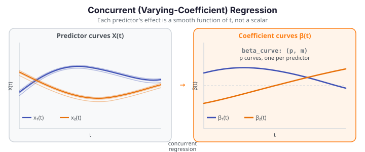

# Concurrent (Varying-Coefficient) Regression

Concurrent regression — also called the *varying-coefficient model* — extends functional regression by letting each predictor's effect vary smoothly over the domain. Where ordinary linear regression assigns a single scalar coefficient to each predictor, concurrent regression assigns an entire *coefficient function* $\beta_k(t)$. At each point $t$ the model behaves like a local ordinary regression, but the coefficients change fluidly as $t$ progresses.

`fdars.regression.concurrent_regression` estimates one smooth coefficient curve per predictor using local kernel regression: the bandwidth controls how quickly the coefficients are allowed to change, and the kernel controls the weighting of neighboring time points.

{ .fdars-diagram }

## Theory

Given $p$ functional predictors $X^{(1)}(t), \dots, X^{(p)}(t)$ and a functional response $Y(t)$, all observed at the same $m$ grid points for $n$ subjects, the model is

$$
Y_i(t) \;=\; \beta_0(t) \;+\; \sum_{k=1}^{p} \beta_k(t)\,X_i^{(k)}(t) \;+\; \varepsilon_i(t),
$$

where $\beta_0(t)$ is a time-varying intercept, $\beta_1(t), \dots, \beta_p(t)$ are time-varying coefficient functions, and $\varepsilon_i(t)$ is a zero-mean error process. At each grid point $t_j$ the function solves a weighted least-squares system with kernel weights centred at $t_j$:

$$
K_h(t_j - t_s) \;=\; K\!\left(\frac{t_j - t_s}{h}\right),
$$

where $h$ is the `bandwidth` and $K$ is the chosen kernel (`"gaussian"`, `"epanechnikov"`, or `"tricube"`). The resulting $\hat\beta(t)$ is a smooth estimate of how the coefficient evolves over the domain.

**Parameters**

| Parameter | Type | Default | Description |
|---|---|---|---|
| `predictors` | `list[ndarray (n, m)]` | — | List of $p$ predictor matrices; each row is one subject's curve |
| `response` | `ndarray (n, m)` | — | Functional response matrix |
| `argvals` | `ndarray (m,)` or `None` | `None` | Evaluation grid; `None` → uniform grid on $[0, 1]$ |
| `bandwidth` | `float` | `0.2` | Kernel bandwidth; must be positive |
| `kernel` | `str` | `"gaussian"` | Kernel: `"gaussian"`, `"epanechnikov"`, or `"tricube"` |

**Returns** a dict:

| Key | Shape | Description |
|---|---|---|
| `"beta_curve"` | `(p, m)` | Time-varying coefficient curves — one row per predictor |
| `"intercept"` | `(m,)` | Time-varying intercept function $\hat\beta_0(t)$ |
| `"fitted"` | `(n, m)` | Fitted response curves $\hat Y_i(t)$ |
| `"residuals"` | `(n, m)` | Residual curves $Y_i(t) - \hat Y_i(t)$ |
| `"argvals"` | `(m,)` | Evaluation grid used (echoed back) |

!!! note "beta_curve shape: (p, m) — predictors × grid"
    `res["beta_curve"]` has shape `(p, m)`, where `p = len(predictors)` and `m` is the number of grid points. This is **not** `(n, m)` — confusing the two is the most common transposition error when working with this function. Row `k` of `beta_curve` is the coefficient curve for the `k`-th predictor, evaluated at every grid point.

```python exec="1" html="1" source="above"
import numpy as np
from docs_fig import fig, render, fast
import fdars.regression as reg

rng = np.random.default_rng(0)
n, m = 20, 50
t = np.linspace(0, 1, m)
# Two synthetic predictor curves + a response
x1 = np.array([np.sin(2 * np.pi * t) + rng.normal(0, 0.1, m) for _ in range(n)])
x2 = np.array([np.cos(2 * np.pi * t) + rng.normal(0, 0.1, m) for _ in range(n)])
y  = x1 * np.sin(2 * np.pi * t) + x2 * 0.5 + rng.normal(0, 0.05, (n, m))

res = reg.concurrent_regression([x1, x2], y, t)
beta = np.asarray(res["beta_curve"])  # shape (2, m) — p=2 predictors

f, ax = fig(figsize=(8.0, 3.8))
ax.plot(t, beta[0], color="#3f51b5", lw=2.2, label="β₁(t) — sin predictor")
ax.plot(t, beta[1], color="#e8710a", lw=2.2, label="β₂(t) — cos predictor")
ax.set(title="Concurrent regression — estimated coefficient curves",
       xlabel="t", ylabel="β(t)")
ax.legend(fontsize=9)
print(render(f))
print(f"beta_curve shape: {beta.shape}  (p=2 predictors × m={m} grid points)")
print("FDARS_FENCE_OK")
```

## References

1. Hastie, T., and Tibshirani, R. (1993). "Varying-coefficient models." *Journal of the Royal Statistical Society, Series B*, 55(4), 757–796. — foundational paper on the varying-coefficient model.
2. Fan, J., and Zhang, W. (1999). "Statistical estimation in varying coefficient models." *Annals of Statistics*, 27(5), 1491–1518. — local polynomial estimation of time-varying coefficients.
3. Ramsay, J. O., and Silverman, B. W. (2005). *Functional Data Analysis*, 2nd ed. Springer. — Chapter 14: concurrent regression and the functional linear model.
