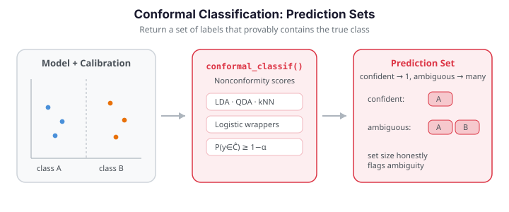

# Conformal Prediction for Classification

A functional classifier hands you a single predicted label, but that label is a point
estimate with no attached reliability. **Conformal prediction** replaces it with a
*prediction set* — a subset of the classes — that provably contains the true label with a
user-chosen probability, using only the mild assumption that the data are exchangeable.
When the classifier is confident, the set is a single label; when the curve sits near a
decision boundary, the set contains several labels, honestly flagging the ambiguity.

`fdars.conformal` provides conformal wrappers for functional classifiers:
`conformal_classif` around FPC-based LDA/QDA/kNN, and `conformal_logistic` /
`conformal_elastic_logistic` around functional logistic regression. All follow the same
split-conformal recipe and expose the finite-sample **coverage guarantee**
$\mathbb{P}(y \in \hat C(x)) \ge 1 - \alpha$.


{ .fdars-diagram }

```python exec="1" html="1" source="above"
import numpy as np
from docs_fig import fig, render
from fdars.simulation import simulate
from fdars.conformal import conformal_classif

np.random.seed(1)
t = np.linspace(0, 1, 60)
# two classes with different mean shapes, overlapping fluctuations
Xa = 0.5 * np.asarray(simulate(n=25, argvals=t, n_basis=6, efun_type="fourier", seed=1)) + np.sin(2 * np.pi * t)
Xb = 0.5 * np.asarray(simulate(n=25, argvals=t, n_basis=6, efun_type="fourier", seed=2)) + np.sin(2 * np.pi * t) + 1.0 * t
X = np.vstack([Xa, Xb])
labels = np.r_[np.zeros(25, int), np.ones(25, int)]
perm = np.random.permutation(50)
X, labels = X[perm], labels[perm]
Xtr, ytr, Xte, yte = X[:40], labels[:40], X[40:], labels[40:]

alphas = np.array([0.05, 0.1, 0.15, 0.2, 0.3])
cov, size = [], []
for a in alphas:
    r = conformal_classif(Xtr, ytr, Xte, ncomp=3, classifier="lda",
                          cal_fraction=0.3, alpha=a, seed=1)
    cov.append(r["coverage"])
    size.append(np.mean([len(s) for s in r["prediction_sets"]]))

f, ax = fig()
ax.plot(alphas, cov, "-o", color="#3f51b5", lw=2, label="empirical coverage")
ax.plot(alphas, 1 - alphas, ls="--", color="#6c757d", lw=1.5, label=r"target $1-\alpha$")
ax2 = ax.twinx()
ax2.plot(alphas, size, "-s", color="#e8710a", lw=2, label="mean set size")
ax.set(title="Coverage and set size vs. miscoverage level",
       xlabel=r"$\alpha$", ylabel="coverage")
ax2.set_ylabel("mean prediction-set size")
ax.legend(loc="lower left", fontsize=8)
ax2.legend(loc="upper right", fontsize=8)
print(render(f))
```

As $\alpha$ increases the coverage requirement relaxes, and the prediction sets shrink —
eventually to single labels. This **coverage–informativeness trade-off** is the central
dial of conformal classification.

## Concepts

**Split conformal.** Reserve a *calibration* subset from the training data. Fit the base
classifier on the rest, then for each calibration point compute a **nonconformity score**
$s_i$ — how poorly the true label conforms to the classifier's output (e.g. one minus the
predicted probability of the true class). Let $\hat q$ be the $\lceil(1-\alpha)(n_{\text{cal}}+1)\rceil$-th
smallest score. For a new curve $x$, the prediction set collects every label whose
nonconformity score would be below $\hat q$:

$$
\hat C(x) = \{\, c : s(x, c) \le \hat q \,\}.
$$

Under exchangeability this construction satisfies the **marginal coverage guarantee**

$$
\mathbb{P}\big(y \in \hat C(x)\big) \ge 1 - \alpha,
$$

for *any* base classifier, with no distributional assumptions — a curve near the boundary
simply admits more labels into its set.

| Set size | Interpretation |
|----------|----------------|
| 1 | Confident, unambiguous prediction |
| 2+ (all classes) | Curve is near a boundary; classifier abstains among these labels |
| 0 (empty) | No label conforms; the curve is atypical of every class (possible outlier) |

## FPC-based classifiers — `conformal_classif`

```python
import numpy as np
from fdars.simulation import simulate
from fdars.conformal import conformal_classif

np.random.seed(1)
t = np.linspace(0, 1, 60)
Xa = 0.5 * np.asarray(simulate(n=25, argvals=t, n_basis=6, efun_type="fourier", seed=1)) + np.sin(2 * np.pi * t)
Xb = 0.5 * np.asarray(simulate(n=25, argvals=t, n_basis=6, efun_type="fourier", seed=2)) + np.sin(2 * np.pi * t) + 1.0 * t
X = np.vstack([Xa, Xb])
labels = np.r_[np.zeros(25, int), np.ones(25, int)]
perm = np.random.permutation(50)
X, labels = X[perm], labels[perm]

res = conformal_classif(X[:40], labels[:40], X[40:], ncomp=3,
                        classifier="lda", cal_fraction=0.3, alpha=0.1, seed=1)

print(f"guaranteed coverage: {1 - 0.1:.2f}")
print(f"empirical coverage:  {res['coverage']:.2f}")
print(f"first 5 sets:        {res['prediction_sets'][:5]}")
```

| Parameter | Type | Description |
|-----------|------|-------------|
| `data` | `ndarray (n, m)` | Training functional predictors |
| `labels` | `ndarray (n,)` | Integer class labels |
| `test_data` | `ndarray (n_test, m)` | Curves to predict |
| `ncomp` | `int` | Number of FPC components |
| `classifier` | `str` | Base classifier (`"lda"`, `"qda"`, `"knn"`) |
| `cal_fraction` | `float` | Fraction of training data held for calibration |
| `alpha` | `float` | Miscoverage level ($1-\alpha$ coverage target) |
| `seed` | `int` | Random seed for the calibration split |

| Return key | Type | Description |
|------------|------|-------------|
| `prediction_sets` | `list[list[int]]` | Label set for each test curve |
| `coverage` | `float` | Empirical coverage on the test curves |

## Logistic classifiers — `conformal_logistic`

For binary problems, `conformal_logistic` wraps functional logistic regression the same
way. It expects **float** labels coded `0.0` / `1.0`.

```python
import numpy as np
from fdars.conformal import conformal_logistic

y01 = labels.astype(np.float64)                   # 0.0 / 1.0 labels
res = conformal_logistic(X[:40], y01[:40], X[40:], ncomp=3,
                         cal_fraction=0.3, alpha=0.1, seed=1)
sizes = [len(s) for s in res["prediction_sets"]]
print(f"empirical coverage: {res['coverage']:.2f}")
print(f"mean set size:      {np.mean(sizes):.2f}")
```

For elastic (warping-invariant) logistic classification of shape-driven labels, use
`conformal_elastic_logistic`, which takes the same `data, labels, test_data` plus an
`argvals` grid and a `lambda_` warping-penalty argument.

The distribution of prediction-set sizes shows how often the classifier is decisive versus
uncertain at a chosen $\alpha$:

```python exec="1" html="1"
import numpy as np
from docs_fig import fig, render
from fdars.simulation import simulate
from fdars.conformal import conformal_classif

np.random.seed(1)
t = np.linspace(0, 1, 60)
Xa = 0.5 * np.asarray(simulate(n=25, argvals=t, n_basis=6, efun_type="fourier", seed=1)) + np.sin(2 * np.pi * t)
Xb = 0.5 * np.asarray(simulate(n=25, argvals=t, n_basis=6, efun_type="fourier", seed=2)) + np.sin(2 * np.pi * t) + 1.0 * t
X = np.vstack([Xa, Xb])
labels = np.r_[np.zeros(25, int), np.ones(25, int)]
perm = np.random.permutation(50)
X, labels = X[perm], labels[perm]

f, ax = fig()
colors = {0.1: "#3f51b5", 0.3: "#e8710a"}
width = 0.35
for j, a in enumerate([0.1, 0.3]):
    r = conformal_classif(X[:40], labels[:40], X[40:], ncomp=3,
                          classifier="lda", cal_fraction=0.3, alpha=a, seed=1)
    sizes = np.array([len(s) for s in r["prediction_sets"]])
    vals, counts = np.unique(sizes, return_counts=True)
    ax.bar(vals + (j - 0.5) * width, counts, width=width,
           color=colors[a], alpha=0.85, label=fr"$\alpha={a}$")
ax.set(title="Distribution of prediction-set sizes",
       xlabel="set size", ylabel="number of test curves")
ax.set_xticks([0, 1, 2])
ax.legend()
print(render(f))
```

## A three-class example

The two-class demo above keeps things minimal; the more common case has several classes with
characteristic shapes. Here class 0 is sine-dominated, class 1 cosine-dominated, and class 2
a noisy linear trend — the hardest to separate.

```python exec="1" html="1" source="above"
import numpy as np
from docs_fig import fig, render

np.random.seed(42)
n_per, m = 40, 60
t = np.linspace(0, 1, m)
n = 3 * n_per
X = np.zeros((n, m))
for i in range(n_per):
    X[i] = np.sin(2 * np.pi * t) + 0.4 * np.random.randn(m)
    X[n_per + i] = np.cos(2 * np.pi * t) + 0.4 * np.random.randn(m)
    X[2 * n_per + i] = 0.6 * (t - 0.5) + 0.2 * np.sin(3 * np.pi * t) + 0.4 * np.random.randn(m)
labels = np.repeat([0, 1, 2], n_per)

f, ax = fig()
colors = ["#3f51b5", "#e8710a", "#2e8b57"]
for c in range(3):
    rows = np.where(labels == c)[0]
    for r in rows:
        ax.plot(t, X[r], color=colors[c], alpha=0.25, lw=0.8)
    ax.plot([], [], color=colors[c], label=f"class {c}")
ax.set(title="Three-class functional data", xlabel="t", ylabel="X(t)")
ax.legend()
print(render(f))
```

### Comparing base classifiers

Split conformal wraps any of the FPC-based classifiers, so you can swap the base learner and
compare. The point of conformal is that *all* of them attain valid coverage; what differs is
how tight (small) the resulting prediction sets are.

```python exec="1" html="1" source="above"
import numpy as np
from docs_fig import fig, render
from fdars.conformal import conformal_classif

np.random.seed(42)
n_per, m = 40, 60
t = np.linspace(0, 1, m)
n = 3 * n_per
X = np.zeros((n, m))
for i in range(n_per):
    X[i] = np.sin(2 * np.pi * t) + 0.4 * np.random.randn(m)
    X[n_per + i] = np.cos(2 * np.pi * t) + 0.4 * np.random.randn(m)
    X[2 * n_per + i] = 0.6 * (t - 0.5) + 0.2 * np.sin(3 * np.pi * t) + 0.4 * np.random.randn(m)
labels = np.repeat([0, 1, 2], n_per)
perm = np.random.default_rng(0).permutation(n)
X, labels = X[perm], labels[perm]
Xtr, ytr, Xte, yte = X[:90], labels[:90], X[90:], labels[90:]

clfs = ["lda", "qda", "knn"]
cov, avg_size = [], []
for clf in clfs:
    r = conformal_classif(Xtr, ytr, Xte, ncomp=5, classifier=clf,
                          cal_fraction=0.25, alpha=0.10, seed=42)
    cov.append(r["coverage"])
    avg_size.append(float(np.mean([len(s) for s in r["prediction_sets"]])))

x = np.arange(len(clfs))
f, ax = fig()
ax.bar(x - 0.2, cov, width=0.4, color="#3f51b5", alpha=0.85, label="coverage")
ax.axhline(0.9, color="#6c757d", ls="--", lw=1)
ax2 = ax.twinx()
ax2.bar(x + 0.2, avg_size, width=0.4, color="#e8710a", alpha=0.85, label="avg set size")
ax.set_xticks(x)
ax.set_xticklabels([c.upper() for c in clfs])
ax.set(title="Conformal classification across base classifiers (90% nominal)",
       ylabel="empirical coverage")
ax2.set_ylabel("average set size")
ax.legend(loc="lower left", fontsize=8)
ax2.legend(loc="lower right", fontsize=8)
print(render(f))
```

LDA, QDA and kNN all cover at or above the 90% target; on well-separated classes each mostly
returns singleton sets. The classifier to prefer is the one giving the smallest sets on
*your* data — conformal handles the coverage either way.

!!! note "No scoring-rule choice in the Python binding"
    The R package exposes a `score.type` argument (LAC vs. APS) and CV+/generic classification
    variants. The Python `conformal_classif` currently offers only the default (LAC-style)
    split-conformal score and no `score_type` / CV+ arguments, so those comparisons are not
    reproduced here.

!!! note "Marginal, not conditional"
    The guarantee is *marginal*: coverage holds on average over all test curves. It does not
    promise $1-\alpha$ coverage within each class or within any subgroup separately. Small
    calibration sets also make the empirical coverage noisy around the target — the guarantee
    is exact in expectation, not on every finite run.

!!! tip "Choosing the base classifier"
    Conformal prediction inherits the accuracy of whatever it wraps: a poorly-tuned base
    model still gets valid coverage, but with larger, less useful sets. Tune `ncomp` and the
    classifier with [cross-validation](cross-validation.md) first, then wrap the tuned model.

## Related pages

- [Conformal prediction](conformal-prediction.md) — the regression counterpart (intervals
  instead of label sets).
- [Uncertainty quantification](uncertainty-quantification.md) — bootstrap and analytic
  intervals; contrast with the distribution-free guarantee here.
- [Cross-validation](cross-validation.md) — tune the base classifier before wrapping it.

## References

- Vovk, V., Gammerman, A., & Shafer, G. (2005). *Algorithmic Learning in a Random World.* Springer.
- Sadinle, M., Lei, J., & Wasserman, L. (2019). *Least ambiguous set-valued classifiers with bounded error levels.* Journal of the American Statistical Association, 114(525), 223–234.
- Romano, Y., Sesia, M., & Candès, E. J. (2020). *Classification with valid and adaptive coverage.* Advances in Neural Information Processing Systems, 33.
