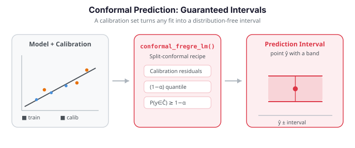

# Conformal Prediction

Conformal prediction provides **distribution-free, finite-sample prediction intervals** (for regression) and **prediction sets** (for classification). Unlike asymptotic confidence intervals, conformal guarantees hold for any sample size and any data distribution:

$$
P\bigl(Y_{\text{new}} \in \hat{C}(X_{\text{new}})\bigr) \geq 1 - \alpha
$$

`fdars` implements split conformal methods for functional regression and classification.


---

{ .fdars-diagram }

## How split conformal works

1. **Split** the training data into a *proper training set* and a *calibration set*.
2. **Fit** the model on the proper training set.
3. **Compute residuals** (nonconformity scores) on the calibration set.
4. **Construct** prediction intervals/sets for new observations using the calibration quantile.

!!! info "Coverage guarantee"
    For a calibration set of size $n_{\text{cal}}$ and miscoverage level $\alpha$, the coverage guarantee is:

    $$
    P\bigl(Y_{\text{new}} \in \hat{C}(X_{\text{new}})\bigr) \geq 1 - \alpha
    $$

    This holds marginally (over both the calibration set and new data) without any distributional assumptions.

## Choosing a method

Conformal comes in several flavors that trade data efficiency against computation. The
`fdars` Python bindings implement the **split** variants — one model fit, a clean $\ge 1-\alpha$
guarantee, at the cost of holding out a calibration fraction.

| Variant | Data use | Model fits | Guarantee | In `fdars` Python? |
|---------|----------|------------|-----------|--------------------|
| Split | reserves a calibration fraction | 1 | $\ge 1-\alpha$ | **yes** (`conformal_fregre_lm`, `conformal_fregre_np`, `conformal_classif`, ...) |
| CV+ | all data used | $K$ folds | $\ge 1-2\alpha$ | not yet |
| Jackknife+ | all data used | $n$ (leave-one-out) | $\ge 1-2\alpha$ | not yet |
| Generic | pre-fitted model | 0 | heuristic only | not yet |

!!! warning "CV+, jackknife+ and generic conformal are R-only for now"
    The R `fdars` package also ships `cv.conformal.regression()`, `jackknife.plus()` and
    `conformal.generic.regression()`. These are **not yet exposed** in the Python bindings, so
    this page uses only the split-conformal functions that exist here. For limited data where
    you would reach for CV+, the practical Python substitute is a larger `cal_fraction`
    (0.3-0.5) or repeating the split across seeds and averaging.

---

## Conformal FPC regression

Wraps `fregre_lm` with split conformal calibration to produce prediction intervals.

```python
import numpy as np
from fdars import Fdata
from fdars.conformal import conformal_fregre_lm

# --- Simulate data ---
np.random.seed(42)
n_train, n_test, m = 200, 50, 81
t = np.linspace(0, 1, m)
beta_true = np.sin(4 * np.pi * t)

def make_data(n):
    raw = np.zeros((n, m))
    for i in range(n):
        raw[i] = (
            np.random.randn() * np.sin(2 * np.pi * t)
            + np.random.randn() * np.cos(2 * np.pi * t)
            + 0.3 * np.random.randn(m)
        )
    fd = Fdata(raw, argvals=t)
    response = np.trapz(fd.data * beta_true, fd.argvals, axis=1) + 0.5 * np.random.randn(n)
    return fd, response

fd_train, train_response = make_data(n_train)
fd_test, test_response = make_data(n_test)

# --- Conformal prediction ---
result = conformal_fregre_lm(
    fd_train.data, train_response, fd_test.data,
    ncomp=3,
    cal_fraction=0.25,   # 25% of training data for calibration
    alpha=0.1,           # 90% prediction intervals
    seed=42,
)

lower       = result["lower"]        # (n_test,)
upper       = result["upper"]        # (n_test,)
predictions = result["predictions"]  # (n_test,)
coverage    = result["coverage"]     # empirical coverage (if test labels provided)

# Check coverage on test set
actual_coverage = np.mean((test_response >= lower) & (test_response <= upper))
print(f"Target coverage:  {1 - 0.1:.0%}")
print(f"Empirical coverage: {actual_coverage:.0%}")
print(f"Mean interval width: {np.mean(upper - lower):.4f}")
```

| Key | Type | Description |
|-----|------|-------------|
| `lower` | `ndarray (n_test,)` | Lower bounds of prediction intervals |
| `upper` | `ndarray (n_test,)` | Upper bounds of prediction intervals |
| `predictions` | `ndarray (n_test,)` | Point predictions |
| `coverage` | `float` | Reported coverage |

Each vertical band is a 90% conformal prediction interval for a test observation (sorted by prediction). Points inside their band are covered (green); the occasional miss (red) is expected at the 10% miscoverage level:

```python exec="1" html="1"
import numpy as np
from docs_fig import fig, render
from fdars.conformal import conformal_fregre_lm

np.random.seed(42)
n_train, n_test, m = 120, 30, 81
t = np.linspace(0, 1, m)
beta_true = np.sin(4 * np.pi * t)

def make(n):
    raw = np.zeros((n, m))
    for i in range(n):
        raw[i] = (np.random.randn() * np.sin(2 * np.pi * t)
                  + np.random.randn() * np.cos(2 * np.pi * t)
                  + 0.3 * np.random.randn(m))
    y = np.trapezoid(raw * beta_true, t, axis=1) + 0.5 * np.random.randn(n)
    return raw, y

Xtr, ytr = make(n_train)
Xte, yte = make(n_test)
res = conformal_fregre_lm(Xtr, ytr, Xte, ncomp=3, cal_fraction=0.25, alpha=0.1, seed=42)
lo, hi = np.asarray(res["lower"]), np.asarray(res["upper"])
pr = np.asarray(res["predictions"])

order = np.argsort(pr)
x = np.arange(n_test)
cov = ((yte >= lo) & (yte <= hi))[order]

f, ax = fig()
ax.vlines(x, lo[order], hi[order], color="#3f51b5", alpha=0.35, lw=6)
ax.scatter(x[cov], yte[order][cov], color="#198754", s=26, label="covered", zorder=3)
if (~cov).any():
    ax.scatter(x[~cov], yte[order][~cov], color="#dc3545", s=32, label="missed", zorder=3)
ax.plot(x, pr[order], color="#e8710a", lw=1.5, label="prediction")
ax.set(title="90% conformal prediction intervals (test set)",
       xlabel="test observation (sorted by prediction)", ylabel="y")
ax.legend()
print(render(f))
```

| Parameter | Default | Description |
|-----------|---------|-------------|
| `ncomp` | 3 | Number of FPC components |
| `cal_fraction` | 0.25 | Fraction of training data reserved for calibration |
| `alpha` | 0.1 | Miscoverage level ($1 - \alpha$ = coverage target) |
| `seed` | 42 | Random seed for the train/calibration split |

---

## Conformal nonparametric regression

Uses kernel regression (`fregre_np`) as the base model, with conformal calibration on top.

```python
from fdars.conformal import conformal_fregre_np

result = conformal_fregre_np(
    fd_train.data, train_response, fd_test.data, fd_train.argvals,
    cal_fraction=0.25,
    alpha=0.1,
    h_func=1.0,
    h_scalar=1.0,
    seed=42,
)

actual_coverage = np.mean((test_response >= result["lower"]) &
                          (test_response <= result["upper"]))
print(f"NP conformal coverage: {actual_coverage:.0%}")
print(f"Mean interval width:   {np.mean(result['upper'] - result['lower']):.4f}")
```

| Parameter | Default | Description |
|-----------|---------|-------------|
| `h_func` | 1.0 | Functional bandwidth |
| `h_scalar` | 1.0 | Scalar bandwidth |
| `cal_fraction` | 0.25 | Calibration fraction |
| `alpha` | 0.1 | Miscoverage level |

---

## Linear vs. nonparametric width

Conformal coverage is guaranteed *regardless of the base model* — but the base model
determines how *tight* the intervals are. A well-specified linear model usually gives the
narrowest intervals; the flexible nonparametric model pays for its flexibility with wider,
noisier calibration residuals. The following simulation mimics near-infrared spectra with a
localized absorption peak near $t=0.4$ whose height drives the response, then compares the two
base models at the same 90% level.

```python exec="1" html="1" source="above"
import numpy as np
from docs_fig import fig, render
from fdars.conformal import conformal_fregre_lm, conformal_fregre_np

np.random.seed(42)
n_train, n_test, m = 160, 40, 80
t = np.linspace(0, 1, m)

def make(n):
    raw = np.zeros((n, m))
    for i in range(n):
        baseline = 0.8 * np.sin(np.pi * t) + 0.3 * np.cos(2 * np.pi * t)
        peak_loc = 0.4 + 0.03 * np.random.randn()
        peak_h = 2.0 + 0.6 * np.random.randn()
        peak = np.exp(-((t - peak_loc) / 0.05) ** 2 / 2)     # unit-height Gaussian bump
        raw[i] = baseline + peak_h * peak + 0.08 * np.random.randn(m)
    beta_true = np.exp(-((t - 0.4) / 0.06) ** 2 / 2)
    y = np.trapezoid(raw * beta_true, t, axis=1) + 0.15 * np.random.randn(n)
    return raw, y

Xtr, ytr = make(n_train)
Xte, yte = make(n_test)

lm = conformal_fregre_lm(Xtr, ytr, Xte, ncomp=5, cal_fraction=0.25, alpha=0.10, seed=42)
npr = conformal_fregre_np(Xtr, ytr, Xte, t, cal_fraction=0.25, alpha=0.10,
                          h_func=1.0, h_scalar=1.0, seed=42)

def summary(res):
    lo, hi = np.asarray(res["lower"]), np.asarray(res["upper"])
    cov = float(np.mean((yte >= lo) & (yte <= hi)))
    return hi - lo, cov

w_lm, c_lm = summary(lm)
w_np, c_np = summary(npr)

f, ax = fig()
ax.boxplot([w_lm, w_np],
           tick_labels=[f"linear\n(cov {c_lm*100:.0f}%)", f"nonparametric\n(cov {c_np*100:.0f}%)"])
ax.set(title="Conformal interval width by base model (90% nominal)",
       ylabel="interval width")
print(render(f))
```

Both models cover at or above the 90% target, but the linear base model — which matches the
data-generating process — produces the tighter intervals. When you suspect a nonlinear
predictor-response relationship, the nonparametric base is the safer choice despite the wider
bands.

---

## Conformal classification

Produces **prediction sets** for classification: a set of possible labels for each test observation, with guaranteed marginal coverage.

```python
import numpy as np
from fdars import Fdata
from fdars.conformal import conformal_classif

# --- Simulate three-class data ---
np.random.seed(7)
n_train, n_test = 150, 30
m = 101
t = np.linspace(0, 1, m)

templates = [
    np.sin(2 * np.pi * t),
    np.cos(2 * np.pi * t),
    np.sin(4 * np.pi * t),
]

def make_classif_data(n):
    raw = np.zeros((n, m))
    labels = np.zeros(n, dtype=np.int64)
    for i in range(n):
        k = i % 3
        raw[i] = templates[k] + 0.4 * np.random.randn(m)
        labels[i] = k
    fd = Fdata(raw, argvals=t)
    return fd, labels

fd_train, train_labels = make_classif_data(n_train)
fd_test, test_labels = make_classif_data(n_test)

result = conformal_classif(
    fd_train.data, train_labels, fd_test.data,
    ncomp=3,
    classifier="lda",
    cal_fraction=0.25,
    alpha=0.1,
    seed=42,
)

pred_sets = result["prediction_sets"]  # list of lists
coverage  = result["coverage"]

# Inspect prediction sets
for i in range(min(5, n_test)):
    correct = test_labels[i] in pred_sets[i]
    print(f"  Test {i}: set={pred_sets[i]}, true={test_labels[i]}, "
          f"covered={'yes' if correct else 'NO'}")

actual_coverage = np.mean([test_labels[i] in pred_sets[i] for i in range(n_test)])
print(f"\nTarget coverage:   {1 - 0.1:.0%}")
print(f"Empirical coverage: {actual_coverage:.0%}")
print(f"Mean set size:      {np.mean([len(s) for s in pred_sets]):.2f}")
```

| Key | Type | Description |
|-----|------|-------------|
| `prediction_sets` | `list[list[int]]` | Prediction set for each test observation |
| `coverage` | `float` | Reported coverage |

| Parameter | Default | Description |
|-----------|---------|-------------|
| `classifier` | `"lda"` | Base classifier: `"lda"`, `"qda"`, or `"knn"` |
| `ncomp` | 3 | Number of FPC components |
| `cal_fraction` | 0.25 | Calibration fraction |
| `alpha` | 0.1 | Miscoverage level |

!!! tip "Interpreting prediction set sizes"
    - **Set size = 1**: the model is confident about a single class.
    - **Set size > 1**: ambiguity -- multiple classes are plausible at the specified confidence level.
    - **Empty set**: can occur in rare edge cases; indicates the calibration set was too small.

---

## Practical considerations

### Choosing `cal_fraction`

The calibration fraction controls the bias-variance trade-off:

- **Larger** calibration set (e.g., 0.3--0.5): tighter, more accurate coverage but the model is trained on less data.
- **Smaller** calibration set (e.g., 0.1--0.2): more training data but wider intervals and noisier coverage.

A common choice is `cal_fraction=0.25`.

### Choosing `alpha`

| `alpha` | Coverage target | Typical use case |
|---------|-----------------|------------------|
| 0.01 | 99% | Safety-critical applications |
| 0.05 | 95% | Standard scientific inference |
| 0.10 | 90% | Exploratory analysis |
| 0.20 | 80% | Screening / ranking |

As $\alpha$ shrinks, the guarantee tightens and the intervals must widen to keep up. Sweeping
$\alpha$ makes the trade-off concrete: empirical coverage tracks the $1-\alpha$ target while
the mean width grows monotonically.

```python exec="1" html="1" source="above"
import numpy as np
from docs_fig import fig, render
from fdars.conformal import conformal_fregre_lm

np.random.seed(123)
n_train, n_test, m = 200, 60, 80
t = np.linspace(0, 1, m)
beta_true = np.exp(-((t - 0.5) ** 2) / 0.02)

def make(n):
    raw = np.zeros((n, m))
    for i in range(n):
        raw[i] = sum(np.random.randn() * np.sin((2 * k + 1) * np.pi * t)
                     for k in range(4)) + 0.2 * np.random.randn(m)
    y = np.trapezoid(raw * beta_true, t, axis=1) + 0.4 * np.random.randn(n)
    return raw, y

Xtr, ytr = make(n_train)
Xte, yte = make(n_test)

alphas = [0.02, 0.05, 0.10, 0.20]
cov, width = [], []
for a in alphas:
    r = conformal_fregre_lm(Xtr, ytr, Xte, ncomp=4, cal_fraction=0.25, alpha=a, seed=42)
    lo, hi = np.asarray(r["lower"]), np.asarray(r["upper"])
    cov.append(float(np.mean((yte >= lo) & (yte <= hi))))
    width.append(float(np.mean(hi - lo)))

targets = [1 - a for a in alphas]
f, ax = fig()
ax.plot(targets, cov, "o-", color="#198754", label="empirical coverage")
ax.plot([min(targets), 1], [min(targets), 1], color="#6c757d", ls="--", lw=1,
        label="target = 1 - alpha")
ax.set(title="Coverage tracks the target as alpha varies",
       xlabel=r"target coverage $1-\alpha$", ylabel="empirical coverage")
ax2 = ax.twinx()
ax2.plot(targets, width, "s--", color="#7b2d8e", alpha=0.7, label="mean width")
ax2.set_ylabel("mean interval width", color="#7b2d8e")
ax.legend(loc="upper left", fontsize=8)
print(render(f))
```

Coverage stays on or above the diagonal at every level, and the widths (purple) climb as the
guarantee tightens — the price of higher confidence.

---

## Full example: comparing conformal methods

```python
import numpy as np
from fdars import Fdata
from fdars.conformal import conformal_fregre_lm, conformal_fregre_np

np.random.seed(123)
n_train, n_test, m = 300, 100, 81
t = np.linspace(0, 1, m)
beta_true = np.exp(-((t - 0.5)**2) / 0.02)

def make_data(n):
    raw = np.zeros((n, m))
    for i in range(n):
        raw[i] = sum(
            np.random.randn() * np.sin((2*k+1) * np.pi * t)
            for k in range(4)
        ) + 0.2 * np.random.randn(m)
    fd = Fdata(raw, argvals=t)
    resp = np.trapz(fd.data * beta_true, fd.argvals, axis=1) + 0.4 * np.random.randn(n)
    return fd, resp

fd_train, train_resp = make_data(n_train)
fd_test, test_resp = make_data(n_test)

for alpha in [0.05, 0.10, 0.20]:
    # Linear conformal
    lm = conformal_fregre_lm(
        fd_train.data, train_resp, fd_test.data,
        ncomp=4, cal_fraction=0.25, alpha=alpha,
    )
    cov_lm = np.mean((test_resp >= lm["lower"]) & (test_resp <= lm["upper"]))
    width_lm = np.mean(lm["upper"] - lm["lower"])

    # Nonparametric conformal
    np_r = conformal_fregre_np(
        fd_train.data, train_resp, fd_test.data, fd_train.argvals,
        cal_fraction=0.25, alpha=alpha,
    )
    cov_np = np.mean((test_resp >= np_r["lower"]) & (test_resp <= np_r["upper"]))
    width_np = np.mean(np_r["upper"] - np_r["lower"])

    print(f"alpha={alpha:.2f} | LM: cov={cov_lm:.0%} width={width_lm:.3f} | "
          f"NP: cov={cov_np:.0%} width={width_np:.3f}")
```
