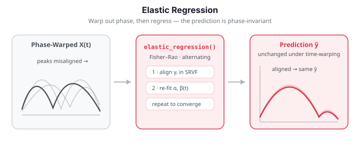

# Elastic Regression

Standard scalar-on-function regression assumes the functional predictors are
observed on a common, meaningful time scale. When curves carry **phase
variability** (differences in the *timing* of features), least-squares methods
blend amplitude and phase variation: the FPCs waste directions on the
misalignment, $\hat\beta(t)$ gets blurred, and predictive accuracy collapses.

Elastic regression fixes this by *jointly* estimating warping functions
$\gamma_i$ and a coefficient function $\beta(t)$ under the **Fisher–Rao metric**,
working in the **square-root-velocity (SRVF)** domain where phase and amplitude
separate cleanly.

{ .fdars-diagram }

---

## Mathematical framework

### Standard functional linear model

The scalar-on-function linear model regresses a scalar response on a functional
predictor $X_i(t)$, $t \in [0,1]$:

$$
y_i = \alpha + \int_0^1 X_i(t)\,\beta(t)\,dt + \varepsilon_i ,
\qquad \varepsilon_i \sim \mathcal N(0, \sigma^2).
$$

This is what [`fregre_lm`](scalar-on-function.md) fits (via an FPCA basis
truncation). It is optimal only when the $X_i$ are already **registered** —
i.e. corresponding features occur at the same $t$ across curves.

### Phase variability and the SRVF representation

Let $\Gamma = \{\gamma:[0,1]\to[0,1] \mid \gamma(0)=0,\ \gamma(1)=1,\ \dot\gamma>0\}$
be the group of boundary-preserving diffeomorphisms (warping functions). A
warped predictor is the composition $\tilde X_i = X_i \circ \gamma_i$. The
difficulty is that the ordinary $\mathbb L^2$ distance is **not** invariant to
warping — $\|X\circ\gamma - Y\circ\gamma\| \neq \|X-Y\|$ — so registration under
$\mathbb L^2$ is ill-posed (the *pinching* problem).

The fix is to represent each curve by its **square-root velocity function**
(SRVF):

$$
q(t) \;=\; \operatorname{sgn}\!\big(\dot X(t)\big)\,\sqrt{\lvert \dot X(t)\rvert}
\;=\; \frac{\dot X(t)}{\sqrt{\lvert \dot X(t)\rvert}} .
$$

The original curve is recovered (up to a constant) by
$X(t) = X(0) + \int_0^t q(s)\,\lvert q(s)\rvert\,ds$. The decisive property is
that under warping the SRVF transforms as

$$
(q\circ\gamma)\sqrt{\dot\gamma} \;=\; (q,\gamma),
$$

and the $\mathbb L^2$ distance between SRVFs **is** warping-invariant:
$\lVert (q_1,\gamma) - (q_2,\gamma)\rVert = \lVert q_1 - q_2\rVert$. The
$\mathbb L^2$ metric on SRVFs is exactly the **Fisher–Rao metric** pulled back to
curve space — the unique reparameterization-invariant Riemannian metric. This is
what makes the **amplitude distance**

$$
d_a(X_1, X_2) \;=\; \inf_{\gamma \in \Gamma}\;
   \big\lVert q_1 - (q_2,\gamma) \big\rVert
$$

a proper, phase-invariant notion of how different two curves are *in shape*, and
the residual **phase distance** $d_p$ a measure of how much timing had to change
to achieve that match. In `fdars` the SRVF map is `srsf_transform` / its inverse
`srsf_inverse`, and the amplitude/phase split of a pair is `elastic_decomposition`.

### Elastic regression model

Elastic regression embeds the warping directly into the linear model, treating
phase as a **nuisance** to be optimised away:

$$
y_i \;=\; \alpha \;+\; \int_0^1 \tilde X_i(t)\,\beta(t)\,dt \;+\; \varepsilon_i,
\qquad \tilde X_i = X_i \circ \gamma_i .
$$

The model is **phase-invariant by construction**: warping a predictor,
$X_i \mapsto X_i \circ \gamma$, is absorbed into $\gamma_i$, leaving the
prediction unchanged. Fitting minimises the residual sum of squares jointly over
$(\alpha, \beta, \{\gamma_i\})$ by an **alternating (block-coordinate)**
scheme, with a roughness penalty $\lambda$ on the warping to prevent degenerate
(pinched) $\gamma_i$:

1. **Alignment step** — fix $\beta$, and for each $i$ update
   $\gamma_i = \arg\min_{\gamma\in\Gamma}\big(y_i - \alpha - \int \tilde X_i\beta\big)^2$
   by dynamic programming in the SRVF domain (the response *guides* the warp).
2. **Regression step** — fix $\{\gamma_i\}$, form the aligned curves, and
   re-estimate $\alpha$ and $\beta(t)$ by penalised least squares on an
   `ncomp_beta`-dimensional FPCA basis.

Iterate until the relative change in SSE falls below `tol` (or `max_iter` is
reached). Because each step cannot increase the objective, the loss decreases
monotonically to a stationary point.

### Elastic logistic model

For a binary response the same machinery applies to the log-odds:

$$
\log\frac{P(y_i = 1 \mid X_i)}{P(y_i = 0 \mid X_i)}
   \;=\; \alpha + \int_0^1 \tilde X_i(t)\,\beta(t)\,dt ,
$$

with the regression step replaced by penalised logistic regression on the
aligned FPCA scores.

### Elastic principal component regression (PCR)

Instead of estimating $\beta(t)$ directly, elastic PCR first performs
**elastic FPCA** on the aligned curves and regresses the response on the
resulting scores $\xi_{ik}$:

$$
y_i \;=\; \alpha + \sum_{k=1}^{K} b_k\,\xi_{ik} + \varepsilon_i .
$$

There are three flavours of score, depending on which variation you keep:
**vertical** (amplitude only, `vert_fpca`), **horizontal** (phase only, via the
shooting vectors of the warps, `horiz_fpca`), and **joint** (a balanced
combination, `joint_fpca`).

---

## When alignment actually matters

The key scenario is: **the response is driven by an amplitude feature, and phase
is pure nuisance.** The worked example below (ported from the R reference) makes
this precise. Every curve is a nonlinearly time-warped copy of one template,
scaled by a random amplitude perturbation $\delta_i$; the response depends only
on $\delta_i$:

$$
X_i(t) = (1 + 0.2\,\delta_i)\;\text{template}(\gamma_i(t)) + \text{noise},
\qquad y_i = 2\,\delta_i + \text{noise}.
$$

Because the informative signal ($\delta_i$) lives in amplitude while the
dominant *variance* is phase, ordinary FPC regression latches onto the warping
and fails. Elastic regression aligns the phase away and recovers the amplitude
signal.

```python exec="1" html="1" source="above"
import numpy as np
from scipy.stats import beta as beta_dist
from docs_fig import fig, render
from fdars.regression import fregre_lm
from fdars.alignment import elastic_regression

rng = np.random.default_rng(42)
n, m = 60, 80
t = np.linspace(0, 1, m)

def template(s):
    return np.sin(2 * np.pi * s) + 0.3 * np.sin(6 * np.pi * s)

def random_warp(rng, t):
    # A nonlinear, monotone warp of [0,1] onto itself: a Beta CDF.
    a, b = rng.uniform(0.5, 2.0, size=2)
    return beta_dist.cdf(t, a, b)

X = np.zeros((n, m))
y = np.zeros(n)
for i in range(n):
    gamma = random_warp(rng, t)
    delta = rng.normal(0, 0.4)                      # amplitude signal
    X[i] = (1 + 0.2 * delta) * np.interp(gamma, t, template(t)) \
           + 0.1 * rng.standard_normal(m)
    y[i] = 2 * delta + rng.normal(0, 0.3)           # response depends on delta

lm = fregre_lm(X, y, n_comp=5)
el = elastic_regression(X, t, y, ncomp_beta=5, lambda_=0.01, max_iter=20, tol=1e-3)

f, (a0, a1) = fig(1, 2, figsize=(11, 4))
a0.plot(t, X[:20].T, color="#3f51b5", lw=0.7, alpha=0.4)
a0.set(title="Predictors: warped copies of one template", xlabel="t", ylabel="X(t)")

for name, res, c in [(f"standard FPC (R²={lm['r_squared']:.2f})", lm["fitted_values"], "#dc3545"),
                     (f"elastic (R²={el['r_squared']:.2f})", el["fitted_values"], "#198754")]:
    a1.scatter(y, np.asarray(res), s=26, alpha=0.75, color=c, label=name)
lim = [y.min(), y.max()]
a1.plot(lim, lim, color="#6c757d", ls="--", lw=1.5)
a1.set(title="Observed vs fitted", xlabel="observed y", ylabel="fitted y")
a1.legend(fontsize=8)
print(render(f))
```

Standard FPC regression explains almost none of the response, while elastic
regression recovers it: the misalignment that dominated the raw curves is
removed before fitting.

---

## The SRVF domain: where phase and amplitude separate

The engine underneath every elastic method is the SRVF transform. Raw curves
that differ mostly in *timing* look wildly spread out; their SRVFs collapse
toward a common shape once the (multiplicative) warping term is factored out.
The plot below shows the raw predictors and their SRVFs `srsf_transform(X_i, t)`.

```python exec="1" html="1" source="above"
import numpy as np
from scipy.stats import beta as beta_dist
from docs_fig import fig, render
from fdars.alignment import srsf_transform, karcher_mean

rng = np.random.default_rng(42)
n, m = 60, 80
t = np.linspace(0, 1, m)

def template(s):
    return np.sin(2 * np.pi * s) + 0.3 * np.sin(6 * np.pi * s)

X = np.zeros((n, m))
for i in range(n):
    a, b = rng.uniform(0.5, 2.0, size=2)
    gamma = beta_dist.cdf(t, a, b)
    delta = rng.normal(0, 0.4)
    X[i] = (1 + 0.2 * delta) * np.interp(gamma, t, template(t)) \
           + 0.1 * rng.standard_normal(m)

q = np.array([np.asarray(srsf_transform(X[i], t)) for i in range(n)])
km = karcher_mean(X, t, lambda_=0.01)          # Fisher-Rao Karcher mean + alignment
aligned = np.asarray(km["aligned_data"])

f, (a0, a1, a2) = fig(1, 3, figsize=(13, 4))
a0.plot(t, X[:20].T, color="#3f51b5", lw=0.7, alpha=0.5)
a0.set(title="Raw curves  X(t)", xlabel="t")
a1.plot(t, q[:20].T, color="#8e24aa", lw=0.7, alpha=0.5)
a1.set(title=r"SRVF domain  q(t)", xlabel="t")
a2.plot(t, aligned[:20].T, color="#198754", lw=0.7, alpha=0.5)
a2.plot(t, np.asarray(km["mean"]), color="#111", lw=2.2, label="Karcher mean")
a2.set(title="Aligned curves (phase removed)", xlabel="t")
a2.legend(fontsize=8)
print(render(f))
```

After Fisher–Rao alignment the curves overlap tightly around the Karcher mean;
the remaining vertical spread is exactly the amplitude signal $\delta_i$ that
the response cares about.

---

## Amplitude vs. phase distances

`elastic_decomposition(f1, f2, argvals, lambda_)` optimally aligns `f2` to `f1`
and splits their total elastic distance into an **amplitude** part
($d_a$, shape difference in the SRVF domain) and a **phase** part
($d_p$, cost of the warp). Measuring each curve against the Karcher mean shows
how the two kinds of variation are distributed across the sample: here phase is
large and roughly constant (every curve is heavily warped), while the amplitude
distances carry what little of $\lvert\delta_i\rvert$ survives the template and
noise (a weak proxy — the regression below extracts it far more cleanly).

```python exec="1" html="1" source="above"
import numpy as np
from scipy.stats import beta as beta_dist
from docs_fig import fig, render
from fdars.alignment import karcher_mean, elastic_decomposition

rng = np.random.default_rng(42)
n, m = 60, 80
t = np.linspace(0, 1, m)

def template(s):
    return np.sin(2 * np.pi * s) + 0.3 * np.sin(6 * np.pi * s)

X = np.zeros((n, m)); delta = np.zeros(n)
for i in range(n):
    a, b = rng.uniform(0.5, 2.0, size=2)
    gamma = beta_dist.cdf(t, a, b)
    delta[i] = rng.normal(0, 0.4)
    X[i] = (1 + 0.2 * delta[i]) * np.interp(gamma, t, template(t)) \
           + 0.1 * rng.standard_normal(m)

mu = np.asarray(karcher_mean(X, t, lambda_=0.01)["mean"])
d_amp = np.zeros(n); d_phase = np.zeros(n)
for i in range(n):
    dec = elastic_decomposition(mu, X[i], t, lambda_=0.01)
    d_amp[i], d_phase[i] = dec["d_amplitude"], dec["d_phase"]

f, (a0, a1) = fig(1, 2, figsize=(11, 4))
a0.scatter(d_phase, d_amp, s=30, c="#3f51b5", alpha=0.8)
a0.set(title="Phase vs. amplitude distance to the mean",
       xlabel=r"phase distance $d_p$", ylabel=r"amplitude distance $d_a$")
a1.scatter(np.abs(delta), d_amp, s=30, c="#198754", alpha=0.8)
a1.set(title=r"Amplitude distance vs. $|\delta_i|$",
       xlabel=r"$|\delta_i|$ (true amplitude signal)", ylabel=r"amplitude distance $d_a$")
print(render(f))
```

The right panel is a caution, not a victory lap: with only a 20% amplitude
perturbation riding on a shared template plus noise, the raw amplitude *distance
to the mean* is a **weak, scattered** proxy for $|\delta_i|$ — a curve's distance
to the Karcher mean mixes its own $\delta_i$ with template and noise. The point of
the elastic pipeline is not that this scatter is tight, but that a regression fit
in the aligned/SRVF domain (below) recovers the $\delta_i$ signal far more
directly than one fit on the raw, phase-corrupted curves.

---

## Elastic scalar-on-function regression

`elastic_regression(data, argvals, response, ...)` fits the joint model and
returns the intercept, aligned coefficient function, fit statistics, and the
estimated warping functions.

| Parameter | Type | Default | Description |
|-----------|------|---------|-------------|
| `data` | `ndarray (n, m)` | — | Predictor curves (one per row) |
| `argvals` | `ndarray (m,)` | — | Common time grid $t$ |
| `response` | `ndarray (n,)` | — | Scalar response $y$ |
| `ncomp_beta` | `int` | `10` | FPCA basis dimension for $\beta(t)$ |
| `lambda_` | `float` | `0.0` | Roughness penalty on the warpings |
| `max_iter` | `int` | `20` | Max align/refit iterations |
| `tol` | `float` | `1e-4` | Relative-SSE convergence tolerance |

```python
import numpy as np
from scipy.stats import beta as beta_dist
from fdars import Fdata
from fdars.alignment import elastic_regression

# --- Simulate warped template + amplitude-driven response ---
rng = np.random.default_rng(42)
n, m = 60, 80
t = np.linspace(0, 1, m)

def template(s):
    return np.sin(2 * np.pi * s) + 0.3 * np.sin(6 * np.pi * s)

def random_warp(rng, t):
    a, b = rng.uniform(0.5, 2.0, size=2)       # Beta-CDF warp of [0,1]
    return beta_dist.cdf(t, a, b)

raw = np.zeros((n, m))
response = np.zeros(n)
for i in range(n):
    gamma = random_warp(rng, t)
    delta = rng.normal(0, 0.4)
    raw[i] = (1 + 0.2 * delta) * np.interp(gamma, t, template(t)) \
             + 0.1 * rng.standard_normal(m)
    response[i] = 2 * delta + rng.normal(0, 0.3)
fd = Fdata(raw, argvals=t)

# --- Fit elastic regression ---
result = elastic_regression(
    fd.data, fd.argvals, response,
    ncomp_beta=5,   # basis dimension for beta
    lambda_=0.01,   # regularization on warping
    max_iter=20,
    tol=1e-3,
)

alpha    = result["alpha"]           # intercept
beta     = result["beta"]            # (m,) -- estimated beta(t) in aligned space
fitted   = result["fitted_values"]   # (n,)
resid    = result["residuals"]       # (n,)
sse      = result["sse"]             # sum of squared errors
r2       = result["r_squared"]       # R-squared
gammas   = result["gammas"]          # (n, m) -- estimated warping functions
n_iter   = result["n_iter"]          # iterations used

print(f"R-squared:  {r2:.4f}")
print(f"Iterations: {n_iter}")
```

| Key | Type | Description |
|-----|------|-------------|
| `alpha` | `float` | Intercept |
| `beta` | `ndarray (m,)` | Estimated coefficient function |
| `fitted_values` | `ndarray (n,)` | Predicted response |
| `residuals` | `ndarray (n,)` | Residuals |
| `sse` | `float` | Sum of squared errors |
| `r_squared` | `float` | Coefficient of determination |
| `gammas` | `ndarray (n, m)` | Estimated warping functions |
| `n_iter` | `int` | Number of iterations |

The two diagnostics that matter most are the estimated coefficient function
$\hat\beta(t)$ (interpretable only in the *aligned* domain) and the recovered
warping functions $\hat\gamma_i$ that carry all the phase:

```python exec="1" html="1" source="above"
import numpy as np
from scipy.stats import beta as beta_dist
from docs_fig import fig, render
from fdars.alignment import elastic_regression

rng = np.random.default_rng(42)
n, m = 60, 80
t = np.linspace(0, 1, m)

def template(s):
    return np.sin(2 * np.pi * s) + 0.3 * np.sin(6 * np.pi * s)

X = np.zeros((n, m)); y = np.zeros(n)
for i in range(n):
    a, b = rng.uniform(0.5, 2.0, size=2)
    gamma = beta_dist.cdf(t, a, b)
    delta = rng.normal(0, 0.4)
    X[i] = (1 + 0.2 * delta) * np.interp(gamma, t, template(t)) \
           + 0.1 * rng.standard_normal(m)
    y[i] = 2 * delta + rng.normal(0, 0.3)

el = elastic_regression(X, t, y, ncomp_beta=5, lambda_=0.01, max_iter=20, tol=1e-3)
beta = np.asarray(el["beta"]); gammas = np.asarray(el["gammas"])

f, (a0, a1) = fig(1, 2, figsize=(11, 4))
a0.plot(t, beta, color="#198754", lw=2)
a0.axhline(0, color="#6c757d", ls="--", lw=1)
a0.set(title=r"Estimated coefficient function $\hat\beta(t)$",
       xlabel="t (aligned)", ylabel=r"$\hat\beta(t)$")
a1.plot(t, gammas[:25].T, color="#e8710a", lw=0.8, alpha=0.6)
a1.plot([0, 1], [0, 1], color="#111", ls="--", lw=1.2, label="identity")
a1.set(title=r"Estimated warping functions $\hat\gamma_i$",
       xlabel="t", ylabel=r"$\gamma_i(t)$")
a1.legend(fontsize=8)
print(render(f))
```

!!! info "Comparison with standard regression"
    Elastic regression outperforms `fregre_lm` when the predictors carry
    substantial phase variability. If curves are already well aligned, the two
    give similar results and `fregre_lm` is much faster.

---

## Elastic logistic regression

For binary classification under phase variability. The model jointly aligns the
curves and estimates the decision boundary in the aligned (SRVF) domain:

$$
\log\frac{P(G=1 \mid x)}{P(G=0 \mid x)} = \alpha + \int_0^1 \tilde X(t)\,\beta(t)\,dt .
$$

Continuing the example above, we threshold the response at its median to make a
binary label. Elastic logistic recovers the classes with high accuracy because
the amplitude sign that determines the label survives alignment, while the phase
nuisance is removed.

```python
import numpy as np
from fdars.alignment import elastic_logistic

labels = (response > np.median(response)).astype(np.int64)

result = elastic_logistic(
    fd.data, fd.argvals, labels,
    ncomp_beta=5,
    lambda_=0.01,
    max_iter=15,
    tol=1e-3,
)

probs     = result["probabilities"]       # (n,)
predicted = result["predicted_classes"]   # (n,)
accuracy  = result["accuracy"]            # scalar
beta      = result["beta"]                # (m,)
gammas    = result["gammas"]              # (n, m)
loss      = result["loss"]                # final loss value

print(f"Accuracy:   {accuracy:.2%}")
print(f"Final loss: {loss:.4f}")
```

| Key | Type | Description |
|-----|------|-------------|
| `alpha` | `float` | Intercept |
| `beta` | `ndarray (m,)` | Coefficient function |
| `probabilities` | `ndarray (n,)` | Predicted class probabilities |
| `predicted_classes` | `ndarray (n,)` | Predicted labels |
| `accuracy` | `float` | Classification accuracy |
| `loss` | `float` | Final logistic loss |
| `gammas` | `ndarray (n, m)` | Estimated warping functions |
| `n_iter` | `int` | Number of iterations |

---

## Elastic PCR: regressing on amplitude/phase scores

Elastic PCR replaces the direct $\beta(t)$ estimate with a two-step recipe:
run **elastic FPCA** on the aligned curves, then regress $y$ on the leading
scores. `fdars` exposes the three elastic-FPCA primitives — `vert_fpca`
(amplitude / vertical), `horiz_fpca` (phase / horizontal), and `joint_fpca`
(balanced) — each returning `scores`, `eigenvalues`, and `cumulative_variance`.

!!! warning "There is no packaged `elastic.pcr` binding in Python"
    The R reference ships a single `elastic.pcr(fd, y, ncomp, pca.method=...)`
    wrapper. `fdars`' Python surface exposes the **components** but not the
    wrapper, so we assemble PCR explicitly below: FPCA → ordinary least squares
    on the scores. This is transparent and matches what the wrapper does
    internally. The related conformal routine
    `fdars.conformal.conformal_elastic_pcr` *is* bound if you need calibrated
    prediction intervals.

A subtlety worth being honest about: the amplitude signal $\delta_i$ here is a
*low-variance* direction, so the first few `vert_fpca` scores (ordered by
variance) capture template-shape variation before they reach $\delta_i$. PCR
therefore needs enough components — or, equivalently, principal components of the
Karcher-**aligned** curves — before $R^2$ climbs. The figure sweeps the number
of components for both score types.

```python exec="1" html="1" source="above"
import numpy as np
from numpy.linalg import lstsq
from scipy.stats import beta as beta_dist
from docs_fig import fig, render
from fdars.regression import fregre_lm
from fdars.alignment import vert_fpca, karcher_mean

rng = np.random.default_rng(42)
n, m = 60, 80
t = np.linspace(0, 1, m)

def template(s):
    return np.sin(2 * np.pi * s) + 0.3 * np.sin(6 * np.pi * s)

X = np.zeros((n, m)); y = np.zeros(n)
for i in range(n):
    a, b = rng.uniform(0.5, 2.0, size=2)
    gamma = beta_dist.cdf(t, a, b)
    delta = rng.normal(0, 0.4)
    X[i] = (1 + 0.2 * delta) * np.interp(gamma, t, template(t)) \
           + 0.1 * rng.standard_normal(m)
    y[i] = 2 * delta + rng.normal(0, 0.3)

def pcr_r2(scores):
    Z = np.column_stack([np.ones(n), scores])
    b, *_ = lstsq(Z, y, rcond=None)
    fit = Z @ b
    return 1 - ((y - fit) ** 2).sum() / ((y - y.mean()) ** 2).sum()

aligned = np.asarray(karcher_mean(X, t, lambda_=0.01)["aligned_data"])
ks = [2, 3, 4, 5, 6, 8]
r2_vert, r2_aligned = [], []
for k in ks:
    r2_vert.append(pcr_r2(np.asarray(vert_fpca(X, t, n_comp=k)["scores"])))
    Xc = aligned - aligned.mean(0)
    U, s, _ = np.linalg.svd(Xc, full_matrices=False)
    r2_aligned.append(pcr_r2(U[:, :k] * s[:k]))
r2_std = fregre_lm(X, y, n_comp=5)["r_squared"]

f, ax = fig()
ax.plot(ks, r2_vert, "o-", color="#8e24aa", label="vert_fpca scores")
ax.plot(ks, r2_aligned, "s-", color="#198754", label="PCA on aligned curves")
ax.axhline(r2_std, color="#dc3545", ls="--", lw=1.5, label=f"standard fregre_lm ({r2_std:.2f})")
ax.set(title="Elastic PCR: R² vs. number of components",
       xlabel="components K", ylabel=r"$R^2$", ylim=(0, 1))
ax.legend(fontsize=8)
print(render(f))
```

With enough components, PCR on the aligned curves recovers the amplitude signal
and dwarfs the unaligned baseline; the raw vertical scores need more components
to reach the same place because they rank the template shape above the weak
$\delta_i$ direction.

---

## Align-then-regress: a cheaper alternative

Joint estimation is expensive. A pragmatic middle ground is to align the curves
once with `karcher_mean` (which returns `aligned_data`) and feed the aligned
curves into ordinary `fregre_lm`. Both alignment strategies dramatically beat the
unaligned baseline; which of the two wins depends on the data — align-then-regress
is a fast, strong default, while joint elastic optimisation lets the response
guide the warping.

```python exec="1" html="1" source="above"
import numpy as np
from scipy.stats import beta as beta_dist
from docs_fig import fig, render
from fdars.regression import fregre_lm
from fdars.alignment import elastic_regression, karcher_mean

rng = np.random.default_rng(42)
n, m = 60, 80
t = np.linspace(0, 1, m)

def template(s):
    return np.sin(2 * np.pi * s) + 0.3 * np.sin(6 * np.pi * s)

def random_warp(rng, t):
    a, b = rng.uniform(0.5, 2.0, size=2)
    return beta_dist.cdf(t, a, b)

X = np.zeros((n, m)); y = np.zeros(n)
for i in range(n):
    gamma = random_warp(rng, t)
    delta = rng.normal(0, 0.4)
    X[i] = (1 + 0.2 * delta) * np.interp(gamma, t, template(t)) \
           + 0.1 * rng.standard_normal(m)
    y[i] = 2 * delta + rng.normal(0, 0.3)

r_std = fregre_lm(X, y, n_comp=5)["r_squared"]
km = karcher_mean(X, t, lambda_=0.01)
r_align = fregre_lm(np.asarray(km["aligned_data"]), y, n_comp=5)["r_squared"]
r_elastic = elastic_regression(X, t, y, ncomp_beta=5, lambda_=0.01)["r_squared"]

methods = ["standard\nfregre_lm", "align-then\n-regress", "elastic\nregression"]
r2s = [r_std, r_align, r_elastic]

f, ax = fig()
ax.bar(methods, r2s, color=["#dc3545", "#e8710a", "#198754"], alpha=0.85)
for i, v in enumerate(r2s):
    ax.text(i, v + 0.01, f"{v:.2f}", ha="center", fontsize=10)
ax.set(title="R² by alignment strategy", ylabel=r"$R^2$", ylim=(0, 1))
print(render(f))
```

---

## When to use elastic regression

| Scenario | Recommended method |
|----------|--------------------|
| Predictors pre-aligned / no phase variability | `fregre_lm`, `fregre_pls` |
| Moderate phase shifts | `elastic_regression` with small $\lambda$ |
| Large, nonlinear phase distortions | `elastic_regression` with moderate $\lambda$ |
| Fast approximation for large $n$ | align with `karcher_mean`, then `fregre_lm` |
| Interpretable amplitude/phase scores | elastic PCR via `vert_fpca` / `horiz_fpca` / `joint_fpca` |
| Binary classification with phase variability | `elastic_logistic` |
| Binary classification without phase variability | `functional_logistic`, `fclassif_lda` |

!!! warning "Computational cost"
    Elastic regression is far more expensive than standard functional regression
    because it re-optimises the warping functions at every iteration. For large
    datasets, pre-align once with `karcher_mean` and use `fregre_lm`.

!!! note "Amplitude/phase attribution (R-only)"
    The R reference additionally documents `elastic.attribution` (permutation
    importance of amplitude vs. phase). There is no single packaged `fdars`
    Python binding for it. You can approximate it by permuting the `vert_fpca`
    (amplitude) and `horiz_fpca` (phase) scores separately and measuring the drop
    in $R^2$, using the primitives shown above.

## References

- Srivastava, A., Wu, W., Kurtek, S., Klassen, E. & Marron, J. S. (2011).
  *Registration of functional data using the Fisher–Rao metric.*
  arXiv:1103.3817.
- Tucker, J. D., Wu, W. & Srivastava, A. (2013). *Generative models for
  functional data using phase and amplitude separation.* Computational
  Statistics & Data Analysis, 61, 50–66.
- Srivastava, A. & Klassen, E. (2016). *Functional and Shape Data Analysis.*
  Springer.
- Ramsay, J. O. & Silverman, B. W. (2005). *Functional Data Analysis*, 2nd ed.
  Springer.
