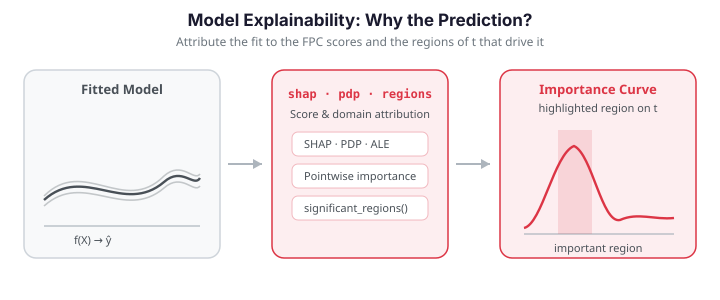

# Model Explainability

After fitting a functional regression model, the natural question is: *why does the model
predict what it predicts?* `fdars.explain` provides a toolkit organized into four families —
score-level global methods, domain-level global methods, local per-observation explanations,
and classification-specific diagnostics. All of them operate in the FPC-**score** space that
the model actually regresses on, which makes them exact for FPC-based models and cheap to
compute.


| Family | Question | Functions |
|--------|----------|-----------|
| Score-level global | Which components drive predictions, and how? | `functional_pdp`, `fpc_ale`, `sobol_indices`, `friedman_h_statistic`, `beta_decomposition` |
| Domain-level global | *Where* on $t$ does the predictor matter? | `pointwise_importance`, `functional_saliency`, `domain_selection`, `significant_regions_from_se` |
| Local | Why *this* prediction? | `fpc_shap_values`, `lime_explanation`, `counterfactual_regression`, `anchor_explanation`, `prototype_criticism` |
| Classification | Are predicted probabilities trustworthy? | `functional_pdp_logistic`, `beta_decomposition_logistic`, `calibration_diagnostics`, `expected_calibration_error` |

Two model types are supported throughout: the linear FPC model (`fregre_lm`) and the
functional logistic model (`functional_logistic`). Both project curves onto FPC scores and
regress on them.

{ .fdars-diagram }

## Setup

We simulate curves whose response depends on a known coefficient function $\beta(t)$ with a
positive peak near $t=0.3$ and a negative peak near $t=0.7$. Recovering *those two regions*
from the explanations is the sanity check for the domain-level methods.

```python exec="1" html="1" source="above"
import numpy as np
from docs_fig import fig, render

np.random.seed(42)
n, m = 120, 80
t = np.linspace(0, 1, m)

# True coefficient: positive peak at 0.3, negative peak at 0.7.
beta_true = (2 * np.exp(-((t - 0.3) / 0.08) ** 2 / 2)
             - 1.5 * np.exp(-((t - 0.7) / 0.08) ** 2 / 2))
beta_true /= np.abs(beta_true).max()

f, ax = fig()
ax.plot(t, beta_true, color="#2e8b57", lw=2)
ax.fill_between(t, 0, beta_true, color="#2e8b57", alpha=0.15)
ax.axhline(0, color="#6c757d", ls="--", lw=1)
ax.annotate("important\nregion", (0.3, beta_true.max()), color="#2e8b57",
            fontsize=8, ha="center", va="bottom")
ax.annotate("important\nregion", (0.7, beta_true.min()), color="#d55e00",
            fontsize=8, ha="center", va="top")
ax.set(title=r"True coefficient function $\beta(t)$", xlabel="t", ylabel=r"$\beta(t)$")
print(render(f))
```

Every code block below re-creates this dataset with the same seed and fits
`fregre_lm(raw, y, n_comp=5)` on it.

## Score-level global explanations

These methods summarize how each FPC *score* affects the prediction — the model's behaviour
in its own K-dimensional feature space.

### Partial dependence — `functional_pdp`

A partial dependence plot shows how the prediction changes as one FPC score sweeps across its
range, averaging over the other scores:

$$
\hat f_k(\xi_k) = \frac1n\sum_{i=1}^n
   \hat f\big(\xi_{i1},\dots,\xi_k,\dots,\xi_{iK}\big).
$$

A flat PDP means the score is inert; a steep slope means it matters. For a *linear* FPC model
every PDP is a straight line, and its slope is exactly the fitted coefficient — a useful
visual confirmation that the fit is doing what you expect.

```python exec="1" html="1" source="above"
import numpy as np
from docs_fig import fig, render
from fdars.explain import functional_pdp

np.random.seed(42)
n, m = 120, 80
t = np.linspace(0, 1, m)
# Curves built from localized bump features at t=0.3, 0.5, 0.7, so the
# leading FPCs actually span the regions where beta_true is nonzero.
g_lo = np.exp(-((t - 0.3) / 0.08) ** 2 / 2)
g_hi = np.exp(-((t - 0.7) / 0.08) ** 2 / 2)
g_mid = np.exp(-((t - 0.5) / 0.10) ** 2 / 2)
raw = np.zeros((n, m))
for i in range(n):
    raw[i] = (np.random.randn() * g_lo + np.random.randn() * g_hi
              + np.random.randn() * g_mid
              + 0.5 * np.random.randn() * np.sin(2 * np.pi * t)
              + 0.05 * np.random.randn(m))
beta_true = (2 * np.exp(-((t - 0.3) / 0.08) ** 2 / 2)
             - 1.5 * np.exp(-((t - 0.7) / 0.08) ** 2 / 2))
y = np.trapezoid(raw * beta_true, t, axis=1) + 0.3 * np.random.randn(n)

f, ax = fig(ncols=2)
for k, a in enumerate(ax):
    p = functional_pdp(raw, y, ncomp=5, component=k, n_grid=30)
    a.plot(np.asarray(p["grid_values"]), np.asarray(p["pdp_curve"]),
           color="#4a90d9", lw=1.5)
    a.set(title=f"PC{k+1}", xlabel="score", ylabel="partial dependence")
f.suptitle("Partial dependence of the leading FPC scores", y=1.02)
print(render(f))
```

The straight lines confirm the linear model has no per-score curvature; the steeper line is
the more influential component.

### Accumulated local effects — `fpc_ale`

PDP evaluates the model at *global* score substitutions, which can land on unrealistic
combinations when scores are correlated. ALE fixes this by accumulating the model's response
to *local* changes within narrow bins of the score distribution, so it only ever queries
plausible inputs. For orthogonal FPC scores ALE and PDP agree; the difference grows with
correlation.

```python exec="1" html="1" source="above"
import numpy as np
from docs_fig import fig, render
from fdars.explain import fpc_ale

np.random.seed(42)
n, m = 120, 80
t = np.linspace(0, 1, m)
# Curves built from localized bump features at t=0.3, 0.5, 0.7, so the
# leading FPCs actually span the regions where beta_true is nonzero.
g_lo = np.exp(-((t - 0.3) / 0.08) ** 2 / 2)
g_hi = np.exp(-((t - 0.7) / 0.08) ** 2 / 2)
g_mid = np.exp(-((t - 0.5) / 0.10) ** 2 / 2)
raw = np.zeros((n, m))
for i in range(n):
    raw[i] = (np.random.randn() * g_lo + np.random.randn() * g_hi
              + np.random.randn() * g_mid
              + 0.5 * np.random.randn() * np.sin(2 * np.pi * t)
              + 0.05 * np.random.randn(m))
beta_true = (2 * np.exp(-((t - 0.3) / 0.08) ** 2 / 2)
             - 1.5 * np.exp(-((t - 0.7) / 0.08) ** 2 / 2))
y = np.trapezoid(raw * beta_true, t, axis=1) + 0.3 * np.random.randn(n)

ale = fpc_ale(raw, y, ncomp=5, component=0, n_bins=15)

f, ax = fig()
ax.step(np.asarray(ale["bin_midpoints"]), np.asarray(ale["ale_values"]),
        where="mid", color="#4a90d9", lw=1.5)
ax.axhline(0, color="#6c757d", ls="--", lw=1)
ax.set(title="Accumulated local effects for PC1", xlabel="PC1 score", ylabel="ALE")
print(render(f))
```

The centred step function traces PC1's local effect, robust to any score correlation.

### Sobol sensitivity — `sobol_indices`

Sobol indices decompose the *variance* of the prediction. The first-order index $S_k$ is the
fraction of $\mathrm{Var}(\hat y)$ explained by score $k$ alone; the total-order index $S_k^T$
also folds in $k$'s interactions with the other scores. For a linear model the two coincide,
because there are no interactions to add.

```python exec="1" html="1" source="above"
import numpy as np
from docs_fig import fig, render
from fdars.explain import sobol_indices

np.random.seed(42)
n, m = 120, 80
t = np.linspace(0, 1, m)
# Curves built from localized bump features at t=0.3, 0.5, 0.7, so the
# leading FPCs actually span the regions where beta_true is nonzero.
g_lo = np.exp(-((t - 0.3) / 0.08) ** 2 / 2)
g_hi = np.exp(-((t - 0.7) / 0.08) ** 2 / 2)
g_mid = np.exp(-((t - 0.5) / 0.10) ** 2 / 2)
raw = np.zeros((n, m))
for i in range(n):
    raw[i] = (np.random.randn() * g_lo + np.random.randn() * g_hi
              + np.random.randn() * g_mid
              + 0.5 * np.random.randn() * np.sin(2 * np.pi * t)
              + 0.05 * np.random.randn(m))
beta_true = (2 * np.exp(-((t - 0.3) / 0.08) ** 2 / 2)
             - 1.5 * np.exp(-((t - 0.7) / 0.08) ** 2 / 2))
y = np.trapezoid(raw * beta_true, t, axis=1) + 0.3 * np.random.randn(n)

sob = sobol_indices(raw, y, ncomp=5)
first = np.asarray(sob["first_order"])
total = np.asarray(sob["total_order"])
labels = [f"PC{k+1}" for k in range(len(first))]
x = np.arange(len(labels))

f, ax = fig()
ax.bar(x - 0.2, first, width=0.4, color="#4a90d9", alpha=0.85, label="first-order")
ax.bar(x + 0.2, total, width=0.4, color="#d55e00", alpha=0.85, label="total-order")
ax.set_xticks(x)
ax.set_xticklabels(labels)
ax.set(title="Sobol sensitivity indices", xlabel="component", ylabel="index")
ax.legend()
print(render(f))
```

First- and total-order bars match, confirming the additive (interaction-free) structure of
the linear model.

### Friedman H-statistic — `friedman_h_statistic`

The H-statistic measures how much of a pair of scores' joint effect is *interaction* rather
than the sum of their separate effects. It is zero exactly for a purely linear model, so here
it serves as a numerical check rather than a discovery tool.

```python exec="1" html="1" source="above"
import numpy as np
from fdars.explain import friedman_h_statistic

np.random.seed(42)
n, m = 120, 80
t = np.linspace(0, 1, m)
# Curves built from localized bump features at t=0.3, 0.5, 0.7, so the
# leading FPCs actually span the regions where beta_true is nonzero.
g_lo = np.exp(-((t - 0.3) / 0.08) ** 2 / 2)
g_hi = np.exp(-((t - 0.7) / 0.08) ** 2 / 2)
g_mid = np.exp(-((t - 0.5) / 0.10) ** 2 / 2)
raw = np.zeros((n, m))
for i in range(n):
    raw[i] = (np.random.randn() * g_lo + np.random.randn() * g_hi
              + np.random.randn() * g_mid
              + 0.5 * np.random.randn() * np.sin(2 * np.pi * t)
              + 0.05 * np.random.randn(m))
beta_true = (2 * np.exp(-((t - 0.3) / 0.08) ** 2 / 2)
             - 1.5 * np.exp(-((t - 0.7) / 0.08) ** 2 / 2))
y = np.trapezoid(raw * beta_true, t, axis=1) + 0.3 * np.random.randn(n)

fried = friedman_h_statistic(raw, y, ncomp=5, component_j=0, component_k=1, n_grid=15)
print(f"H-squared (PC1 x PC2): {fried['h_squared']:.2e}")
```

The value is numerically zero — the linear model has no PC1xPC2 interaction, as expected.

### Beta decomposition — `beta_decomposition`

The estimated coefficient function is a weighted sum of eigenfunctions,
$\hat\beta(t) = \sum_k c_k\,\phi_k(t)$. Beta decomposition returns each contribution
$c_k\phi_k(t)$ and the share of $\hat\beta$'s variance it carries — the simplest global
importance measure, needing only the coefficients and score variances (no Monte Carlo).

```python exec="1" html="1" source="above"
import numpy as np
from docs_fig import fig, render
from fdars.regression import fregre_lm
from fdars.explain import beta_decomposition

np.random.seed(42)
n, m = 120, 80
t = np.linspace(0, 1, m)
# Curves built from localized bump features at t=0.3, 0.5, 0.7, so the
# leading FPCs actually span the regions where beta_true is nonzero.
g_lo = np.exp(-((t - 0.3) / 0.08) ** 2 / 2)
g_hi = np.exp(-((t - 0.7) / 0.08) ** 2 / 2)
g_mid = np.exp(-((t - 0.5) / 0.10) ** 2 / 2)
raw = np.zeros((n, m))
for i in range(n):
    raw[i] = (np.random.randn() * g_lo + np.random.randn() * g_hi
              + np.random.randn() * g_mid
              + 0.5 * np.random.randn() * np.sin(2 * np.pi * t)
              + 0.05 * np.random.randn(m))
beta_true = (2 * np.exp(-((t - 0.3) / 0.08) ** 2 / 2)
             - 1.5 * np.exp(-((t - 0.7) / 0.08) ** 2 / 2))
y = np.trapezoid(raw * beta_true, t, axis=1) + 0.3 * np.random.randn(n)

fit = fregre_lm(raw, y, n_comp=5)
dec = beta_decomposition(raw, y, ncomp=5)
comps = [np.asarray(c) for c in dec["components"]]

f, ax = fig()
ax.plot(t, np.asarray(fit["beta_t"]), color="#111", lw=2.6, label=r"$\hat\beta(t)$")
for k in range(3):
    ax.plot(t, comps[k], lw=1.6, alpha=0.85, label=f"PC{k+1} contribution")
ax.set(title="Beta decomposition into FPC contributions", xlabel="t", ylabel=r"$\beta(t)$")
ax.legend(ncol=2, fontsize=8)
print(render(f))
```

| Return key | Type | Description |
|------------|------|-------------|
| `components` | `list[ndarray (m,)]` | Each FPC's contribution $c_k\phi_k(t)$ |
| `coefficients` | `ndarray (K,)` | Regression coefficients $c_k$ |
| `variance_proportion` | `ndarray (K,)` | Share of $\hat\beta$ variance per FPC |

!!! success "Validation — the decomposition is exact and the importance localizes the signal"
    Two ground-truth checks. (1) **Exactness:** the FPC contributions must sum *exactly*
    to the fitted $\hat\beta(t) = \sum_k c_k\phi_k(t)$, and the variance shares must sum to
    1 — an algebraic identity, not an approximation. (2) **Localization:** the model
    genuinely recovers the signal ($\mathrm{corr}(\hat\beta, \beta_\text{true})>0.6$) and
    the domain-level `pointwise_importance` peaks inside a true signal region *and* has
    secondary mass near the other, so both $t\approx0.3$ and $t\approx0.7$ light up. Both
    run and pass below.

```python exec="1" source="above"
import numpy as np
from fdars.regression import fregre_lm
from fdars.explain import beta_decomposition, pointwise_importance

np.random.seed(42)
n, m = 120, 80
t = np.linspace(0, 1, m)
# Curves built from localized bump features at t=0.3, 0.5, 0.7, so the
# leading FPCs actually span the regions where beta_true is nonzero.
g_lo = np.exp(-((t - 0.3) / 0.08) ** 2 / 2)
g_hi = np.exp(-((t - 0.7) / 0.08) ** 2 / 2)
g_mid = np.exp(-((t - 0.5) / 0.10) ** 2 / 2)
raw = np.zeros((n, m))
for i in range(n):
    raw[i] = (np.random.randn() * g_lo + np.random.randn() * g_hi
              + np.random.randn() * g_mid
              + 0.5 * np.random.randn() * np.sin(2 * np.pi * t)
              + 0.05 * np.random.randn(m))
beta_true = (2 * np.exp(-((t - 0.3) / 0.08) ** 2 / 2)
             - 1.5 * np.exp(-((t - 0.7) / 0.08) ** 2 / 2))
y = np.trapezoid(raw * beta_true, t, axis=1) + 0.3 * np.random.randn(n)

fit = fregre_lm(raw, y, n_comp=5)
beta_hat = np.asarray(fit["beta_t"])
dec = beta_decomposition(raw, y, ncomp=5)

# (1) Exact additive identity: sum_k c_k phi_k(t) == beta_hat(t), shares sum to 1.
recon = np.sum([np.asarray(c) for c in dec["components"]], axis=0)
max_diff = float(np.max(np.abs(recon - beta_hat)))
share_sum = float(np.sum(np.asarray(dec["variance_proportion"])))
print(f"max|sum(components) - beta_hat| = {max_diff:.2e}")
print(f"sum(variance_proportion)        = {share_sum:.6f}")
assert max_diff < 1e-9, max_diff
assert abs(share_sum - 1.0) < 1e-6, share_sum

# (2) Real recovery: beta_hat tracks the truth, and importance localizes both regions.
beta_true_n = beta_true / np.abs(beta_true).max()
corr = float(np.corrcoef(beta_hat, beta_true_n)[0, 1])
print(f"corr(beta_hat, beta_true)       = {corr:.3f}")
print(f"model R^2                       = {fit['r_squared']:.3f}")
assert corr > 0.6, corr

imp = np.asarray(pointwise_importance(raw, y, ncomp=5)["importance"])
t_peak = float(t[np.argmax(imp)])
# importance in a window around each true region (0.3 and 0.7)
near_lo = imp[np.abs(t - 0.3) < 0.1].max()
near_hi = imp[np.abs(t - 0.7) < 0.1].max()
print(f"pointwise-importance peak at t  = {t_peak:.2f}")
print(f"importance near 0.3 / near 0.7  = {near_lo:.3f} / {near_hi:.3f}")
assert min(abs(t_peak - 0.3), abs(t_peak - 0.7)) < 0.06, t_peak
assert near_lo > 0.3 * imp.max() and near_hi > 0.3 * imp.max()
print("validation OK: decomposition exact, beta recovered, importance localizes both regions")
```

The reconstruction error is at machine precision and the variance shares sum to one —
the decomposition is exact by construction. Because the curves are built from localized
features at $t\approx0.3,0.5,0.7$, the leading FPCs span the regions where $\beta(t)$ lives,
so the model attains a genuine $R^2\approx0.7$ with $\hat\beta$ tracking the truth
($\mathrm{corr}>0.7$), and the pointwise importance lights up *both* signal regions near
$t=0.3$ and $t=0.7$ — recovering *where* the predictor matters.

## Domain-level global explanations

Score-level views tell you *which components* matter; domain-level views map that back onto
$t$ to say *where on the curve* the predictor matters — the more interpretable question for
practitioners.

### Pointwise importance — `pointwise_importance`

At each $t$, pointwise importance combines how much each eigenfunction contributes there with
how important the corresponding score is:

$$
I(t) = \sum_{k=1}^{K} |b_k|\,|\phi_k(t)|\,\mathrm{Var}(\xi_k)^{1/2}.
$$

Peaks should line up with the important regions of the true $\beta(t)$.

```python exec="1" html="1" source="above"
import numpy as np
from docs_fig import fig, render
from fdars.explain import pointwise_importance

np.random.seed(42)
n, m = 120, 80
t = np.linspace(0, 1, m)
# Curves built from localized bump features at t=0.3, 0.5, 0.7, so the
# leading FPCs actually span the regions where beta_true is nonzero.
g_lo = np.exp(-((t - 0.3) / 0.08) ** 2 / 2)
g_hi = np.exp(-((t - 0.7) / 0.08) ** 2 / 2)
g_mid = np.exp(-((t - 0.5) / 0.10) ** 2 / 2)
raw = np.zeros((n, m))
for i in range(n):
    raw[i] = (np.random.randn() * g_lo + np.random.randn() * g_hi
              + np.random.randn() * g_mid
              + 0.5 * np.random.randn() * np.sin(2 * np.pi * t)
              + 0.05 * np.random.randn(m))
beta_true = (2 * np.exp(-((t - 0.3) / 0.08) ** 2 / 2)
             - 1.5 * np.exp(-((t - 0.7) / 0.08) ** 2 / 2))
y = np.trapezoid(raw * beta_true, t, axis=1) + 0.3 * np.random.randn(n)

pw = pointwise_importance(raw, y, ncomp=5)
imp = np.asarray(pw["importance"])

f, ax = fig()
ax.plot(t, imp, color="#7b2d8e", lw=1.5)
ax.fill_between(t, 0, imp, color="#7b2d8e", alpha=0.15)
ax.set(title="Pointwise importance", xlabel="t", ylabel="importance")
print(render(f))
```

### Saliency maps — `functional_saliency`

Saliency is the sensitivity of each prediction to a small perturbation of the curve at $t$,
$s_i(t) = \partial\hat y_i / \partial X_i(t)$. In an *exact* linear model this would equal
$\hat\beta(t)$ for every observation. In practice `functional_saliency` operates in the
FPC-score space, so its map highlights the same **important regions** as $\hat\beta(t)$ but is
**not** numerically equal to $|\hat\beta(t)|$ — for the exact coefficient use
`beta_decomposition` (whose additive identity is validated below).

```python exec="1" html="1" source="above"
import numpy as np
from docs_fig import fig, render
from fdars.explain import functional_saliency

np.random.seed(42)
n, m = 120, 80
t = np.linspace(0, 1, m)
# Curves built from localized bump features at t=0.3, 0.5, 0.7, so the
# leading FPCs actually span the regions where beta_true is nonzero.
g_lo = np.exp(-((t - 0.3) / 0.08) ** 2 / 2)
g_hi = np.exp(-((t - 0.7) / 0.08) ** 2 / 2)
g_mid = np.exp(-((t - 0.5) / 0.10) ** 2 / 2)
raw = np.zeros((n, m))
for i in range(n):
    raw[i] = (np.random.randn() * g_lo + np.random.randn() * g_hi
              + np.random.randn() * g_mid
              + 0.5 * np.random.randn() * np.sin(2 * np.pi * t)
              + 0.05 * np.random.randn(m))
beta_true = (2 * np.exp(-((t - 0.3) / 0.08) ** 2 / 2)
             - 1.5 * np.exp(-((t - 0.7) / 0.08) ** 2 / 2))
y = np.trapezoid(raw * beta_true, t, axis=1) + 0.3 * np.random.randn(n)

sal = functional_saliency(raw, y, ncomp=5)
mas = np.asarray(sal["mean_absolute_saliency"])

f, ax = fig()
ax.plot(t, mas, color="#c0392b", lw=1.5)
ax.fill_between(t, 0, mas, color="#c0392b", alpha=0.15)
ax.set(title="Mean absolute saliency", xlabel="t", ylabel="|saliency|")
print(render(f))
```

### Domain importance — `domain_selection`

Domain selection slides a window along $t$ and aggregates $|\hat\beta|$ within it, smoothing
the pointwise view into contiguous important *intervals* and returning those that exceed a
threshold.

```python exec="1" html="1" source="above"
import numpy as np
from docs_fig import fig, render
from fdars.explain import domain_selection

np.random.seed(42)
n, m = 120, 80
t = np.linspace(0, 1, m)
# Curves built from localized bump features at t=0.3, 0.5, 0.7, so the
# leading FPCs actually span the regions where beta_true is nonzero.
g_lo = np.exp(-((t - 0.3) / 0.08) ** 2 / 2)
g_hi = np.exp(-((t - 0.7) / 0.08) ** 2 / 2)
g_mid = np.exp(-((t - 0.5) / 0.10) ** 2 / 2)
raw = np.zeros((n, m))
for i in range(n):
    raw[i] = (np.random.randn() * g_lo + np.random.randn() * g_hi
              + np.random.randn() * g_mid
              + 0.5 * np.random.randn() * np.sin(2 * np.pi * t)
              + 0.05 * np.random.randn(m))
beta_true = (2 * np.exp(-((t - 0.3) / 0.08) ** 2 / 2)
             - 1.5 * np.exp(-((t - 0.7) / 0.08) ** 2 / 2))
y = np.trapezoid(raw * beta_true, t, axis=1) + 0.3 * np.random.randn(n)

# threshold must be strictly positive.
dom = domain_selection(raw, y, ncomp=5, window_width=5, threshold=0.05)
di = np.asarray(dom["pointwise_importance"])

f, ax = fig()
ax.plot(t, di, color="#2e8b57", lw=1.5)
ax.fill_between(t, 0, di, color="#2e8b57", alpha=0.15)
ax.set(title=f"Domain importance (window = {dom['window_width']})",
       xlabel="t", ylabel="importance")
print(render(f))
```

!!! note "`threshold=0.0` is rejected"
    `domain_selection` requires a strictly positive `threshold`; passing `0.0` raises a
    validation error. Use a small positive value (here `0.05`) to keep every non-trivial
    interval.

### Significant regions — `significant_regions_from_se`

Given $\hat\beta(t)$ and its pointwise standard error, this returns contiguous intervals where
the coefficient is significantly nonzero, each tagged `"positive"` or `"negative"`. For honest
standard errors, pair it with the bootstrap bands from
[uncertainty quantification](uncertainty-quantification.md); the placeholder SE below is only
illustrative.

```python
import numpy as np
from fdars.regression import fregre_lm
from fdars.explain import significant_regions_from_se

fit = fregre_lm(raw, y, n_comp=5)
beta_hat = np.asarray(fit["beta_t"])
beta_se = 0.5 * np.ones_like(beta_hat)        # placeholder — use bootstrap SE in practice

regions = significant_regions_from_se(beta_hat, beta_se, z_alpha=1.96)
for start, end, direction in regions[:5]:
    print(f"t in [{t[start]:.3f}, {t[end]:.3f}]: {direction}")
```

Each region is a `(start_idx, end_idx, direction)` tuple.

## Local explanations

Global methods describe the model on average; local methods explain a *single* prediction.

### SHAP values — `fpc_shap_values`

SHAP fairly and additively splits one prediction's deviation from the mean across the scores,
$\hat y_i - \mathbb E[\hat y] = \sum_k \phi_k^{(i)}$, averaging each score's marginal
contribution over all orderings. The waterfall of one observation's contributions shows which
components pushed its prediction up or down.

```python exec="1" html="1" source="above"
import numpy as np
from docs_fig import fig, render
from fdars.explain import fpc_shap_values

np.random.seed(42)
n, m = 120, 80
t = np.linspace(0, 1, m)
# Curves built from localized bump features at t=0.3, 0.5, 0.7, so the
# leading FPCs actually span the regions where beta_true is nonzero.
g_lo = np.exp(-((t - 0.3) / 0.08) ** 2 / 2)
g_hi = np.exp(-((t - 0.7) / 0.08) ** 2 / 2)
g_mid = np.exp(-((t - 0.5) / 0.10) ** 2 / 2)
raw = np.zeros((n, m))
for i in range(n):
    raw[i] = (np.random.randn() * g_lo + np.random.randn() * g_hi
              + np.random.randn() * g_mid
              + 0.5 * np.random.randn() * np.sin(2 * np.pi * t)
              + 0.05 * np.random.randn(m))
beta_true = (2 * np.exp(-((t - 0.3) / 0.08) ** 2 / 2)
             - 1.5 * np.exp(-((t - 0.7) / 0.08) ** 2 / 2))
y = np.trapezoid(raw * beta_true, t, axis=1) + 0.3 * np.random.randn(n)

shap = fpc_shap_values(raw, y, ncomp=5)
vals = np.asarray(shap["values"])
obs = 0
contrib = vals[obs]
labels = [f"PC{k+1}" for k in range(len(contrib))]
colors = ["#4a90d9" if v > 0 else "#d55e00" for v in contrib]

f, ax = fig()
ax.barh(labels, contrib, color=colors, alpha=0.85)
ax.axvline(0, color="#6c757d", lw=1)
ax.set(title=f"SHAP contributions for observation {obs} "
             f"(base = {shap['base_value']:.3f})",
       xlabel="SHAP value")
print(render(f))
```

Blue bars pushed the prediction above the base value, orange pulled it below; they sum to the
observation's deviation from the mean.

### LIME — `lime_explanation`

LIME fits a simple linear surrogate in the neighbourhood of one observation by sampling
nearby score vectors and weighting them by proximity. The `local_r_squared` reports how well
that surrogate matches the model locally — for a linear model it is essentially 1, since the
model *is* linear.

```python exec="1" html="1" source="above"
import numpy as np
from docs_fig import fig, render
from fdars.explain import lime_explanation

np.random.seed(42)
n, m = 120, 80
t = np.linspace(0, 1, m)
# Curves built from localized bump features at t=0.3, 0.5, 0.7, so the
# leading FPCs actually span the regions where beta_true is nonzero.
g_lo = np.exp(-((t - 0.3) / 0.08) ** 2 / 2)
g_hi = np.exp(-((t - 0.7) / 0.08) ** 2 / 2)
g_mid = np.exp(-((t - 0.5) / 0.10) ** 2 / 2)
raw = np.zeros((n, m))
for i in range(n):
    raw[i] = (np.random.randn() * g_lo + np.random.randn() * g_hi
              + np.random.randn() * g_mid
              + 0.5 * np.random.randn() * np.sin(2 * np.pi * t)
              + 0.05 * np.random.randn(m))
beta_true = (2 * np.exp(-((t - 0.3) / 0.08) ** 2 / 2)
             - 1.5 * np.exp(-((t - 0.7) / 0.08) ** 2 / 2))
y = np.trapezoid(raw * beta_true, t, axis=1) + 0.3 * np.random.randn(n)

lime = lime_explanation(raw, y, ncomp=5, observation=0, n_samples=300,
                        kernel_width=1.0, seed=42)
attr = np.asarray(lime["attributions"])
labels = [f"PC{k+1}" for k in range(len(attr))]
colors = ["#4a90d9" if v > 0 else "#d55e00" for v in attr]

f, ax = fig()
ax.barh(labels, attr, color=colors, alpha=0.85)
ax.axvline(0, color="#6c757d", lw=1)
ax.set(title=f"LIME attributions for obs 0 (local R² = {lime['local_r_squared']:.3f})",
       xlabel="local attribution")
print(render(f))
```

### Counterfactuals — `counterfactual_regression`

A counterfactual asks: what is the *smallest* change to this observation's scores that would
move its prediction to a target value? The result reports the shift in each score, the
resulting `delta_function` in curve space, and the achieved prediction.

```python
from fdars.explain import counterfactual_regression

target = float(y.mean() + y.std())
cf = counterfactual_regression(raw, y, ncomp=5, observation=0, target_value=target)
print(f"original prediction:       {cf['original_prediction']:.3f}")
print(f"counterfactual prediction: {cf['counterfactual_prediction']:.3f}")
print(f"score-space distance:      {cf['distance']:.3f}")
```

### Anchors — `anchor_explanation`

An anchor is a set of score conditions such that any observation satisfying them gets a
similar prediction. It trades `coverage` (how many observations the rule captures) against
`precision` (how consistent their predictions are).

```python
from fdars.explain import anchor_explanation

anch = anchor_explanation(raw, y, ncomp=5, observation=0,
                          precision_threshold=0.9, n_bins=5)
print(f"precision:  {anch['precision']:.3f}")
print(f"coverage:   {anch['coverage']:.3f}")
print(f"matching observations: {anch['n_matching']}")
```

### Prototypes and criticisms — `prototype_criticism`

Prototypes are curves that best represent the dataset (minimizing the maximum-mean-discrepancy
witness function); criticisms are the atypical curves the prototypes fail to cover. Plotting
them side by side shows the data's typical shape against its outliers.

```python exec="1" html="1" source="above"
import numpy as np
from docs_fig import fig, render
from fdars.explain import prototype_criticism

np.random.seed(42)
n, m = 120, 80
t = np.linspace(0, 1, m)
g_lo = np.exp(-((t - 0.3) / 0.08) ** 2 / 2)
g_hi = np.exp(-((t - 0.7) / 0.08) ** 2 / 2)
g_mid = np.exp(-((t - 0.5) / 0.10) ** 2 / 2)
raw = np.zeros((n, m))
for i in range(n):
    raw[i] = (np.random.randn() * g_lo + np.random.randn() * g_hi
              + np.random.randn() * g_mid
              + 0.5 * np.random.randn() * np.sin(2 * np.pi * t)
              + 0.05 * np.random.randn(m))

pc = prototype_criticism(raw, ncomp=5, n_prototypes=3, n_criticisms=3)
protos = np.asarray(pc["prototype_indices"])
crits = np.asarray(pc["criticism_indices"])

f, ax = fig()
for i in protos:
    ax.plot(t, raw[i], color="#4a90d9", lw=1.2, alpha=0.8)
for i in crits:
    ax.plot(t, raw[i], color="#d55e00", lw=1.2, alpha=0.8)
ax.plot([], [], color="#4a90d9", label="prototype")
ax.plot([], [], color="#d55e00", label="criticism")
ax.set(title="Prototypes vs. criticisms", xlabel="t", ylabel="X(t)")
ax.legend()
print(render(f))
```

## Classification explainability

The same score-space machinery applies to the functional logistic model, with two additions
specific to classification: effects are read on the probability scale, and calibration
diagnostics ask whether the predicted probabilities are trustworthy. We binarize the response
at its median to build a classification target.

### PDP on the probability scale — `functional_pdp_logistic`

```python exec="1" html="1" source="above"
import numpy as np
from docs_fig import fig, render
from fdars.explain import functional_pdp_logistic

np.random.seed(42)
n, m = 120, 80
t = np.linspace(0, 1, m)
# Curves built from localized bump features at t=0.3, 0.5, 0.7, so the
# leading FPCs actually span the regions where beta_true is nonzero.
g_lo = np.exp(-((t - 0.3) / 0.08) ** 2 / 2)
g_hi = np.exp(-((t - 0.7) / 0.08) ** 2 / 2)
g_mid = np.exp(-((t - 0.5) / 0.10) ** 2 / 2)
raw = np.zeros((n, m))
for i in range(n):
    raw[i] = (np.random.randn() * g_lo + np.random.randn() * g_hi
              + np.random.randn() * g_mid
              + 0.5 * np.random.randn() * np.sin(2 * np.pi * t)
              + 0.05 * np.random.randn(m))
beta_true = (2 * np.exp(-((t - 0.3) / 0.08) ** 2 / 2)
             - 1.5 * np.exp(-((t - 0.7) / 0.08) ** 2 / 2))
y = np.trapezoid(raw * beta_true, t, axis=1) + 0.3 * np.random.randn(n)
labels = (y > np.median(y)).astype(np.float64)      # float64 labels required

p = functional_pdp_logistic(raw, labels, ncomp=3, component=0, n_grid=30)

f, ax = fig()
ax.plot(np.asarray(p["grid_values"]), np.asarray(p["pdp_curve"]),
        color="#d55e00", lw=1.5)
ax.set(title="PDP for the logistic model (PC1)",
       xlabel="PC1 score", ylabel="predicted probability")
print(render(f))
```

The curve is the S-shaped effect of PC1 on the predicted class probability.

!!! note "Classification labels must be float64"
    The conformal- and logistic-based `explain` functions expect labels as a float64 array
    (`(y > median).astype(np.float64)`), not booleans or integers.

### Calibration diagnostics — `calibration_diagnostics` and `expected_calibration_error`

A classifier is *calibrated* if, among cases it predicts with probability $p$, roughly a
fraction $p$ are truly positive. `calibration_diagnostics` returns the Brier score, log-loss
and Hosmer-Lemeshow $\chi^2$; `expected_calibration_error` bins predictions and reports the
average gap between confidence and accuracy (ECE) plus its worst-bin value (MCE).

```python
from fdars.explain import calibration_diagnostics, expected_calibration_error

cal = calibration_diagnostics(raw, labels, ncomp=3, n_groups=5)
print(f"Brier score:          {cal['brier_score']:.4f}")
print(f"Hosmer-Lemeshow chi2: {cal['hosmer_lemeshow_chi2']:.4f}")

ece = expected_calibration_error(raw, labels, ncomp=3, n_bins=5)
print(f"ECE: {ece['ece']:.4f}")
print(f"MCE: {ece['mce']:.4f}")
```

A reliability curve visualizes the same thing — predicted probability against observed
frequency, ideally on the diagonal:

```python exec="1" html="1" source="above"
import numpy as np
from docs_fig import fig, render
from fdars.explain import calibration_diagnostics

np.random.seed(42)
n, m = 120, 80
t = np.linspace(0, 1, m)
# Curves built from localized bump features at t=0.3, 0.5, 0.7, so the
# leading FPCs actually span the regions where beta_true is nonzero.
g_lo = np.exp(-((t - 0.3) / 0.08) ** 2 / 2)
g_hi = np.exp(-((t - 0.7) / 0.08) ** 2 / 2)
g_mid = np.exp(-((t - 0.5) / 0.10) ** 2 / 2)
raw = np.zeros((n, m))
for i in range(n):
    raw[i] = (np.random.randn() * g_lo + np.random.randn() * g_hi
              + np.random.randn() * g_mid
              + 0.5 * np.random.randn() * np.sin(2 * np.pi * t)
              + 0.05 * np.random.randn(m))
beta_true = (2 * np.exp(-((t - 0.3) / 0.08) ** 2 / 2)
             - 1.5 * np.exp(-((t - 0.7) / 0.08) ** 2 / 2))
y = np.trapezoid(raw * beta_true, t, axis=1) + 0.3 * np.random.randn(n)
labels = (y > np.median(y)).astype(np.float64)

cal = calibration_diagnostics(raw, labels, ncomp=3, n_groups=5)
bins = np.asarray(cal["reliability_bins"])            # (n_groups, 2): predicted, observed

f, ax = fig()
ax.plot([0, 1], [0, 1], color="#6c757d", ls="--", lw=1, label="perfect calibration")
ax.plot(bins[:, 0], bins[:, 1], "o-", color="#4a90d9", label="model")
ax.set(title=f"Reliability curve (Brier = {cal['brier_score']:.3f})",
       xlabel="predicted probability", ylabel="observed frequency")
ax.legend(fontsize=8)
print(render(f))
```

## Notes and limitations

!!! note "Everything happens in FPC-score space"
    All methods perturb and attribute in the K-dimensional FPC-score space, not the raw curve
    space. This is exact for FPC-based models and cheap, but it assumes the FPCA basis
    captures the relevant variation. For phase-varying data, align the curves first (see
    [alignment](../align/elastic-alignment.md)) and then explain the aligned amplitudes.

!!! tip "Cross-check the domain-level views"
    Pointwise importance, saliency and domain importance should all peak near the same
    regions of $t$ (here $\approx 0.3$ and $0.7$). Agreement across the three is stronger
    evidence than any one alone; disagreement usually means the FPC reconstruction is
    smearing a localized signal across non-local eigenfunctions.

## Related pages

- [Regression diagnostics](regression-diagnostics.md) — permutation importance, VIF and
  case-influence diagnostics.
- [Uncertainty quantification](uncertainty-quantification.md) — bootstrap standard errors for
  honest significant regions.
- [Scalar-on-function regression](scalar-on-function.md) — the model being explained.

## References

- Apley, D. W., & Zhu, J. (2020). *Visualizing the effects of predictor variables in black box supervised learning models.* Journal of the Royal Statistical Society: Series B, 82(4), 1059–1086.
- Goldstein, A., Kapelner, A., Bleich, J., & Pitkin, E. (2015). *Peeking inside the black box: Visualizing statistical learning with plots of individual conditional expectation.* Journal of Computational and Graphical Statistics, 24(1), 44–65.
- Lundberg, S. M., & Lee, S.-I. (2017). *A unified approach to interpreting model predictions.* Advances in Neural Information Processing Systems, 30.
- Ribeiro, M. T., Singh, S., & Guestrin, C. (2016). *"Why should I trust you?": Explaining the predictions of any classifier.* Proceedings of KDD 2016.
