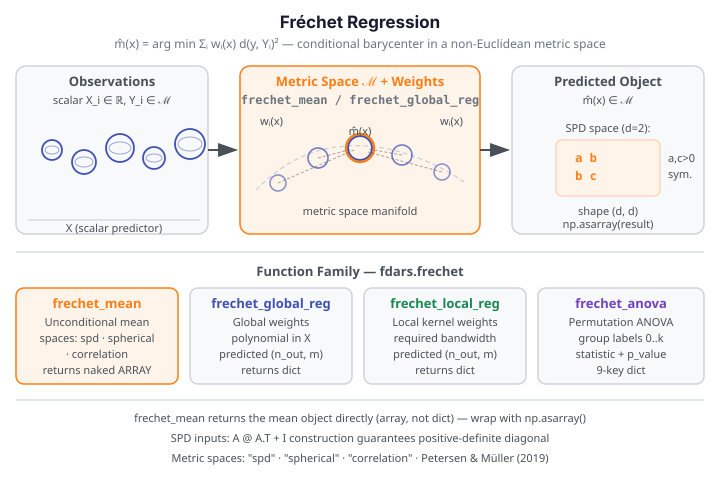

# Fréchet Regression

Fréchet regression extends regression analysis to settings where the **response lives in
a non-Euclidean metric space** — such as the manifold of symmetric positive-definite (SPD)
matrices, the unit sphere, or a space of probability distributions. Instead of a
Euclidean conditional mean, the model estimates a **conditional Fréchet mean**: the
minimizer of a weighted sum of squared metric distances to the observed responses.

{ .fdars-diagram }

## Core Concept

Let $Y_1, \ldots, Y_n$ be response objects in a metric space $(\mathcal{M}, d)$ and
let $X_i \in \mathbb{R}^p$ be scalar predictors. The **global Fréchet regression** model
estimates the conditional Fréchet mean:

$$
\hat{m}(x) = \operatorname{arg\,min}_{y \in \mathcal{M}}
             \sum_{i=1}^{n} w_i(x)\, d(y,\, Y_i)^2
$$

where the weights $w_i(x)$ depend on the distance between $x$ and $X_i$ (global model:
polynomial weights; local model: kernel weights). The unconditional **Fréchet mean** is
the special case $w_i \equiv 1/n$.

```python exec="1" source="above"
import numpy as np
from fdars.frechet import frechet_mean

rng = np.random.default_rng(42)
d = 2
# Build a list of SPD (symmetric positive-definite) matrices via A @ A.T + I
spds = []
for _ in range(8):
    A = rng.standard_normal((d, d))
    spds.append(A @ A.T + np.eye(d))

mean_spd = np.asarray(frechet_mean(spds, space="spd", d=d))
print(f"Fréchet mean (SPD, d=2): shape {mean_spd.shape}")
print(f"positive diagonal: {mean_spd[0, 0] > 0} {mean_spd[1, 1] > 0}  FDARS_FENCE_OK")
```

!!! warning "Return type: naked array, not a dict"
    `frechet_mean` returns the mean **object directly** — a `(d, d)` array for SPD space,
    a `(d,)` array for spherical space, and a `(d, d)` array for correlation space.
    It does **not** return a dict. Wrap the result in `np.asarray(...)` before indexing.

## API Reference

### `frechet_mean` — Unconditional Fréchet Mean

```python
from fdars.frechet import frechet_mean

mean_obj = frechet_mean(objects, space, d, weights=None)
```

| Parameter | Type | Description |
|-----------|------|-------------|
| `objects` | `list` of `np.ndarray` | List of metric-space objects (each a 2D array for SPD/correlation, 1D for spherical) |
| `space` | `str` | Metric space: `"spd"`, `"spherical"`, or `"correlation"` |
| `d` | `int` | Ambient dimension of the space |
| `weights` | `list` of `float` or `None` | Optional observation weights (uniform if `None`) |

**Return type varies by space:**

| Space | Return | Constraint |
|-------|--------|------------|
| `"spd"` | `np.ndarray` (d, d) | Must be symmetric with positive diagonal |
| `"spherical"` | `np.ndarray` (d,) | Unit-norm vector |
| `"correlation"` | `np.ndarray` (d, d) | Unit diagonal + symmetric |

In-binding validation raises `ValueError` for non-SPD inputs (non-symmetric or
non-positive diagonal), non-unit-norm spherical inputs, and non-unit-diagonal correlation
matrices.

---

### `frechet_global_reg` — Global Fréchet Regression

```python
from fdars.frechet import frechet_global_reg

result = frechet_global_reg(predictors, responses, argvals, xout)
```

| Parameter | Type | Description |
|-----------|------|-------------|
| `predictors` | `np.ndarray` (n, m) | Scalar or functional predictor matrix |
| `responses` | `np.ndarray` (n, m) | Response functional data (density-default) |
| `argvals` | `np.ndarray` (m,) | Evaluation grid |
| `xout` | `np.ndarray` (n_out,) | Grid of predictor values to predict at |

| Key | Meaning |
|-----|---------|
| `predicted` | Predicted response objects, shape `(n_out, m)` |
| `xout` | The predictor output grid (echoed) |
| `x_bar` | Mean predictor value used for centering |

---

### `frechet_local_reg` — Local Fréchet Regression

```python
from fdars.frechet import frechet_local_reg

result = frechet_local_reg(predictors, responses, argvals, xout, bandwidth)
```

Same parameters as `frechet_global_reg` plus a required `bandwidth` (positive float)
for the kernel weight function. Returns the same 3-key dict.

---

### `frechet_anova` — Permutation ANOVA in Metric Space

```python
from fdars.frechet import frechet_anova

result = frechet_anova(objects, group_labels, space, d, n_perm=99)
```

| Parameter | Type | Description |
|-----------|------|-------------|
| `objects` | `list` of `np.ndarray` | Metric-space objects |
| `group_labels` | `list` of `int` | Contiguous integer group labels starting at 0 (e.g., `[0, 0, 1, 1, 2]`) |
| `space` | `str` | Metric space name |
| `d` | `int` | Ambient dimension |
| `n_perm` | `int` | Number of permutations (default: 99) |

!!! note "Group label requirement"
    Labels must be **contiguous integers starting at 0** (e.g., `[0, 0, 1, 1]`).
    Non-contiguous labels (e.g., `[0, 1, 3]`) raise `ValueError`.

| Key | Meaning |
|-----|---------|
| `statistic` | Observed ANOVA test statistic |
| `p_value` | Permutation p-value |
| Plus 7 additional summary keys | Group sizes, within-group and between-group Fréchet variances |

## References

- Petersen, A. and Müller, H.-G. (2019). Fréchet regression for random objects with Euclidean
  predictors. *Annals of Statistics* 47(2), 691–719.
- Fréchet, M. (1948). Les éléments aléatoires de nature quelconque dans un espace distancié.
  *Annales de l'Institut Henri Poincaré* 10(4), 215–310.
- Tucker, J. D., Wu, W. and Srivastava, A. (2013). Generative models for functional data
  using phase and amplitude separation. *Computational Statistics & Data Analysis* 61, 50–66.
