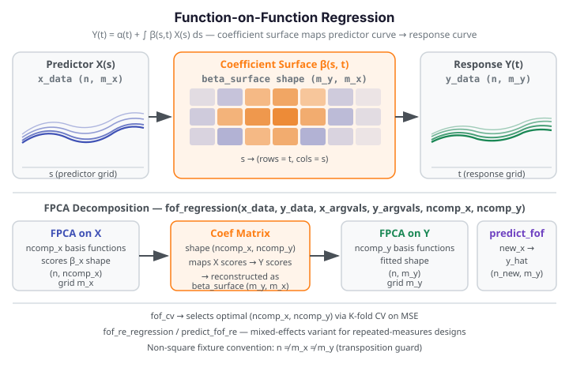

# Function-on-Function Regression

Function-on-Function (FoF) regression extends linear regression to the setting where both
the predictor and the response are functional observations. Instead of a scalar coefficient,
the model estimates a **bivariate coefficient surface** $\beta(s, t)$ that describes how
each point on the predictor curve influences each point on the response curve.

{ .fdars-diagram }

## Core Concept

Let $X_i(s)$ be the $i$-th predictor curve evaluated on grid $\{s_1, \ldots, s_{m_x}\}$,
and $Y_i(t)$ be the corresponding response curve on grid $\{t_1, \ldots, t_{m_y}\}$.
The FoF model is:

$$
Y_i(t) = \alpha(t) + \int \beta(s, t)\, X_i(s)\, ds + \varepsilon_i(t)
$$

where $\alpha(t)$ is a functional intercept and $\varepsilon_i(t)$ is a mean-zero error
curve. `fdars` estimates the model via truncated FPCA: $X$ is expanded in $K_x$ principal
components and $Y$ in $K_y$ principal components, yielding a $K_x \times K_y$ coefficient
matrix that maps back to the $\beta(s, t)$ surface.

```python exec="1" source="above"
import numpy as np
from fdars.regression import fof_regression

rng = np.random.default_rng(42)
n, mx, my = 25, 20, 15    # non-square predictor and response grids
tx = np.linspace(0, 1, mx)
ty = np.linspace(0, 1, my)
X  = np.array([np.sin(2 * np.pi * tx + rng.uniform(0, 0.3)) for _ in range(n)])
Y  = np.array([np.cos(np.pi * ty + rng.uniform(0, 0.3))     for _ in range(n)])

fit = fof_regression(X, Y, tx, ty, ncomp_x=3, ncomp_y=3)
print(f"r_squared:       {fit['r_squared']:.4f}")
print(f"beta_surface:    {np.asarray(fit['beta_surface']).shape}  FDARS_FENCE_OK")
```

The coefficient surface `beta_surface` has shape `(m_y, m_x)` — rows correspond to
response-grid points, columns to predictor-grid points. The low R² is expected for
random noise-dominated data.

## API Reference

### `fof_regression` — Fit Function-on-Function Regression

```python
from fdars.regression import fof_regression

fit = fof_regression(x_data, y_data, x_argvals, y_argvals, ncomp_x=3, ncomp_y=3)
```

| Parameter | Type | Description |
|-----------|------|-------------|
| `x_data` | `np.ndarray` (n, m_x) | Predictor functional observations |
| `y_data` | `np.ndarray` (n, m_y) | Response functional observations |
| `x_argvals` | `np.ndarray` (m_x,) | Predictor evaluation grid |
| `y_argvals` | `np.ndarray` (m_y,) | Response evaluation grid |
| `ncomp_x` | `int` | FPCA components for predictors (default: 3) |
| `ncomp_y` | `int` | FPCA components for responses (default: 3) |

| Key | Meaning |
|-----|---------|
| `intercept` | Functional intercept $\alpha(t)$, shape `(m_y,)` |
| `beta_surface` | Coefficient surface $\beta(s, t)$, shape `(m_y, m_x)` |
| `fitted` | Fitted response curves, shape `(n, m_y)` |
| `residuals` | Residual curves, shape `(n, m_y)` |
| `r_squared_t` | Point-wise R² across the response grid, shape `(m_y,)` |
| `r_squared` | Global R² scalar |
| `ncomp_x` | Number of predictor components used |
| `ncomp_y` | Number of response components used |
| `coef_matrix` | Raw FPCA coefficient matrix, shape `(ncomp_x, ncomp_y)` |

!!! note "Excluded keys"
    `fpca_x` and `fpca_y` (internal FPCA decomposition objects) are intentionally omitted
    from the result dict — they are consumed inside the binding and not needed by callers.

---

### `predict_fof` — Predict on New Predictor Curves

```python
from fdars.regression import predict_fof

y_hat = predict_fof(x_data, y_data, x_argvals, y_argvals, ncomp_x, ncomp_y, new_x)
```

| Parameter | Type | Description |
|-----------|------|-------------|
| `x_data` | `np.ndarray` (n, m_x) | Training predictor curves |
| `y_data` | `np.ndarray` (n, m_y) | Training response curves |
| `x_argvals` | `np.ndarray` (m_x,) | Predictor grid |
| `y_argvals` | `np.ndarray` (m_y,) | Response grid |
| `ncomp_x` | `int` | FPCA components for predictors |
| `ncomp_y` | `int` | FPCA components for responses |
| `new_x` | `np.ndarray` (n_new, m_x) | New predictor curves to predict for |

Returns a `np.ndarray` of shape `(n_new, m_y)` — predicted response curves.

---

### `fof_cv` — Cross-Validation for Component Selection

```python
from fdars.regression import fof_cv

cv = fof_cv(x_data, y_data, x_argvals, y_argvals, ncomp_x_range=[2, 3, 4])
```

| Key | Meaning |
|-----|---------|
| `candidates` | List of `(ncomp_x, ncomp_y)` tuples evaluated |
| `cv_errors` | Cross-validation MSE for each candidate |
| `optimal` | Best `(ncomp_x, ncomp_y)` tuple |
| `min_cv_mse` | Minimum CV MSE |

---

### Random-Effects Variant

For repeated-measures designs where each subject contributes multiple curves, use:

| Function | Description |
|----------|-------------|
| `fof_re_regression(x_data, y_data, x_argvals, y_argvals, subject_ids, ncomp_x, ncomp_y)` | Fit mixed-effects FoF model; returns 13-key dict including `random_effects` and `sigma2_u` |
| `predict_fof_re(x_data, y_data, x_argvals, y_argvals, subject_ids, ncomp_x, ncomp_y, new_x)` | Predict from the random-effects model |

`subject_ids` must be a list of integer group labels with at least 2 distinct values and
length equal to `n`. Both functions are importable from `fdars.regression`.

## References

- Ramsay, J. O. and Silverman, B. W. (2005). *Functional Data Analysis*, 2nd ed. Springer.
- Yao, F., Müller, H.-G. and Wang, J.-L. (2005). Functional linear regression analysis for
  longitudinal data. *Annals of Statistics* 33(6), 2873–2903.
- Chiou, J.-M. (2012). Dynamical functional prediction and classification, with application
  to traffic flow prediction. *Annals of Applied Statistics* 6(4), 1588–1614.
