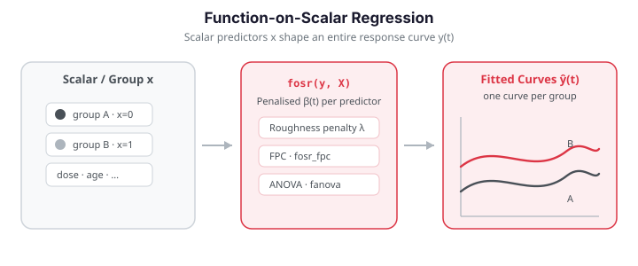

# Function-on-Scalar Regression

Function-on-scalar regression is the mirror image of scalar-on-function: it
models a **functional response** $y_i(t)$ as a function of **scalar predictors**
$x_{i1}, \dots, x_{ip}$:

$$
y_i(t) = \beta_0(t) + \sum_{j=1}^{p} x_{ij}\,\beta_j(t) + \varepsilon_i(t).
$$

Each coefficient function $\beta_j(t)$ describes how predictor $j$ influences the
response curve at every point $t$. Typical questions it answers:

- How does a treatment shift the *entire* response curve, and *when* is the
  effect strongest?
- Do group mean functions differ across the domain?

`fdars` offers a penalised estimator (`fosr`), an FPC-based estimator
(`fosr_fpc`), prediction (`predict_fosr`), and a permutation ANOVA test
(`fanova`).


{ .fdars-diagram }

## Penalised estimation

Fitting the model by ordinary least squares *independently at each $t$* recovers
$\beta_j(t)$ but produces noisy, jagged curves. `fosr` instead adds a
second-difference roughness penalty, minimising

$$
\sum_{i=1}^{n}\big\|y_i - \beta_0 - \textstyle\sum_j x_{ij}\beta_j\big\|^2
\;+\; \lambda \sum_{j} \int \big[\beta_j''(t)\big]^2\,dt,
$$

which yields the ridge-type estimator
$\hat\beta(\cdot) = (X^\top X + \lambda D^\top D)^{-1} X^\top Y(\cdot)$, where $D$
is a second-difference operator. The penalty $\lambda \ge 0$ trades data fidelity
against smoothness.

A useful summary of fit quality is the **pointwise $R^2$**,

$$
R^2(t) = 1 - \frac{\sum_i [y_i(t) - \hat y_i(t)]^2}{\sum_i [y_i(t) - \bar y(t)]^2},
$$

which reveals *where* along the domain the scalar predictors explain the response
well, and where they do not.

---

## Function-on-Scalar Regression (FOSR)

`fosr` fits the model with an optional roughness penalty and returns coefficient
functions, fitted curves, residuals, and a global $R^2$.

```python
import numpy as np
from fdars import Fdata
from fdars.regression import fosr

# --- Simulate data ---
np.random.seed(0)
n, m, p = 80, 101, 3
t = np.linspace(0, 1, m)

# Scalar predictors
predictors = np.random.randn(n, p)

# True coefficient functions
beta_true = np.zeros((p, m))
beta_true[0] = np.sin(2 * np.pi * t)          # predictor 1 effect
beta_true[1] = 0.5 * np.cos(4 * np.pi * t)    # predictor 2 effect
beta_true[2] = t * (1 - t)                     # predictor 3 effect

# Functional response
fd = Fdata(predictors @ beta_true + 0.2 * np.random.randn(n, m), argvals=t)

# --- Fit FOSR ---
result = fosr(fd.data, predictors, lambda_=0.1)  # ridge penalty

fitted    = result["fitted"]      # (n, m) -- fitted functional responses
beta_hat  = result["beta"]        # (p, m) -- estimated coefficient functions
residuals = result["residuals"]   # (n, m)
r2        = result["r_squared"]   # scalar

print(f"R-squared: {r2:.4f}")
print(f"Beta shape: {np.asarray(beta_hat).shape}")
```

| Key | Type | Description |
|-----|------|-------------|
| `fitted` | `ndarray (n, m)` | Fitted functional responses |
| `beta` | `ndarray (p, m)` | Estimated coefficient functions |
| `residuals` | `ndarray (n, m)` | Residual curves |
| `r_squared` | `float` | Global $R^2$ |

!!! tip "Roughness penalty"
    Set `lambda_=0.0` for ordinary least squares at each time point (fast but
    noisy). A positive `lambda_` applies a fixed second-difference penalty;
    increase it until the coefficient functions are as smooth as the science
    warrants.

The estimated coefficient functions $\hat\beta_j(t)$ (solid) track the true
effects (dashed) closely, one curve per scalar predictor:

```python exec="1" html="1"
import numpy as np
from docs_fig import fig, render
from fdars.regression import fosr

np.random.seed(0)
n, m, p = 40, 81, 3
t = np.linspace(0, 1, m)
predictors = np.random.randn(n, p)

beta_true = np.zeros((p, m))
beta_true[0] = np.sin(2 * np.pi * t)
beta_true[1] = 0.5 * np.cos(4 * np.pi * t)
beta_true[2] = t * (1 - t)

Y = predictors @ beta_true + 0.2 * np.random.randn(n, m)
beta = np.asarray(fosr(Y, predictors, lambda_=0.1)["beta"])

f, ax = fig()
colors = ["#3f51b5", "#e8710a", "#198754"]
for j in range(p):
    ax.plot(t, beta_true[j], color=colors[j], lw=1.2, ls="--", alpha=0.6)
    ax.plot(t, beta[j], color=colors[j], lw=2, label=fr"$\hat\beta_{{{j+1}}}(t)$")
ax.set(title="Estimated coefficient functions (dashed = truth)",
       xlabel="t", ylabel=r"$\beta_j(t)$")
ax.legend(ncol=3)
print(render(f))
```

Each estimated curve hugs its dashed truth: the sinusoid, the higher-frequency
cosine, and the parabolic bump are all recovered, confirming that the ridge
penalty smooths without flattening the genuine signal.

### Interpreting coefficient functions

Each $\hat{\beta}_j(t)$ describes the effect of predictor $j$ on the response at
time $t$:

- $\hat{\beta}_j(t) > 0$: increasing predictor $j$ raises the response at time $t$.
- $\hat{\beta}_j(t) < 0$: increasing predictor $j$ lowers the response at time $t$.
- $\hat{\beta}_j(t) \approx 0$: predictor $j$ has no effect at time $t$.

```python
# Check recovery of true coefficients
for j in range(p):
    corr = np.corrcoef(beta_true[j], np.asarray(beta_hat)[j])[0, 1]
    print(f"  Predictor {j}: correlation with truth = {corr:.4f}")
```

---

## FPC-based FOSR

Instead of penalising, `fosr_fpc` first compresses the response curves onto their
leading functional principal components, regresses the FPC scores on the scalar
predictors, and maps the result back to function space. It replaces the choice of
$\lambda$ with a choice of component count `n_comp`, and is efficient and stable
when the response curves have strong low-rank structure. It also returns the
pointwise $R^2(t)$.

```python
from fdars.regression import fosr_fpc

result = fosr_fpc(fd.data, predictors, n_comp=5)

print(f"FPC-based R-squared: {result['r_squared']:.4f}")
```

| Key | Type | Description |
|-----|------|-------------|
| `beta` | `ndarray (p, m)` | Coefficient functions |
| `intercept` | `ndarray (m,)` | Intercept function $\hat\beta_0(t)$ |
| `fitted` | `ndarray (n, m)` | Fitted response curves |
| `residuals` | `ndarray (n, m)` | Residual curves |
| `r_squared` | `float` | Global $R^2$ |
| `r_squared_t` | `ndarray (m,)` | Pointwise $R^2(t)$ |
| `ncomp` | `int` | Number of components used |

The pointwise $R^2(t)$ shows where the predictors explain the response — high
in regions with real signal, low where the response is dominated by noise.

```python exec="1" html="1" source="above"
import numpy as np
from docs_fig import fig, render
from fdars.regression import fosr_fpc

np.random.seed(3)
n, m, p = 60, 101, 2
t = np.linspace(0, 1, m)
X = np.random.randn(n, p)
beta_true = np.zeros((p, m))
beta_true[0] = np.sin(2 * np.pi * t)
# Second effect concentrated in the first half of the domain
beta_true[1] = np.where(t < 0.5, np.cos(2 * np.pi * t), 0.0)
Y = X @ beta_true + 0.25 * np.random.randn(n, m)

res = fosr_fpc(Y, X, n_comp=5)
r2t = np.asarray(res["r_squared_t"])

f, ax = fig()
ax.plot(t, r2t, color="#3f51b5", lw=2)
ax.fill_between(t, 0, r2t, color="#3f51b5", alpha=0.15)
ax.set(title=r"Pointwise $R^2(t)$", xlabel="t", ylabel=r"$R^2(t)$", ylim=(0, 1))
print(render(f))
```

The curve is high on the left, where the second predictor's effect lives, and
sags toward the right, where only the sinusoid contributes and noise dominates —
a direct map of *where* the scalar predictors earn their keep.

---

## Prediction

`predict_fosr` returns the fitted response curves for new predictor rows. Pass
the training data and predictors plus the new predictor matrix; the returned
array has one row per new observation.

```python
new_pred = np.array([[1.0, 0.5, 0.0],   # e.g. treated, avg covariate
                     [0.0, -1.0, 1.0]]) # control
pred_curves = predict_fosr(fd.data, predictors, new_pred, lambda_=0.1)
print(np.asarray(pred_curves).shape)   # (2, m)
```

---

## Functional ANOVA

**Functional ANOVA** tests whether group mean functions differ across the
domain — the functional analog of one-way ANOVA. The null is that all $k$ group
mean functions coincide:

$$
H_0: \mu_1(t) = \mu_2(t) = \cdots = \mu_k(t) \quad \text{for all } t \in \mathcal{T}.
$$

A pointwise $F$-statistic is computed at each $t$,

$$
F(t) = \frac{\sum_g n_g\,(\bar y_g(t) - \bar y(t))^2 / (k-1)}
             {\sum_g \sum_{i \in g} (y_i(t) - \bar y_g(t))^2 / (N-k)},
$$

and the global statistic $\int F(t)\,dt$ is compared to its permutation
distribution: group labels are shuffled $B$ times, and the $p$-value is
$(1 + \#\{F^*_b \ge F_{\text{obs}}\})/(B+1)$. This gives an exact, distribution-free
test valid at any sample size.

```python
import numpy as np
from fdars import Fdata
from fdars.regression import fanova

# --- Simulate three groups ---
np.random.seed(1)
n_per_group = 30
m = 101
t = np.linspace(0, 1, m)

group_means = [
    np.sin(2 * np.pi * t),
    np.sin(2 * np.pi * t) + 0.5 * t,         # shifted group
    np.sin(2 * np.pi * t) - 0.3 * (1 - t),   # another shifted group
]

fd = Fdata(
    np.vstack([
        mean + 0.3 * np.random.randn(n_per_group, m)
        for mean in group_means
    ]),
    argvals=t,
)
groups = np.array([0]*n_per_group + [1]*n_per_group + [2]*n_per_group, dtype=np.int64)

# --- Run FANOVA ---
result = fanova(fd.data, groups, n_perm=999)

print(f"Global F-statistic: {result['global_statistic']:.4f}")
print(f"Permutation p-value: {result['p_value']:.4f}")
print(f"Group means shape: {np.asarray(result['group_means']).shape}")   # (3, 101)
print(f"Pointwise F(t) shape: {np.asarray(result['f_statistic_t']).shape}")  # (101,)
```

| Key | Type | Description |
|-----|------|-------------|
| `f_statistic_t` | `ndarray (m,)` | Pointwise $F$-statistic |
| `p_value` | `float` | Permutation-based $p$-value |
| `group_means` | `ndarray (k, m)` | Estimated group mean functions |
| `global_statistic` | `float` | Global (integrated) $F$-statistic |

!!! info "Permutation test"
    The `n_perm` parameter controls the number of random permutations. More
    permutations yield a more precise $p$-value but take longer. For
    publication-quality results, use `n_perm=4999` or higher.

The two panels below show where the groups separate: the group mean functions on
the left, and the pointwise $F(t)$ on the right — its peaks mark the regions
driving the rejection.

```python exec="1" html="1" source="above"
import numpy as np
from docs_fig import fig, render
from fdars.regression import fanova

np.random.seed(1)
npg, m = 25, 81
t = np.linspace(0, 1, m)
means = [np.sin(2 * np.pi * t),
         np.sin(2 * np.pi * t) + 0.5 * np.cos(2 * np.pi * t),
         2 * t - 1]
Y = np.vstack([mu + 0.15 * np.random.randn(npg, m) for mu in means])
groups = np.repeat([0, 1, 2], npg).astype(np.int64)

res = fanova(Y, groups, n_perm=499)
gm = np.asarray(res["group_means"])
ft = np.asarray(res["f_statistic_t"])

f, (a0, a1) = fig(1, 2, figsize=(11, 4))
colors = ["#3f51b5", "#e8710a", "#198754"]
for g in range(3):
    a0.plot(t, gm[g], color=colors[g], lw=2, label=f"group {g+1}")
a0.set(title="Group mean functions", xlabel="t", ylabel="mean")
a0.legend()

a1.plot(t, ft, color="#b5179e", lw=2)
a1.set(title=f"Pointwise F(t)   (p = {res['p_value']:.3f})",
       xlabel="t", ylabel="F(t)")
print(render(f))
```

The three group means fan apart most strongly near the middle and right of the
domain, and the $F(t)$ trace peaks in exactly those regions — the permutation
$p$-value confirms the separation is far beyond chance.

---

## Diagnostics: pointwise residual variance

A quick model check is the variance of the residual curves at each $t$. Roughly
constant variance supports the model; peaks flag regions where the scalar
predictors fail to capture the response.

```python exec="1" html="1" source="above"
import numpy as np
from docs_fig import fig, render
from fdars.regression import fosr

np.random.seed(5)
n, m, p = 70, 101, 2
t = np.linspace(0, 1, m)
X = np.random.randn(n, p)
beta_true = np.zeros((p, m))
beta_true[0] = np.sin(2 * np.pi * t)
beta_true[1] = 0.5 * np.cos(4 * np.pi * t)
# Heteroscedastic noise: larger in the second half
noise = np.random.randn(n, m) * (0.1 + 0.4 * (t > 0.5))
Y = X @ beta_true + noise

res = fosr(Y, X, lambda_=0.1)
resid = np.asarray(res["residuals"])
rv = resid.var(axis=0)

f, ax = fig()
ax.plot(t, rv, color="#3f51b5", lw=2)
ax.set(title="Pointwise residual variance", xlabel="t", ylabel="Var(residual)")
print(render(f))
```

Residual variance is flat and small over the first half of the domain but climbs
sharply past $t=0.5$, exactly matching the heteroscedastic noise we injected — a
clear signal that a constant-variance assumption would be violated there.

---

## Full example: treatment effect on functional responses

```python
import numpy as np
from fdars import Fdata
from fdars.regression import fosr, fanova

np.random.seed(77)
n, m = 90, 121
t = np.linspace(0, 1, m)

# Two-group design: treatment (1) vs control (0)
treatment = np.array([0]*45 + [1]*45, dtype=np.int64)
predictors = treatment.reshape(-1, 1).astype(np.float64)

# True treatment effect peaks in the middle of the domain
effect = 2.0 * np.exp(-((t - 0.5)**2) / 0.02)

# Simulate response
raw = np.zeros((n, m))
for i in range(n):
    baseline = np.sin(2 * np.pi * t) + 0.5 * np.random.randn() * np.cos(np.pi * t)
    raw[i] = baseline + treatment[i] * effect + 0.4 * np.random.randn(m)
fd = Fdata(raw, argvals=t)

# --- FOSR: estimate the treatment effect curve ---
fosr_result = fosr(fd.data, predictors, lambda_=0.1)
beta_treatment = np.asarray(fosr_result["beta"])[0]  # estimated effect of treatment
print(f"FOSR R-squared: {fosr_result['r_squared']:.4f}")
print(f"Peak treatment effect at t={fd.argvals[np.argmax(beta_treatment)]:.2f}")

# --- FANOVA: test whether groups differ ---
fanova_result = fanova(fd.data, treatment, n_perm=999)
print(f"FANOVA p-value: {fanova_result['p_value']:.4f}")
if fanova_result["p_value"] < 0.05:
    print("Significant treatment effect detected.")
else:
    print("No significant treatment effect.")
```

The estimated treatment-effect curve $\hat\beta_1(t)$ should localise the bump we
built into the simulation. Plotting it against the truth confirms both its shape
and its timing:

```python exec="1" html="1" source="above"
import numpy as np
from docs_fig import fig, render
from fdars.regression import fosr

np.random.seed(77)
n, m = 90, 121
t = np.linspace(0, 1, m)
treatment = np.array([0] * 45 + [1] * 45, dtype=np.int64)
predictors = treatment.reshape(-1, 1).astype(np.float64)
effect = 2.0 * np.exp(-((t - 0.5) ** 2) / 0.02)

raw = np.zeros((n, m))
for i in range(n):
    baseline = np.sin(2 * np.pi * t) + 0.5 * np.random.randn() * np.cos(np.pi * t)
    raw[i] = baseline + treatment[i] * effect + 0.4 * np.random.randn(m)

beta_hat = np.asarray(fosr(raw, predictors, lambda_=0.1)["beta"])[0]

f, ax = fig()
ax.plot(t, effect, color="#6c757d", lw=1.5, ls="--", label="true effect")
ax.plot(t, beta_hat, color="#e8710a", lw=2, label=r"$\hat\beta_1(t)$")
ax.axvline(t[np.argmax(beta_hat)], color="#3f51b5", ls=":", lw=1.2,
           label=f"peak at t = {t[np.argmax(beta_hat)]:.2f}")
ax.set(title="Recovered treatment-effect curve", xlabel="t", ylabel="effect")
ax.legend()
print(render(f))
```

The recovered curve peaks near $t=0.5$ and tapers to zero elsewhere, matching the
localized Gaussian effect that was injected — the estimator correctly isolates
both *how large* and *when* the treatment acts.

---

## When to use each method

| Method | Function | Tuning | Best for |
|--------|----------|--------|----------|
| Penalised FOSR | `fosr` | $\lambda$ | smooth coefficient functions, large $m$ |
| FPC-based FOSR | `fosr_fpc` | $K$ (# components) | low-rank response structure, pointwise $R^2$ |
| Functional ANOVA | `fanova` | $B$ (# permutations) | testing group differences |

!!! note "2D function-on-scalar (R-only)"
    The R reference also documents `fosr.2d` for surface-valued responses
    $y_i(s,t)$ (e.g. spatio-temporal fields, imaging). There is no `fdars`
    Python binding for this today, so it is omitted here rather than emulated.

## References

- Ramsay & Silverman (2005), *Functional Data Analysis*, 2nd ed.
- Reiss & Ogden (2007), Functional Principal Component Regression and Functional
  Partial Least Squares, *JASA* 102(479), 984–996.
- Cuevas, Febrero & Fraiman (2004), An ANOVA test for functional data,
  *Comput. Stat. Data Anal.* 47(1), 111–122.
