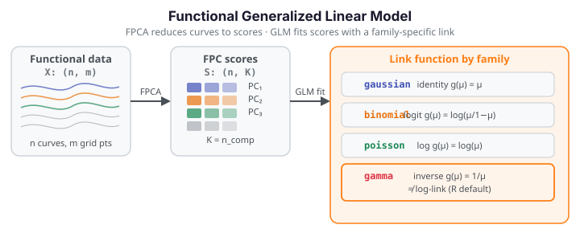

# Functional Generalized Linear Model

Functional GLM extends scalar-on-function regression to exponential-family responses. Instead of a Gaussian error term, the response may be binary (binomial), a count (Poisson), a positive continuous value (gamma), or unrestricted Gaussian. `fdars.regression.functional_glm` first projects each observed curve onto a small number of functional principal components (FPCA), then fits a standard GLM on the resulting scores — one scalar score per FPC per subject. The coefficient function $\hat\beta(t)$ is reconstructed back to the original domain by recombining the FPC loadings.

{ .fdars-diagram }

## Theory

Let $X_1(t), \dots, X_n(t)$ be $n$ functional observations on grid $t_1, \dots, t_m$, and let $y_1, \dots, y_n$ be scalar responses from a specified exponential-family distribution. The model proceeds in two stages:

**Stage 1 — FPCA projection.** Decompose the functional data into `n_comp` leading functional principal components $\phi_1(t), \dots, \phi_K(t)$ and form the score matrix $S \in \mathbb{R}^{n \times K}$ where $s_{ik} = \int X_i(t)\,\phi_k(t)\,dt$. Each curve is now represented by $K$ scalar scores.

**Stage 2 — GLM in score space.** Fit a GLM on the scores:

$$
g\!\bigl(\mathbb{E}[y_i \mid S_i]\bigr) \;=\; \alpha + S_i^\top \gamma,
$$

where $g(\cdot)$ is the link function for the chosen family and $\gamma \in \mathbb{R}^K$ are scalar coefficients. The coefficient function on the original domain is

$$
\hat\beta(t) \;=\; \sum_{k=1}^{K} \hat\gamma_k\,\phi_k(t).
$$

The GLM is fit by iteratively reweighted least squares (IRLS) with a maximum of `max_iter` iterations and convergence tolerance `tol` on the deviance change.

**Link functions by family**

| Family | Link | $g(\mu)$ | Notes |
|--------|------|-----------|-------|
| `"gaussian"` | identity | $\mu$ | Reduces to ordinary functional linear model |
| `"binomial"` | logit | $\log(\mu / (1-\mu))$ | Binary or proportion response in $[0, 1]$ |
| `"poisson"` | log | $\log(\mu)$ | Count response; response must be non-negative |
| `"gamma"` | **inverse (canonical)** | $1/\mu$ | Positive continuous response; **NOT log-link** |

!!! warning "Gamma family uses the inverse canonical link, not log"
    `fdars.regression.functional_glm` with `family="gamma"` uses the **inverse canonical link** $g(\mu) = 1/\mu$, not the log-link that R's `glm(..., family=Gamma)` defaults to. Results will differ from R if you assume a log-link. If you need a log-link for a Gamma response, transform the response before calling `functional_glm` with `family="gaussian"`, or interpret the inverse-link coefficients appropriately.

!!! note "AIC is not comparable to R glm() AIC"
    The AIC returned by `functional_glm` is computed from the score-space GLM log-likelihood, which treats the FPC scores as fixed predictors. This is **not** the same quantity as R's `glm()` AIC, which is based on the full-data likelihood. The AIC value here is useful for comparing models with different `n_comp` or `family` choices within `fdars`, but should not be compared numerically to AIC from R or other software.

**Parameters**

| Parameter | Type | Default | Description |
|---|---|---|---|
| `data` | `ndarray (n, m)` | — | Functional data matrix; rows are observations |
| `response` | `ndarray (n,)` | — | Scalar response vector |
| `family` | `str` | `"gaussian"` | Exponential family: `"gaussian"`, `"binomial"`, `"poisson"`, `"gamma"` |
| `n_comp` | `int` | `3` | Number of FPC components for the FPCA projection |
| `scalar_covariates` | `ndarray (n, q)` or `None` | `None` | Additional scalar predictors to include in the GLM alongside the FPC scores |
| `max_iter` | `int` | `25` | Maximum IRLS iterations |
| `tol` | `float` | `1e-6` | Convergence tolerance on deviance change |

**Returns** a dict:

| Key | Shape / Type | Description |
|---|---|---|
| `"intercept"` | `float` | GLM intercept on the link scale |
| `"beta_t"` | `(m,)` | Functional coefficient $\hat\beta(t)$ on the original domain |
| `"beta_se"` | `(m,)` | Pointwise standard errors of $\hat\beta(t)$ |
| `"gamma"` | `(K,)` | Score-space GLM coefficients ($K$ = actual `n_comp` used) |
| `"fitted_values"` | `(n,)` | Fitted responses on the response scale (inverse-linked) |
| `"linear_predictors"` | `(n,)` | Linear predictors $\hat\eta_i = \alpha + S_i^\top \hat\gamma$ |
| `"ncomp"` | `int` | Actual number of FPC components used |
| `"coefficients"` | `(K+1,)` | Full coefficient vector (intercept + score coefficients) |
| `"std_errors"` | `(K+1,)` | Standard errors of `coefficients` |
| `"log_likelihood"` | `float` | Log-likelihood of the fitted score-space GLM |
| `"deviance"` | `float` | Residual deviance |
| `"iterations"` | `int` | Number of IRLS iterations taken |
| `"aic"` | `float` | AIC from the score-space GLM (not comparable to R glm AIC — see note above) |
| `"bic"` | `float` | BIC from the score-space GLM |
| `"family"` | `str` | Family string echoed back |

```python exec="1" html="1" source="above"
import numpy as np
from docs_fig import fig, render
import fdars.regression as reg

rng = np.random.default_rng(1)
n, m = 30, 60
t = np.linspace(0, 1, m)
X = np.array([np.sin(2 * np.pi * t * (1 + 0.3 * rng.normal())) + rng.normal(0, 0.1, m)
              for _ in range(n)])
# Binary response (Binomial)
logit_true = X @ np.sin(2 * np.pi * t) / m
prob_true = 1 / (1 + np.exp(-3 * logit_true))
y = rng.binomial(1, prob_true).astype(float)

res = reg.functional_glm(X, y, family="binomial", n_comp=3)
beta_t = np.asarray(res["beta_t"])

f, ax = fig(figsize=(8.0, 3.6))
ax.plot(t, beta_t, color="#3f51b5", lw=2.2)
ax.set(title="Functional GLM (binomial) — coefficient function β(t)",
       xlabel="t", ylabel="β(t)")
print(render(f))
print(f"deviance={res['deviance']:.3f}  aic={res['aic']:.3f}  family={res['family']}")
print("FDARS_FENCE_OK")
```

## References

1. Cardot, H., Ferraty, F., and Sarda, P. (1999). "Functional linear model." *Statistics and Probability Letters*, 45(1), 11–22. — FPC-score representation in functional regression.
2. James, G. M. (2002). "Generalized linear models with functional predictors." *Journal of the Royal Statistical Society, Series B*, 64(3), 411–432. — functional GLM methodology underlying `functional_glm`.
3. Wood, S. N. (2017). *Generalized Additive Models: An Introduction with R*, 2nd ed. CRC Press. — Chapter 3: GLM theory and IRLS algorithm.
4. Ramsay, J. O., and Silverman, B. W. (2005). *Functional Data Analysis*, 2nd ed. Springer. — Chapter 15: principal components basis for functional regression.
