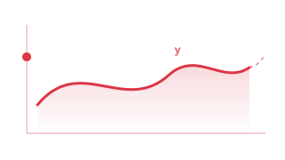
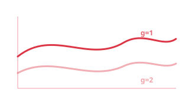
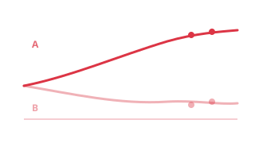
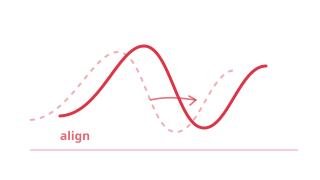
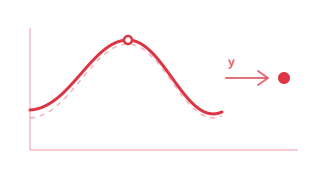
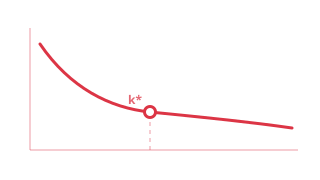
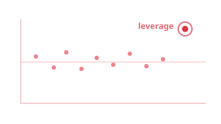
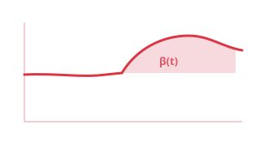
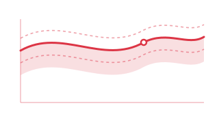
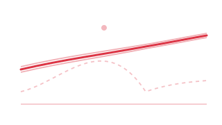

# Regression

**Predict, classify, and explain with functional predictors and responses.**

The Regression module covers the full spectrum of supervised learning with functional data -- from classical scalar-on-function models to elastic regression, classification, conformal prediction, and model explainability.

<a class="fdars-gallery-item" href="scalar-on-function/">

Scalar-on-Function

FPC linear, PLS, and nonparametric regression with a scalar response.

</a>
<a class="fdars-gallery-item" href="function-on-scalar/">

Function-on-Scalar

FOSR and FANOVA for predicting functional responses.

</a>
<a class="fdars-gallery-item" href="classification/">

Classification

LDA, QDA, k-NN, and kernel classifiers with cross-validation.

</a>
<a class="fdars-gallery-item" href="elastic-regression/">

Elastic Regression

Regression in SRSF space for phase-invariant prediction.

</a>
<a class="fdars-gallery-item" href="scalar-on-shape/">

Scalar-on-Shape

Predict a scalar from curve shape via elastic distances and shape PCs.

</a>
<a class="fdars-gallery-item" href="cross-validation/">

Cross-Validation

Honest out-of-fold model comparison and component selection.

</a>
<a class="fdars-gallery-item" href="regression-diagnostics/">

Regression Diagnostics

Leverage, influence, and residual analysis for functional models.

</a>
<a class="fdars-gallery-item" href="uncertainty-quantification/">

Uncertainty Quantification

Bootstrap confidence bands and prediction intervals.

</a>
<a class="fdars-gallery-item" href="explainability/">

Explainability

SHAP, PDP, permutation importance, and significant regions.

</a>
<a class="fdars-gallery-item" href="conformal-prediction/">

Conformal Prediction

Distribution-free prediction intervals with split conformal.

</a>
<a class="fdars-gallery-item" href="conformal-classification/">

Conformal Classification

Prediction sets with finite-sample coverage guarantees.

</a>
<a class="fdars-gallery-item" href="robust-regression/">

Robust Regression

Depth-weighted and trimmed regression resistant to outliers.

</a>

