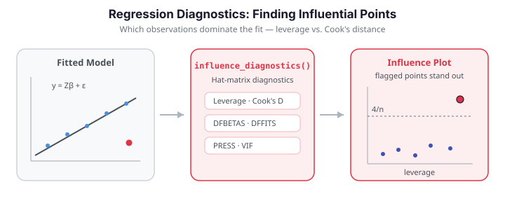

# Regression Diagnostics

A fitted regression summarizes the *average* relationship between predictor and response,
but a handful of unusual observations can dominate that summary. **Regression diagnostics**
identify which observations exert outsized influence on the fit, so you can decide whether
they are valuable signal or corrupting noise. In functional regression the same logic
applies to the FPC-score design: an observation can be a high-**leverage** point (unusual
predictor shape), a large-**residual** point (unusual response), or — most dangerously —
both, which makes it **influential**.

After fitting a functional regression model you typically want to answer three questions:
are the model assumptions valid, are any observations unduly influential, and how stable
are the results? `fdars.explain` provides a diagnostic toolkit adapted to FPC-based
scalar-on-function models to answer them.


| Diagnostic | Function | Question |
|------------|----------|----------|
| Leverage & Cook's distance | `influence_diagnostics` | How influential is each observation? |
| DFBETAS / DFFITS | `dfbetas_dffits` | *Which* coefficient / fit does a point distort? |
| Leave-one-out PRESS | `loo_cv_press` | How well does the model generalize? |
| Variance inflation | `fpc_vif` | Are the FPC scores collinear? |
| Permutation importance | `fpc_permutation_importance` | Which scores drive the prediction? |
| Conditional importance | `conditional_permutation_importance` | Same, corrected for correlations |
| Regression depth | `regression_depth` | Is the coefficient estimate robust? |
| Explanation stability | `explanation_stability` | Does $\beta(t)$ change across samples? |

The influence, DFBETAS/DFFITS and PRESS diagnostics rely on the hat matrix, which is only
defined for the linear FPC model. VIF, importance, depth and stability are more general and
apply to any model built on FPC scores; stability is *model-free* because it refits the
whole FPCA-plus-regression pipeline on each resample.

{ .fdars-diagram }

```python exec="1" html="1" source="above"
import numpy as np
from docs_fig import fig, render
from fdars.simulation import simulate
from fdars.explain import influence_diagnostics

np.random.seed(0)
t = np.linspace(0, 1, 60)
X = np.asarray(simulate(n=36, argvals=t, n_basis=6, efun_type="fourier", seed=1))
beta_true = np.sin(2 * np.pi * t)
y = np.trapezoid(X * beta_true, t, axis=1) + 0.3 * np.random.randn(len(X))

# Inject one influential point: unusual response
y[5] += 4.0

diag = influence_diagnostics(X, y, ncomp=3)
lev = np.asarray(diag["leverage"])
cook = np.asarray(diag["cooks_distance"])

f, ax = fig()
ax.scatter(lev, cook, color="#3f51b5", s=36, alpha=0.85)
thr = 4 / len(y)                                  # common Cook's-D cutoff
flag = np.where(cook > thr)[0]
ax.scatter(lev[flag], cook[flag], color="#dc3545", s=70,
           edgecolor="k", zorder=3, label="flagged")
for i in flag:
    ax.annotate(str(i), (lev[i], cook[i]), fontsize=8,
                xytext=(4, 4), textcoords="offset points")
ax.axhline(thr, color="#6c757d", ls="--", lw=1, label=f"4/n = {thr:.3f}")
ax.set(title="Influence plot: Cook's distance vs. leverage",
       xlabel="leverage", ylabel="Cook's distance")
ax.legend()
print(render(f))
```

The injected point (index 5) jumps out as high Cook's distance — it moves the fit far more
than a typical observation.

## Concepts

Write the FPC-score regression in matrix form $y = Z\beta + \varepsilon$, where $Z$ stacks
the intercept and FPC scores. The **hat matrix** $H = Z(Z^\top Z)^{-1}Z^\top$ maps observed
to fitted values, $\hat y = Hy$. Its diagonal $h_{ii}$ is the **leverage** of observation
$i$ — how strongly its own response pulls its own fitted value. Leverage depends only on the
predictors; a curve with an unusual FPC-score profile has high leverage regardless of its
response.

**Cook's distance** combines leverage and residual size into a single influence measure —
how much all fitted values shift when observation $i$ is deleted:

$$
D_i = \frac{r_i^2}{p\,\hat\sigma^2}\cdot\frac{h_{ii}}{(1-h_{ii})^2},
$$

where $r_i$ is the residual, $p$ the number of parameters, and $\hat\sigma^2$ the residual
variance. A common rule flags $D_i > 4/n$. Two finer-grained measures localize the effect:
**DFFITS** measures the change in observation $i$'s own fitted value when it is deleted,
while **DFBETAS** measures the change in each *coefficient*, revealing *which* direction of
the model a point distorts.

## Leverage and Cook's distance — `influence_diagnostics`

```python
import numpy as np
from fdars.simulation import simulate
from fdars.explain import influence_diagnostics

np.random.seed(0)
t = np.linspace(0, 1, 60)
X = np.asarray(simulate(n=36, argvals=t, n_basis=6, efun_type="fourier", seed=1))
beta_true = np.sin(2 * np.pi * t)
y = np.trapezoid(X * beta_true, t, axis=1) + 0.3 * np.random.randn(len(X))

diag = influence_diagnostics(X, y, ncomp=3)
high_lev = np.where(diag["leverage"] > 2 * diag["p"] / len(y))[0]
print(f"high-leverage indices: {high_lev.tolist()}")
```

| Return key | Type | Description |
|------------|------|-------------|
| `leverage` | `ndarray (n,)` | Hat-matrix diagonal $h_{ii}$ |
| `cooks_distance` | `ndarray (n,)` | Cook's distance $D_i$ |
| `p` | `float` | Number of model parameters (intercept + components) |
| `mse` | `float` | Residual mean squared error |

## DFBETAS and DFFITS — `dfbetas_dffits`

```python
from fdars.explain import dfbetas_dffits

infl = dfbetas_dffits(X, y, ncomp=3)
print("DFFITS cutoff:  ", round(infl["dffits_cutoff"], 3))
print("DFBETAS cutoff: ", round(infl["dfbetas_cutoff"], 3))
```

| Return key | Type | Description |
|------------|------|-------------|
| `dfbetas` | `ndarray (n, p)` | Per-coefficient influence of each observation |
| `dffits` | `ndarray (n,)` | Change in own fitted value when deleted |
| `studentized_residuals` | `ndarray (n,)` | Externally studentized residuals |
| `p` | `float` | Number of parameters |
| `dfbetas_cutoff` | `float` | $2/\sqrt{n}$ suggested threshold |
| `dffits_cutoff` | `float` | $2\sqrt{p/n}$ suggested threshold |

The studentized residuals against leverage give the second classic diagnostic view. Points
in the upper corners — large residual *and* high leverage — are the ones to scrutinize.

```python exec="1" html="1"
import numpy as np
from docs_fig import fig, render
from fdars.simulation import simulate
from fdars.explain import influence_diagnostics, dfbetas_dffits

np.random.seed(0)
t = np.linspace(0, 1, 60)
X = np.asarray(simulate(n=36, argvals=t, n_basis=6, efun_type="fourier", seed=1))
beta_true = np.sin(2 * np.pi * t)
y = np.trapezoid(X * beta_true, t, axis=1) + 0.3 * np.random.randn(len(X))
y[5] += 4.0                                       # same injected point

lev = np.asarray(influence_diagnostics(X, y, ncomp=3)["leverage"])
infl = dfbetas_dffits(X, y, ncomp=3)
sr = np.asarray(infl["studentized_residuals"])

f, ax = fig()
ax.scatter(lev, sr, color="#3f51b5", s=36, alpha=0.85)
ax.axhline(2, color="#6c757d", ls=":", lw=1)
ax.axhline(-2, color="#6c757d", ls=":", lw=1)
big = np.where(np.abs(sr) > 2)[0]
ax.scatter(lev[big], sr[big], color="#dc3545", s=70, edgecolor="k", zorder=3)
for i in big:
    ax.annotate(str(i), (lev[i], sr[i]), fontsize=8,
                xytext=(4, 4), textcoords="offset points")
ax.set(title="Studentized residual vs. leverage",
       xlabel="leverage", ylabel="studentized residual")
print(render(f))
```

## Leave-one-out PRESS — `loo_cv_press`

The **PRESS** statistic sums the squared leave-one-out residuals, and `loo_r_squared`
rescales it to an out-of-sample $R^2$. Unlike the training $R^2$, PRESS penalizes models
that fit any single point too tightly — an honest complement to the leverage plot.

```python
from fdars.explain import loo_cv_press

press = loo_cv_press(X, y, ncomp=3)
print(f"PRESS:        {press['press']:.3f}")
print(f"LOO R²:       {press['loo_r_squared']:.3f}")
```

| Return key | Type | Description |
|------------|------|-------------|
| `loo_residuals` | `ndarray (n,)` | Leave-one-out residuals |
| `press` | `float` | Predicted residual sum of squares |
| `loo_r_squared` | `float` | Out-of-sample $R^2$ from LOO residuals |
| `leverage` | `ndarray (n,)` | Hat-matrix diagonal |
| `tss` | `float` | Total sum of squares of the response |

## Variance inflation — `fpc_vif`

Leverage and Cook's distance ask whether individual *observations* destabilize the fit; the
**variance inflation factor** asks whether the *predictors* do. When two FPC scores carry
overlapping information, their coefficients trade off against each other and the estimates
become numerically fragile. VIF quantifies this per component:

$$
\text{VIF}_k = \frac{1}{1 - R_k^2},
$$

where $R_k^2$ comes from regressing score $\xi_k$ on all the others. $\text{VIF}_k = 1$ means
component $k$ is orthogonal to the rest; $\text{VIF}_k = 10$ means 90% of its variance is
already explained by the other predictors. FPC scores are orthogonal *by construction*, so
in a pure FPCA model every VIF should sit essentially at 1 — a departure signals numerical
ill-conditioning or, once scalar covariates are added, real collinearity. A conventional
cutoff flags $\text{VIF} > 5$.

```python exec="1" html="1" source="above"
import numpy as np
from docs_fig import fig, render
from fdars.simulation import simulate
from fdars.explain import fpc_vif

np.random.seed(0)
t = np.linspace(0, 1, 60)
X = np.asarray(simulate(n=40, argvals=t, n_basis=6, efun_type="fourier", seed=1))
beta_true = np.sin(2 * np.pi * t)
y = np.trapezoid(X * beta_true, t, axis=1) + 0.3 * np.random.randn(len(X))

vif = fpc_vif(X, y, ncomp=5)
scores = np.asarray(vif["vif"])
labels = [f"PC{k+1}" for k in range(len(scores))]

f, ax = fig()
ax.bar(labels, scores, color="#7b2d8e", alpha=0.8)
ax.axhline(5, color="#dc3545", ls="--", lw=1, label="VIF = 5 threshold")
ax.axhline(1, color="#6c757d", ls=":", lw=1)
ax.set(title="Variance inflation factor per FPC component",
       xlabel="component", ylabel="VIF")
ax.legend()
print(render(f))
```

Every bar rests at 1: the orthogonal FPC scores show no collinearity, exactly as expected
(`mean_vif ≈ 1`). Read this plot alongside the influence diagnostics — it confirms that any
instability you *do* see comes from individual observations, not from the design.

| Return key | Type | Description |
|------------|------|-------------|
| `vif` | `ndarray (K,)` | Variance inflation factor per component |
| `labels` | `list[str]` | Component labels |
| `mean_vif` | `float` | Mean VIF across components |
| `n_moderate` | `int` | Count with $5 <$ VIF $\le 10$ |
| `n_severe` | `int` | Count with VIF $> 10$ |

## Residual diagnostics

The classic residual plots need only the fitted values and residuals of the linear model,
which we reconstruct from the fitted FPC coefficients. Three views expose different
assumption failures: a curved **residuals-vs-fitted** trend flags missing nonlinearity or a
funnel shape flags heteroscedasticity; a **Q-Q plot** checks the Gaussian-error assumption
that underpins parametric prediction intervals; and a **scale-location** plot re-examines
variance homogeneity on the $\sqrt{|e_i|}$ scale, where a flat smoother means constant
spread.

```python exec="1" html="1" source="above"
import numpy as np
from docs_fig import fig, render
from fdars.simulation import simulate
from fdars.explain import influence_diagnostics, dfbetas_dffits

np.random.seed(0)
t = np.linspace(0, 1, 60)
X = np.asarray(simulate(n=40, argvals=t, n_basis=6, efun_type="fourier", seed=1))
beta_true = np.sin(2 * np.pi * t)
y = np.trapezoid(X * beta_true, t, axis=1) + 0.3 * np.random.randn(len(X))

# Reconstruct fitted values and residuals from the FPC linear fit.
diag = influence_diagnostics(X, y, ncomp=5)
lev = np.asarray(diag["leverage"])
infl = dfbetas_dffits(X, y, ncomp=5)
# residual = studentized residual undone via leverage + MSE, but the simplest
# honest route is an ordinary least-squares refit on the same FPC scores:
from fdars.regression import fpca
sc = np.asarray(fpca(X, t, n_comp=5)["scores"])
Z = np.column_stack([np.ones(len(y)), sc])
beta_hat, *_ = np.linalg.lstsq(Z, y, rcond=None)
fitted = Z @ beta_hat
resid = y - fitted

# 1) residuals vs fitted (point size = leverage)
f, ax = fig()
sizes = 20 + 400 * (lev - lev.min()) / (np.ptp(lev) + 1e-12)
ax.scatter(fitted, resid, s=sizes, color="#4a90d9", alpha=0.6)
ax.axhline(0, color="#6c757d", ls="--", lw=1)
order = np.argsort(fitted)
# light loess-style trend via a low-order polynomial
coef = np.polyfit(fitted, resid, 2)
ax.plot(fitted[order], np.polyval(coef, fitted[order]),
        color="#dc3545", lw=1.2, label="quadratic trend")
ax.set(title="Residuals vs fitted (point size = leverage)",
       xlabel="fitted values", ylabel="residual")
ax.legend()
print(render(f))
```

The trend line hugs zero and the spread is even across the fitted range: no obvious
nonlinearity or heteroscedasticity.

```python exec="1" html="1"
import numpy as np
from docs_fig import fig, render
from fdars.simulation import simulate
from fdars.regression import fpca

np.random.seed(0)
t = np.linspace(0, 1, 60)
X = np.asarray(simulate(n=40, argvals=t, n_basis=6, efun_type="fourier", seed=1))
beta_true = np.sin(2 * np.pi * t)
y = np.trapezoid(X * beta_true, t, axis=1) + 0.3 * np.random.randn(len(X))

sc = np.asarray(fpca(X, t, n_comp=5)["scores"])
Z = np.column_stack([np.ones(len(y)), sc])
beta_hat, *_ = np.linalg.lstsq(Z, y, rcond=None)
resid = y - Z @ beta_hat

# Normal Q-Q plot: standardized residuals against standard-normal quantiles.
rs = np.sort((resid - resid.mean()) / resid.std(ddof=1))
n = len(rs)
probs = (np.arange(1, n + 1) - 0.5) / n
# scipy-free normal quantiles: empirical quantiles of a large reference sample.
ref = np.random.default_rng(0).standard_normal(200000)
theo = np.quantile(ref, probs)

f, ax = fig()
ax.scatter(theo, rs, s=28, color="#4a90d9", alpha=0.7)
lim = [min(theo.min(), rs.min()), max(theo.max(), rs.max())]
ax.plot(lim, lim, color="#dc3545", lw=1.2)
ax.set(title="Normal Q-Q plot of residuals",
       xlabel="theoretical quantiles", ylabel="sample quantiles")
print(render(f))
```

Points track the diagonal, so the Gaussian-error assumption holds — parametric prediction
intervals (see [uncertainty quantification](uncertainty-quantification.md)) are justified
here. Heavy tails would bow the points away from the line at the extremes.

```python exec="1" html="1"
import numpy as np
from docs_fig import fig, render
from fdars.simulation import simulate
from fdars.regression import fpca

np.random.seed(0)
t = np.linspace(0, 1, 60)
X = np.asarray(simulate(n=40, argvals=t, n_basis=6, efun_type="fourier", seed=1))
beta_true = np.sin(2 * np.pi * t)
y = np.trapezoid(X * beta_true, t, axis=1) + 0.3 * np.random.randn(len(X))

sc = np.asarray(fpca(X, t, n_comp=5)["scores"])
Z = np.column_stack([np.ones(len(y)), sc])
beta_hat, *_ = np.linalg.lstsq(Z, y, rcond=None)
fitted = Z @ beta_hat
resid = y - fitted
sqrt_abs = np.sqrt(np.abs(resid))

f, ax = fig()
ax.scatter(fitted, sqrt_abs, s=28, color="#2e8b57", alpha=0.6)
order = np.argsort(fitted)
coef = np.polyfit(fitted, sqrt_abs, 2)
ax.plot(fitted[order], np.polyval(coef, fitted[order]), color="#dc3545", lw=1.2)
ax.set(title="Scale-location plot",
       xlabel="fitted values", ylabel=r"$\sqrt{|\mathrm{residual}|}$")
print(render(f))
```

The smoother stays flat, confirming roughly constant variance (homoscedasticity).

!!! note "Residuals are reconstructed, not returned"
    The `fdars.explain` diagnostics return leverage, Cook's distance and studentized
    residuals but not the raw fitted values. The plots above refit the same FPC design with
    ordinary least squares (`fpca` scores plus an intercept) to obtain fitted values and
    residuals — an exact reconstruction of the linear model, done transparently in NumPy.

## Importance and robustness

The final group of diagnostics asks not *which observations* matter but *which parts of the
model* matter and *how much you can trust them*. All four operate on the FPC scores, so they
apply to both `fregre_lm`-style and logistic models (stability is model-free).

### Permutation importance — `fpc_permutation_importance`

For each FPC score, randomly shuffle its values — severing its link to the response — and
measure how much the prediction error grows. A large increase means the model leans heavily
on that score:

$$
\text{Imp}_k = \frac{1}{P}\sum_{p=1}^{P}\Big[\text{MSE}\big(\hat y;\,\tilde\xi_k^{(p)}\big)
              - \text{MSE}(\hat y)\Big],
$$

averaged over $P$ permutation replicates. The measure is model-agnostic and stays
non-negative for genuinely useful predictors.

```python exec="1" html="1" source="above"
import numpy as np
from docs_fig import fig, render
from fdars.simulation import simulate
from fdars.explain import fpc_permutation_importance

np.random.seed(0)
t = np.linspace(0, 1, 60)
X = np.asarray(simulate(n=40, argvals=t, n_basis=6, efun_type="fourier", seed=1))
beta_true = np.sin(2 * np.pi * t)
y = np.trapezoid(X * beta_true, t, axis=1) + 0.3 * np.random.randn(len(X))

imp = fpc_permutation_importance(X, y, ncomp=5, n_perm=50, seed=42)
vals = np.asarray(imp["importance"])
labels = [f"PC{k+1}" for k in range(len(vals))]
order = np.argsort(-vals)

f, ax = fig()
ax.bar([labels[i] for i in order], vals[order], color="#4a90d9", alpha=0.8)
ax.set(title=f"Permutation importance (baseline MSE = {imp['baseline_metric']:.3f})",
       xlabel="component", ylabel="MSE increase when shuffled")
print(render(f))
```

The bars rank the components by how much shuffling each inflates the error — the tallest is
the score the model relies on most.

### Conditional permutation importance — `conditional_permutation_importance`

Plain permutation importance can overstate a score when predictors are correlated, because
shuffling one score also breaks its correlation with the others. **Conditional** permutation
fixes this by shuffling $\xi_k$ only *within bins* of the remaining scores, preserving the
conditional distribution $\xi_k \mid \boldsymbol\xi_{-k}$. Comparing the two versions tells
you how much of the apparent importance is real rather than an artifact of correlation.
Because FPC scores are orthogonal, the two should agree closely here.

```python exec="1" html="1" source="above"
import numpy as np
from docs_fig import fig, render
from fdars.simulation import simulate
from fdars.explain import conditional_permutation_importance

np.random.seed(0)
t = np.linspace(0, 1, 60)
X = np.asarray(simulate(n=40, argvals=t, n_basis=6, efun_type="fourier", seed=1))
beta_true = np.sin(2 * np.pi * t)
y = np.trapezoid(X * beta_true, t, axis=1) + 0.3 * np.random.randn(len(X))

cimp = conditional_permutation_importance(X, y, ncomp=5, n_bins=5, n_perm=50, seed=42)
cond = np.asarray(cimp["importance"])
uncond = np.asarray(cimp["unconditional_importance"])
labels = [f"PC{k+1}" for k in range(len(cond))]
x = np.arange(len(labels))

f, ax = fig()
ax.bar(x - 0.2, cond, width=0.4, color="#4a90d9", alpha=0.8, label="conditional")
ax.bar(x + 0.2, uncond, width=0.4, color="#dc3545", alpha=0.8, label="unconditional")
ax.set_xticks(x)
ax.set_xticklabels(labels)
ax.set(title="Conditional vs unconditional permutation importance",
       xlabel="component", ylabel="importance")
ax.legend()
print(render(f))
```

The two sets of bars line up: with orthogonal scores there is no spurious importance to
correct for. A gap would flag a component whose apparent influence rides on correlation with
others.

### Regression depth — `regression_depth`

Regression depth measures how *central* the fitted coefficients sit inside a cloud of
bootstrap re-estimates. The function bootstraps the fit $B$ times and reports the depth of
$\hat\beta$: a value near $0.5$ means the estimate lives in the middle of the cloud (robust),
while a value near $0$ means it sits on the boundary, where a small data perturbation could
swing it. It also returns a per-observation `score_depths` array, so you can see which cases
sit deepest in — versus at the edge of — the resampled score distribution.

```python exec="1" html="1" source="above"
import numpy as np
from docs_fig import fig, render
from fdars.simulation import simulate
from fdars.explain import regression_depth

np.random.seed(0)
t = np.linspace(0, 1, 60)
X = np.asarray(simulate(n=40, argvals=t, n_basis=6, efun_type="fourier", seed=1))
beta_true = np.sin(2 * np.pi * t)
y = np.trapezoid(X * beta_true, t, axis=1) + 0.3 * np.random.randn(len(X))

rd = regression_depth(X, y, ncomp=5, n_boot=50, seed=42)
sd = np.asarray(rd["score_depths"])

f, ax = fig()
ax.hist(sd, bins=12, color="#2e8b57", alpha=0.8)
ax.axvline(rd["mean_score_depth"], color="#dc3545", ls="--", lw=1,
           label=f"mean = {rd['mean_score_depth']:.3f}")
ax.set(title=f"Score depth distribution (beta depth = {rd['beta_depth']:.3f})",
       xlabel="score depth", ylabel="count")
ax.legend()
print(render(f))
```

A beta depth of ~0.34 (out of a maximum 0.5) puts the coefficient vector comfortably inside
the bootstrap cloud — the fit is robust to resampling. Observations with low score depth are
the ones sitting near the edge of the score distribution.

!!! note "`score_depths` is per-observation here"
    The R reference reports one depth per FPC component; the Python binding instead returns
    one depth per *observation* (`score_depths` has length $n$). The plot above reflects the
    Python semantics — a distribution over cases, summarized by `mean_score_depth`.

### Explanation stability — `explanation_stability`

Stability analysis asks: *if I had drawn a slightly different sample, how much would
$\beta(t)$ move?* It bootstraps the entire pipeline — FPCA plus regression — and reports the
pointwise coefficient of variation of $\hat\beta(t)$:

$$
\text{CV}(t) = \frac{\hat\sigma_{\text{boot}}\big(\hat\beta(t)\big)}
                    {\big|\overline{\hat\beta}(t)\big| + \epsilon},
$$

with a small $\epsilon$ guarding against division by zero where $\beta(t)\approx 0$. Low CV
marks stable regions; peaks mark stretches of the domain where the coefficient function is
unreliable. Because it refits from scratch each time, the function takes the raw data rather
than a fitted model.

```python exec="1" html="1" source="above"
import numpy as np
from docs_fig import fig, render
from fdars.simulation import simulate
from fdars.explain import explanation_stability

np.random.seed(0)
t = np.linspace(0, 1, 60)
X = np.asarray(simulate(n=40, argvals=t, n_basis=6, efun_type="fourier", seed=1))
beta_true = np.sin(2 * np.pi * t)
y = np.trapezoid(X * beta_true, t, axis=1) + 0.3 * np.random.randn(len(X))

stab = explanation_stability(X, y, ncomp=5, n_boot=50, seed=42)
cv = np.asarray(stab["beta_t_cv"])

f, ax = fig()
ax.plot(t, cv, color="#c0392b", lw=1.4)
ax.fill_between(t, 0, cv, color="#c0392b", alpha=0.12)
ax.set(title=f"Coefficient of variation of beta(t) (mean CV = {cv.mean():.2f})",
       xlabel="t", ylabel="CV")
print(render(f))
```

The CV spikes near where $\beta(t) = \sin(2\pi t)$ crosses zero (around $t\approx 0$, $0.5$
and $1$) — the denominator shrinks in those neighborhoods, so a high CV there is largely an
artifact of near-zero coefficients rather than genuine instability. Away from those crossings
the coefficient function is estimated consistently across resamples.

!!! note "Flagging is not deleting"
    A flagged point is a point to *investigate*, not automatically remove. High influence may
    reflect a genuine, informative extreme observation. When influential points are truly
    contaminating, prefer a principled remedy — [robust regression](robust-regression.md)
    down-weights outliers without hand-deleting data.

!!! tip "Leverage vs. influence"
    High leverage alone is harmless if the point follows the trend (large $h_{ii}$, tiny
    Cook's $D$). It only becomes influential when paired with a large residual. Always read
    the two diagnostic plots together.

## Related pages

- [Robust regression](robust-regression.md) — fitting that resists the outliers found here.
- [Cross-validation](cross-validation.md) — fold-based honest error, the resampling analogue
  of PRESS.
- [Uncertainty quantification](uncertainty-quantification.md) — confidence bands on the
  coefficient function once influential points are handled.

## References

- Cook, R. D. (1977). *Detection of influential observations in linear regression.* Technometrics, 19(1), 15–18.
- Belsley, D. A., Kuh, E., & Welsch, R. E. (1980). *Regression Diagnostics: Identifying Influential Data and Sources of Collinearity.* Wiley.
- Rousseeuw, P. J., & Hubert, M. (1999). *Regression depth.* Journal of the American Statistical Association, 94(446), 388–402.
- Breiman, L. (2001). *Random forests.* Machine Learning, 45(1), 5–32.
- Ramsay, J. O., & Silverman, B. W. (2005). *Functional Data Analysis* (2nd ed.). Springer.
