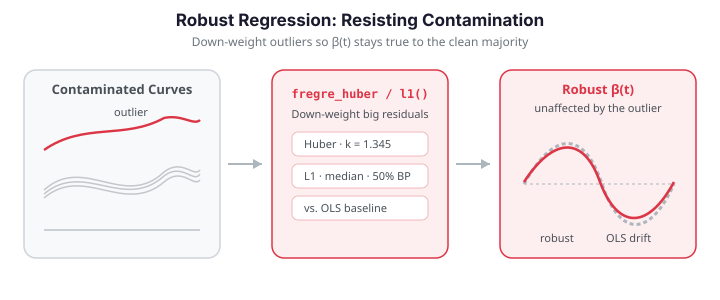

# Robust Regression

Standard FPC regression (`fregre_lm`) uses ordinary least squares, which is sensitive to outliers in the response. Robust regression methods replace the squared loss with loss functions that down-weight extreme residuals, yielding estimators that resist contamination.

`fdars` provides two robust alternatives:

| Method | Loss function | Breakdown point | Notes |
|--------|--------------|-----------------|-------|
| **L1 regression** | $\lvert r \rvert$ | 50% | Median regression; completely ignores outlier magnitude |
| **Huber M-estimation** | Quadratic near 0, linear in tails | Depends on $k$ | Smooth compromise between L2 and L1 |


### Which method should I use?

1. Start with **OLS** (`fregre_lm`) — it is the most efficient estimator when the data are
   clean and gives you the full diagnostic ecosystem.
2. If you suspect outliers, fit **Huber** — the default $k=1.345$ keeps 95% of OLS's
   efficiency on clean Gaussian data, so it costs almost nothing to hedge.
3. For **severe** contamination (more than ~10-15%), switch to **L1**, which trades a little
   clean-data efficiency for maximum outlier resistance.

{ .fdars-diagram }

## Setup: clean vs. contaminated spectra

We simulate curves built from four smooth modes whose amplitudes drive the response,
$y = 2\,a_1 - 1.5\,a_2 + \varepsilon$, so the true coefficient is
$\beta(t) \propto 2\phi_1(t) - 1.5\phi_2(t)$ and is recoverable when the fit is not corrupted.
Then we contaminate 15% of the responses with *one-sided* positive shifts of 5-15 units — the
kind of damage a saturating sensor produces.

```python exec="1" html="1" source="above"
import numpy as np
from docs_fig import fig, render

np.random.seed(42)
n, m = 120, 81
t = np.linspace(0, 1, m)
amp = np.random.randn(n, 4)
raw = np.zeros((n, m))
for i in range(n):
    raw[i] = sum(amp[i, k] * np.sin((2 * k + 1) * np.pi * t)
                 for k in range(4)) + 0.1 * np.random.randn(m)

y_clean = 2.0 * amp[:, 0] - 1.5 * amp[:, 1] + 0.3 * np.random.randn(n)
y_contam = y_clean.copy()
outliers = np.random.choice(n, int(0.15 * n), replace=False)
y_contam[outliers] += np.random.uniform(5, 15, size=len(outliers))

is_out = np.zeros(n, bool)
is_out[outliers] = True

f, ax = fig()
ax.scatter(y_clean[~is_out], y_contam[~is_out], color="#2e8b57", s=28, alpha=0.7,
           label="clean")
ax.scatter(y_clean[is_out], y_contam[is_out], color="#d55e00", s=40, alpha=0.9,
           label="outlier")
lim = [y_clean.min(), y_clean.max()]
ax.plot(lim, lim, color="#6c757d", ls="--", lw=1)
ax.set(title="Clean vs. contaminated responses",
       xlabel="clean y", ylabel="contaminated y")
ax.legend()
print(render(f))
```

The 15% of points lifted above the diagonal are the contamination the robust methods must
resist.

## Coefficient recovery under contamination

With 15% of the responses corrupted, the OLS estimate of $\beta(t)$ is dragged toward the
outliers, while L1 and Huber stay close to the truth. Correlation with the true $\beta(t)$
makes this quantitative.

```python exec="1" html="1" source="above"
import numpy as np
from docs_fig import fig, render
from fdars.regression import fregre_lm, fregre_l1, fregre_huber

np.random.seed(42)
n, m = 120, 81
t = np.linspace(0, 1, m)
amp = np.random.randn(n, 4)
raw = np.zeros((n, m))
for i in range(n):
    raw[i] = sum(amp[i, k] * np.sin((2 * k + 1) * np.pi * t)
                 for k in range(4)) + 0.1 * np.random.randn(m)
y_clean = 2.0 * amp[:, 0] - 1.5 * amp[:, 1] + 0.3 * np.random.randn(n)
y_contam = y_clean.copy()
outliers = np.random.choice(n, int(0.15 * n), replace=False)
y_contam[outliers] += np.random.uniform(5, 15, size=len(outliers))

beta_true = 2.0 * np.sin(np.pi * t) - 1.5 * np.sin(3 * np.pi * t)
beta_true /= np.abs(beta_true).max()

ols = fregre_lm(raw, y_contam, n_comp=5)
l1 = fregre_l1(raw, y_contam, n_comp=5)
hub = fregre_huber(raw, y_contam, n_comp=5, huber_k=1.345)

def scaled(b):
    b = np.asarray(b)
    return b / np.abs(b).max()

f, ax = fig()
ax.plot(t, beta_true, color="#6c757d", lw=2, ls="--", label=r"true $\beta(t)$")
ax.plot(t, scaled(ols["beta_t"]), color="#dc3545", lw=2, label="OLS")
ax.plot(t, scaled(l1["beta_t"]), color="#3f51b5", lw=2, label="L1")
ax.plot(t, scaled(hub["beta_t"]), color="#198754", lw=2, label="Huber")
ax.set(title="Coefficient estimates under 15% response contamination (scaled)",
       xlabel="t", ylabel=r"$\beta(t)$ (unit max)")
ax.legend()
print(render(f))
```

```python exec="1" source="above"
import numpy as np
from fdars.regression import fregre_lm, fregre_l1, fregre_huber

np.random.seed(42)
n, m = 120, 81
t = np.linspace(0, 1, m)
amp = np.random.randn(n, 4)
raw = np.zeros((n, m))
for i in range(n):
    raw[i] = sum(amp[i, k] * np.sin((2 * k + 1) * np.pi * t)
                 for k in range(4)) + 0.1 * np.random.randn(m)
y_clean = 2.0 * amp[:, 0] - 1.5 * amp[:, 1] + 0.3 * np.random.randn(n)
y_contam = y_clean.copy()
outliers = np.random.choice(n, int(0.15 * n), replace=False)
y_contam[outliers] += np.random.uniform(5, 15, size=len(outliers))
beta_true = 2.0 * np.sin(np.pi * t) - 1.5 * np.sin(3 * np.pi * t)

def corr(b):
    return abs(np.corrcoef(beta_true, np.asarray(b))[0, 1])

c = {}
for name, fn, kw in [("OLS", fregre_lm, {}), ("L1", fregre_l1, {}),
                     ("Huber", fregre_huber, {"huber_k": 1.345})]:
    fit = fn(raw, y_contam, n_comp=5, **kw)
    c[name] = corr(fit["beta_t"])
    print(f"{name:6s} corr(beta_hat, beta_true) = {c[name]:.3f}")

# Validation: robust fits stay faithful to the true beta under 15% contamination,
# while OLS is dragged off by the outliers.
assert c["L1"] > 0.9 and c["Huber"] > 0.9, c        # robust methods recover beta(t)
assert c["OLS"] < 0.6, c                            # OLS collapses under contamination
assert min(c["L1"], c["Huber"]) - c["OLS"] > 0.3, c # clear robustness gap
print("validation OK: L1/Huber corr > 0.9 while OLS collapses (< 0.6)")
```

The printed correlations tell the story: OLS's estimate barely resembles the truth, while L1
and Huber recover it almost intact. (The clean-data fit reaches $R^2 \approx 0.98$ for all
three; the gap only opens once the outliers are added.) The assertions make this quantitative:
the two robust fits stay above a 0.9 correlation with the true $\beta(t)$ while OLS drops
below 0.6.

---

## L1 regression

**L1 (least absolute deviations)** regression minimizes $\sum_i |y_i - \hat{y}_i|$ instead of $\sum_i (y_i - \hat{y}_i)^2$. This is equivalent to estimating the conditional median rather than the conditional mean.

```python
import numpy as np
from fdars import Fdata
from fdars.regression import fregre_l1

# --- Simulate data with outliers ---
np.random.seed(42)
n, m = 100, 81
t = np.linspace(0, 1, m)
beta_true = np.sin(4 * np.pi * t)

raw = np.zeros((n, m))
for i in range(n):
    raw[i] = (
        np.random.randn() * np.sin(2 * np.pi * t)
        + np.random.randn() * np.cos(2 * np.pi * t)
        + 0.2 * np.random.randn(m)
    )
fd = Fdata(raw, argvals=t)

response = np.trapz(fd.data * beta_true, fd.argvals, axis=1) + 0.3 * np.random.randn(n)

# Add 10% outliers
n_outliers = 10
outlier_idx = np.random.choice(n, n_outliers, replace=False)
response[outlier_idx] += 10 * np.random.randn(n_outliers)

# --- Fit L1 regression ---
result = fregre_l1(fd.data, response, n_comp=3)

fitted  = result["fitted_values"]  # (n,)
resid   = result["residuals"]      # (n,)
beta_l1 = result["beta_t"]         # (m,) -- estimated beta(t)

print(f"L1 median absolute residual: {np.median(np.abs(resid)):.4f}")
```

| Key | Type | Description |
|-----|------|-------------|
| `fitted_values` | `ndarray (n,)` | Fitted values |
| `residuals` | `ndarray (n,)` | Residuals |
| `beta_t` | `ndarray (m,)` | Estimated coefficient function |

---

## Huber M-estimation

**Huber regression** uses the Huber loss, which behaves like squared error for small residuals and like absolute error for large residuals:

$$
\rho_k(r) = \begin{cases}
\frac{1}{2} r^2 & \text{if } |r| \leq k \\
k|r| - \frac{1}{2} k^2 & \text{if } |r| > k
\end{cases}
$$

The tuning constant $k$ controls the transition point. The default $k = 1.345$ gives 95% efficiency relative to OLS when the errors are truly Gaussian.

```python
from fdars.regression import fregre_huber

result = fregre_huber(fd.data, response, n_comp=3, huber_k=1.345)

fitted     = result["fitted_values"]  # (n,)
resid      = result["residuals"]      # (n,)
beta_huber = result["beta_t"]         # (m,)

print(f"Huber median absolute residual: {np.median(np.abs(resid)):.4f}")
```

| Key | Type | Description |
|-----|------|-------------|
| `fitted_values` | `ndarray (n,)` | Fitted values |
| `residuals` | `ndarray (n,)` | Residuals |
| `beta_t` | `ndarray (m,)` | Estimated coefficient function |

| Parameter | Default | Description |
|-----------|---------|-------------|
| `n_comp` | 3 | Number of FPC components |
| `huber_k` | 1.345 | Huber tuning constant |

!!! tip "Choosing `huber_k`"
    | `huber_k` | Behavior | Efficiency (Gaussian) |
    |-----------|----------|----------------------|
    | 0.5 | Very robust, low efficiency | ~60% |
    | 1.0 | Moderate robustness | ~89% |
    | 1.345 | Standard choice | ~95% |
    | 2.0 | Mild robustness | ~99% |
    | $\to \infty$ | Equivalent to OLS | 100% |

---

## How robustness works: IRLS weights

Both robust fits are solved by **iteratively reweighted least squares**: at each iteration
every observation gets a weight $w_i = \psi(r_i)/r_i$ that shrinks as its residual grows, and
a weighted OLS step is taken. The weight functions are

$$
w_i^{\text{Huber}} = \min\!\Big(1,\ \frac{k}{|r_i|}\Big),
\qquad
w_i^{\text{L1}} = \frac{1}{|r_i|}.
$$

Huber leaves small-residual points at full weight (1) and tapers only the tails; L1 down-weights
everything by the inverse residual, pushing hardest on the outliers. Reconstructing the final
Huber weights from the returned residuals shows the mechanism directly: the contaminated points
are driven to near-zero weight.

```python exec="1" html="1" source="above"
import numpy as np
from docs_fig import fig, render
from fdars.regression import fregre_huber

np.random.seed(42)
n, m = 120, 81
t = np.linspace(0, 1, m)
amp = np.random.randn(n, 4)
raw = np.zeros((n, m))
for i in range(n):
    raw[i] = sum(amp[i, k] * np.sin((2 * k + 1) * np.pi * t)
                 for k in range(4)) + 0.1 * np.random.randn(m)
y_clean = 2.0 * amp[:, 0] - 1.5 * amp[:, 1] + 0.3 * np.random.randn(n)
y_contam = y_clean.copy()
outliers = np.random.choice(n, int(0.15 * n), replace=False)
y_contam[outliers] += np.random.uniform(5, 15, size=len(outliers))

hub = fregre_huber(raw, y_contam, n_comp=5, huber_k=1.345)
resid = np.asarray(hub["residuals"])

# Reconstruct the final Huber IRLS weights from the residuals.
k = 1.345
scale = 1.4826 * np.median(np.abs(resid - np.median(resid)))    # robust scale (MAD)
w = np.minimum(1.0, k * scale / np.abs(resid))

is_out = np.zeros(n, bool)
is_out[outliers] = True

f, ax = fig()
ax.scatter(np.where(~is_out)[0], w[~is_out], color="#2e8b57", s=24, alpha=0.7,
           label="clean")
ax.scatter(np.where(is_out)[0], w[is_out], color="#d55e00", s=44, alpha=0.9,
           label="outlier")
ax.set(title="Reconstructed Huber IRLS weights",
       xlabel="observation", ylabel="weight")
ax.legend()
print(render(f))
```

Clean observations cluster near weight 1; the outliers collapse toward 0, which is exactly why
their upward shift cannot drag the fit.

!!! note "Weights are reconstructed, not returned"
    The R `fregre.huber`/`fregre.l1` return the IRLS `weights`, `iterations` and `converged`
    flag directly; the Python bindings currently return only `fitted_values`, `residuals` and
    `beta_t`. The weights above are recomputed from the returned residuals using the Huber
    weight function and a MAD scale estimate — the same quantity, made explicit.

---

## Comparing OLS, L1, and Huber

```python
import numpy as np
import pandas as pd
from fdars import Fdata
from fdars.regression import fregre_lm, fregre_l1, fregre_huber

np.random.seed(0)
n, m = 120, 101
t = np.linspace(0, 1, m)
beta_true = np.exp(-((t - 0.5)**2) / 0.02)

# Clean data
raw = np.zeros((n, m))
for i in range(n):
    raw[i] = sum(
        np.random.randn() * np.sin((2*k+1) * np.pi * t)
        for k in range(4)
    ) + 0.15 * np.random.randn(m)
fd = Fdata(raw, argvals=t)

response_clean = np.trapz(fd.data * beta_true, fd.argvals, axis=1) + 0.3 * np.random.randn(n)

# Contaminated response (15% outliers)
response = response_clean.copy()
contaminated = np.random.choice(n, int(0.15 * n), replace=False)
response[contaminated] += 8 * np.random.choice([-1, 1], size=len(contaminated))

# --- Fit all three ---
ols   = fregre_lm(fd.data, response, n_comp=4)
l1    = fregre_l1(fd.data, response, n_comp=4)
huber = fregre_huber(fd.data, response, n_comp=4, huber_k=1.345)

# --- Evaluate beta recovery and prediction on clean observations ---
clean_idx = np.setdiff1d(np.arange(n), contaminated)
rows = []
for name, res in [("OLS", ols), ("L1", l1), ("Huber", huber)]:
    corr = np.corrcoef(beta_true, res["beta_t"])[0, 1]
    mse = np.mean((res["fitted_values"][clean_idx] - response_clean[clean_idx])**2)
    rows.append({"method": name, "beta_corr": corr, "mse_clean": mse})

results_df = pd.DataFrame(rows)
print(results_df.to_string(index=False))
```

The clearest view is observed-vs-predicted on the *clean* observations after training on
contaminated data: OLS's cloud is tilted and shifted by the outliers it chased, while L1 and
Huber stay close to the 1:1 line.

```python exec="1" html="1" source="above"
import numpy as np
from docs_fig import fig, render
from fdars.regression import fregre_lm, fregre_l1, fregre_huber

np.random.seed(42)
n, m = 120, 81
t = np.linspace(0, 1, m)
amp = np.random.randn(n, 4)
raw = np.zeros((n, m))
for i in range(n):
    raw[i] = sum(amp[i, k] * np.sin((2 * k + 1) * np.pi * t)
                 for k in range(4)) + 0.1 * np.random.randn(m)
y_clean = 2.0 * amp[:, 0] - 1.5 * amp[:, 1] + 0.3 * np.random.randn(n)
y_contam = y_clean.copy()
outliers = np.random.choice(n, int(0.15 * n), replace=False)
y_contam[outliers] += np.random.uniform(5, 15, size=len(outliers))
clean_idx = np.setdiff1d(np.arange(n), outliers)

fits = [("OLS", fregre_lm(raw, y_contam, n_comp=5)),
        ("L1", fregre_l1(raw, y_contam, n_comp=5)),
        ("Huber", fregre_huber(raw, y_contam, n_comp=5, huber_k=1.345))]

f, axes = fig(ncols=3, figsize=(11, 3.4))
for (name, fit), ax in zip(fits, axes):
    pred = np.asarray(fit["fitted_values"])[clean_idx]
    obs = y_clean[clean_idx]
    ax.scatter(obs, pred, color="#4a90d9", s=20, alpha=0.7)
    lim = [obs.min(), obs.max()]
    ax.plot(lim, lim, color="#6c757d", ls="--", lw=1)
    ax.set(title=name, xlabel="true (clean) y", ylabel="predicted")
f.suptitle("Observed vs. predicted on clean points (trained on contaminated data)", y=1.03)
print(render(f))
```

The OLS panel is visibly tilted and offset — its predictions on clean points are
biased by the outliers it chased during fitting — whereas the L1 and Huber clouds
hug the 1:1 line, confirming that down-weighting the tails preserves accuracy where
it matters.

## The loss and weight functions side by side

The whole story reduces to *how each method scores a residual*. Plotting the
three loss functions $\rho(r)$ and their IRLS weight functions $w(r)=\psi(r)/r$
over a common residual axis makes the trade-off concrete:

```python exec="1" html="1" source="above"
import numpy as np
from docs_fig import fig, render

r = np.linspace(-6, 6, 400)
k = 1.345
loss_ols = 0.5 * r ** 2
loss_l1 = np.abs(r)
loss_hub = np.where(np.abs(r) <= k, 0.5 * r ** 2, k * np.abs(r) - 0.5 * k ** 2)

eps = 1e-6
w_ols = np.ones_like(r)
w_l1 = 1.0 / np.maximum(np.abs(r), eps)
w_hub = np.minimum(1.0, k / np.maximum(np.abs(r), eps))

f, (a0, a1) = fig(ncols=2, figsize=(11, 3.8))
a0.plot(r, loss_ols, color="#dc3545", lw=2, label="OLS  ½r²")
a0.plot(r, loss_l1, color="#3f51b5", lw=2, label="L1  |r|")
a0.plot(r, loss_hub, color="#198754", lw=2, label=fr"Huber  (k={k})")
a0.axvspan(-k, k, color="#198754", alpha=0.08)
a0.set(title="Loss functions ρ(r)", xlabel="residual r", ylabel="ρ(r)", ylim=(0, 12))
a0.legend()

a1.plot(r, w_ols, color="#dc3545", lw=2, label="OLS")
a1.plot(r, w_l1, color="#3f51b5", lw=2, label="L1")
a1.plot(r, w_hub, color="#198754", lw=2, label="Huber")
a1.axvspan(-k, k, color="#198754", alpha=0.08)
a1.set(title="IRLS weights w(r)", xlabel="residual r", ylabel="w(r)", ylim=(0, 1.1))
a1.legend()
print(render(f))
```

OLS grows quadratically forever and weights every point equally, so a single large
residual dominates the fit; Huber switches to a linear tail outside the shaded band
$|r|\le k$ and caps its weight there; L1 is linear everywhere and its weight decays
like $1/|r|$, the most aggressive down-weighting of the three.

---

## When to use robust methods

| Scenario | Recommendation |
|----------|---------------|
| Clean data, no outliers | `fregre_lm` (OLS) -- most efficient |
| Suspected outliers in response | `fregre_huber` with default $k=1.345$ |
| Known heavy contamination ($>10\%$) | `fregre_l1` |
| Outliers in predictors (leverage points) | Pre-filter with [outlier detection](../analyze/outlier-detection.md), then use any method |
| Heteroscedastic errors | `fregre_huber` with smaller $k$ (e.g., 1.0) |

!!! warning
    Robust methods protect against outliers in the **response** $y_i$. They do not guard against leverage points (outlying $x_i(t)$). For high-leverage outliers, consider depth-based trimming before fitting.

## See also

- [Scalar-on-function regression](scalar-on-function.md) — the OLS baseline these methods harden.
- [Regression diagnostics](regression-diagnostics.md) — locate the influential points before down-weighting them.
- [Outlier detection](../analyze/outlier-detection.md) — depth-based screening for leverage points.

## References

- Huber, P. J. (1964). *Robust estimation of a location parameter.* Annals of Mathematical Statistics, 35(1), 73–101.
- Huber, P. J., & Ronchetti, E. M. (2009). *Robust Statistics* (2nd ed.). Wiley.
- Maronna, R. A., Martin, R. D., Yohai, V. J., & Salibián-Barrera, M. (2019). *Robust Statistics: Theory and Methods* (2nd ed.). Wiley.
- Cardot, H., Crambes, C., & Sarda, P. (2005). *Quantile regression when the covariates are functions.* Journal of Nonparametric Statistics, 17(7), 841–856.
