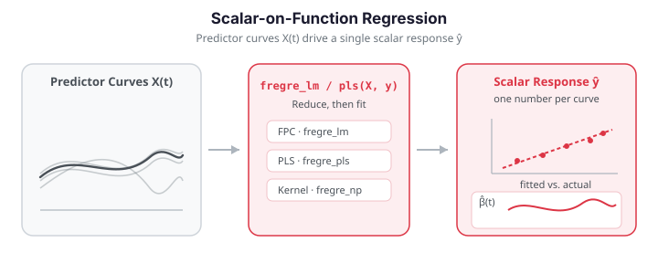

# Scalar-on-Function Regression

Scalar-on-function regression predicts a scalar response $y_i$ from a functional
predictor $x_i(t)$ through the **functional linear model**:

$$
y_i = \alpha + \int_{\mathcal{T}} x_i(t)\,\beta(t)\,dt + \varepsilon_i,
\qquad \varepsilon_i \sim \text{iid}(0, \sigma^2).
$$

The coefficient function $\beta(t)$ is the object of interest: it reveals *which
regions* of the predictor curve drive the response. `fdars` provides several
complementary estimators for this model.


{ .fdars-diagram }

## The estimation challenge

Estimating $\beta(t)$ directly is **ill-posed**. Discretising the predictor on
$m$ grid points turns the integral into an $m$-dimensional regression, and with
$m \gg n$ the least-squares problem is massively overparameterised. Every
practical method therefore reduces dimensionality before fitting, and they
differ in *how*:

| Method | `fdars` function | Key parameter | Idea |
|--------|------------------|---------------|------|
| FPC regression | `fregre_lm` | `n_comp` | project onto principal components |
| PLS regression | `fregre_pls` | `n_comp` | components chosen to predict $y$ |
| Nonparametric | `fregre_np` | `h` (bandwidth) | kernel-smooth over a distance matrix |
| Robust FPC | `fregre_huber`, `fregre_l1` | `n_comp` | down-weight outliers |

**Quick rule:** start with `fregre_lm` (FPC regression) — it is fast, gives an
interpretable $\hat\beta(t)$, and returns the fitted values and $R^2$ you need
for diagnostics. Switch to `fregre_np` if you suspect the $x \mapsto y$
relationship is nonlinear, and to the robust variants if outliers are present.

The two figures below show what a fitted model produces: the recovered
coefficient function $\hat\beta(t)$ (compared against the truth) and a
predicted-vs-actual scatter of the scalar response.

```python exec="1" html="1"
import numpy as np
from docs_fig import fig, render
from fdars.regression import fregre_lm, fregre_pls

np.random.seed(1)
n, m = 80, 81
t = np.linspace(0, 1, m)
beta_true = np.sin(4 * np.pi * t)

raw = np.zeros((n, m))
for i in range(n):
    raw[i] = (np.random.randn() * np.sin(2 * np.pi * t)
              + np.random.randn() * np.cos(2 * np.pi * t)
              + np.random.randn() * np.sin(4 * np.pi * t)
              + 0.3 * np.random.randn(m))
y = np.trapezoid(raw * beta_true, t, axis=1) + 0.5 * np.random.randn(n)

# FPC needs the third mode (sin 4pi t) to see the signal; PLS reaches it in
# two supervised components. Both track the true beta at these counts.
lm = fregre_lm(raw, y, n_comp=3)
pls = fregre_pls(raw, t, y, n_comp=2)

f, ax = fig()
ax.plot(t, beta_true, color="#6c757d", lw=2, ls="--", label=r"true $\beta(t)$")
ax.plot(t, np.asarray(lm["beta_t"]), color="#3f51b5", lw=2, label="FPC estimate")
ax.plot(t, np.asarray(pls["beta_t"]), color="#e8710a", lw=2, label="PLS estimate")
ax.set(title="Estimated coefficient function", xlabel="t", ylabel=r"$\beta(t)$")
ax.legend()
print(render(f))
```

```python exec="1" html="1"
import numpy as np
from docs_fig import fig, render
from fdars.regression import fregre_lm

np.random.seed(1)
n, m = 40, 81
t = np.linspace(0, 1, m)
beta_true = np.sin(4 * np.pi * t)
raw = np.zeros((n, m))
for i in range(n):
    raw[i] = (np.random.randn() * np.sin(2 * np.pi * t)
              + np.random.randn() * np.cos(2 * np.pi * t)
              + np.random.randn() * np.sin(4 * np.pi * t)
              + 0.3 * np.random.randn(m))
y = np.trapezoid(raw * beta_true, t, axis=1) + 0.5 * np.random.randn(n)

lm = fregre_lm(raw, y, n_comp=4)
yhat = np.asarray(lm["fitted_values"])

f, ax = fig()
ax.scatter(y, yhat, color="#3f51b5", s=28, alpha=0.8)
lim = [min(y.min(), yhat.min()), max(y.max(), yhat.max())]
ax.plot(lim, lim, color="#6c757d", ls="--", lw=1.5)
ax.set(title=f"Predicted vs actual (R² = {lm['r_squared']:.2f})",
       xlabel="observed y", ylabel="predicted y")
print(render(f))
```

---

## 1. FPC regression

The most common approach: expand the coefficient function in the eigenbasis
$\{\phi_k\}$ of the predictor's covariance operator,
$\beta(t) = \sum_k \gamma_k \phi_k(t)$. Writing the FPC scores as
$\xi_{ik} = \int (x_i(t) - \bar x(t))\,\phi_k(t)\,dt$, the model collapses to an
ordinary linear regression on the first $K$ scores,

$$
y_i \approx \alpha + \sum_{k=1}^{K}\gamma_k\,\xi_{ik} + \varepsilon_i,
$$

and the coefficient function is reconstructed as
$\hat\beta(t) = \sum_{k=1}^{K}\hat\gamma_k\,\phi_k(t)$.

```python
import numpy as np
from fdars import Fdata
from fdars.regression import fregre_lm

# Simulate data
np.random.seed(42)
n, m = 100, 81
t = np.linspace(0, 1, m)
beta_true = np.sin(4 * np.pi * t)

# Generate functional predictors (smooth random curves)
raw = np.zeros((n, m))
for i in range(n):
    raw[i] = (
        np.random.randn() * np.sin(2 * np.pi * t)
        + np.random.randn() * np.cos(2 * np.pi * t)
        + np.random.randn() * np.sin(4 * np.pi * t)
        + 0.3 * np.random.randn(m)
    )
fd = Fdata(raw, argvals=t)

# Scalar response = integral of data * beta + noise
response = np.trapezoid(fd.data * beta_true, fd.argvals, axis=1) + 0.5 * np.random.randn(n)

# Fit the model
result = fregre_lm(fd.data, response, n_comp=3)

fitted   = result["fitted_values"]   # (n,)
resid    = result["residuals"]       # (n,)
beta_hat = result["beta_t"]          # (m,) -- estimated beta(t)
r2       = result["r_squared"]       # scalar
coefs    = result["coefficients"]    # FPC coefficients
intercept = result["intercept"]      # scalar

print(f"R-squared: {r2:.4f}")
```

| Key | Type | Description |
|-----|------|-------------|
| `fitted_values` | `ndarray (n,)` | Predicted response values |
| `residuals` | `ndarray (n,)` | Residuals $y - \hat{y}$ |
| `beta_t` | `ndarray (m,)` | Estimated coefficient function $\hat{\beta}(t)$ |
| `r_squared` | `float` | Coefficient of determination |
| `coefficients` | `ndarray (k,)` | Regression coefficients on FPC scores |
| `intercept` | `float` | Intercept $\hat{\alpha}$ |

!!! note "Number of components"
    The choice of `n_comp` controls the bias-variance trade-off. Too few
    components under-fit; too many over-fit. Use `fregre_cv` (Section 4) or
    `model_selection_ncomp` (Section 5) for automatic selection.

---

## 2. PLS regression

**Partial Least Squares** finds components that maximise the covariance between
the functional predictor and the response, often out-performing FPCA when the
dominant modes of variation are not the most predictive.

```python
from fdars.regression import fregre_pls

result = fregre_pls(fd.data, fd.argvals, response, n_comp=3)

print(f"PLS R-squared: {result['r_squared']:.4f}")
print(f"Beta shape:    {np.asarray(result['beta_t']).shape}")
```

| Key | Type | Description |
|-----|------|-------------|
| `fitted_values` | `ndarray (n,)` | Fitted values |
| `residuals` | `ndarray (n,)` | Residuals |
| `beta_t` | `ndarray (m,)` | PLS coefficient function |
| `r_squared` | `float` | $R^2$ |

!!! tip "PLS vs. FPC regression"
    PLS is preferable when the response depends on modes of variation with small
    eigenvalues. FPC regression may miss these because FPCA is unsupervised —
    it picks the directions of largest *variance*, not largest *covariance with
    $y$*.

!!! warning "Keep the PLS component count small"
    `fregre_pls` reaches the predictive signal in very few supervised components.
    Asking for more than the data support can make the reconstructed
    $\hat\beta(t)$ oscillate wildly even when the fitted $R^2$ looks fine, so
    always pick `n_comp` by cross-validation (Section 4) and prefer the smallest
    count that captures the signal — two components suffice in the example above.

---

## 3. Nonparametric regression

When the relationship between $x(t)$ and $y$ is nonlinear, use a
**Nadaraya–Watson kernel estimator** built on a pre-computed distance matrix.
For a query curve $x^\*$,

$$
\hat m(x^\*) = \frac{\sum_{i} K\!\big(d(x^\*, x_i)/h\big)\,y_i}
                     {\sum_{i} K\!\big(d(x^\*, x_i)/h\big)},
$$

where $d(\cdot,\cdot)$ is any functional distance and $h$ is the bandwidth.
This makes no linearity assumption; the choice of distance sets the geometry.

```python
from fdars.regression import fregre_np
from fdars.metric import lp_self_1d

# Compute L2 distance matrix
D = lp_self_1d(fd.data, fd.argvals, p=2.0)

result = fregre_np(D, response, h=0.0)  # h=0.0 -> automatic bandwidth

print(f"NP R-squared: {result['r_squared']:.4f}")
print(f"Bandwidth:    {result['h_func']:.4f}")
```

| Key | Type | Description |
|-----|------|-------------|
| `fitted_values` | `ndarray (n,)` | Fitted values |
| `residuals` | `ndarray (n,)` | Residuals |
| `h_func` | `float` | Selected or user-specified bandwidth |
| `r_squared` | `float` | $R^2$ |

!!! info "Distance choice matters"
    The distance metric used to build `D` determines the geometry of the
    regression. Swap $L^2$ for an elastic, DTW, or Fourier distance
    (`fdars.metric`) to match the structure of your curves.

---

## 4. Cross-validating the number of components

`fregre_cv` runs $k$-fold cross-validation over a range of FPC component counts
and returns the value of $K$ minimising out-of-fold error, together with the
per-$k$ curve you can plot.

```python
from fdars.regression import fregre_cv

cv = fregre_cv(fd.data, response, k_min=1, k_max=8, n_folds=5)
print(f"Optimal number of components: {cv['optimal_k']}")
```

| Key | Type | Description |
|-----|------|-------------|
| `optimal_k` | `int` | Component count with lowest CV error |
| `k_values` | `ndarray` | The $K$ values tested |
| `cv_errors` | `ndarray` | Mean CV error for each $K$ |
| `min_cv_error` | `float` | Error at `optimal_k` |
| `oof_predictions` | `ndarray (n,)` | Out-of-fold predictions at `optimal_k` |
| `fold_errors` | `ndarray` | Error per fold |
| `fold_assignments` | `ndarray (n,)` | Fold index of each observation |

The figure below plots the CV curve; the marked minimum is the selected $K$.

```python exec="1" html="1" source="above"
import numpy as np
from docs_fig import fig, render
from fdars import Fdata
from fdars.regression import fregre_cv

np.random.seed(7)
n, m = 90, 81
t = np.linspace(0, 1, m)
beta_true = np.sin(4 * np.pi * t)
raw = np.zeros((n, m))
for i in range(n):
    raw[i] = (np.random.randn() * np.sin(2 * np.pi * t)
              + np.random.randn() * np.cos(2 * np.pi * t)
              + np.random.randn() * np.sin(4 * np.pi * t)
              + 0.3 * np.random.randn(m))
fd = Fdata(raw, argvals=t)
y = np.trapezoid(fd.data * beta_true, fd.argvals, axis=1) + 0.5 * np.random.randn(n)

cv = fregre_cv(fd.data, y, k_min=1, k_max=10, n_folds=5)
ks = np.asarray(cv["k_values"])
errs = np.asarray(cv["cv_errors"])
best = int(cv["optimal_k"])

f, ax = fig()
ax.plot(ks, errs, "-o", color="#3f51b5")
ax.axvline(best, color="#e8710a", ls="--", lw=1.5, label=f"optimal K = {best}")
ax.set(title="Cross-validated component selection",
       xlabel="number of FPC components K", ylabel="CV error")
ax.legend()
print(render(f))
```

---

## 5. Model selection by information criteria

Where `fregre_cv` uses out-of-sample error, `model_selection_ncomp` scores each
candidate $K$ with in-sample **AIC**, **BIC**, or **GCV** — cheaper, and useful
when you want to compare criteria side by side.

```python
from fdars.regression import model_selection_ncomp

result = model_selection_ncomp(fd.data, response, max_comp=10, criterion="gcv")

best_k = result["best_ncomp"]
print(f"Best number of components: {best_k}")

# Inspect all criteria
for ncomp, aic, bic, gcv in result["criteria"]:
    print(f"  k={ncomp}: AIC={aic:.2f}, BIC={bic:.2f}, GCV={gcv:.4f}")
```

| Key | Type | Description |
|-----|------|-------------|
| `best_ncomp` | `int` | Optimal number of components |
| `criteria` | `list[tuple]` | `(ncomp, AIC, BIC, GCV)` for each $K$ tested |

---

## 6. Robust regression

When a few curves or responses are contaminated, ordinary FPC regression can be
badly distorted. `fregre_huber` replaces the squared loss with Huber's loss
(quadratic near zero, linear in the tails), and `fregre_l1` uses least-absolute
deviations. Both share the FPC dimension reduction of `fregre_lm`.

```python
from fdars.regression import fregre_huber, fregre_l1

hub = fregre_huber(fd.data, response, n_comp=3, huber_k=1.345)
l1  = fregre_l1(fd.data, response, n_comp=3)

print("Huber beta shape:", np.asarray(hub["beta_t"]).shape)
print("L1 beta shape:   ", np.asarray(l1["beta_t"]).shape)
```

Both return `fitted_values`, `residuals`, and `beta_t`. Use them as drop-in
replacements for `fregre_lm` when a residual or QQ plot flags outliers.

---

## 7. FPCA-then-regression pattern

For maximum control, run FPCA explicitly and feed the scores into your own
regression pipeline.

```python
from fdars.regression import fpca
import numpy as np

# Step 1: FPCA
pca = fpca(fd.data, fd.argvals, n_comp=5)
scores   = np.asarray(pca["scores"])     # (n, 5)
rotation = np.asarray(pca["rotation"])   # (m, 5)
mean_fn  = np.asarray(pca["mean"])       # (m,)

# Step 2: OLS on the scores (using numpy)
X = np.column_stack([np.ones(n), scores])
beta_hat = np.linalg.lstsq(X, response, rcond=None)[0]
fitted = X @ beta_hat
r2 = 1 - np.sum((response - fitted)**2) / np.sum((response - response.mean())**2)
print(f"Manual FPC regression R-squared: {r2:.4f}")

# Step 3: Reconstruct beta(t) in function space
beta_t = rotation @ beta_hat[1:]
```

!!! note "Methods available in the R package but not (yet) in Python"
    The R reference also documents `fregre.basis` (basis-expansion regression
    with a roughness penalty), a pure-R `fregre.pc`, and the `flm.test`
    linearity test. These have no `fdars` Python binding today, so they are
    omitted here rather than faked. The FPCA-then-regression pattern above
    covers the `fregre.pc` case; for a basis expansion, fit a basis with
    `fdars.basis` and regress on the coefficients yourself.

---

## Diagnostics: residuals and coefficient recovery

After fitting, two plots tell you most of what you need. A fitted-vs-residual
plot checks for constant variance (a random band around zero is good; a fan or
curve is not), and overlaying $\hat\beta(t)$ on the truth shows how faithfully
the model recovered the signal.

```python exec="1" html="1" source="above"
import numpy as np
from docs_fig import fig, render
from fdars import Fdata
from fdars.regression import fregre_lm

np.random.seed(11)
n, m = 100, 81
t = np.linspace(0, 1, m)
beta_true = np.sin(4 * np.pi * t)
raw = np.zeros((n, m))
for i in range(n):
    raw[i] = (np.random.randn() * np.sin(2 * np.pi * t)
              + np.random.randn() * np.cos(2 * np.pi * t)
              + np.random.randn() * np.sin(4 * np.pi * t)
              + 0.3 * np.random.randn(m))
fd = Fdata(raw, argvals=t)
y = np.trapezoid(fd.data * beta_true, fd.argvals, axis=1) + 0.5 * np.random.randn(n)

lm = fregre_lm(fd.data, y, n_comp=3)   # the signal lives in the first 3 modes; more over-fits
fitted = np.asarray(lm["fitted_values"])
resid = np.asarray(lm["residuals"])

f, (a0, a1) = fig(1, 2, figsize=(11, 4))
a0.scatter(fitted, resid, color="#3f51b5", s=24, alpha=0.7)
a0.axhline(0, color="#6c757d", ls="--", lw=1.5)
a0.set(title="Fitted vs residuals", xlabel="fitted", ylabel="residual")

a1.plot(t, beta_true, color="#6c757d", lw=2, ls="--", label=r"true $\beta(t)$")
a1.plot(t, np.asarray(lm["beta_t"]), color="#3f51b5", lw=2, label="estimate")
a1.set(title="Coefficient recovery", xlabel="t", ylabel=r"$\beta(t)$")
a1.legend()
print(render(f))
```

---

## Comparing methods on a hold-out set

The honest way to choose a method is out-of-sample error. Below we split the
data, fit FPC, PLS, and nonparametric models on the training set, predict the
test responses, and tabulate RMSE / $R^2$ / MAE.

```python exec="1" html="1" source="above"
import numpy as np
from docs_fig import fig, render
from fdars import Fdata
from fdars.regression import (
    fregre_lm, fregre_pls, fregre_np,
    predict_fregre_lm, predict_fregre_pls,
)
from fdars.metric import lp_self_1d, lp_cross_1d

np.random.seed(99)
n, m = 140, 101
t = np.linspace(0, 1, m)
# Coefficient concentrated in the late part of the domain
beta_true = np.where(t > 0.6, 5 * (t - 0.6), 0.0)

raw = np.zeros((n, m))
for i in range(n):
    c1, c2, c3 = np.random.randn(3)
    raw[i] = c1 * t + c2 * t**2 + c3 * np.sin(np.pi * t) + 0.2 * np.random.randn(m)
fd = Fdata(raw, argvals=t)
y = np.trapezoid(fd.data * beta_true, fd.argvals, axis=1) + 0.3 * np.random.randn(n)

ntr = 100
Xtr, ytr = fd.data[:ntr], y[:ntr]
Xte, yte = fd.data[ntr:], y[ntr:]

def metrics(y_true, y_pred):
    y_true, y_pred = np.asarray(y_true), np.asarray(y_pred)
    err = y_true - y_pred
    rmse = np.sqrt(np.mean(err**2))
    mae = np.mean(np.abs(err))
    r2 = 1 - np.sum(err**2) / np.sum((y_true - y_true.mean())**2)
    return rmse, r2, mae

# FPC and PLS have proper predict functions
pred_lm = predict_fregre_lm(Xtr, ytr, Xte, n_comp=4)
pred_pls = predict_fregre_pls(Xtr, t, ytr, Xte, n_comp=4)

# NP: build train distance + cross distance, kernel-average by hand-free helper
Dtr = lp_self_1d(Xtr, t, p=2.0)
np_fit = fregre_np(Dtr, ytr, h=0.0)          # fit to get the bandwidth
h = np_fit["h_func"]
Dcross = np.asarray(lp_cross_1d(Xte, Xtr, t, p=2.0))  # (n_te, n_tr)
w = np.exp(-0.5 * (Dcross / h) ** 2)
pred_np = (w @ ytr) / w.sum(axis=1)

rows = [("FPC (fregre_lm)", *metrics(yte, pred_lm)),
        ("PLS (fregre_pls)", *metrics(yte, pred_pls)),
        ("Nonparametric (NW)", *metrics(yte, pred_np))]

print("| method | RMSE | R² | MAE |")
print("|--------|------|-----|-----|")
for name, rmse, r2, mae in rows:
    print(f"| {name} | {rmse:.3f} | {r2:.3f} | {mae:.3f} |")

f, ax = fig()
colors = ["#3f51b5", "#e8710a", "#2e7d32"]
for (name, *_), pred, c in zip(rows, [pred_lm, pred_pls, pred_np], colors):
    ax.scatter(yte, np.asarray(pred), s=30, alpha=0.7, color=c, label=name)
lim = [yte.min(), yte.max()]
ax.plot(lim, lim, color="#6c757d", ls="--", lw=1.5)
ax.set(title="Predicted vs observed (test set)",
       xlabel="observed y", ylabel="predicted y")
ax.legend(fontsize=8)
print(render(f))
```

The table is printed above the figure at build time, so the numbers always match
the current `fdars` implementation.

---

## Method selection guide

| Method | Best when | Speed | Interpretability |
|--------|-----------|-------|------------------|
| `fregre_lm` (FPC) | predictor has clear dominant variation modes | fast | high — inspect $\hat\beta(t)$ |
| `fregre_pls` | predictive signal lives in low-variance modes | fast | high |
| `fregre_np` | relationship may be nonlinear | moderate | low |
| `fregre_huber` / `fregre_l1` | outliers in curves or response | fast | high |

**Recommended workflow**

1. Choose $K$ with `fregre_cv` (out-of-fold) or `model_selection_ncomp` (AIC/BIC/GCV).
2. Fit `fregre_lm`; inspect the fitted-vs-residual plot and $\hat\beta(t)$.
3. If residuals show structure, try `fregre_np`; if they show outliers, try the robust variants.
4. Confirm the winner on a held-out test set via RMSE / $R^2$ / MAE.

## References

- Ramsay & Silverman (2005), *Functional Data Analysis*, 2nd ed.
- Ferraty & Vieu (2006), *Nonparametric Functional Data Analysis*.
- Horváth & Kokoszka (2012), *Inference for Functional Data with Applications*.
