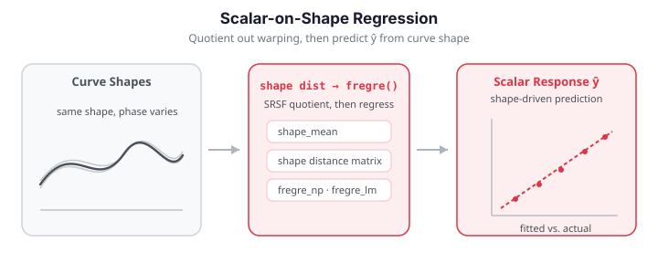

# Scalar-on-Shape Regression

Ordinary [scalar-on-function regression](scalar-on-function.md) predicts a scalar
response from the *amplitude* of a curve — its value at each fixed $t$. But
sometimes the response depends on the curve's **shape**: the geometric pattern of
peaks and troughs, independent of how the curve is stretched or shifted along the
$t$-axis. Two curves that are warped versions of one another have the same shape
and, for a shape-driven response, should predict the same value.

Scalar-on-shape regression handles exactly this. We first quotient out warping
with the elastic (SRSF) machinery in `fdars.alignment`, then regress the response
on either a **shape distance matrix** (nonparametric) or **shape principal-component
scores** (linear). This page builds both pipelines on a seeded example.

!!! note "No single `scalar_on_shape` binding"
    The R package ships a purpose-built `scalar.on.shape()` estimator that jointly
    fits alignment and a penalised coefficient index. `fdars` for Python does not
    expose that one function; instead we compose the same idea from the shape
    primitives (`shape_mean`, `shape_self_distance_matrix`) plus the standard
    regressors. The results below are honest: the shape pipelines are competitive
    with, and often better than, naïve FPC regression on phase-variable data, but
    the margins depend on the problem.


{ .fdars-diagram }

```python exec="1" html="1" source="above"
import numpy as np
from scipy.stats import beta as beta_dist
from docs_fig import fig, render
from fdars.alignment import shape_mean

def make_shape_data(seed, n=60, m=60):
    """Curves = phase-warped copies of a shape whose amplitude drives y."""
    rng = np.random.default_rng(seed)
    t = np.linspace(0, 1, m)
    X = np.zeros((n, m)); y = np.zeros(n)
    for i in range(n):
        amp = rng.normal(0, 1)                              # shape signal
        base = amp * np.sin(2 * np.pi * t) + 0.4 * np.sin(4 * np.pi * t)
        a, b = rng.uniform(0.3, 3.0, size=2)               # phase nuisance
        gamma = beta_dist.cdf(t, a, b)
        X[i] = np.interp(gamma, t, base) + 0.05 * rng.standard_normal(m)
        y[i] = 2 * amp + rng.normal(0, 0.3)                # response from shape
    return t, X, y

t, X, y = make_shape_data(seed=3)
sm = shape_mean(X, t)
mean = np.asarray(sm["mean"])
aligned = np.asarray(sm["aligned_data"])

f, (a0, a1) = fig(1, 2, figsize=(11, 4))
a0.plot(t, X[:20].T, color="#3f51b5", lw=0.8, alpha=0.4)
a0.set(title="Raw curves (phase-warped)", xlabel="t", ylabel="X(t)")
a1.plot(t, aligned.T, color="#198754", lw=0.8, alpha=0.4)
a1.plot(t, mean, color="#e8710a", lw=2.6, label="shape mean")
a1.set(title="After alignment to the shape mean", xlabel="t", ylabel="X(t)")
a1.legend()
print(render(f))
```

The raw panel is a tangle of peaks at different $t$-locations — pure phase noise —
while the aligned panel collapses them onto a common shape around the orange mean,
exposing the amplitude variation that actually drives the response.

## Concepts

A functional observation $x(t)$ splits into an **amplitude** component (the shape
of the curve) and a **phase** component (a warping $\gamma$ of the $t$-axis). Two
curves $x_1, x_2$ share a shape when there is a warping $\gamma$ with
$x_1 \approx x_2 \circ \gamma$. The elastic (Fisher–Rao) framework makes this
precise through the square-root velocity function (SRVF); the resulting **shape
distance**

$$
d_{\text{shape}}(x_1, x_2) = \min_{\gamma}\;
  \big\lVert q_1 - (q_2 \circ \gamma)\sqrt{\dot\gamma}\big\rVert_2
$$

is invariant to warping. The scalar-on-shape model then assumes the response
depends on the curve *only through its shape*:

$$
y_i = g\!\left(\text{shape}(x_i)\right) + \varepsilon_i .
$$

We estimate $g$ in two ways. **(1) Distance-based (nonparametric):** feed the
pairwise shape-distance matrix into the Nadaraya–Watson kernel regressor
`fregre_np`, letting similar-shaped curves borrow strength. **(2) Shape-PC
(linear):** align all curves to the shape mean, run FPCA on the aligned curves to
obtain warping-invariant *shape scores*, and regress the response on those scores
with `fregre_lm`.

## Building the data

The predictor curves are phase-warped copies of a base shape whose amplitude
carries the signal; the response depends on that amplitude, not on the warping.
This is the regime where removing phase should help.

```python
import numpy as np
from scipy.stats import beta as beta_dist

def make_shape_data(seed, n=60, m=60):
    rng = np.random.default_rng(seed)
    t = np.linspace(0, 1, m)
    X = np.zeros((n, m)); y = np.zeros(n)
    for i in range(n):
        amp = rng.normal(0, 1)                              # shape signal
        base = amp * np.sin(2 * np.pi * t) + 0.4 * np.sin(4 * np.pi * t)
        a, b = rng.uniform(0.3, 3.0, size=2)               # phase nuisance
        gamma = beta_dist.cdf(t, a, b)
        X[i] = np.interp(gamma, t, base) + 0.05 * rng.standard_normal(m)
        y[i] = 2 * amp + rng.normal(0, 0.3)
    return t, X, y

t, X, y = make_shape_data(seed=3)
```

## Pipeline 1 — distance-based shape regression

`shape_self_distance_matrix` computes the full $n \times n$ matrix of pairwise
shape distances. Passing it to `fregre_np` gives a kernel regression whose
geometry is defined by shape similarity, not pointwise amplitude.

```python
import numpy as np
from fdars.alignment import shape_self_distance_matrix
from fdars.regression import fregre_np

D = np.asarray(shape_self_distance_matrix(X, t))   # (n, n) shape distances
np_fit = fregre_np(D, y, h=0.0)                    # h=0 -> automatic bandwidth

print(f"shape-NP R²:        {np_fit['r_squared']:.3f}")
print(f"selected bandwidth: {np_fit['h_func']:.3f}")
```

| Function | Signature | Returns |
|----------|-----------|---------|
| `shape_self_distance_matrix` | `(data, argvals, quotient="reparameterization", lambda_=0.0)` | `ndarray (n, n)` |
| `fregre_np` | `(dist_matrix, response, h=0.0)` | dict: `fitted_values`, `residuals`, `h_func`, `r_squared` |

The kernel regressor sees only this distance matrix, so it is worth looking at.
Sorting rows and columns by the response $y$ reveals whether shape-similar curves
(small distances, dark cells) also share similar responses — the structure the
kernel exploits:

```python exec="1" html="1" source="above"
import numpy as np
from scipy.stats import beta as beta_dist
from docs_fig import fig, render
from fdars.alignment import shape_self_distance_matrix

def make_shape_data(seed, n=60, m=60):
    rng = np.random.default_rng(seed)
    t = np.linspace(0, 1, m)
    X = np.zeros((n, m)); y = np.zeros(n)
    for i in range(n):
        amp = rng.normal(0, 1)
        base = amp * np.sin(2 * np.pi * t) + 0.4 * np.sin(4 * np.pi * t)
        a, b = rng.uniform(0.3, 3.0, size=2)
        gamma = beta_dist.cdf(t, a, b)
        X[i] = np.interp(gamma, t, base) + 0.05 * rng.standard_normal(m)
        y[i] = 2 * amp + rng.normal(0, 0.3)
    return t, X, y

t, X, y = make_shape_data(seed=3)
D = np.asarray(shape_self_distance_matrix(X, t))
order = np.argsort(y)                     # sort by response
Ds = D[np.ix_(order, order)]

f, ax = fig()
im = ax.imshow(Ds, cmap="viridis", origin="lower")
ax.set(title="Shape-distance matrix (rows/cols sorted by y)",
       xlabel="curve (by y rank)", ylabel="curve (by y rank)")
f.colorbar(im, ax=ax, label="shape distance")
print(render(f))
```

The dark block along the diagonal shows that curves with similar responses are also
close in shape distance — a checkerboard would instead signal that shape carries no
response information, and the kernel regressor would then fail.

## Pipeline 2 — shape-PC linear regression

Aligning to the shape mean removes phase variation; FPCA on the aligned curves
then yields *shape scores*. Regressing the response on these scores with
`fregre_lm` gives an interpretable linear model whose coefficient function lives
in the shape space.

```python
import numpy as np
from fdars.alignment import shape_mean
from fdars.regression import fregre_lm

sm = shape_mean(X, t)
aligned = np.asarray(sm["aligned_data"])          # phase removed

lm_fit = fregre_lm(aligned, y, n_comp=6)          # FPC regression on shape
print(f"shape-PC R²: {lm_fit['r_squared']:.3f}")
```

The two figures below show the shape principal modes (how the aligned curves vary
around the shape mean) and the predicted-vs-actual scatter for the shape-PC model.

```python exec="1" html="1"
import numpy as np
from scipy.stats import beta as beta_dist
from docs_fig import fig, render
from fdars.alignment import shape_mean
from fdars.regression import fpca

def make_shape_data(seed, n=60, m=60):
    rng = np.random.default_rng(seed)
    t = np.linspace(0, 1, m)
    X = np.zeros((n, m)); y = np.zeros(n)
    for i in range(n):
        amp = rng.normal(0, 1)
        base = amp * np.sin(2 * np.pi * t) + 0.4 * np.sin(4 * np.pi * t)
        a, b = rng.uniform(0.3, 3.0, size=2)
        gamma = beta_dist.cdf(t, a, b)
        X[i] = np.interp(gamma, t, base) + 0.05 * rng.standard_normal(m)
        y[i] = 2 * amp + rng.normal(0, 0.3)
    return t, X, y

t, X, y = make_shape_data(seed=3)
sm = shape_mean(X, t)
aligned = np.asarray(sm["aligned_data"])
mean = np.asarray(sm["mean"])

pc = fpca(aligned, t, n_comp=3)
rot = np.asarray(pc["rotation"])            # (m, 3) shape modes
sv = np.asarray(pc["singular_values"])

f, ax = fig()
colors = ["#3f51b5", "#e8710a", "#198754"]
for k in range(3):
    scale = 1.5 * sv[k] / np.sqrt(len(X))
    ax.plot(t, mean + scale * rot[:, k], color=colors[k], lw=2,
            label=f"mean + PC{k+1}")
ax.plot(t, mean, color="#6c757d", lw=2.5, ls="--", label="shape mean")
ax.set(title="Shape principal modes of variation", xlabel="t", ylabel="X(t)")
ax.legend(fontsize=8)
print(render(f))
```

```python exec="1" html="1"
import numpy as np
from scipy.stats import beta as beta_dist
from docs_fig import fig, render
from fdars.alignment import shape_mean, shape_self_distance_matrix
from fdars.regression import fregre_lm, fregre_np

def make_shape_data(seed, n=60, m=60):
    rng = np.random.default_rng(seed)
    t = np.linspace(0, 1, m)
    X = np.zeros((n, m)); y = np.zeros(n)
    for i in range(n):
        amp = rng.normal(0, 1)
        base = amp * np.sin(2 * np.pi * t) + 0.4 * np.sin(4 * np.pi * t)
        a, b = rng.uniform(0.3, 3.0, size=2)
        gamma = beta_dist.cdf(t, a, b)
        X[i] = np.interp(gamma, t, base) + 0.05 * rng.standard_normal(m)
        y[i] = 2 * amp + rng.normal(0, 0.3)
    return t, X, y

t, X, y = make_shape_data(seed=3)
aligned = np.asarray(shape_mean(X, t)["aligned_data"])
lm_fit = fregre_lm(aligned, y, n_comp=6)
yhat = np.asarray(lm_fit["fitted_values"])

D = np.asarray(shape_self_distance_matrix(X, t))
np_r2 = fregre_np(D, y, h=0.0)["r_squared"]

f, ax = fig()
ax.scatter(y, yhat, color="#3f51b5", s=32, alpha=0.85)
lim = [min(y.min(), yhat.min()), max(y.max(), yhat.max())]
ax.plot(lim, lim, color="#6c757d", ls="--", lw=1.5)
ax.set(title=f"Shape-PC fit (R² = {lm_fit['r_squared']:.2f}; shape-NP R² = {np_r2:.2f})",
       xlabel="observed y", ylabel="predicted y")
print(render(f))
```

The shape-PC points cluster tightly along the 1:1 line, so its predictions track
the response almost one-to-one; the distance-based shape-NP model (title) lands a
markedly lower $R^2$, foreshadowing the head-to-head comparison below.

## Comparison with naïve FPC regression

Does removing phase actually help? We compare the two shape pipelines against
plain `fregre_lm` on the *unaligned* curves, sweeping its component count. On this
phase-warped data the shape-PC route is the clear winner: it beats naïve FPC
regression at every component budget while using an interpretable low-rank shape
representation. The distance-based shape-NP route is weaker here — its single
kernel-regression $R^2$ (≈0.60) is overtaken by naïve FPC once you allow it four or
more components, so on *this* problem it underperforms both the naïve linear fit and
shape-PC. It remains worth trying when the shape–response relationship is genuinely
nonlinear (where the linear routes would stumble), but it is not a co-equal
alternative on smoothly-varying data like this.

```python exec="1" html="1" source="above"
import numpy as np
from scipy.stats import beta as beta_dist
from docs_fig import fig, render
from fdars.alignment import shape_mean, shape_self_distance_matrix
from fdars.regression import fregre_lm, fregre_np

def make_shape_data(seed, n=60, m=60):
    rng = np.random.default_rng(seed)
    t = np.linspace(0, 1, m)
    X = np.zeros((n, m)); y = np.zeros(n)
    for i in range(n):
        amp = rng.normal(0, 1)
        base = amp * np.sin(2 * np.pi * t) + 0.4 * np.sin(4 * np.pi * t)
        a, b = rng.uniform(0.3, 3.0, size=2)
        gamma = beta_dist.cdf(t, a, b)
        X[i] = np.interp(gamma, t, base) + 0.05 * rng.standard_normal(m)
        y[i] = 2 * amp + rng.normal(0, 0.3)
    return t, X, y

t, X, y = make_shape_data(seed=3)

ks = [2, 4, 6, 8, 10]
naive = [fregre_lm(X, y, n_comp=k)["r_squared"] for k in ks]

aligned = np.asarray(shape_mean(X, t)["aligned_data"])
shape_pc = fregre_lm(aligned, y, n_comp=6)["r_squared"]
D = np.asarray(shape_self_distance_matrix(X, t))
shape_np = fregre_np(D, y, h=0.0)["r_squared"]

f, ax = fig()
ax.plot(ks, naive, "-o", color="#3f51b5", label="naïve fregre_lm")
ax.axhline(shape_pc, color="#198754", ls="--", lw=2,
           label=f"shape-PC (R²={shape_pc:.2f})")
ax.axhline(shape_np, color="#e8710a", ls=":", lw=2,
           label=f"shape-NP (R²={shape_np:.2f})")
ax.set(title="Shape regression vs naïve FPC regression",
       xlabel="number of FPC components (naïve)", ylabel=r"$R^2$")
ax.legend(fontsize=8)
print(render(f))
```

The green shape-PC line sits above the entire blue naïve-FPC curve — even at ten
components — confirming that phase removal, not raw model capacity, is what unlocks
the signal; the orange shape-NP line trails once naïve FPC is given enough
components, marking it as the weaker choice on this smoothly-varying data.

!!! success "Validation — shape-PC regression beats naïve FPC on phase-warped data"
    On data where the response depends only on shape (phase is pure nuisance), removing
    phase before regressing must help. The checks below assert that the shape-PC $R^2$
    (6 components) exceeds the **best** naïve FPC $R^2$ across the whole component sweep,
    and beats naïve FPC at the *matched* 6-component budget by a wide margin. Both pass.

```python exec="1" source="above"
import numpy as np
from scipy.stats import beta as beta_dist
from fdars.alignment import shape_mean
from fdars.regression import fregre_lm

def make_shape_data(seed, n=60, m=60):
    rng = np.random.default_rng(seed)
    t = np.linspace(0, 1, m)
    X = np.zeros((n, m)); y = np.zeros(n)
    for i in range(n):
        amp = rng.normal(0, 1)
        base = amp * np.sin(2 * np.pi * t) + 0.4 * np.sin(4 * np.pi * t)
        a, b = rng.uniform(0.3, 3.0, size=2)
        gamma = beta_dist.cdf(t, a, b)
        X[i] = np.interp(gamma, t, base) + 0.05 * rng.standard_normal(m)
        y[i] = 2 * amp + rng.normal(0, 0.3)
    return t, X, y

t, X, y = make_shape_data(seed=3)

naive = {k: fregre_lm(X, y, n_comp=k)["r_squared"] for k in [2, 4, 6, 8, 10]}
aligned = np.asarray(shape_mean(X, t)["aligned_data"])
shape_pc = fregre_lm(aligned, y, n_comp=6)["r_squared"]

best_naive = max(naive.values())
print(f"best naïve FPC R²        = {best_naive:.3f}  (over k in {list(naive)})")
print(f"naïve FPC R² at k=6      = {naive[6]:.3f}")
print(f"shape-PC R² (6 comps)    = {shape_pc:.3f}")

# (1) shape-PC beats the best naïve fit anywhere on the sweep.
assert shape_pc > best_naive, (shape_pc, best_naive)
# (2) at a matched 6-component budget the margin is large.
assert shape_pc - naive[6] > 0.10, (shape_pc, naive[6])
print("validation OK: shape-PC R² > best naïve FPC, and >> naïve at matched ncomp")
```

Removing phase pays off: with only six shape components the shape-PC model reaches an
$R^2$ above every naïve FPC fit — including the 10-component one — and beats the
matched six-component naïve model by more than 0.10, because the naïve basis wastes
components describing the phase nuisance instead of the shape signal.

!!! tip "Which pipeline?"
    Reach for the **shape-PC** route (`fpca` + `fregre_lm`) by default when you want
    an interpretable linear coefficient function and the response varies smoothly
    with a few dominant shape modes — it is the strongest performer on the example
    above. Keep the **distance-based** route (`fregre_np`) for the case it is built
    for: a genuinely *nonlinear* shape–response relationship (or when you already
    have a shape distance matrix), where the linear routes would break down. On
    smooth, near-linear data like this example it trails naïve FPC, so do not treat
    it as a drop-in equal of shape-PC.

!!! note "Amplitude vs. phase"
    Scalar-on-shape regression discards phase by construction. If the *timing* of
    features carries signal — e.g. *when* a peak occurs, not just that it occurs —
    model amplitude and phase jointly instead
    ([elastic regression](elastic-regression.md)), or predict from phase features
    directly.

## Related pages

- [Scalar-on-function regression](scalar-on-function.md) — amplitude-based predictors.
- [Elastic regression](elastic-regression.md) — joint alignment + regression.
- [Cross-validation](cross-validation.md) — choosing the number of shape components honestly.

## References

- Srivastava, A., Klassen, E., Joshi, S. H., & Jermyn, I. H. (2011). *Shape analysis of elastic curves in Euclidean spaces.* IEEE Transactions on Pattern Analysis and Machine Intelligence, 33(7), 1415–1428.
- Tucker, J. D., Wu, W., & Srivastava, A. (2013). *Generative models for functional data using phase and amplitude separation.* Computational Statistics & Data Analysis, 61, 50–66.
- Srivastava, A., & Klassen, E. P. (2016). *Functional and Shape Data Analysis.* Springer.
