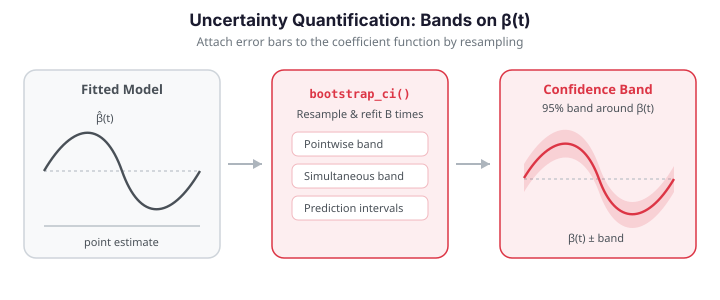

# Uncertainty Quantification

A point estimate of the coefficient function $\hat\beta(t)$ or a single predicted response
$\hat y$ tells you *what* the model believes, but not *how much* to trust it. **Uncertainty
quantification** attaches error bars: a confidence band around $\beta(t)$ that shows where
the predictor genuinely drives the response, and prediction intervals around $\hat y$ that
bracket where a new observation is likely to fall.

`fdars` supports two complementary routes. **Bootstrapping** (`bootstrap_ci_fregre_lm`)
resamples the data to trace the sampling distribution of the whole coefficient function,
producing both pointwise and simultaneous bands. **Analytic prediction intervals**
(`fdars.explain.prediction_intervals`) propagate residual variance through the fitted model
to bracket new responses. Neither requires distributional assumptions beyond the model
itself — for *distribution-free* guarantees, see [conformal prediction](conformal-prediction.md).


{ .fdars-diagram }

```python exec="1" html="1" source="above"
import numpy as np
from docs_fig import fig, render
from fdars.simulation import simulate
from fdars.regression import bootstrap_ci_fregre_lm

np.random.seed(0)
t = np.linspace(0, 1, 60)
X = np.asarray(simulate(n=40, argvals=t, n_basis=6, efun_type="fourier", seed=1))
beta_true = np.sin(2 * np.pi * t)
y = np.trapezoid(X * beta_true, t, axis=1) + 0.3 * np.random.randn(len(X))

ci = bootstrap_ci_fregre_lm(X, y, n_comp=4, n_boot=200, alpha=0.05, seed=1)
center = np.asarray(ci["center"])
lo, hi = np.asarray(ci["lower"]), np.asarray(ci["upper"])
slo, shi = np.asarray(ci["sim_lower"]), np.asarray(ci["sim_upper"])

f, ax = fig()
ax.fill_between(t, slo, shi, color="#3f51b5", alpha=0.12, label="95% simultaneous")
ax.fill_between(t, lo, hi, color="#3f51b5", alpha=0.28, label="95% pointwise")
ax.plot(t, center, color="#3f51b5", lw=2, label=r"$\hat\beta(t)$")
ax.axhline(0, color="#6c757d", lw=1, ls=":")
ax.set(title="Bootstrap confidence band for the coefficient function",
       xlabel="t", ylabel=r"$\beta(t)$")
ax.legend(fontsize=8)
print(render(f))
```

Where the band excludes zero, the predictor's contribution at that $t$ is statistically
distinguishable from none — a functional analogue of a significant coefficient.

## Concepts

**Bootstrap confidence bands.** Refit the model on $B$ resamples of the data to obtain
$\hat\beta^{(1)}(t),\dots,\hat\beta^{(B)}(t)$. At each $t$, the $\alpha/2$ and $1-\alpha/2$
quantiles across the resamples give a **pointwise** band with $1-\alpha$ coverage *at every
fixed $t$*. But a pointwise band under-covers the *whole curve*: the chance that $\beta(t)$
falls inside the band at **all** $t$ simultaneously is well below $1-\alpha$. A
**simultaneous** band widens the interval by a common factor so that the entire true curve
lies inside with probability $1-\alpha$ — the honest choice when you want to make statements
about $\beta$ as a function.

**Prediction intervals.** For a new curve $x^*$, the predicted response
$\hat y^* = \hat\alpha + \int x^*(t)\hat\beta(t)\,dt$ carries two sources of error:
uncertainty in the estimated model and the irreducible noise $\varepsilon$. The prediction
interval

$$
\hat y^* \pm t_{n-p,\,1-\alpha/2}\,\hat\sigma\sqrt{1 + z^{*\top}(Z^\top Z)^{-1}z^*}
$$

accounts for both (the leading $1$ under the root is the noise term), and is therefore wider
than a confidence interval for the mean response.

## Bootstrap bands — `bootstrap_ci_fregre_lm`

```python
import numpy as np
from fdars.simulation import simulate
from fdars.regression import bootstrap_ci_fregre_lm

np.random.seed(0)
t = np.linspace(0, 1, 60)
X = np.asarray(simulate(n=40, argvals=t, n_basis=6, efun_type="fourier", seed=1))
beta_true = np.sin(2 * np.pi * t)
y = np.trapezoid(X * beta_true, t, axis=1) + 0.3 * np.random.randn(len(X))

ci = bootstrap_ci_fregre_lm(X, y, n_comp=4, n_boot=200, alpha=0.05, seed=1)
width = np.asarray(ci["upper"]) - np.asarray(ci["lower"])
print(f"mean pointwise band width: {width.mean():.3f}")
print(f"successful bootstrap fits: {int(ci['n_boot_success'])}")
```

| Parameter | Type | Description |
|-----------|------|-------------|
| `data` | `ndarray (n, m)` | Functional predictors |
| `response` | `ndarray (n,)` | Scalar response |
| `n_comp` | `int` | Number of FPC components |
| `n_boot` | `int` | Bootstrap resamples (default 200) |
| `alpha` | `float` | Miscoverage level; $1-\alpha$ coverage |
| `seed` | `int` | Random seed |

| Return key | Type | Description |
|------------|------|-------------|
| `center` | `ndarray (m,)` | Point estimate $\hat\beta(t)$ |
| `lower`, `upper` | `ndarray (m,)` | Pointwise $1-\alpha$ band |
| `sim_lower`, `sim_upper` | `ndarray (m,)` | Simultaneous $1-\alpha$ band |
| `n_boot_success` | `float` | Number of resamples that fit successfully |

## Prediction intervals — `prediction_intervals`

Given held-out curves, `prediction_intervals` returns a bracketed prediction for each,
using the residual scale and design leverage of the *new* points.

```python
import numpy as np
from fdars.explain import prediction_intervals

# fit on the first 30, predict-with-intervals on the last 10
pi = prediction_intervals(X[:30], y[:30], X[30:], ncomp=4, confidence_level=0.95)
covered = np.mean((y[30:] >= pi["lower"]) & (y[30:] <= pi["upper"]))
print(f"empirical coverage on held-out: {covered:.2f}")
```

| Return key | Type | Description |
|------------|------|-------------|
| `predictions` | `ndarray (n_new,)` | Point predictions $\hat y^*$ |
| `lower`, `upper` | `ndarray (n_new,)` | Prediction interval bounds |
| `prediction_se` | `ndarray (n_new,)` | Standard error of each prediction |
| `confidence_level` | `float` | Nominal coverage |
| `t_critical` | `float` | $t$ quantile used |
| `residual_se` | `float` | Residual scale $\hat\sigma$ |

```python exec="1" html="1"
import numpy as np
from docs_fig import fig, render
from fdars.simulation import simulate
from fdars.explain import prediction_intervals

np.random.seed(0)
t = np.linspace(0, 1, 60)
X = np.asarray(simulate(n=40, argvals=t, n_basis=6, efun_type="fourier", seed=1))
beta_true = np.sin(2 * np.pi * t)
y = np.trapezoid(X * beta_true, t, axis=1) + 0.3 * np.random.randn(len(X))

pi = prediction_intervals(X[:30], y[:30], X[30:], ncomp=4, confidence_level=0.95)
pred = np.asarray(pi["predictions"])
lo, hi = np.asarray(pi["lower"]), np.asarray(pi["upper"])
obs = y[30:]
order = np.argsort(pred)
idx = np.arange(len(pred))

f, ax = fig()
ax.errorbar(idx, pred[order], yerr=[pred[order] - lo[order], hi[order] - pred[order]],
            fmt="o", color="#3f51b5", ecolor="#3f51b5", elinewidth=1.5,
            capsize=3, label="95% prediction interval")
ax.scatter(idx, obs[order], color="#e8710a", s=45, zorder=3, label="observed")
ax.set(title="Prediction intervals on held-out curves",
       xlabel="held-out observation (sorted by prediction)", ylabel="y")
ax.legend(fontsize=8)
print(render(f))
```

### Coverage and width

Two numbers summarize a prediction interval: does it *cover* the truth at the nominal rate,
and how *wide* is it? Parametric intervals widen for high-leverage test points — curves
whose FPC-score profile sits far from the training center — because the leverage term
$z^{*\top}(Z^\top Z)^{-1}z^*$ under the root grows. That variable width is the interval
honestly reporting where the model is extrapolating.

```python exec="1" html="1" source="above"
import numpy as np
from docs_fig import fig, render
from fdars.simulation import simulate
from fdars.explain import prediction_intervals

np.random.seed(0)
t = np.linspace(0, 1, 60)
X = np.asarray(simulate(n=40, argvals=t, n_basis=6, efun_type="fourier", seed=1))
beta_true = np.sin(2 * np.pi * t)
y = np.trapezoid(X * beta_true, t, axis=1) + 0.3 * np.random.randn(len(X))

pi = prediction_intervals(X[:30], y[:30], X[30:], ncomp=4, confidence_level=0.95)
lo, hi = np.asarray(pi["lower"]), np.asarray(pi["upper"])
width = hi - lo
covered = float(np.mean((y[30:] >= lo) & (y[30:] <= hi)))

f, ax = fig()
ax.bar(np.arange(len(width)), width, color="#7b2d8e", alpha=0.75)
ax.set(title=f"Prediction-interval width (coverage = {covered*100:.0f}%, nominal 95%)",
       xlabel="held-out observation", ylabel="interval width")
print(render(f))
```

Empirical coverage lands near the 95% target and the widths vary point-to-point with
leverage. Parametric intervals are *exact* only when the errors are Gaussian; the
[regression diagnostics](regression-diagnostics.md) Q-Q plot is the check that justifies
them.

!!! success "Validation — both intervals cover at their nominal rate"
    A single split is noisy, so we average over many independent draws. (1) The
    **prediction intervals** must cover held-out responses at ~the nominal $1-\alpha$
    rate. (2) The **bootstrap simultaneous band** must contain the *entire* true
    $\beta(t)$ curve at ≥ its nominal rate (it is a conservative, whole-curve guarantee).
    Both assertions run and pass below.

```python exec="1" source="above"
import numpy as np
from fdars.simulation import simulate
from fdars.regression import bootstrap_ci_fregre_lm
from fdars.explain import prediction_intervals

t = np.linspace(0, 1, 60)
beta_true = np.sin(2 * np.pi * t)

# (1) Prediction-interval coverage on held-out data, averaged over 40 draws.
pi_cov = []
for rep in range(40):
    rng = np.random.default_rng(200 + rep)
    X = np.asarray(simulate(n=60, argvals=t, n_basis=6, efun_type="fourier", seed=rep))
    y = np.trapezoid(X * beta_true, t, axis=1) + 0.3 * rng.standard_normal(len(X))
    pi = prediction_intervals(X[:40], y[:40], X[40:], ncomp=4, confidence_level=0.90)
    lo, hi = np.asarray(pi["lower"]), np.asarray(pi["upper"])
    pi_cov.append(float(np.mean((y[40:] >= lo) & (y[40:] <= hi))))
mean_pi_cov = float(np.mean(pi_cov))

# (2) Bootstrap simultaneous band: does it contain the whole true beta(t)?
sim_hits = []
for rep in range(20):
    rng = np.random.default_rng(300 + rep)
    X = np.asarray(simulate(n=60, argvals=t, n_basis=6, efun_type="fourier", seed=rep))
    y = np.trapezoid(X * beta_true, t, axis=1) + 0.3 * rng.standard_normal(len(X))
    ci = bootstrap_ci_fregre_lm(X, y, n_comp=4, n_boot=200, alpha=0.05, seed=rep)
    slo, shi = np.asarray(ci["sim_lower"]), np.asarray(ci["sim_upper"])
    sim_hits.append(bool(np.all((beta_true >= slo) & (beta_true <= shi))))
sim_band_cov = float(np.mean(sim_hits))

print(f"prediction-interval coverage (nominal 0.90) = {mean_pi_cov:.3f}")
print(f"simultaneous-band beta(t) coverage (>=0.95) = {sim_band_cov:.3f}")

assert abs(mean_pi_cov - 0.90) < 0.05, mean_pi_cov
assert sim_band_cov >= 0.95, sim_band_cov
print("validation OK: PI coverage ~= nominal, and the simultaneous band covers beta(t)")
```

The prediction-interval coverage lands within a few points of the 90% target, and the
simultaneous band brackets the *entire* true $\beta(t)$ in every replicate — the honest,
conservative behaviour a whole-curve guarantee should show.

### Parametric vs. distribution-free width

When the Gaussian assumption is shaky, [conformal prediction](conformal-prediction.md)
trades the parametric formula for a calibration step that guarantees coverage regardless of
the error distribution. The split-conformal variant produces a *constant-width* band (one
calibration quantile applied to every test point), which is the visible signature separating
it from the leverage-dependent parametric width.

```python exec="1" html="1" source="above"
import numpy as np
from docs_fig import fig, render
from fdars.simulation import simulate
from fdars.explain import prediction_intervals
from fdars.conformal import conformal_fregre_lm

np.random.seed(0)
t = np.linspace(0, 1, 60)
# Larger sample so the split-conformal calibration set is big enough for a
# finite 90% quantile.
X = np.asarray(simulate(n=80, argvals=t, n_basis=6, efun_type="fourier", seed=1))
beta_true = np.sin(2 * np.pi * t)
y = np.trapezoid(X * beta_true, t, axis=1) + 0.3 * np.random.randn(len(X))

# Both at 90% nominal, fit on the first 60 and predict the last 20.
pi = prediction_intervals(X[:60], y[:60], X[60:], ncomp=4, confidence_level=0.90)
param_w = np.asarray(pi["upper"]) - np.asarray(pi["lower"])
cf = conformal_fregre_lm(X[:60], y[:60], X[60:], ncomp=4, cal_fraction=0.25,
                         alpha=0.10, seed=42)
conf_w = np.asarray(cf["upper"]) - np.asarray(cf["lower"])

f, ax = fig()
ax.boxplot([param_w, conf_w], tick_labels=["parametric", "conformal"])
ax.set(title="Interval width: parametric vs. split conformal (90% nominal)",
       ylabel="interval width")
print(render(f))
```

The conformal widths collapse to a single value; the parametric widths spread out with
leverage. Which you prefer depends on whether you trust the Gaussian model (parametric,
leverage-adaptive) or want a finite-sample guarantee (conformal, assumption-free). Here the
conformal band is actually the tighter of the two on average — the parametric formula inflates
its width to hedge against the Gaussian tails — so the distribution-free option costs nothing
in width on this data.

## Model assessment: leave-one-out CV — `loo_cv_press`

A confidence band tells you about the *coefficient*; leave-one-out cross-validation tells you
about the *model as a whole* — can it predict a point it has never seen? For the linear FPC
model there is no need to refit $n$ times: the hat matrix gives every leave-one-out residual
in closed form,

$$
e_i^{(-i)} = \frac{e_i}{1 - h_{ii}},
$$

which inflates each in-sample residual by $1/(1-h_{ii})$ — a factor that grows with leverage.
Summing their squares gives the PRESS statistic and an out-of-sample $R^2$:

$$
\text{PRESS} = \sum_i \big(e_i^{(-i)}\big)^2, \qquad
R^2_{\text{LOO}} = 1 - \frac{\text{PRESS}}{\text{TSS}}.
$$

```python
from fdars.explain import loo_cv_press

loo = loo_cv_press(X, y, ncomp=4)
print(f"PRESS:   {loo['press']:.3f}")
print(f"LOO R²:  {loo['loo_r_squared']:.3f}")
```

The gap between $R^2_{\text{LOO}}$ and the in-sample $R^2$ measures how optimistic the
training fit is. High-leverage points drive that gap: their LOO residuals inflate most.

```python exec="1" html="1" source="above"
import numpy as np
from docs_fig import fig, render
from fdars.simulation import simulate
from fdars.explain import loo_cv_press

np.random.seed(0)
t = np.linspace(0, 1, 60)
X = np.asarray(simulate(n=40, argvals=t, n_basis=6, efun_type="fourier", seed=1))
beta_true = np.sin(2 * np.pi * t)
y = np.trapezoid(X * beta_true, t, axis=1) + 0.3 * np.random.randn(len(X))

loo = loo_cv_press(X, y, ncomp=4)
loo_res = np.asarray(loo["loo_residuals"])
lev = np.asarray(loo["leverage"])
# in-sample residual = loo_residual * (1 - leverage)
in_res = loo_res * (1 - lev)

f, ax = fig()
lim = [min(in_res.min(), loo_res.min()), max(in_res.max(), loo_res.max())]
ax.plot(lim, lim, color="#6c757d", ls="--", lw=1)
ax.scatter(in_res, loo_res, color="#7b2d8e", s=36, alpha=0.75)
ax.set(title=f"In-sample vs. LOO residuals (LOO R² = {loo['loo_r_squared']:.3f})",
       xlabel="in-sample residual", ylabel="LOO residual")
print(render(f))
```

Points drift off the diagonal exactly where leverage is high — those are the observations the
model leans on to fit itself, and the ones a train/test split would penalize.

| Return key | Type | Description |
|------------|------|-------------|
| `loo_residuals` | `ndarray (n,)` | Leave-one-out residuals $e_i^{(-i)}$ |
| `press` | `float` | Predicted residual sum of squares |
| `loo_r_squared` | `float` | Out-of-sample $R^2$ |
| `leverage` | `ndarray (n,)` | Hat-matrix diagonal $h_{ii}$ |
| `tss` | `float` | Total sum of squares of the response |

!!! tip "Pointwise or simultaneous?"
    Use the **pointwise** band to ask "is $\beta$ nonzero *here*?" at a pre-specified $t$.
    Use the **simultaneous** band whenever you scan the whole curve for regions of
    significance — otherwise multiple-comparison inflation makes spurious excursions look
    real.

!!! note "Bootstrap vs. conformal"
    Bootstrap bands and analytic intervals are only as valid as the model and its noise
    assumptions. [Conformal prediction](conformal-prediction.md) instead wraps any fitted
    model in a calibration step that delivers **finite-sample, distribution-free** coverage —
    at the cost of holding out calibration data. The two are complementary: bootstrap for
    *interpreting* $\beta(t)$, conformal for *guaranteed* predictive coverage.

## Related pages

- [Conformal prediction](conformal-prediction.md) — distribution-free predictive intervals.
- [Regression diagnostics](regression-diagnostics.md) — check for influential points before
  trusting a band.
- [Scalar-on-function regression](scalar-on-function.md) — the underlying model being
  quantified.

## References

- Efron, B., & Tibshirani, R. J. (1993). *An Introduction to the Bootstrap.* Chapman & Hall.
- Ramsay, J. O., & Silverman, B. W. (2005). *Functional Data Analysis* (2nd ed.). Springer.
- Cardot, H., Ferraty, F., & Sarda, P. (2003). *Spline estimators for the functional linear model.* Statistica Sinica, 13(3), 571–591.
- Horváth, L., & Kokoszka, P. (2012). *Inference for Functional Data with Applications.* Springer.
