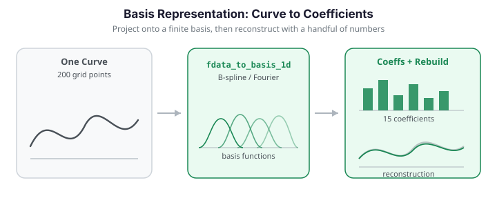

# Basis Representation

Representing functional data in a finite basis -- B-splines, Fourier, or P-splines -- converts a discrete set of evaluations into a compact coefficient vector. This enables smoothing, differentiation, integration, and dimensionality reduction, all while preserving the continuous nature of the underlying functions.


{ .fdars-diagram }

## When to use basis representations

- **Smoothing noisy data** -- P-spline penalties remove high-frequency noise while preserving shape.
- **Dimension reduction** -- a curve with 500 grid points can be faithfully captured by 15-20 basis coefficients.
- **Derivative computation** -- analytic derivatives come for free from the basis expansion.
- **Regularization** -- roughness penalties in the basis domain prevent overfitting in regression.

The core trade-off is resolution versus compression: too few basis functions oversmooth and miss features, too many reproduce noise. The figure below projects one curve onto B-spline bases of increasing size and reconstructs it -- the fit sharpens as the basis grows.

```python exec="1" html="1" source="above"
import numpy as np
from docs_fig import fig, render
from fdars.simulation import simulate
from fdars.basis import fdata_to_basis_1d, basis_to_fdata_1d

t = np.linspace(0, 1, 200)
X = np.asarray(simulate(n=1, argvals=t, n_basis=8, efun_type="fourier", seed=3))

f, ax = fig()
ax.plot(t, X[0], color="#6c757d", lw=1.0, alpha=0.6, label="target curve")
for nb in (4, 8, 20):
    c, actual = fdata_to_basis_1d(X, t, n_basis=nb, basis_type="bspline")
    rec = np.asarray(basis_to_fdata_1d(c, t, n_basis=actual, basis_type="bspline"))
    ax.plot(t, rec[0], lw=1.8, label=f"n_basis = {actual}")
ax.set(title="B-spline reconstruction at increasing basis size",
       xlabel="t", ylabel="X(t)")
ax.legend()
print(render(f))
```

## B-spline vs Fourier basis

| Property | B-spline | Fourier |
|----------|----------|---------|
| Support | Local (compact) | Global |
| Best for | Non-periodic data, local features | Periodic / seasonal data |
| Boundary behavior | Handles edges naturally | Assumes periodicity |
| Derivative stability | Excellent | Excellent |
| Basis count rule of thumb | ~1 per interior knot + order | Must be odd ($2k + 1$) |

### When the basis matters: a non-periodic signal

The choice really bites when the signal is *non-periodic with local features*. Consider a curve built from a polynomial trend, a narrow Gaussian bump, and a one-sided sharp edge -- exactly the kind of structure a global sinusoidal basis struggles with. Selecting the number of basis functions by GCV for each family and reconstructing the curve shows the B-spline winning by a wide margin, while the Fourier fit rings around the bump and the edge (a Gibbs phenomenon).

```python exec="1" html="1" source="above"
import numpy as np
from docs_fig import fig, render
from fdars.basis import basis_nbasis_cv, fdata_to_basis_1d, basis_to_fdata_1d

rng = np.random.default_rng(123)
t = np.linspace(0, 1, 120)

def complex_signal(t):
    trend = 2 * t ** 2 - t
    bump = 0.8 * np.exp(-((t - 0.3) ** 2) / (2 * 0.05 ** 2))   # localized feature
    sharp = 0.5 * np.sqrt(np.maximum(0.0, t - 0.7))            # sharp edge
    return trend + bump + sharp

X = np.array([complex_signal(t) + 0.15 * rng.standard_normal(t.size)
              for _ in range(30)])

# GCV-select the basis count for each family.
cb = basis_nbasis_cv(X, t, nbasis_min=5, nbasis_max=25, basis_type="bspline")
cf = basis_nbasis_cv(X, t, nbasis_min=5, nbasis_max=25, basis_type="fourier")
nb, nf = int(cb["optimal_nbasis"]), int(cf["optimal_nbasis"])

# Reconstruct one curve at each family's optimum.
cbc, ab = fdata_to_basis_1d(X, t, n_basis=nb, basis_type="bspline")
recb = np.asarray(basis_to_fdata_1d(cbc, t, n_basis=ab, basis_type="bspline"))
cfc, af = fdata_to_basis_1d(X, t, n_basis=nf, basis_type="fourier")
recf = np.asarray(basis_to_fdata_1d(cfc, t, n_basis=af, basis_type="fourier"))

f, (a0, a1) = fig(1, 2, figsize=(11, 3.9))
a0.plot(np.asarray(cb["nbasis_range"]), np.asarray(cb["scores"]), "o-",
        color="#3f51b5", label=f"B-spline (min GCV {min(cb['scores']):.3f})")
a0.plot(np.asarray(cf["nbasis_range"]), np.asarray(cf["scores"]), "s-",
        color="#e8710a", label=f"Fourier (min GCV {min(cf['scores']):.3f})")
a0.set(title="GCV vs basis count (lower is better)",
       xlabel="number of basis functions", ylabel="GCV score")
a0.legend()

a1.plot(t, complex_signal(t), color="#6c757d", lw=2, ls="--", label="true signal")
a1.plot(t, recb[0], color="#3f51b5", lw=1.8, label=f"B-spline (K={ab})")
a1.plot(t, recf[0], color="#e8710a", lw=1.8, label=f"Fourier (K={af})")
a1.set(title="B-spline captures the bump; Fourier rings",
       xlabel="t", ylabel="X(t)")
a1.legend()
print(render(f))
```

For this signal the B-spline optimum reaches a markedly lower GCV than the Fourier optimum -- confirming the rule of thumb that local, non-periodic features call for a locally supported basis.

## Quick start: project and reconstruct

```python
import numpy as np
from fdars import Fdata
from fdars.basis import fdata_to_basis_1d, basis_to_fdata_1d

# Simulate some data
argvals = np.linspace(0, 1, 200)
data = np.column_stack([np.sin(2 * np.pi * argvals) + 0.2 * np.random.randn(200)
                        for _ in range(30)]).T  # shape (30, 200)
fd = Fdata(data, argvals=argvals)

# Project onto a B-spline basis with 15 functions
coeffs, actual_nbasis = fdata_to_basis_1d(fd.data, fd.argvals, n_basis=15,
                                           basis_type="bspline")
print(f"Coefficients shape: {coeffs.shape}")   # (30, 15)
print(f"Actual n_basis used: {actual_nbasis}")

# Reconstruct back to the evaluation grid
reconstructed = basis_to_fdata_1d(coeffs, fd.argvals, n_basis=actual_nbasis,
                                   basis_type="bspline")
print(f"Reconstructed shape: {reconstructed.shape}")  # (30, 200)
```

### Fourier basis for periodic data

```python
# Periodic data: use Fourier basis
argvals_p = np.linspace(0, 2 * np.pi, 200)
periodic_data = np.column_stack([
    np.sin(argvals_p) + 0.5 * np.cos(3 * argvals_p) + 0.15 * np.random.randn(200)
    for _ in range(30)
]).T
fd_p = Fdata(periodic_data, argvals=argvals_p)

coeffs_f, nbasis_f = fdata_to_basis_1d(fd_p.data, fd_p.argvals, n_basis=11,
                                         basis_type="fourier")
reconstructed_f = basis_to_fdata_1d(coeffs_f, fd_p.argvals, n_basis=nbasis_f,
                                     basis_type="fourier")
```

## Evaluating basis matrices directly

For advanced use (e.g., building your own penalty matrices), you can evaluate the raw basis matrix.

### B-spline basis

```python
from fdars.basis import bspline_basis

argvals = np.linspace(0, 1, 100)
B = bspline_basis(argvals, nknots=10, order=4)
print(B.shape)  # (100, 14) -- nknots + order = 14 basis functions
```

| Parameter | Description |
|-----------|-------------|
| `argvals` | Evaluation points |
| `nknots` | Number of equally spaced interior knots |
| `order` | Spline order: 4 = cubic (default), 3 = quadratic |

### Fourier basis

```python
from fdars.basis import fourier_basis

argvals = np.linspace(0, 2 * np.pi, 100)
F = fourier_basis(argvals, n_basis=11)
print(F.shape)  # (100, 11)
```

The Fourier basis consists of $1, \sin(\omega t), \cos(\omega t), \sin(2\omega t), \cos(2\omega t), \ldots$ where $\omega = 2\pi / T$ and $T$ is the period (range of `argvals`).

The two basis families look very different: B-splines are local bumps with compact support, while Fourier functions are global sinusoids. This is why B-splines excel at local features and Fourier at periodic signals.

```python exec="1" html="1"
import numpy as np
from docs_fig import fig, render
from fdars.basis import bspline_basis, fourier_basis

f, (a0, a1) = fig(1, 2, figsize=(10, 3.8))

tb = np.linspace(0, 1, 200)
B = np.asarray(bspline_basis(tb, nknots=6, order=4))
a0.plot(tb, B, lw=1.4)
a0.set(title=f"B-spline basis ({B.shape[1]} local functions)",
       xlabel="t", ylabel="$B_j(t)$")

tf = np.linspace(0, 2 * np.pi, 200)
F = np.asarray(fourier_basis(tf, n_basis=7))
a1.plot(tf, F, lw=1.4)
a1.set(title="Fourier basis (7 global functions)",
       xlabel="t", ylabel="$F_j(t)$")
print(render(f))
```

!!! info "Fourier n_basis"
    `n_basis` should be odd. If an even value is given, it will be adjusted to the next odd number so the basis contains matched sine-cosine pairs plus the constant function.

## P-spline smoothing

P-splines combine a rich B-spline basis with a discrete roughness penalty on the coefficients. The penalty parameter $\lambda$ controls the trade-off between fit and smoothness.

$$
\hat{\mathbf{c}} = \arg\min_{\mathbf{c}} \left\| \mathbf{y} - B\mathbf{c} \right\|^2 + \lambda \left\| D^d \mathbf{c} \right\|^2
$$

where $B$ is the B-spline basis matrix, $D^d$ is the $d$-th order difference matrix, and $\lambda \ge 0$.

### Fixed lambda

```python
from fdars.basis import pspline_fit_1d

result = pspline_fit_1d(fd.data, fd.argvals, n_basis=25, lambda_=1e-2, order=2)

print(result.keys())
# dict_keys(['fitted', 'coefficients', 'edf', 'rss', 'gcv', 'aic', 'bic'])
```

| Key | Description |
|-----|-------------|
| `fitted` | Smoothed curves, shape (n, m) |
| `coefficients` | B-spline coefficients, shape (n, n_basis) |
| `edf` | Effective degrees of freedom |
| `rss` | Residual sum of squares |
| `gcv` | Generalized cross-validation score |
| `aic` | Akaike information criterion |
| `bic` | Bayesian information criterion |

### Automatic lambda via GCV

When you do not know the right smoothing level, let GCV choose:

```python
from fdars.basis import pspline_fit_gcv

result = pspline_fit_gcv(fd.data, fd.argvals, n_basis=25, order=2)
print(f"GCV score: {result['gcv']:.6f}")
print(f"Effective degrees of freedom: {result['edf']:.1f}")
```

!!! tip "Choosing n_basis for P-splines"
    With P-splines the exact number of basis functions matters less because the penalty controls smoothness. A safe rule is to use a generous basis (e.g., 20-40 functions for 100-500 grid points) and rely on $\lambda$ to prevent overfitting.

### Comparing smoothing levels

The penalty $\lambda$ interpolates between an unpenalized (wiggly) B-spline fit and a nearly-linear fit. Sweeping it over several orders of magnitude on a noisy sinusoid shows the effect directly, with the effective degrees of freedom shrinking as $\lambda$ grows.

```python exec="1" html="1" source="above"
import numpy as np
from docs_fig import fig, render
from fdars.basis import pspline_fit_1d

rng = np.random.default_rng(11)
t = np.linspace(0, 1, 120)
true = np.sin(2 * np.pi * t) + 0.5 * np.sin(4 * np.pi * t)
X = np.array([true + 0.3 * rng.standard_normal(t.size) for _ in range(30)])

f, axes = fig(1, 4, figsize=(14, 3.4), sharey=True)
for ax, lam in zip(axes, [1e-4, 1e-2, 1.0, 1e2]):
    res = pspline_fit_1d(X, t, n_basis=25, lambda_=lam, order=2)
    ax.plot(t, X[0], ".", ms=2, alpha=0.35, color="#6c757d", label="raw")
    ax.plot(t, np.asarray(res["fitted"])[0], color="#dc3545", lw=2,
            label=f"edf={res['edf']:.1f}")
    ax.set(title=f"$\\lambda$ = {lam:.0e}", xlabel="t")
    ax.legend(fontsize=8)
axes[0].set_ylabel("X(t)")
print(render(f))
```

## Automatic basis selection

`select_basis_auto_1d` jointly selects:

1. **Basis type** -- B-spline or Fourier (optionally using an FFT-based seasonality hint).
2. **Number of basis functions** -- optimizing GCV, AIC, or BIC.
3. **P-spline penalty** -- when using B-splines.

```python
from fdars.basis import select_basis_auto_1d

selections = select_basis_auto_1d(fd.data, fd.argvals, criterion="gcv")

# Each element corresponds to one curve
for i, sel in enumerate(selections[:3]):
    print(f"Curve {i}: basis={sel['basis_type']}, nbasis={sel['nbasis']}, "
          f"score={sel['score']:.4f}, seasonal={sel['seasonal_detected']}")
```

| Parameter | Default | Description |
|-----------|---------|-------------|
| `criterion` | `"gcv"` | `"gcv"`, `"aic"`, or `"bic"` |
| `nbasis_min` | 0 (auto) | Lower bound for basis count search |
| `nbasis_max` | 0 (auto) | Upper bound for basis count search |
| `lambda_pspline` | -1.0 (auto) | P-spline penalty; negative triggers GCV selection |
| `use_seasonal_hint` | `True` | Use FFT to detect periodicity and prefer Fourier |

Each element of the returned list is a dict with:

| Key | Description |
|-----|-------------|
| `basis_type` | `"bspline"` or `"fourier"` |
| `nbasis` | Optimal number of basis functions |
| `score` | Information criterion score |
| `coefficients` | Basis coefficients for this curve |
| `fitted` | Fitted values for this curve |
| `edf` | Effective degrees of freedom |
| `seasonal_detected` | Whether the FFT hint detected periodicity |
| `lambda_val` | Selected P-spline penalty (if B-spline) |

## Cross-validated basis count

When you want to fix the basis type and only search over the number of basis functions:

```python
from fdars.basis import basis_nbasis_cv

cv_result = basis_nbasis_cv(
    fd.data, fd.argvals,
    nbasis_min=4,
    nbasis_max=30,
    basis_type="bspline",
    criterion="gcv",
    n_folds=5,
    lambda_=1.0,
)

print(f"Optimal n_basis: {cv_result['optimal_nbasis']}")
print(f"Criterion used:  {cv_result['criterion']}")
```

### Plotting the CV curve

```python
nbasis_range = cv_result["nbasis_range"]
scores = cv_result["scores"]

plt.figure(figsize=(7, 4))
plt.plot(nbasis_range, scores, "o-", color="steelblue")
plt.axvline(cv_result["optimal_nbasis"], ls="--", color="coral",
            label=f"Optimal = {cv_result['optimal_nbasis']}")
plt.xlabel("Number of basis functions")
plt.ylabel(f"{cv_result['criterion'].upper()} score")
plt.title("Basis count selection")
plt.legend()
plt.tight_layout()
plt.show()
```

## Information criteria reference

| Criterion | Formula | Tends to select |
|-----------|---------|-----------------|
| GCV | $\displaystyle\frac{n^{-1}\,\text{RSS}}{(1 - \text{edf}/n)^2}$ | Moderate smoothness |
| AIC | $n\log(\text{RSS}/n) + 2\,\text{edf}$ | Slightly more complex models |
| BIC | $n\log(\text{RSS}/n) + \log(n)\,\text{edf}$ | Simpler (sparser) models |

!!! note "GCV vs CV"
    GCV is a leave-one-out cross-validation approximation that avoids refitting. For small samples, explicit $k$-fold CV (set `criterion="cv"` in `basis_nbasis_cv`) may be more reliable.

## Comparing the smoothing approaches

The three routes -- a fixed basis, a CV-selected basis count, and a P-spline with GCV-selected penalty -- can be run side by side. On noisy sinusoidal data, the CV-optimal basis and the P-spline both recover the underlying signal closely, while a too-small fixed basis oversmooths.

```python exec="1" html="1" source="above"
import numpy as np
from docs_fig import fig, render
from fdars.basis import (fdata_to_basis_1d, basis_to_fdata_1d,
                         basis_nbasis_cv, pspline_fit_gcv)

rng = np.random.default_rng(7)
t = np.linspace(0, 1, 150)
true = np.sin(2 * np.pi * t) + 0.5 * np.sin(4 * np.pi * t)
X = np.array([true + 0.3 * rng.standard_normal(t.size) for _ in range(30)])

# 1. Fixed small Fourier basis.
c5, n5 = fdata_to_basis_1d(X, t, n_basis=5, basis_type="fourier")
fix = np.asarray(basis_to_fdata_1d(c5, t, n_basis=n5, basis_type="fourier"))

# 2. CV-selected Fourier basis count.
cv = basis_nbasis_cv(X, t, nbasis_min=5, nbasis_max=21, basis_type="fourier")
kcv = int(cv["optimal_nbasis"])
ccv, ncv = fdata_to_basis_1d(X, t, n_basis=kcv, basis_type="fourier")
cvfit = np.asarray(basis_to_fdata_1d(ccv, t, n_basis=ncv, basis_type="fourier"))

# 3. P-spline with GCV-selected lambda.
ps = pspline_fit_gcv(X, t, n_basis=25, order=2)
psfit = np.asarray(ps["fitted"])

f, ax = fig()
ax.plot(t, X[0], ".", ms=2, alpha=0.3, color="#6c757d", label="observed")
ax.plot(t, true, color="k", lw=1.6, ls="--", label="true signal")
ax.plot(t, fix[0], color="#0dcaf0", lw=1.6, label=f"fixed Fourier (K={n5})")
ax.plot(t, cvfit[0], color="#198754", lw=1.6, label=f"CV Fourier (K={ncv})")
ax.plot(t, psfit[0], color="#6f42c1", lw=1.6, label="P-spline (GCV λ)")
ax.set(title="Fixed vs CV-selected basis vs P-spline", xlabel="t", ylabel="X(t)")
ax.legend(fontsize=8)
print(render(f))
```

## Recommendations

| Situation | Recommended approach |
|-----------|----------------------|
| Periodic data | Fourier basis with GCV-selected `n_basis` |
| Non-periodic data with local features | B-spline basis with GCV-selected `n_basis` |
| Heavy noise | P-splines with automatic $\lambda$ (`pspline_fit_gcv`) |
| Fast processing | Fixed basis type and count (`fdata_to_basis_1d`) |
| Don't know the family | `select_basis_auto_1d` (chooses type + count) |
| Robust selection | `basis_nbasis_cv` with `criterion="cv"` and `n_folds` |

## API summary

| Function | Description |
|----------|-------------|
| `fdata_to_basis_1d(data, argvals, n_basis, basis_type)` | Project curves onto a basis |
| `basis_to_fdata_1d(coeffs, argvals, n_basis, basis_type)` | Reconstruct curves from coefficients |
| `bspline_basis(argvals, nknots, order)` | Evaluate raw B-spline basis matrix |
| `fourier_basis(argvals, n_basis)` | Evaluate raw Fourier basis matrix |
| `pspline_fit_1d(data, argvals, n_basis, lambda_, order)` | P-spline fit with fixed $\lambda$ |
| `pspline_fit_gcv(data, argvals, n_basis, order)` | P-spline fit with GCV-selected $\lambda$ |
| `select_basis_auto_1d(data, argvals, ...)` | Automatic basis type + count selection |
| `basis_nbasis_cv(data, argvals, ...)` | Cross-validated basis count selection |
| `smooth_basis_gcv(data, argvals, n_basis, ...)` | Basis smoothing with GCV penalty selection |

All functions are imported from `fdars.basis`.

## References

- Ramsay, J.O., Silverman, B.W. (2005). *Functional Data Analysis*, 2nd ed. Springer.
- Eilers, P.H.C., Marx, B.D. (1996). *Flexible smoothing with B-splines and penalties.* Statistical Science 11(2), 89-121.
- de Boor, C. (1978). *A Practical Guide to Splines.* Springer.
- Craven, P., Wahba, G. (1979). *Smoothing noisy data with spline functions: estimating the correct degree of smoothing by the method of generalized cross-validation.* Numerische Mathematik 31(4), 377-403.
