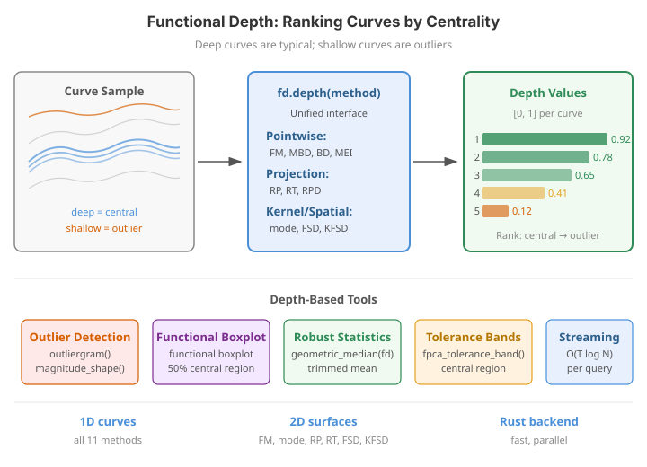

# Depth Functions

Depth functions generalize the notion of quantiles and ranks to functional data. A depth measure assigns each curve a real number indicating how "central" it is relative to a reference sample. The deepest curve is the **functional median** -- a robust location estimator. Curves with low depth are potential outliers.


{ .fdars-diagram }

```python exec="1" html="1" source="above"
import numpy as np
from docs_fig import fig, render
from fdars.simulation import simulate
from fdars.depth import modified_band_1d

t = np.linspace(0, 1, 120)
X = np.asarray(simulate(n=30, argvals=t, n_basis=6, efun_type="fourier", seed=1))
depth = np.asarray(modified_band_1d(X, X))        # self-depth of each curve
order = np.argsort(depth)
rng = np.ptp(depth) + 1e-9

f, ax = fig()
for i in order:                                    # faint = shallow, bold = deep
    ax.plot(t, X[i], color="#3f51b5", lw=1.2,
            alpha=0.15 + 0.75 * (depth[i] - depth.min()) / rng)
ax.plot(t, X[order[-1]], color="#e8710a", lw=2.6, label="functional median")
ax.set(title="30 curves shaded by modified band depth",
       xlabel="t", ylabel="X(t)")
ax.legend()
print(render(f))
```

The opacity encodes depth: the boldest curve (orange) is the deepest one, the functional median, and it threads through the middle of the bundle. The faint curves at the top and bottom edges have the lowest depth -- they are the peripheral, potentially outlying trajectories.

## Concepts

Given a sample of curves $X_1(t), \ldots, X_n(t)$, a functional depth $D(X_i \mid X_1, \ldots, X_n) \in [0, 1]$ satisfies:

- **Maximality at center**: the depth is maximized at some notion of center.
- **Monotonicity from center**: moving a curve away from the center decreases its depth.
- **Vanishing at infinity**: extreme curves have depth approaching zero.

The **functional median** is the observation with the largest depth:

$$
\hat{X}_{\mathrm{med}} = X_{i^*}, \quad i^* = \arg\max_i D(X_i \mid X_1, \ldots, X_n)
$$

!!! success "Validation: depth range and centrality of the median"

    The two properties every depth must satisfy are checked below. **(1)** All depth values
    lie in $[0,1]$, for the three fastest measures. **(2)** The functional median (the
    deepest curve, and exactly what `Fdata.depth("modified_band")` selects via `argmax`) is
    genuinely *central*: it sits far closer to the pointwise sample median than the
    shallowest curve does. Here the deepest curve's $L^2$ distance to the pointwise median
    is roughly a third of the shallowest curve's -- consistent with the "maximality at
    center" axiom. All assertions pass.

```python exec="1" source="above"
import numpy as np
from fdars import Fdata
from fdars.simulation import simulate
from fdars.depth import modified_band_1d, fraiman_muniz_1d, band_1d

t = np.linspace(0, 1, 120)
X = np.asarray(simulate(n=30, argvals=t, n_basis=6, efun_type="fourier", seed=1))

# (1) Depth values live in [0, 1].
for name, fn in [("MBD", modified_band_1d), ("FM", fraiman_muniz_1d),
                 ("BD", band_1d)]:
    d = np.asarray(fn(X, X))
    assert d.min() >= -1e-9 and d.max() <= 1 + 1e-9, (name, d.min(), d.max())
    print(f"{name}: depth in [{d.min():.3f}, {d.max():.3f}] -- inside [0, 1]")

# (2) The deepest curve = functional median = the most central curve.
fd = Fdata(X, argvals=t)
depth = np.asarray(fd.depth("modified_band"))
assert np.argmax(depth) == np.argmax(np.asarray(modified_band_1d(X, X)))
med = np.median(X, axis=0)                       # pointwise sample median
l2 = lambda a: float(np.sqrt(np.mean((a - med) ** 2)))
d_deep = l2(X[np.argmax(depth)])
d_shallow = l2(X[np.argmin(depth)])
assert d_deep < d_shallow, (d_deep, d_shallow)
print(f"median curve dist to pointwise median {d_deep:.3f} "
      f"<< shallowest {d_shallow:.3f}")
```

The printout shows all three measures return values inside $[0,1]$, and the deepest curve lands several times closer to the pointwise median than the shallowest -- concrete confirmation of the maximality-at-center property.

## Available depth measures

All depth functions live in `fdars.depth` and share a common interface:

```python
from fdars.depth import fraiman_muniz_1d  # example

depths = fraiman_muniz_1d(data, ref_data)
```

| Parameter | Type | Description |
|-----------|------|-------------|
| `data` | `np.ndarray` (n, m) | Curves to evaluate |
| `ref_data` | `np.ndarray` (n_ref, m) | Reference sample (often the same as `data`) |

The return value is always a 1D array of length `n` with depth values.

!!! tip "Self-depth"
    To rank observations within their own sample, pass the same array as both `data` and `ref_data`:
    ```python
    depths = fraiman_muniz_1d(data, data)
    ```

---

### Fraiman-Muniz depth

```python
from fdars.depth import fraiman_muniz_1d

depths = fraiman_muniz_1d(data, ref_data, scale=True)
```

Integrates univariate depth (based on the empirical CDF) across the domain:

$$
D_{\mathrm{FM}}(X) = \int_0^1 D_1\bigl(X(t) \mid X_1(t), \ldots, X_n(t)\bigr)\,dt
$$

where $D_1$ is the univariate simplicial depth $D_1(x) = 2 \min\bigl(F_n(x),\, 1 - F_n(x)\bigr)$.

| Parameter | Default | Description |
|-----------|---------|-------------|
| `scale` | `True` | Normalize depth values to $[0, 1]$ |

---

### Modified Band Depth

```python
from fdars.depth import modified_band_1d

depths = modified_band_1d(data, ref_data)
```

Measures the proportion of time a curve lies within the band formed by pairs of reference curves. More robust than band depth because it uses the proportion of time inside the band rather than requiring full containment.

$$
D_{\mathrm{MBD}}(X) = \binom{n}{2}^{-1} \sum_{i < j} \lambda\bigl\{t : X_{(i)}(t) \le X(t) \le X_{(j)}(t)\bigr\}
$$

where $\lambda$ denotes the proportion of the domain.

---

### Band Depth

```python
from fdars.depth import band_1d

depths = band_1d(data, ref_data)
```

The "strict" version of modified band depth: a curve gets credit only if it is **entirely** contained within the band formed by a pair of reference curves. This makes it more sensitive to outlying segments.

---

### Modified Epigraph Index

```python
from fdars.depth import modified_epigraph_index_1d

depths = modified_epigraph_index_1d(data, ref_data)
```

Measures the proportion of curves in the reference sample that lie above the evaluated curve at each time point, integrated over the domain. Useful for detecting magnitude outliers.

---

### Random Projection Depth

```python
from fdars.depth import random_projection_1d

depths = random_projection_1d(data, ref_data, n_proj=50)
```

Projects functional data onto random directions and averages univariate depth over many projections. Computationally efficient and consistent for detecting outliers in high dimensions.

| Parameter | Default | Description |
|-----------|---------|-------------|
| `n_proj` | `50` | Number of random projections |

---

### Random Tukey Depth

```python
from fdars.depth import random_tukey_1d

depths = random_tukey_1d(data, ref_data, n_proj=50)
```

Similar to random projection depth but uses Tukey (halfspace) depth for each univariate projection. More robust to skewed distributions.

| Parameter | Default | Description |
|-----------|---------|-------------|
| `n_proj` | `50` | Number of random projections |

---

### Modal Depth

```python
from fdars.depth import modal_1d

depths = modal_1d(data, ref_data, h=1.0)
```

Measures depth based on the local density of curves. The curve at the mode of the distribution has the highest modal depth.

$$
D_{\mathrm{modal}}(X) = \frac{1}{n} \sum_{j=1}^{n} K_h\bigl(\|X - X_j\|\bigr)
$$

where $K_h$ is a kernel function with bandwidth $h$.

| Parameter | Default | Description |
|-----------|---------|-------------|
| `h` | `1.0` | Kernel bandwidth -- smaller values give sharper depth |

!!! warning "Bandwidth selection"
    The bandwidth `h` strongly affects results. A value too small yields noisy depth values; too large makes all depths similar. Experiment with different values or use the $L^2$ norm of your data to calibrate.

---

### Functional Spatial Depth

```python
from fdars.depth import functional_spatial_1d

depths = functional_spatial_1d(data, ref_data, argvals=None)
```

Extension of multivariate spatial depth to functions. Based on the average spatial sign function:

$$
D_{\mathrm{sp}}(X) = 1 - \left\| \frac{1}{n} \sum_{j=1}^{n} S(X - X_j) \right\|
$$

where $S(f) = f / \|f\|$ is the spatial sign.

| Parameter | Default | Description |
|-----------|---------|-------------|
| `argvals` | `None` | Evaluation points; if `None`, uses a uniform grid on $[0, 1]$ |

---

### Kernel Functional Spatial Depth

```python
from fdars.depth import kernel_functional_spatial_1d

depths = kernel_functional_spatial_1d(data, ref_data, argvals, h=1.0)
```

A kernelized version of functional spatial depth that adds local weighting. Useful when the sample has heterogeneous density.

| Parameter | Default | Description |
|-----------|---------|-------------|
| `argvals` | (required) | Evaluation points |
| `h` | `1.0` | Kernel bandwidth |

---

## 2D variants for surfaces

All depth measures that support surfaces (bivariate functional data) have `_2d` counterparts:

```python
from fdars.depth import (
    fraiman_muniz_2d,
    modal_2d,
    random_projection_2d,
    random_tukey_2d,
    functional_spatial_2d,
    kernel_functional_spatial_2d,
)
```

For 2D data, `data` and `ref_data` are still 2D NumPy arrays of shape `(n, m)`, where each row is a flattened surface observed on a product grid.

## Comparison table

| Depth measure | Speed | Outlier sensitivity | Shape sensitive | Parameters |
|:---|:---:|:---:|:---:|:---|
| Fraiman-Muniz | Fast | Moderate | Low | `scale` |
| Modified Band | Fast | Good | Low | -- |
| Band | Fast | High | Low | -- |
| Modified Epigraph | Fast | Good (magnitude) | Low | -- |
| Random Projection | Moderate | Good | Moderate | `n_proj` |
| Random Tukey | Moderate | Very good | Moderate | `n_proj` |
| Modal | Moderate | Excellent | High | `h` |
| Functional Spatial | Moderate | Good | Moderate | `argvals` |
| Kernel Func. Spatial | Moderate | Very good | High | `argvals`, `h` |

!!! note "Which depth to choose?"
    - **General purpose**: Modified Band Depth (MBD) is the most widely used.
    - **Magnitude outliers**: Modified Epigraph Index or Fraiman-Muniz.
    - **Shape outliers**: Modal depth or Random Tukey.
    - **Skewed distributions**: Random Tukey depth handles asymmetry better.
    - **Speed priority**: Fraiman-Muniz and MBD scale well with $n$.

## How the measures respond to magnitude vs shape outliers

A useful stress test is a clean sample of curves with two deliberately planted anomalies: a **magnitude** outlier (the same shape, shifted vertically) and a **shape** outlier (a different frequency at the same level). A good depth assigns low values to both. The panel below runs seven measures on such a sample and marks the two outliers -- every method flags the magnitude outlier hard, while the pointwise measures (FM, MEI) are comparatively lenient on the shape outlier and the derivative/projection-aware ones separate it better.

```python exec="1" html="1" source="above"
import numpy as np
from matplotlib.patches import Patch
from docs_fig import fig, render
from fdars.depth import (fraiman_muniz_1d, modified_band_1d, band_1d,
                         modified_epigraph_index_1d, random_projection_1d,
                         random_tukey_1d, modal_1d)

rng = np.random.default_rng(1)
t = np.linspace(0, 1, 100)
n = 30
X = np.array([np.sin(2 * np.pi * t) + rng.normal(0, 0.2)
              + 0.05 * rng.standard_normal(t.size) for _ in range(n)])
X[-2] = np.sin(2 * np.pi * t) + 2.5      # magnitude outlier
X[-1] = np.cos(4 * np.pi * t)            # shape outlier

methods = {
    "FM": np.asarray(fraiman_muniz_1d(X, X)),
    "MBD": np.asarray(modified_band_1d(X, X)),
    "BD": np.asarray(band_1d(X, X)),
    "MEI": np.asarray(modified_epigraph_index_1d(X, X)),
    "RP": np.asarray(random_projection_1d(X, X, n_proj=50)),
    "RT": np.asarray(random_tukey_1d(X, X, n_proj=50)),
    "modal": np.asarray(modal_1d(X, X, h=1.0)),
}

types = ["normal"] * n
types[-2], types[-1] = "magnitude", "shape"
color = {"normal": "#3f51b5", "magnitude": "#dc3545", "shape": "#e8710a"}

f, axes = fig(2, 4, figsize=(13, 5.5))
axes = axes.ravel()
for ax, (name, dep) in zip(axes, methods.items()):
    ax.bar(np.arange(n), dep, color=[color[c] for c in types], width=0.9)
    ax.set(title=name, xticks=[])
    ax.set_ylabel("depth", fontsize=8)
axes[-1].axis("off")
axes[-1].legend(handles=[Patch(color=color[k], label=k)
    for k in ("normal", "magnitude", "shape")], loc="center")
print(render(f))
```

Across all seven panels the red bar (magnitude outlier) is driven to near-zero depth -- every measure catches a vertical shift easily. The orange bar (shape outlier) is where they differ: the pointwise measures FM and MEI leave it only mildly shallow, while the projection- and band-based measures (RP, RT, BD) push it much lower, confirming that shape anomalies need projection- or band-aware depths.

## Depth-weighted robust mean

Because depth down-weights peripheral curves, using it as a weight vector yields a mean that resists outliers -- the functional analogue of a weighted average that discounts extreme observations. Compare a plain mean, pulled upward by a magnitude outlier, against a depth-weighted mean:

```python exec="1" html="1" source="above"
import numpy as np
from docs_fig import fig, render
from fdars.depth import modified_band_1d

rng = np.random.default_rng(4)
t = np.linspace(0, 1, 120)
n = 40
X = np.array([np.sin(2 * np.pi * t) + rng.normal(0, 0.2)
              + 0.05 * rng.standard_normal(t.size) for _ in range(n)])
X[0] = np.sin(2 * np.pi * t) + 3.0        # one big magnitude outlier

dep = np.asarray(modified_band_1d(X, X))
w = dep / dep.sum()

simple_mean = X.mean(axis=0)
weighted_mean = np.average(X, axis=0, weights=w)

f, ax = fig()
ax.plot(t, X.T, color="#6c757d", lw=0.6, alpha=0.3)
ax.plot(t, np.sin(2 * np.pi * t), color="#198754", lw=1.6, ls="--",
        label="true signal")
ax.plot(t, simple_mean, color="k", lw=2, label="simple mean")
ax.plot(t, weighted_mean, color="#3f51b5", lw=2, label="depth-weighted mean")
ax.set(title="A single outlier lifts the plain mean; depth weighting resists it",
       xlabel="t", ylabel="X(t)")
ax.legend()
print(render(f))
```

The plain black mean is visibly lifted off the true green signal by the single magnitude outlier, whereas the depth-weighted blue mean stays glued to the truth. Because the outlier receives near-zero depth, it contributes almost nothing to the weighted average.

## Complete example: functional median and depth-based ordering

Three depth measures on one contaminated sample give three depth *orderings*. Colouring every curve by its depth (bright = deep) and dashing the two shallowest shows that all three agree on the injected outliers, but the exact ranking of the merely-peripheral curves differs between measures.

```python exec="1" html="1" source="above"
import numpy as np
import matplotlib.pyplot as plt
from docs_fig import fig, render
from fdars import Fdata
from fdars.simulation import simulate

argvals = np.linspace(0, 1, 150)
data = np.asarray(simulate(n=50, argvals=argvals, n_basis=5, seed=42))
data[0] += 3.0                                   # magnitude outlier up
data[1] -= 2.5                                   # magnitude outlier down
fd = Fdata(data, argvals=argvals)

depths_mbd = np.asarray(fd.depth("modified_band"))
depths_fm = np.asarray(fd.depth("fraiman_muniz"))
depths_rt = np.asarray(fd.depth("random_tukey"))

f, axes = fig(1, 3, figsize=(13, 4))
for ax, depths, name in zip(axes, [depths_mbd, depths_fm, depths_rt],
                            ["MBD", "Fraiman-Muniz", "Random Tukey"]):
    order = np.argsort(depths)                    # low depth first (outliers)
    for i in order:
        c = plt.cm.viridis(depths[i] / depths.max())
        ax.plot(argvals, data[i], color=c, alpha=0.5, lw=0.8)
    med = int(np.argmax(depths))
    ax.plot(argvals, data[med], "r-", lw=2.5, label=f"median (#{med})")
    for out_idx in order[:2]:
        ax.plot(argvals, data[out_idx], "k--", lw=1.5, alpha=0.7)
    ax.set(title=name, xlabel="t")
    ax.legend(fontsize=8)
print(render(f))
```

All three measures pick the same red median curve in the centre of the bundle and dash the same two injected outliers, so the deepest and shallowest curves are robust to the choice of depth. The colour gradient of the intermediate curves differs slightly, reflecting how each measure trades off magnitude against shape.

## Modal depth and the bandwidth `h`

Modal depth is the one measure with a free tuning knob, the kernel bandwidth $h$. Sweeping $h$ shows its effect directly: a small bandwidth makes the depth ranking sharp and local (only near-identical curves count as deep), while a large bandwidth flattens the ranking until almost every curve looks equally central.

```python exec="1" html="1" source="above"
import numpy as np
from docs_fig import fig, render
from fdars.simulation import simulate
from fdars.depth import modal_1d

t = np.linspace(0, 1, 100)
X = np.asarray(simulate(n=40, argvals=t, n_basis=6, efun_type="fourier", seed=3))
X[0] += 2.5                                       # a clear outlier

f, ax = fig(figsize=(7, 4))
for h in (0.25, 0.5, 1.0, 2.0):
    d = np.asarray(modal_1d(X, X, h=h))
    d = d / d.max()                               # normalize to compare shapes
    ax.plot(np.sort(d)[::-1], lw=1.8, label=f"h = {h}")
ax.set(title="Sorted modal depth for increasing bandwidth h",
       xlabel="rank (deep -> shallow)", ylabel="depth (normalized)")
ax.legend()
print(render(f))
```

Small bandwidths give a steep curve -- depth falls off quickly from the mode, so only a few curves score high and the outlier is sharply isolated. As $h$ grows the curve flattens toward a constant, the classic under-resolved regime where every curve looks equally deep and outliers stop standing out.

## Depth for outlier detection

Low depth values flag potential outliers. A common rule uses the boxplot of depth values:

```python
# Outlier detection via depth
q1 = np.percentile(depths_mbd, 25)
iqr = np.percentile(depths_mbd, 75) - q1
threshold = q1 - 1.5 * iqr

outlier_mask = depths_mbd < threshold
print(f"Detected outliers: {np.where(outlier_mask)[0]}")
```

!!! tip "Formal outlier detection"
    For production outlier detection, see the [Outlier Detection](../analyze/outlier-detection.md) guide which covers the functional boxplot, outliergram, and magnitude-shape plot -- all built on depth functions.

## Using depth as features

Depth values can serve as features for classification or as weights for robust estimation:

```python
# Weighted mean (depth-weighted, robust to outliers)
weights = depths_mbd / depths_mbd.sum()
robust_mean = np.average(fd.data, axis=0, weights=weights)
```

## API summary

| Function | Extra parameters | Description |
|----------|-----------------|-------------|
| `fraiman_muniz_1d(data, ref_data, scale)` | `scale=True` | Integrated univariate depth |
| `modified_band_1d(data, ref_data)` | -- | Proportion of time inside bands |
| `band_1d(data, ref_data)` | -- | Full containment in bands |
| `modified_epigraph_index_1d(data, ref_data)` | -- | Epigraph-based depth |
| `random_projection_1d(data, ref_data, n_proj)` | `n_proj=50` | Averaged projected depth |
| `random_tukey_1d(data, ref_data, n_proj)` | `n_proj=50` | Projected Tukey halfspace depth |
| `modal_1d(data, ref_data, h)` | `h=1.0` | Kernel-based modal depth |
| `functional_spatial_1d(data, ref_data, argvals)` | `argvals=None` | Spatial sign depth |
| `kernel_functional_spatial_1d(data, ref_data, argvals, h)` | `argvals`, `h=1.0` | Kernelized spatial depth |

All `_1d` variants have `_2d` counterparts for surface data, imported from the same `fdars.depth` module.

## New depth measures (v6.0)

`fdars.depth` exposes a unified entry point `functional_depth(data, method=...)` that accepts all 13 depth-method strings — the 4 classic individual-function variants plus the 9 new measures below. For `method="fraiman_muniz"` the `scale` parameter controls standardisation; for `method="random_projection"` the `nproj` (default 50) and `seed` parameters control the random projection count and RNG seed.

### Method reference

| Method string | Interpretation | Parameters |
|---|---|---|
| `"hypograph_index"` | Proportion of sample curves **below** the reference curve at each point, averaged over the domain | — |
| `"modified_hypograph_index"` | Hypograph index smoothed by weighting near-boundary points less | — |
| `"epigraph_index"` | Proportion of sample curves **above** the reference curve, averaged over the domain | — |
| `"half_region"` | Proportion of time the reference curve lies within the hypograph **or** epigraph of each sample curve, maximised | — |
| `"modified_half_region"` | Half-region depth with a modified (smoothed) boundary treatment | — |
| `"extremal"` | Proportion of the sample that is at least as extreme as the reference curve in every direction | — |
| `"extreme_rank_length"` | Extreme-rank-length depth: length of time spent inside the central band weighted by rank | — |
| `"l_infinity"` | $L^\infty$ depth: closeness to the sample maximum deviation, rescaled to $[0,1]$ | — |
| `"total_variation"` | Proportion of time a reference curve's derivative stays within the sample derivative band | — |

### Hypograph vs epigraph asymmetry

The hypograph index and epigraph index measure **opposite things**:

- **Hypograph index**: high value → many curves above the reference (reference is near the bottom of the bundle).
- **Epigraph index**: high value → many curves below the reference (reference is near the top of the bundle).

These two indices are not symmetric in general unless the distribution of curves is itself symmetric. A curve at the bottom of the bundle will score **high on hypograph** (most curves are above it) and **low on epigraph** (few curves are below it). See [Outlier Detection](../analyze/outlier-detection.md) for a visual illustration.

### Example: all 9 new methods on a contaminated sample

```python exec="1" source="above"
import numpy as np
from fdars.simulation import simulate
from fdars.depth import functional_depth

rng = np.random.default_rng(7)
t = np.linspace(0, 1, 80)
X = np.asarray(simulate(n=25, argvals=t, n_basis=5, seed=7))
X[0] += 2.5  # magnitude outlier

new_methods = [
    "hypograph_index", "modified_hypograph_index", "epigraph_index",
    "half_region", "modified_half_region", "extremal",
    "extreme_rank_length", "l_infinity", "total_variation",
]
for method in new_methods:
    d = np.asarray(functional_depth(X, method=method))
    print(f"{method:<28s}  outlier_rank={np.argsort(d)[0]}  min={d.min():.3f}")
print("FDARS_FENCE_OK")
```

All methods assign low depth to the planted magnitude outlier (index 0), though the exact ranking of borderline curves differs between measures. The `epigraph_index` assigns low depth to a curve **above** the bulk, whereas `hypograph_index` assigns low depth to a curve **below** — the asymmetry is intentional and method-accurate.

## References

- Fraiman, R. and Muniz, G. (2001). Trimmed means for functional data. *Test* 10(2), 419-440.
- López-Pintado, S. and Romo, J. (2009). On the concept of depth for functional data. *JASA* 104(486), 718-734.
- Cuevas, A., Febrero, M. and Fraiman, R. (2007). Robust estimation and classification for functional data via projection-based depth notions. *Computational Statistics* 22, 481-496.
- Chakraborty, A. and Chaudhuri, P. (2014). The spatial distribution in infinite dimensional spaces and related quantiles and depths. *Annals of Statistics* 42(3), 1203-1231.
