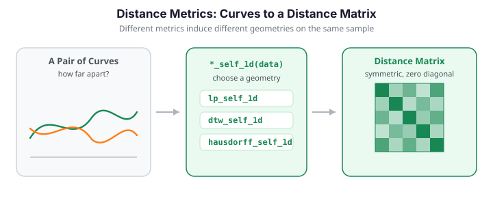

# Distance Metrics

Distance (and dissimilarity) measures between curves are fundamental building blocks for clustering, classification, nonparametric regression, and outlier detection. fdars provides a comprehensive set of metrics -- from classical $L^p$ norms to elastic distances that factor out time warping.


{ .fdars-diagram }

## Self vs cross distances

Every metric comes in two flavors:

| Variant | Signature | Output shape | Description |
|---------|-----------|:---:|-------------|
| **self** | `*_self_1d(data, ...)` | $(n, n)$ | Pairwise distances within one sample |
| **cross** | `*_cross_1d(data1, data2, ...)` | $(n_1, n_2)$ | Distances between two samples |

Both return a NumPy array. Self-distance matrices are symmetric with zeros on the diagonal.

Different metrics induce different geometries on the same sample. Below, four self-distance matrices are computed on a set of curves (half of which are randomly time-shifted). Note how $L^2$ and Hausdorff see the shifted curves as far apart, while DTW -- which absorbs local time warping -- pulls them back together.

```python exec="1" html="1" source="above"
import numpy as np
from docs_fig import fig, render
from fdars.simulation import simulate
from fdars.metric import lp_self_1d, dtw_self_1d, hausdorff_self_1d, fourier_self_1d

rng = np.random.default_rng(123)
t = np.linspace(0, 1, 120)
X = np.asarray(simulate(n=24, argvals=t, n_basis=3, seed=123))
for i in range(12, 24):                       # time-shift half the sample
    X[i] = np.roll(X[i], int(rng.integers(-12, 12)))

mats = [
    ("$L^2$", np.asarray(lp_self_1d(X, t, p=2.0))),
    ("DTW (w=12)", np.asarray(dtw_self_1d(X, p=2.0, w=12))),
    ("Hausdorff", np.asarray(hausdorff_self_1d(X, t))),
    ("Fourier", np.asarray(fourier_self_1d(X, n_basis=7))),
]

f, axes = fig(1, 4, figsize=(12, 3.2))
for ax, (name, D) in zip(axes, mats):
    im = ax.imshow(D, cmap="viridis", aspect="equal")
    ax.set(title=name, xticks=[], yticks=[])
    f.colorbar(im, ax=ax, fraction=0.046, pad=0.04)
print(render(f))
```

The $L^2$ and Hausdorff panels show a bright block for the shifted half of the sample -- these metrics read a time shift as a large distance. The DTW panel is comparatively uniform: by warping the time axis it collapses those same shifted pairs back toward the bulk, and the Fourier panel sits in between.

## $L^p$ distances

The most common functional distances, defined as

$$
d_p(X, Y) = \left( \int_{\mathcal{T}} |X(t) - Y(t)|^p \, dt \right)^{1/p}
$$

with numerical integration via the trapezoidal rule.

```python
import numpy as np
from fdars import Fdata

argvals = np.linspace(0, 1, 200)

# Assuming `data` is a numpy array of curves, wrap it in Fdata
fd = Fdata(data, argvals=argvals)

# L2 distance (default)
D_l2 = fd.distance(method="lp", p=2.0)

# L1 distance (more robust to spikes)
D_l1 = fd.distance(method="lp", p=1.0)

# L-infinity (supremum norm)
D_linf = fd.distance(method="lp", p=float('inf'))
```

| Parameter | Default | Description |
|-----------|---------|-------------|
| `data` | (required) | Curves, shape (n, m) |
| `argvals` | (required) | Evaluation grid, length m |
| `p` | `2.0` | $L^p$ exponent. Use `float('inf')` for the sup norm |

### Cross distance example

```python
# Distance between training and test curves
D_cross = lp_cross_1d(train_data, test_data, argvals, p=2.0)
print(D_cross.shape)  # (n_train, n_test)
```

### 2D variants

For surface data observed on a product grid:

```python
from fdars.metric import lp_self_2d, lp_cross_2d

D_2d = lp_self_2d(surface_data, argvals_s, argvals_t, p=2.0)
```

---

## Hausdorff distance

The Hausdorff distance treats each curve as a set of points in $(t, X(t))$ space and measures the worst-case mismatch:

$$
d_H(X, Y) = \max\!\left(\sup_t \inf_s \bigl\|(t, X(t)) - (s, Y(s))\bigr\|,\; \sup_s \inf_t \bigl\|(t, X(t)) - (s, Y(s))\bigr\|\right)
$$

```python
from fdars.metric import hausdorff_self_1d, hausdorff_cross_1d

D_haus = hausdorff_self_1d(data, argvals)
```

| Property | Value |
|----------|-------|
| Metric | Yes (true metric) |
| Shift invariant | No |
| Robust to phase variation | Somewhat |

!!! info "When to use Hausdorff"
    Hausdorff distance is useful when curves have different support or when you care about the worst-case pointwise discrepancy. It is less sensitive to small localized differences than $L^2$.

### 2D variants

```python
from fdars.metric import hausdorff_self_2d, hausdorff_cross_2d
```

---

## Dynamic Time Warping (DTW)

DTW finds the optimal nonlinear alignment between two sequences that minimizes the total cost. Unlike $L^p$ distances, DTW is invariant to local time shifts.

$$
d_{\mathrm{DTW}}(X, Y) = \min_{\pi} \left( \sum_{(i,j) \in \pi} |X(t_i) - Y(t_j)|^p \right)^{1/p}
$$

where $\pi$ is a monotone warping path.

```python
from fdars.metric import dtw_self_1d, dtw_cross_1d

# Unconstrained DTW
D_dtw = dtw_self_1d(data, p=2.0)

# With Sakoe-Chiba band (limits warping to w grid points)
D_dtw_sc = dtw_self_1d(data, p=2.0, w=10)
```

| Parameter | Default | Description |
|-----------|---------|-------------|
| `p` | `2.0` | Cost exponent |
| `w` | `0` | Sakoe-Chiba band width. `0` = no constraint (full warping) |

!!! tip "Sakoe-Chiba band"
    Setting `w` to a small value (e.g., 5-20 % of the sequence length) serves two purposes:

    1. **Speed** -- constrains the DP search from $O(m^2)$ to $O(m \cdot w)$.
    2. **Prevents pathological warps** -- disallows extreme temporal distortions.

To see why DTW matters, take a curve and a time-shifted copy of it. Pointwise $L^2$ reports a large distance because peaks no longer line up vertically; DTW re-aligns the time axis first and reports a much smaller value.

```python exec="1" html="1"
import numpy as np
from docs_fig import fig, render
from fdars.simulation import simulate
from fdars.metric import lp_self_1d, dtw_self_1d

t = np.linspace(0, 1, 120)
base = np.asarray(simulate(n=1, argvals=t, n_basis=4, efun_type="fourier", seed=33))[0]
pair = np.vstack([base, np.roll(base, 12)])          # curve + shifted copy

d_l2 = float(np.asarray(lp_self_1d(pair, t, p=2.0))[0, 1])
d_dtw = float(np.asarray(dtw_self_1d(pair, p=2.0, w=25))[0, 1])

f, ax = fig()
ax.plot(t, pair[0], color="#3f51b5", lw=2, label="curve")
ax.plot(t, pair[1], color="#e8710a", lw=2, label="shifted copy")
ax.set(title=f"$L^2$ = {d_l2:.3f}   vs   DTW = {d_dtw:.3f}",
       xlabel="t", ylabel="X(t)")
ax.legend()
print(render(f))
```

The two curves are identical up to a horizontal shift, yet the title shows the $L^2$ distance is several times larger than the DTW distance. $L^2$ penalises the vertical mismatch created by the misaligned peaks, while DTW first re-aligns the time axis and so reports the small residual difference that remains.

---

## Soft-DTW

Soft-DTW replaces the hard `min` in DTW with a differentiable soft-minimum, making it suitable as a loss function for gradient-based optimization.

$$
d_{\mathrm{SDTW}}^{\gamma}(X, Y) = \mathrm{soft\text{-}min}_{\pi}^{\gamma} \sum_{(i,j) \in \pi} |X(t_i) - Y(t_j)|^2
$$

where $\mathrm{soft\text{-}min}^{\gamma}$ uses the log-sum-exp with smoothing parameter $\gamma$.

```python
from fdars.metric import soft_dtw_self_1d, soft_dtw_cross_1d

D_sdtw = soft_dtw_self_1d(data, gamma=1.0)
```

| Parameter | Default | Description |
|-----------|---------|-------------|
| `gamma` | `1.0` | Smoothing parameter. As $\gamma \to 0$, Soft-DTW $\to$ DTW |

!!! warning "Soft-DTW is not a metric"
    Soft-DTW does not satisfy the triangle inequality. If you need a proper metric, use the **Soft-DTW divergence** instead:

    ```python
    from fdars.metric import soft_dtw_div_self_1d, soft_dtw_div_cross_1d

    D_div = soft_dtw_div_self_1d(data, gamma=1.0)
    ```

    The divergence is defined as $\tilde{d}_{\gamma}(X, Y) = d_{\gamma}(X, Y) - \frac{1}{2}\bigl[d_{\gamma}(X, X) + d_{\gamma}(Y, Y)\bigr]$ and is non-negative with zero diagonal.

### Effect of the smoothing parameter $\gamma$

The parameter $\gamma$ trades sharpness for smoothness: small $\gamma$ approaches hard DTW (a single best warping path), large $\gamma$ averages over many paths. Sweeping it for a fixed curve pair shows the divergence changing smoothly with $\gamma$ on a log scale.

```python exec="1" html="1" source="above"
import numpy as np
from docs_fig import fig, render
from fdars.simulation import simulate
from fdars.metric import soft_dtw_div_self_1d

t = np.linspace(0, 1, 80)
base = np.asarray(simulate(n=1, argvals=t, n_basis=4, efun_type="fourier", seed=5))[0]
pair = np.vstack([base, np.roll(base, 8)])         # a curve and a shifted copy

gammas = np.array([0.01, 0.03, 0.1, 0.3, 1.0, 3.0, 10.0])
div = np.array([float(np.asarray(soft_dtw_div_self_1d(pair, gamma=g))[0, 1])
                for g in gammas])

f, ax = fig()
ax.plot(gammas, div, "o-", color="#3f51b5")
ax.set(title="Soft-DTW divergence vs smoothing parameter $\\gamma$",
       xlabel="$\\gamma$ (log scale)", ylabel="divergence", xscale="log")
print(render(f))
```

The divergence varies smoothly and monotonically as $\gamma$ sweeps across three orders of magnitude: at small $\gamma$ it tends to the hard-DTW value (a single best path), and it decreases as $\gamma$ grows and the soft-minimum averages over an increasingly wide set of warping paths.

---

## Fourier coefficient distance

Compares curves through their Fourier representations. Two curves are close if their first `n_basis` Fourier coefficients are similar.

$$
d_F(X, Y) = \left\| \hat{X} - \hat{Y} \right\|_2
$$

where $\hat{X}, \hat{Y} \in \mathbb{R}^{n_{\text{basis}}}$ are truncated Fourier coefficient vectors.

```python
from fdars.metric import fourier_self_1d, fourier_cross_1d

D_fourier = fourier_self_1d(data, n_basis=5)
```

| Parameter | Default | Description |
|-----------|---------|-------------|
| `n_basis` | `5` | Number of Fourier coefficients to compare |

| Property | Value |
|----------|-------|
| Metric | Yes |
| Shift invariant | Depends on `n_basis` |
| Best for | Periodic data, frequency-domain comparison |

---

## Horizontal shift distance

Finds the uniform horizontal shift that best aligns two curves and reports the residual:

$$
d_{\mathrm{shift}}(X, Y) = \min_{|\delta| \le \Delta} \|X(t) - Y(t - \delta)\|_2
$$

```python
from fdars.metric import hshift_self_1d, hshift_cross_1d

D_shift = hshift_self_1d(data, argvals, max_shift=0)
```

| Parameter | Default | Description |
|-----------|---------|-------------|
| `max_shift` | `0` | Maximum shift in grid points. `0` = $m/4$ |

| Property | Value |
|----------|-------|
| Metric | Semimetric (triangle inequality may fail) |
| Shift invariant | Yes (by construction) |
| Best for | Data with simple horizontal misalignment |

---

## Elastic distances

The elastic (Fisher-Rao) framework separates **amplitude** (vertical) and **phase** (horizontal) variation via the Square Root Slope Function (SRSF) transform. These distances live in the `fdars.alignment` module.

```python
from fdars.alignment import elastic_distance, amplitude_distance, phase_distance
```

### Elastic distance

The total elastic distance combines amplitude and phase:

```python
d = elastic_distance(curve1, curve2, argvals, lambda_=0.0)
```

### Amplitude distance

Measures only the vertical shape difference after optimal alignment:

```python
d_amp = amplitude_distance(curve1, curve2, argvals, lambda_=0.0)
```

### Phase distance

Measures only the warping needed to align two curves:

```python
d_phase = phase_distance(curve1, curve2, argvals, lambda_=0.0)
```

### Elastic distance matrices

For pairwise computations across a full sample:

```python
from fdars.alignment import elastic_self_distance_matrix, elastic_cross_distance_matrix

D_elastic = elastic_self_distance_matrix(data, argvals, lambda_=0.0)
D_cross   = elastic_cross_distance_matrix(train_data, test_data, argvals)
```

| Parameter | Default | Description |
|-----------|---------|-------------|
| `lambda_` | `0.0` | Regularization -- penalizes extreme warping |

!!! note "Performance"
    Elastic distance matrices require $O(n^2)$ pairwise alignments, each involving a dynamic programming step. For large datasets, consider using a subset or the Sakoe-Chiba-constrained DTW as a faster alternative.

### Amplitude and phase capture orthogonal variation

Amplitude and phase distances describe complementary aspects of dissimilarity: two curves can have the *same shape* but *different timing* (small amplitude, large phase) or *different shapes* at *matched timing* (large amplitude, small phase). Plotting the pairwise amplitude distance against the pairwise phase distance for a sample -- half of which is time-shifted -- shows the two axes are only weakly related.

```python exec="1" html="1" source="above"
import numpy as np
from docs_fig import fig, render
from fdars.simulation import simulate
from fdars.alignment import (amplitude_self_distance_matrix,
                             phase_self_distance_matrix)

rng = np.random.default_rng(0)
t = np.linspace(0, 1, 80)
X = np.asarray(simulate(n=20, argvals=t, n_basis=3, seed=1))
for i in range(10, 20):                            # time-shift half the sample
    X[i] = np.roll(X[i], int(rng.integers(-8, 8)))

Damp = np.asarray(amplitude_self_distance_matrix(X, t))
Dph = np.asarray(phase_self_distance_matrix(X, t))
iu = np.triu_indices(X.shape[0], k=1)
amp, phase = Damp[iu], Dph[iu]

f, ax = fig(figsize=(6, 5))
ax.scatter(amp, phase, s=18, color="#3f51b5", alpha=0.6)
ax.axvline(amp.mean(), ls="--", color="#6c757d", lw=1)
ax.axhline(phase.mean(), ls="--", color="#6c757d", lw=1)
ax.set(title="Amplitude vs phase pairwise distances",
       xlabel="amplitude distance", ylabel="phase distance")
print(render(f))
```

The point cloud has no clear diagonal trend: pairs with large phase distance are spread across the whole range of amplitude distance and vice versa. This confirms the two coordinates are nearly orthogonal -- amplitude captures shape difference, phase captures timing difference, and they carry largely independent information.

---

## Which metrics see phase? A correlation view

Metrics that ignore time warping (L2, L1, Hausdorff) rank pairs somewhat differently from ones that absorb it (DTW). Computing several distance matrices on a phase-varying sample and correlating their off-diagonal entries makes the structure visible: L2 and L1 agree almost perfectly, DTW correlates highly with them (it still tracks amplitude, only discounting phase), and Hausdorff -- caring about worst-case pointwise mismatch -- sits furthest apart.

```python exec="1" html="1" source="above"
import numpy as np
from docs_fig import fig, render
from fdars.simulation import simulate
from fdars.metric import lp_self_1d, dtw_self_1d, hausdorff_self_1d

rng = np.random.default_rng(0)
t = np.linspace(0, 1, 80)
X = np.asarray(simulate(n=24, argvals=t, n_basis=3, seed=1))
for i in range(12, 24):
    X[i] = np.roll(X[i], int(rng.integers(-8, 8)))

iu = np.triu_indices(X.shape[0], k=1)
mats = {
    "L2": np.asarray(lp_self_1d(X, t, p=2.0))[iu],
    "L1": np.asarray(lp_self_1d(X, t, p=1.0))[iu],
    "DTW": np.asarray(dtw_self_1d(X, p=2.0, w=10))[iu],
    "Hausdorff": np.asarray(hausdorff_self_1d(X, t))[iu],
}
names = list(mats)
C = np.corrcoef(np.vstack([mats[n] for n in names]))

f, ax = fig(figsize=(5, 4.5))
im = ax.imshow(C, cmap="viridis", vmin=0, vmax=1)
ax.set(xticks=range(len(names)), yticks=range(len(names)),
       xticklabels=names, yticklabels=names,
       title="Correlation of pairwise distances")
for i in range(len(names)):
    for j in range(len(names)):
        ax.text(j, i, f"{C[i, j]:.2f}", ha="center", va="center",
                color="white" if C[i, j] < 0.7 else "black", fontsize=9)
f.colorbar(im, ax=ax, fraction=0.046, pad=0.04)
print(render(f))
```

The heatmap confirms the narrative: the L2-L1 cell is near 1.0 (they rank pairs almost identically), DTW correlates strongly with both because it still tracks amplitude, and the Hausdorff row/column shows the lowest correlations -- its worst-case pointwise view of dissimilarity is the odd one out.

---

## Metric properties comparison

| Metric | True metric | Shift invariant | Scale invariant | Handles phase variation | Speed |
|:---|:---:|:---:|:---:|:---:|:---:|
| $L^p$ | Yes | No | No | No | Very fast |
| Hausdorff | Yes | No | No | Partially | Fast |
| DTW | Yes | No | No | Yes | Moderate |
| Soft-DTW | No | No | No | Yes | Moderate |
| Soft-DTW Divergence | Semi | No | No | Yes | Moderate |
| Fourier | Yes | Partially | No | No | Fast |
| Horizontal Shift | Semi | Yes | No | Yes (rigid) | Moderate |
| Elastic (Fisher-Rao) | Yes | No | No | Yes (optimal) | Slow |
| Amplitude | Semi | No | No | Yes | Slow |
| Phase | Yes | No | No | Yes | Slow |

---

## Method selection guide

```
Is your data periodic?
  YES --> Fourier coefficient distance
  NO  --> continue

Is there significant horizontal misalignment?
  NO  --> L2 distance (fast, standard choice)
  YES --> continue

Is the misalignment a simple global shift?
  YES --> Horizontal shift distance
  NO  --> continue

Do you need a true metric?
  YES --> DTW (with Sakoe-Chiba band) or Elastic distance
  NO  --> Soft-DTW (differentiable, good for optimization)

Do you need amplitude/phase decomposition?
  YES --> Elastic framework (amplitude_distance + phase_distance)
  NO  --> DTW is simpler and faster
```

## Complete example: comparing metrics

```python
import numpy as np
import matplotlib.pyplot as plt
from fdars import Fdata
from fdars.simulation import simulate
from fdars.metric import dtw_self_1d, hausdorff_self_1d, fourier_self_1d

# --- 1. Simulate data with phase variation --------------------------------
argvals = np.linspace(0, 1, 150)
data = simulate(n=30, argvals=argvals, n_basis=3, seed=123)

# Add random horizontal shifts to half the curves
shifted_data = data.copy()
for i in range(15, 30):
    shift = np.random.randint(-10, 10)
    shifted_data[i] = np.roll(data[i], shift)
fd = Fdata(shifted_data, argvals=argvals)

# --- 2. Compute distance matrices ----------------------------------------
D_l2      = fd.distance(method="lp", p=2.0)
D_dtw     = dtw_self_1d(fd.data, p=2.0, w=15)
D_haus    = hausdorff_self_1d(fd.data, fd.argvals)
D_fourier = fourier_self_1d(fd.data, n_basis=7)

# --- 3. Visualize --------------------------------------------------------
fig, axes = plt.subplots(1, 4, figsize=(18, 4))

for ax, D, name in zip(axes,
                        [D_l2, D_dtw, D_haus, D_fourier],
                        ["L2", "DTW (w=15)", "Hausdorff", "Fourier"]):
    im = ax.imshow(D, cmap="viridis", aspect="auto")
    ax.set_title(name)
    plt.colorbar(im, ax=ax, fraction=0.046)

plt.suptitle("Distance matrix comparison")
plt.tight_layout()
plt.show()
```

## Using distance matrices downstream

Distance matrices plug directly into several fdars methods:

```python
from fdars.regression import fregre_np
from fdars.clustering import kmeans_fd

# Nonparametric kernel regression from distances
D = fd.distance(method="lp", p=2.0)
reg = fregre_np(D, response, h=0.0)  # h=0 -> automatic bandwidth

# Functional k-means also accepts precomputed distances
# (see the clustering documentation)
```

## API summary

### `fdars.metric`

| Function | Key parameters | Description |
|----------|---------------|-------------|
| `lp_self_1d(data, argvals, p)` | `p=2.0` | $L^p$ self distances |
| `lp_cross_1d(data1, data2, argvals, p)` | `p=2.0` | $L^p$ cross distances |
| `lp_self_2d(data, argvals_s, argvals_t, p)` | `p=2.0` | $L^p$ self for surfaces |
| `lp_cross_2d(...)` | `p=2.0` | $L^p$ cross for surfaces |
| `hausdorff_self_1d(data, argvals)` | -- | Hausdorff self |
| `hausdorff_cross_1d(data1, data2, argvals)` | -- | Hausdorff cross |
| `hausdorff_self_2d(data, argvals_s, argvals_t)` | -- | Hausdorff self for surfaces |
| `hausdorff_cross_2d(...)` | -- | Hausdorff cross for surfaces |
| `dtw_self_1d(data, p, w)` | `p=2.0`, `w=0` | DTW self |
| `dtw_cross_1d(data1, data2, p, w)` | `p=2.0`, `w=0` | DTW cross |
| `soft_dtw_self_1d(data, gamma)` | `gamma=1.0` | Soft-DTW self |
| `soft_dtw_cross_1d(data1, data2, gamma)` | `gamma=1.0` | Soft-DTW cross |
| `soft_dtw_div_self_1d(data, gamma)` | `gamma=1.0` | Soft-DTW divergence self |
| `soft_dtw_div_cross_1d(data1, data2, gamma)` | `gamma=1.0` | Soft-DTW divergence cross |
| `fourier_self_1d(data, n_basis)` | `n_basis=5` | Fourier coefficient self |
| `fourier_cross_1d(data1, data2, n_basis)` | `n_basis=5` | Fourier coefficient cross |
| `hshift_self_1d(data, argvals, max_shift)` | `max_shift=0` | Horizontal shift self |
| `hshift_cross_1d(data1, data2, argvals, max_shift)` | `max_shift=0` | Horizontal shift cross |

### `fdars.alignment` (elastic distances)

| Function | Key parameters | Description |
|----------|---------------|-------------|
| `elastic_distance(c1, c2, argvals, lambda_)` | `lambda_=0.0` | Pairwise elastic distance |
| `amplitude_distance(c1, c2, argvals, lambda_)` | `lambda_=0.0` | Amplitude component only |
| `phase_distance(c1, c2, argvals, lambda_)` | `lambda_=0.0` | Phase component only |
| `elastic_self_distance_matrix(data, argvals, lambda_)` | `lambda_=0.0` | Full elastic distance matrix |
| `elastic_cross_distance_matrix(d1, d2, argvals, lambda_)` | `lambda_=0.0` | Cross elastic distance matrix |
| `amplitude_self_distance_matrix(data, argvals, lambda_)` | `lambda_=0.0` | Amplitude distance matrix |
| `phase_self_distance_matrix(data, argvals, lambda_)` | `lambda_=0.0` | Phase distance matrix |
| `shape_distance(c1, c2, argvals, lambda_)` | `lambda_=0.0` | Shape distance (reparameterization-invariant) |
| `shape_self_distance_matrix(data, argvals, quotient, lambda_)` | `quotient="reparameterization"` | Shape distance matrix |

!!! note "Binding differences vs the R reference"
    The Python `fdars.metric` does not expose the R vignette's Kullback-Leibler distance or the PCA / derivative / basis / FFT *semimetrics*; the closest available pieces are `fourier_self_1d` (a truncated-coefficient distance) and building a basis/PCA distance yourself from [basis coefficients](basis-representation.md) or [FPC scores](fpca.md). Unlike the R page, the Python `shape_self_distance_matrix` returns the same value for `quotient="reparameterization"` and `quotient="scale"` on the examples tested, so scale is not factored out here -- use it as a reparameterization-invariant shape distance only.

## References

- Berndt, D.J. and Clifford, J. (1994). Using Dynamic Time Warping to find patterns in time series. *KDD Workshop*, 359-370.
- Cuturi, M. and Blondel, M. (2017). Soft-DTW: a differentiable loss function for time-series. *ICML 34*, 894-903.
- Ferraty, F. and Vieu, P. (2006). *Nonparametric Functional Data Analysis*. Springer.
- Sakoe, H. and Chiba, S. (1978). Dynamic programming algorithm optimization for spoken word recognition. *IEEE TASSP* 26(1), 43-49.
- Srivastava, A. and Klassen, E. (2016). *Functional and Shape Data Analysis*. Springer.
