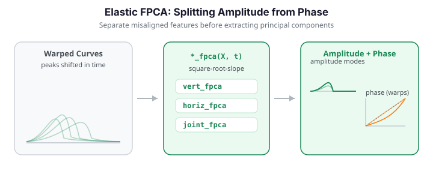

# Elastic FPCA

Ordinary [Functional PCA](fpca.md) assumes that curves differ only in *amplitude* -- their height at each fixed time $t$. Real curves often also differ in *phase*: the same feature (a peak, a crossing) occurs at different times in different observations. When amplitude and phase variation are entangled, ordinary FPCA wastes components describing the misalignment and the leading eigenfunctions become hard to interpret. **Elastic FPCA** first separates the two sources of variation using the square-root-slope framework, then runs PCA in the amplitude space, the phase (warping) space, or jointly.


{ .fdars-diagram }

```python exec="1" html="1"
import numpy as np
from docs_fig import fig, render

# A sample of bump curves that vary in BOTH height (amplitude) and
# location (phase). Ordinary FPCA cannot cleanly separate the two.
t = np.linspace(0, 1, 100)
rng = np.random.default_rng(3)
X = []
for _ in range(25):
    center = 0.5 + 0.12 * rng.standard_normal()   # phase variation
    height = 1.0 + 0.25 * rng.standard_normal()    # amplitude variation
    X.append(height * np.exp(-((t - center) ** 2) / 0.01))
X = np.asarray(X)

f, ax = fig()
ax.plot(t, X.T, color="#3f51b5", lw=1, alpha=0.5)
ax.set(title="Bumps varying in amplitude (height) and phase (location)",
       xlabel="t", ylabel="X(t)")
print(render(f))
```

## Concepts: amplitude and phase

Write each observed curve as a warped version of an underlying *template*:

$$
X_i(t) = a_i \cdot f\bigl(\gamma_i(t)\bigr)
$$

where $\gamma_i:[0,1]\to[0,1]$ is a monotone increasing **warping function** (phase) and $a_i$ scales amplitude. The goal is to decompose the sample into

- an **amplitude** part -- the aligned curves, all sharing a common time axis, and
- a **phase** part -- the warping functions $\gamma_i$ that map each curve onto the template.

The mathematics is cleanest in the **square-root-slope function (SRSF)** representation. For a curve $f$ with derivative $\dot f$,

$$
q(t) = \operatorname{sign}\bigl(\dot f(t)\bigr)\sqrt{\lvert \dot f(t)\rvert}.
$$

The SRSF turns the awkward, non-Euclidean geometry of warping into a plain $L^2$ geometry on the unit Hilbert sphere. The Fisher--Rao distance between two curves, which is invariant to how we parameterize time, then reduces to an $L^2$ distance between SRSFs *after optimal alignment*:

$$
d_{\mathrm{FR}}(f_1, f_2) = \inf_{\gamma \in \Gamma}\, \bigl\lVert q_1 - (q_2 \circ \gamma)\sqrt{\dot\gamma}\,\bigr\rVert_2,
$$

where $\Gamma$ is the group of orientation-preserving warps $\gamma:[0,1]\to[0,1]$ and $(q_2\circ\gamma)\sqrt{\dot\gamma}$ is the SRSF of the warped curve $f_2\circ\gamma$. `fdars` exposes the transform and the resulting elastic mean directly:

```python
from fdars.alignment import srsf_transform, karcher_mean

q = srsf_transform(curve, argvals)      # SRSF of a single curve
km = karcher_mean(data, argvals)        # elastic (Karcher) mean + alignment
```

`karcher_mean` returns the template and the by-products of alignment:

| Key | Shape | Description |
|-----|-------|-------------|
| `mean` | (m,) | Elastic (Karcher) mean curve -- the template |
| `mean_srsf` | (m,) | SRSF of the template |
| `aligned_data` | (n, m) | Each curve warped onto the template (amplitude part) |
| `gammas` | (n, m) | Warping functions $\gamma_i$ (phase part) |
| `n_iter` | scalar | Iterations to convergence |
| `converged` | bool | Whether the fixed-point iteration converged |

The figure below shows the effect of alignment: after warping every curve onto the Karcher mean, the peaks line up and the residual spread is pure amplitude.

```python exec="1" html="1" source="above"
import numpy as np
from docs_fig import fig, render
from fdars.alignment import karcher_mean

t = np.linspace(0, 1, 100)
rng = np.random.default_rng(3)
X = np.asarray([
    (1.0 + 0.25 * rng.standard_normal()) *
    np.exp(-((t - (0.5 + 0.12 * rng.standard_normal())) ** 2) / 0.01)
    for _ in range(25)
])

km = karcher_mean(X, t)
aligned = np.asarray(km["aligned_data"])
mean = np.asarray(km["mean"])

f, (a0, a1) = fig(1, 2, figsize=(10, 3.8))
a0.plot(t, X.T, color="#3f51b5", lw=1, alpha=0.4)
a0.set(title="Original (amplitude + phase)", xlabel="t", ylabel="X(t)")
a1.plot(t, aligned.T, color="#198754", lw=1, alpha=0.4)
a1.plot(t, mean, color="#dc3545", lw=2.4, label="Karcher mean")
a1.set(title="Aligned (amplitude only)", xlabel="t", ylabel="X(t)")
a1.legend()
print(render(f))
```

!!! success "Validation: alignment reduces amplitude variance; warps are valid; distances agree"

    Three properties that alignment *must* satisfy are asserted below. **(1)** Warping
    the curves onto the template collapses the cross-sectional (pointwise) variance: the
    integrated pointwise variance of the aligned curves is strictly smaller than that of
    the originals, because the horizontal spread has been removed. **(2)** Every warping
    function $\gamma_i$ is a valid element of the warping group $\Gamma$ -- monotone
    non-decreasing with $\gamma(0)=0$, $\gamma(1)=1$, and range in $[0,1]$. **(3)** The
    Fisher-Rao **amplitude distance** equals the **elastic distance** to machine precision,
    since after optimal alignment they are the same $L^2$ SRSF distance. All checks pass.

    ```python exec="1" source="above"
    import numpy as np
    from fdars.alignment import karcher_mean, amplitude_distance, elastic_distance

    t = np.linspace(0, 1, 100)
    rng = np.random.default_rng(3)
    X = np.asarray([
        (1.0 + 0.25 * rng.standard_normal()) *
        np.exp(-((t - (0.5 + 0.12 * rng.standard_normal())) ** 2) / 0.01)
        for _ in range(25)
    ])

    km = karcher_mean(X, t)
    aligned = np.asarray(km["aligned_data"])
    gammas = np.asarray(km["gammas"])

    # (1) Alignment reduces the integrated cross-sectional variance.
    var_orig = X.var(axis=0).mean()
    var_aligned = aligned.var(axis=0).mean()
    assert var_aligned < var_orig, (var_aligned, var_orig)
    print(f"cross-sectional variance: {var_orig:.4f} -> {var_aligned:.4f} "
          f"({100 * (1 - var_aligned / var_orig):.0f}% reduction)")

    # (2) Warps live in the warping group Gamma: monotone, range [0,1], fixed ends.
    assert (np.diff(gammas, axis=1) >= -1e-9).all()               # monotone
    assert gammas.min() >= -1e-9 and gammas.max() <= 1 + 1e-9      # range [0,1]
    assert np.abs(gammas[:, 0]).max() < 1e-9                       # gamma(0) = 0
    assert np.abs(gammas[:, -1] - 1).max() < 1e-9                  # gamma(1) = 1
    print("all 25 warps monotone, range [0,1], gamma(0)=0, gamma(1)=1")

    # (3) amplitude_distance == elastic_distance (same post-alignment L2 distance).
    ad = float(amplitude_distance(X[0], X[1], t))
    ed = float(elastic_distance(X[0], X[1], t))
    assert abs(ad - ed) < 1e-10, (ad, ed)
    print(f"amplitude_distance {ad:.6f} == elastic_distance {ed:.6f} "
          f"(|diff| = {abs(ad - ed):.1e})")
    ```

The **warping functions** $\gamma_i$ returned in `gammas` are the phase part -- one monotone map per curve describing how its time axis was stretched to reach the template. A warp bowing above the diagonal advances the peak, one below it delays the peak; the spread of the warps around the identity is the amount of phase variation in the sample.

```python exec="1" html="1" source="above"
import numpy as np
from docs_fig import fig, render
from fdars.alignment import karcher_mean

t = np.linspace(0, 1, 100)
rng = np.random.default_rng(3)
X = np.asarray([
    (1.0 + 0.25 * rng.standard_normal()) *
    np.exp(-((t - (0.5 + 0.12 * rng.standard_normal())) ** 2) / 0.01)
    for _ in range(25)
])

km = karcher_mean(X, t)
gammas = np.asarray(km["gammas"])

f, ax = fig()
ax.plot(t, gammas.T, color="#6f42c1", lw=1, alpha=0.5)
ax.plot([0, 1], [0, 1], color="#dc3545", lw=1.6, ls="--", label="identity (no warp)")
ax.set(title="Warping functions $\\gamma_i$ (phase information)",
       xlabel="t", ylabel=r"$\gamma(t)$")
ax.legend()
print(render(f))
```

## The three elastic FPCA variants

Once amplitude and phase are separated, `fdars.alignment` provides three PCA routines. They share a signature and each return a `dict`.

```python
from fdars.alignment import vert_fpca, horiz_fpca, joint_fpca

amp   = vert_fpca(data, argvals, n_comp=3)   # amplitude-space PCA
phase = horiz_fpca(data, argvals, n_comp=3)  # phase / warping-space PCA
both  = joint_fpca(data, argvals, n_comp=3)  # joint amplitude-phase PCA
```

| Parameter | Type | Default | Description |
|-----------|------|---------|-------------|
| `data` | `np.ndarray` (n, m) | -- | Discretized curves |
| `argvals` | `np.ndarray` (m,) | -- | Common evaluation grid |
| `n_comp` | `int` | `3` | Number of components to retain |
| `lambda_` | `float` | `0.0` | Warping-smoothness penalty used during alignment |
| `max_iter` | `int` | `20` | Max alignment iterations |
| `tol` | `float` | `1e-4` | Convergence tolerance |

### Vertical (amplitude) FPCA

`vert_fpca` runs PCA on the **aligned** curves, so its components describe amplitude variation with phase removed. Its returned dict contains:

| Key | Shape | Description |
|-----|-------|-------------|
| `scores` | (n, n_comp) | Amplitude scores |
| `eigenfunctions_f` | (n_comp, m) | Eigenfunctions in the original (function) space |
| `eigenfunctions_q` | (n_comp, m+1) | Eigenfunctions in SRSF space |
| `eigenvalues` | (n_comp,) | Variance per component |
| `cumulative_variance` | (n_comp,) | Cumulative variance fraction |
| `mean_q` | (m+1,) | SRSF-space mean |

The modes of amplitude variation, $\hat\mu \pm 2\sqrt{\lambda_k}\,\phi_k$, are plotted in the original function space via `eigenfunctions_f`:

```python exec="1" html="1" source="above"
import numpy as np
from docs_fig import fig, render
from fdars.alignment import vert_fpca, karcher_mean

t = np.linspace(0, 1, 100)
rng = np.random.default_rng(3)
X = np.asarray([
    (1.0 + 0.25 * rng.standard_normal()) *
    np.exp(-((t - (0.5 + 0.12 * rng.standard_normal())) ** 2) / 0.01)
    for _ in range(25)
])

amp = vert_fpca(X, t, n_comp=3)
phi = np.asarray(amp["eigenfunctions_f"])         # (n_comp, m)
lam = np.asarray(amp["eigenvalues"])
cumvar = np.asarray(amp["cumulative_variance"])
mean = np.asarray(karcher_mean(X, t)["mean"])     # template in function space

f, ax = fig()
ax.plot(t, mean, color="#6c757d", lw=1.4, ls="--", label="amplitude mean")
for k in range(2):
    ax.plot(t, mean + 2 * np.sqrt(lam[k]) * phi[k], lw=1.8,
            label=f"mode {k+1} (+2 SD)")
ax.set(title="Amplitude modes of variation (vert_fpca)",
       xlabel="t", ylabel="X(t)")
ax.legend()
print(render(f))
```

### Horizontal (phase) FPCA

`horiz_fpca` runs PCA on the **warping functions** -- the phase. Because warping functions live on a curved space (the space of monotone maps), the PCA operates on their *shooting vectors* in the tangent space at the identity warp. Its dict adds phase-specific keys:

| Key | Shape | Description |
|-----|-------|-------------|
| `scores` | (n, n_comp) | Phase scores |
| `eigenfunctions_gam` | (n_comp, m) | Warping-function eigen-directions |
| `eigenfunctions_psi` | (n_comp, m) | SRSF-of-warping eigen-directions |
| `mean_psi` | (m,) | Mean warping SRSF |
| `shooting_vectors` | (n, m) | Tangent-space representation of each $\gamma_i$ |

Plotting the warping functions reconstructed from the leading phase component shows how the *timing* of the feature varies across the sample -- warps bowing above the diagonal advance the peak, those below delay it.

```python exec="1" html="1" source="above"
import numpy as np
from docs_fig import fig, render
from fdars.alignment import horiz_fpca

t = np.linspace(0, 1, 100)
rng = np.random.default_rng(3)
X = np.asarray([
    (1.0 + 0.25 * rng.standard_normal()) *
    np.exp(-((t - (0.5 + 0.12 * rng.standard_normal())) ** 2) / 0.01)
    for _ in range(25)
])

phase = horiz_fpca(X, t, n_comp=3)
gam = np.asarray(phase["eigenfunctions_gam"])       # phase eigen-directions
cumvar = np.asarray(phase["cumulative_variance"])

f, ax = fig()
ax.plot([0, 1], [0, 1], color="#6c757d", lw=1.2, ls="--", label="identity warp")
for k in range(3):
    ax.plot(t, gam[k], lw=1.8, label=f"phase dir {k+1}")
ax.set(title="Phase (warping) eigen-directions (horiz_fpca)",
       xlabel="t", ylabel=r"$\gamma(t)$")
ax.legend()
print(render(f))
```

### Joint FPCA

`joint_fpca` concatenates the amplitude (SRSF) and phase (shooting-vector) representations into a single vector per curve, then runs one PCA on the stack. Its components capture **coupled** amplitude-phase variation -- useful when, say, taller peaks also tend to arrive earlier. A scalar `balance_c` rescales the phase block relative to the amplitude block before the joint SVD, so that neither dominates purely because of its units.

| Key | Shape | Description |
|-----|-------|-------------|
| `scores` | (n, n_comp) | Joint scores |
| `eigenvalues` | (n_comp,) | Variance per joint component |
| `cumulative_variance` | (n_comp,) | Cumulative variance fraction |
| `vert_component` | (n_comp, m+1) | Amplitude part of each joint mode |
| `horiz_component` | (n_comp, m) | Phase part of each joint mode |
| `balance_c` | scalar | Amplitude/phase balancing constant |

Each joint component splits into an amplitude part and a phase part; comparing their energies shows how much of that mode is "what varies" versus "when it varies". For the bump sample, amplitude dominates, so the joint cumulative-variance curve tracks the amplitude-only one closely.

```python exec="1" html="1" source="above"
import numpy as np
from docs_fig import fig, render
from fdars.alignment import joint_fpca

t = np.linspace(0, 1, 100)
rng = np.random.default_rng(3)
X = np.asarray([
    (1.0 + 0.25 * rng.standard_normal()) *
    np.exp(-((t - (0.5 + 0.12 * rng.standard_normal())) ** 2) / 0.01)
    for _ in range(25)
])

joint = joint_fpca(X, t, n_comp=3)
cumvar = np.asarray(joint["cumulative_variance"])
vert = np.asarray(joint["vert_component"])       # (n_comp, m+1) amplitude parts
horiz = np.asarray(joint["horiz_component"])     # (n_comp, m)   phase parts

# Energy of the amplitude vs phase part within each joint mode.
c = float(joint["balance_c"])
amp_energy = (vert ** 2).sum(axis=1)
phase_energy = (c ** 2) * (horiz ** 2).sum(axis=1)
frac_phase = phase_energy / (amp_energy + phase_energy)

f, (a0, a1) = fig(1, 2, figsize=(10, 3.8))
ks = np.arange(1, len(cumvar) + 1)
a0.plot(ks, cumvar, "o-", color="#6f42c1")
a0.set(title="Joint FPCA cumulative variance", xlabel="component",
       ylabel="cumulative variance", ylim=(0, 1.02), xticks=ks)
a1.bar(ks - 0.15, 1 - frac_phase, width=0.3, color="#198754", label="amplitude")
a1.bar(ks + 0.15, frac_phase, width=0.3, color="#6f42c1", label="phase")
a1.set(title="Amplitude / phase balance per mode", xlabel="component",
       ylabel="energy fraction", xticks=ks)
a1.legend()
print(render(f))
```

## Contrast with ordinary FPCA

The payoff of separating amplitude and phase is a more parsimonious decomposition. When curves are misaligned, ordinary FPCA needs several components just to represent the horizontal shifting, so its cumulative-variance curve rises slowly. Amplitude FPCA, operating on aligned curves, concentrates the variance in the first component.

```python exec="1" html="1"
import numpy as np
from docs_fig import fig, render
from fdars.regression import fpca
from fdars.alignment import vert_fpca

t = np.linspace(0, 1, 100)
rng = np.random.default_rng(3)
X = np.asarray([
    (1.0 + 0.25 * rng.standard_normal()) *
    np.exp(-((t - (0.5 + 0.12 * rng.standard_normal())) ** 2) / 0.01)
    for _ in range(25)
])

# Ordinary FPCA cumulative variance
sv = np.asarray(fpca(X, t, n_comp=5)["singular_values"])
ev = sv ** 2 / (X.shape[0] - 1)
pve_ord = np.cumsum(ev) / ev.sum()

# Amplitude (elastic) FPCA cumulative variance
pve_amp = np.asarray(vert_fpca(X, t, n_comp=5)["cumulative_variance"])

ks = np.arange(1, len(pve_ord) + 1)
f, ax = fig()
ax.plot(ks, pve_ord, "o-", color="#3f51b5", label="ordinary FPCA")
ax.plot(ks, pve_amp, "s-", color="#198754", label="amplitude FPCA (elastic)")
ax.axhline(0.95, ls="--", color="#6c757d", lw=1, label="95 %")
ax.set(title="Cumulative variance: ordinary vs elastic amplitude FPCA",
       xlabel="Number of components", ylabel="Cumulative variance",
       ylim=(0, 1.02))
ax.legend()
print(render(f))
```

!!! note "When to reach for elastic FPCA"
    If a functional boxplot or a plot of the raw curves shows features (peaks, zero-crossings) drifting horizontally between observations, ordinary FPCA will mix that phase variation into its amplitude components. Separating the two with `vert_fpca` / `horiz_fpca` yields interpretable, low-dimensional summaries of *what* varies (amplitude) and *when* it varies (phase).

!!! tip "Related tools"
    The alignment itself, distances, and boxplots live alongside these routines in `fdars.alignment`: see `karcher_mean`, `amplitude_distance`, `phase_distance`, and `phase_boxplot`. For the standard (amplitude-only) decomposition, see [Functional PCA](fpca.md).

## Which variant, and when

| Variant | Use it when you want to understand... | Typical questions |
|---------|----------------------------------------|-------------------|
| `vert_fpca` | pure **shape** variation, timing removed | How do the aligned curves differ in height/shape? |
| `horiz_fpca` | pure **timing** variation | How much, and in what pattern, does the feature drift in time? |
| `joint_fpca` | **coupled** amplitude-phase variation | Do taller peaks tend to arrive earlier? What is the amplitude/phase balance? |

Concrete examples: for **growth curves**, vertical FPCA describes differences in final height and spurt magnitude, while horizontal FPCA describes differences in the *timing* of the pubertal spurt. For **gait or movement** data, vertical captures the movement pattern and horizontal the stride timing. For **weather** curves, vertical captures the shape of the seasonal temperature cycle and horizontal the seasonal shift between stations.

## References

- Srivastava, A., Wu, W., Kurtek, S., Klassen, E. and Marron, J.S. (2011). Registration of functional data using Fisher-Rao metric. *arXiv:1103.3817*.
- Tucker, J.D., Wu, W. and Srivastava, A. (2013). Generative models for functional data using phase and amplitude separation. *Computational Statistics & Data Analysis* 61, 50-66.
- Srivastava, A. and Klassen, E.P. (2016). *Functional and Shape Data Analysis*. Springer.
- Ramsay, J.O. and Silverman, B.W. (2005). *Functional Data Analysis*, 2nd ed. Springer.

## API summary

| Function | Module | Purpose |
|----------|--------|---------|
| `srsf_transform(curve, argvals)` | `fdars.alignment` | Square-root-slope transform of one curve |
| `karcher_mean(data, argvals, ...)` | `fdars.alignment` | Elastic template + aligned curves + warps |
| `vert_fpca(data, argvals, n_comp, ...)` | `fdars.alignment` | Amplitude-space FPCA |
| `horiz_fpca(data, argvals, n_comp, ...)` | `fdars.alignment` | Phase (warping)-space FPCA |
| `joint_fpca(data, argvals, n_comp, ...)` | `fdars.alignment` | Joint amplitude-phase FPCA |
| `fpca(data, argvals, n_comp)` | `fdars.regression` | Ordinary (amplitude-only) FPCA |
