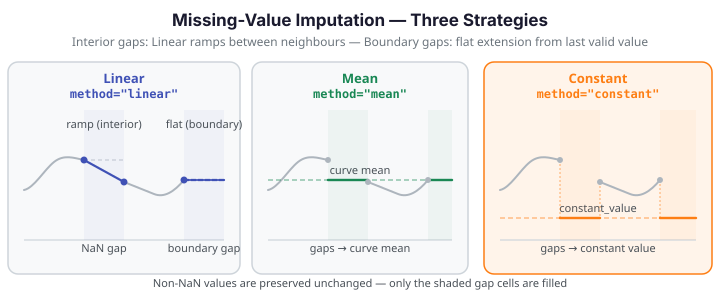

# Missing-Value Imputation

Real-world functional data often contains NaN entries from sensor dropout, transmission errors, or irregular sampling. `impute_missing_values` fills each NaN cell using one of three strategies while leaving all non-NaN values unchanged.

{ .fdars-diagram }

## When to use imputation

- **Before smoothing or depth functions** -- both require a complete data matrix; impute first.
- **Before basis representation** -- projection onto a basis assumes no missing entries.
- **Sensor arrays with dropout** -- a few channels fail per observation; impute the affected cells before analysis.

!!! warning "Imputation is not smoothing"
    `impute_missing_values` fills only NaN cells; it does not adjust non-NaN values. If noise
    reduction across the whole curve is the goal, use P-spline smoothing instead
    (`fdars.basis.pspline_fit_gcv`).

## ImputationMethod strategies

| Method | String value | Interior gap | Boundary gap |
|--------|-------------|--------------|--------------|
| Linear | `"linear"` | Ramp linearly between nearest left/right neighbours | Extend flat from the last valid value |
| Mean | `"mean"` | Replace each NaN with the mean of non-NaN values in that curve | Same |
| Constant | `"constant"` | Replace each NaN with the user-supplied `constant_value` | Same |

!!! note "Boundary gap behaviour for Linear"
    When NaN cells touch the left or right edge of a curve and there is no valid neighbour on
    one side, the **Linear** method extends **flat** (horizontally) from the nearest valid point
    rather than ramping to zero. This prevents spurious slopes at the domain boundary and is
    the correct definition for a boundary gap.

!!! warning "All-NaN curves raise ValueError"
    If a curve contains no valid (non-NaN) values, `impute_missing_values` raises `ValueError`.
    The mean of an all-NaN curve is undefined, and linear interpolation has no anchor points.
    Filter or discard all-NaN curves before calling the function.

## Worked example

The fence below loads the Berkeley Growth Study height data, injects synthetic NaN values
(8% of cells, fixed seed for reproducibility), imputes using the three strategies, and
confirms no NaN values remain.

```python exec="1" html="1" source="above"
import numpy as np
from docs_fig import fig, render
from docs_data import load_growth
from fdars.represent import impute_missing_values

rng = np.random.default_rng(7)

# Load growth data: 93 children × 31 age points (ages 1–18)
age, X, meta = load_growth()

# Inject ~8% NaN at random positions (deterministic seed)
X_nan = X.astype(float).copy()
mask = rng.random(X_nan.shape) < 0.08
X_nan[mask] = np.nan
n_missing = int(mask.sum())

# Impute with each strategy
X_linear   = impute_missing_values(X_nan, age, method="linear")
X_mean     = impute_missing_values(X_nan, age, method="mean")
X_constant = impute_missing_values(X_nan, age, method="constant", constant_value=0.0)

# Confirm all NaN filled
assert np.isnan(X_linear).sum() == 0
assert np.isnan(X_mean).sum() == 0
assert np.isnan(X_constant).sum() == 0

# Visualise: pick one curve with several NaN cells
row = next(i for i in range(len(X_nan)) if mask[i].sum() >= 3)
f, axes = fig(1, 3, figsize=(13, 4.0), sharey=True)

for ax, (label, X_imp, color) in zip(
    axes,
    [
        ("Linear",   X_linear,   "#3f51b5"),
        ("Mean",     X_mean,     "#198754"),
        ("Constant", X_constant, "#fd7e14"),
    ],
):
    # Imputed fill — colour only where NaN was
    ax.scatter(age[mask[row]], X_imp[row][mask[row]], s=40, color=color,
               zorder=5, label=f"{label} fill")
    # Original valid values
    ax.scatter(age[~mask[row]], X[row][~mask[row]], s=18, color="#1a1a2e",
               alpha=0.6, zorder=4, label="observed")
    # Imputed curve
    ax.plot(age, X_imp[row], color=color, lw=1.4, alpha=0.7)
    ax.set(title=f"method='{label.lower()}'", xlabel="Age (years)")
    ax.legend(fontsize=8)

axes[0].set_ylabel("Height (cm)")
print(render(f))
print(f"NaN injected: {n_missing} of {X.size} cells.  FDARS_FENCE_OK")
```

## API summary

| Function | Description |
|----------|-------------|
| `impute_missing_values(data, argvals, method, constant_value)` | Fill NaN cells using the chosen strategy; returns a new array with no NaN |

Imported from `fdars.represent`.

| Parameter | Type | Default | Description |
|-----------|------|---------|-------------|
| `data` | `ndarray (n, m)` | required | Functional data matrix; may contain `NaN` |
| `argvals` | `ndarray (m,)` | required | Sorted evaluation points (must be regular grid) |
| `method` | `str` | `"linear"` | One of `"linear"`, `"mean"`, `"constant"` |
| `constant_value` | `float` | `0.0` | Replacement value when `method="constant"` |

## Recommendations

| Situation | Recommended method |
|-----------|-------------------|
| Sparse dropout between observed values | `"linear"` — preserves local shape |
| Many small gaps across a smooth curve | `"linear"` or `"mean"` |
| Boundary dropout (sensor off at start or end) | `"linear"` (flat extension) or `"constant"` |
| Gap value has a domain-specific default (e.g., sensor zero) | `"constant"` |
| You want a simple, interpretable fill | `"mean"` |

## Missing-data assumptions: MCAR, MAR, and MNAR

The three imputation strategies are simple and deterministic — they make no explicit statistical model of *why* values are missing. This matters for downstream analysis, because the bias of an imputed estimate depends on the missing-data mechanism.

!!! warning "MCAR assumption: required for unbiased imputation"
    **Mean imputation and linear imputation are unbiased only under Missing Completely At Random (MCAR)** — the assumption that a cell is missing *independently* of both the observed and unobserved values. Under MCAR, randomly-selected missing cells can be filled with the curve mean or a linear ramp without introducing systematic bias into downstream statistics (mean curves, covariance surfaces, FPCA scores).

    In practice, MCAR is rarely guaranteed. Sensor dropouts may be correlated with extreme values (the sensor saturates and drops; the most extreme observations are missing). In that case the missing mechanism is **MAR** (Missing At Random, where missingness depends on *observed* values) or **MNAR** (Missing Not At Random, where it depends on the *missing* value itself). Both MAR and MNAR cause `"mean"` imputation to underestimate spread and distort covariance estimates.

!!! note "Imputation as a preprocessing convenience, not a statistical model"
    Treat imputation as a convenience step — a way to complete the data matrix before running an algorithm that requires no NaN. Do not treat imputed values as equivalent to observed measurements.

    **Best practice for validating imputation quality:**
    1. Artificially mask a subset of observed values (hold-out mask) at random.
    2. Impute the masked values and compare against the true values.
    3. If the held-out error is small relative to the signal, imputation is adequate. If it is large, consider collecting more data or using a formal imputation model.

| Missing mechanism | `"linear"` or `"mean"` bias | Recommendation |
|-------------------|---------------------------|----------------|
| MCAR | None (unbiased in expectation) | Safe to proceed |
| MAR | Possible — depends on covariate structure | Validate on held-out mask |
| MNAR | Likely biased | Do not rely on simple imputation; consult a statistician |

For functional data, the most common acceptable case is MCAR sensor dropout (random channel failure independent of temperature, pressure, or the curve's own values). If dropout is correlated with signal magnitude, simple imputation is inadequate and a dedicated functional imputation approach is required.

## References

- Ramsay, J.O., Silverman, B.W. (2005). *Functional Data Analysis*, 2nd ed. Springer.
- Galeano, P., Joseph, E., Lillo, R.E. (2015). The Mahalanobis distance for functional data with applications to classification. *Technometrics*, 57(2), 281–291.
