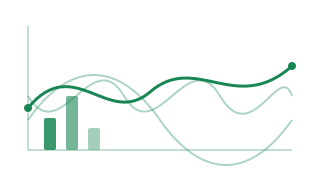
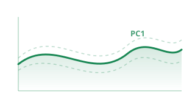
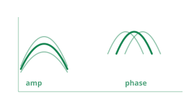
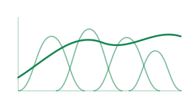
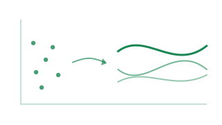
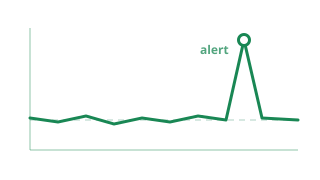
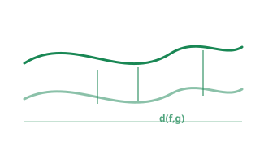

# Represent

**Decompose, transform, rank, and measure functional data.**

The Represent module brings together the core tools for analyzing functional data beyond simple summary statistics. Whether you need to extract the dominant modes of variation, project curves onto a finite basis, rank observations by their centrality, or quantify how different two functional samples are, this section has you covered.

<a class="fdars-gallery-item" href="fpca/">

Functional PCA

Extract dominant modes of variation with weighted FPCA.

</a>
<a class="fdars-gallery-item" href="elastic-fpca/">

Elastic FPCA

Separate amplitude and phase with horizontal, vertical, and joint FPCA.

</a>
<a class="fdars-gallery-item" href="basis-representation/">

Basis Representation

B-spline, Fourier, and P-spline expansions with automatic selection.

</a>
<a class="fdars-gallery-item" href="andrews-transformation/">

Andrews Transformation

Turn multivariate tables into curves for visual exploration.

</a>
<a class="fdars-gallery-item" href="depth-functions/">

Depth Functions

Fraiman-Muniz, band, modal, random projection, Tukey, and spatial depth.

</a>
<a class="fdars-gallery-item" href="streaming-depth/">

Streaming Depth

Flag out-of-distribution curves online against a reference window.

</a>
<a class="fdars-gallery-item" href="distance-metrics/">

Distance Metrics

Lp, Hausdorff, DTW, Soft-DTW, Fourier, and horizontal-shift distances.

</a>

!!! info "Scope & limitations"

    The Represent tools assume **real-valued functions sampled on a single shared grid**. Keep these boundaries in mind:

    - **FPCA and basis representation are linear.** They fit the best linear subspace of $L^2$ and assume the data lies near it. Strong nonlinear or phase (warping) variation is captured poorly — use [Elastic FPCA](elastic-fpca.md) (align first, then separate amplitude and phase) instead.
    - **Basis systems are B-spline and Fourier only** (with optional P-spline penalization); there are no density-specific bases.
    - **Constrained-range or density data is not supported.** Data that must stay nonnegative, integrate to 1, or remain bounded/monotone can be pushed out of its valid range by linear FPCA and means — transform to an unconstrained space (e.g. CLR or log-quantile-density) first.
    - **Sparse or irregular per-curve sampling is not supported.** Pre-smooth each curve onto the common grid first.
    - **Manifold-valued data is out of scope.**
