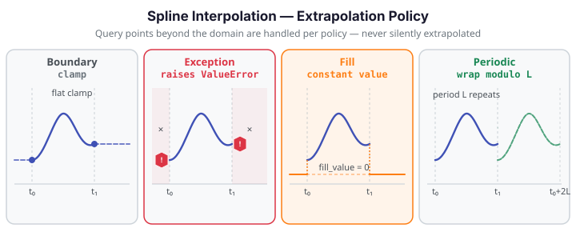

# Spline Interpolation

Spline interpolation fits a B-spline curve per observation and evaluates it at arbitrary query points. This resamples functional data onto any evaluation grid -- denser, sparser, or misaligned -- while preserving the smooth shape of each curve.

{ .fdars-diagram }

## When to use spline interpolation

- **Upsampling** -- go from a sparse measurement grid (e.g., 31 age points) to a fine inference grid (200 points) before computing velocities or depth functions.
- **Resampling to a common grid** -- align curves measured at different frequencies before analysis.
- **Controlled extrapolation** -- query beyond the observed domain with an explicit policy rather than silent extrapolation.

## How it works

For each of the $n$ curves in the data matrix $X$ (shape $n \times m$), `spline_interpolate` fits a B-spline of order $k$ through the observed evaluations $(t_1, \ldots, t_m)$ and evaluates the fit at the query grid $\tau_1, \ldots, \tau_q$. The result is an $n \times q$ matrix.

$$
\hat{X}_i(\tau) \;=\; \sum_{j=1}^{K} c_{ij}\,B_j^{(k)}(\tau), \quad \tau \in [t_1, t_m],
$$

where the coefficients $\mathbf{c}_i$ are the B-spline fit through the observed $m$ points. This is exact interpolation, not smoothing -- the fitted curve passes through all observed values.

## ExtrapolationPolicy

The base `spline_interpolate` raises `ValueError` when any query point falls outside $[t_1, t_m]$. Use `spline_interpolate_with_policy` to control this behaviour explicitly.

| Policy | String value | Behaviour |
|--------|-------------|-----------|
| Boundary | `"boundary"` | Clamp: return the spline value at the nearest domain endpoint |
| Exception | `"exception"` | Raise `ValueError` for any out-of-domain query (default) |
| Fill | `"fill"` | Assign a constant `fill_value` to all out-of-domain cells |
| Periodic | `"periodic"` | Wrap: map $\tau$ to the domain modulo $L = t_m - t_1$ before evaluating |

!!! warning "Exception policy raises — it does not extrapolate"
    With `policy="exception"` (the default), any query point outside $[t_1, t_m]$ raises
    `ValueError: query … is outside domain`. The curve is **not** extended beyond the observed
    domain. Use `"boundary"` for a safe default when small floating-point overruns occur.

!!! tip "Periodic policy for seasonal data"
    Canadian weather temperatures are inherently annual-periodic: day 366 should join
    naturally to day 1. With `policy="periodic"`, query points beyond day 365 wrap into the
    domain rather than raising. This is preferable to padding or clamping for truly cyclic data.

## Worked example

The fence below upsamples the Berkeley Growth Study height curves from the 31 original age
points onto a fine grid of 200 points, demonstrating both in-domain interpolation and the
`"boundary"` policy for safe handling of a query grid that slightly overshoots the data range.

```python exec="1" html="1" source="above"
import numpy as np
from docs_fig import fig, render
from docs_data import load_growth
from fdars.represent import spline_interpolate_with_policy

rng = np.random.default_rng(0)

# Load growth data: 93 children × 31 age points (ages 1–18)
age, X, meta = load_growth()

# Upsample onto a fine grid — boundary policy safely clamps any tiny overshoots
query = np.linspace(age[0], age[-1], 200)
X_fine = spline_interpolate_with_policy(
    X, age, query, policy="boundary", order=4
)

# Also demonstrate fill policy: query slightly beyond domain → filled with 0
query_wide = np.linspace(age[0] - 0.5, age[-1] + 0.5, 220)
X_fill = spline_interpolate_with_policy(
    X, age, query_wide, policy="fill", fill_value=0.0, order=4
)

f, (a0, a1) = fig(1, 2, figsize=(11, 4.0))

# Left: original sparse points vs smooth interpolant (first 6 curves)
for i in range(6):
    a0.plot(query, X_fine[i], lw=1.4, alpha=0.8)
a0.scatter(
    np.tile(age, 6),
    X[:6].ravel(),
    s=14, zorder=5, color="#1a1a2e", alpha=0.5
)
a0.set(
    title="Upsampled onto 200 points (policy='boundary')",
    xlabel="Age (years)", ylabel="Height (cm)"
)

# Right: fill policy effect at domain edges
a1.axvspan(query_wide[0], age[0], color="#dc3545", alpha=0.07, label="out-of-domain")
a1.axvspan(age[-1], query_wide[-1], color="#dc3545", alpha=0.07)
for i in range(6):
    a1.plot(query_wide, X_fill[i], lw=1.4, alpha=0.8)
a1.axhline(0, color="#fd7e14", lw=1.2, ls="--", alpha=0.7, label="fill_value=0")
a1.set(
    title="Fill policy: out-of-domain → 0 (shaded)",
    xlabel="Age (years)", ylabel="Height (cm)"
)
a1.legend()
print(render(f))
print("Interpolated shape:", X_fine.shape, " FDARS_FENCE_OK")
```

## Resampling convenience methods

`Fdata.resample()`, `Fdata.upsample()`, and `Fdata.downsample()` are thin wrappers that build a uniform evaluation grid over the current `rangeval` and delegate to `Fdata.interpolate()` — no new numerics, just grid construction.  The default `policy="boundary"` is chosen because the uniform linspace endpoints coincide with the domain edges, so boundary safely handles floating-point edge cases where the computed endpoint barely overshoots the domain.

| Method | Signature | Effect |
|--------|-----------|--------|
| `resample` | `fd.resample(n_points=N)` or `fd.resample(factor=F)` | Resample to exactly N points, or to `round(m × F)` points |
| `upsample` | `fd.upsample(factor)` | Increase to `ceil(m × factor)` points; `factor` must be > 1 |
| `downsample` | `fd.downsample(factor)` | Reduce to `max(2, int(m / factor))` points; `factor` must be > 1 |

Exactly one of `n_points` / `factor` must be passed to `resample`; passing both or neither raises `ValueError`.  `upsample` and `downsample` each require `factor > 1`.

```python exec="1" html="1" source="above"
import numpy as np
from docs_fig import fig, render
from docs_data import load_growth
from fdars import Fdata

# Load growth data: 93 children × 31 age points (ages 1–18)
age, X, meta = load_growth()

# Wrap into an Fdata object
fd = Fdata(X, argvals=age)

# Upsample 4× → 124 points; downsample 3× → 10 points
fd_up = fd.upsample(4)
fd_down = fd.downsample(3)

f, (a0, a1) = fig(1, 2, figsize=(11, 4.0))

# Left: upsampled curves
for i in range(6):
    a0.plot(fd_up.argvals, fd_up.data[i], lw=1.2, alpha=0.8)
a0.scatter(
    np.tile(age, 6),
    X[:6].ravel(),
    s=14, zorder=5, color="#1a1a2e", alpha=0.5,
)
a0.set(
    title=f"upsample(4): {fd.n_points} → {fd_up.n_points} points",
    xlabel="Age (years)", ylabel="Height (cm)",
)

# Right: downsampled curves
for i in range(6):
    a1.plot(fd_down.argvals, fd_down.data[i], lw=1.2, alpha=0.8, marker="o", ms=4)
a1.set(
    title=f"downsample(3): {fd.n_points} → {fd_down.n_points} points",
    xlabel="Age (years)", ylabel="Height (cm)",
)

print(render(f))
print(f"upsample(4) n_points = {fd_up.n_points}")
print(f"downsample(3) n_points = {fd_down.n_points}")
print("FDARS_FENCE_OK")
```

## API summary

| Function | Description |
|----------|-------------|
| `spline_interpolate(data, argvals, query_points, order)` | Interpolate to new query points; raises on out-of-domain queries |
| `spline_interpolate_with_policy(data, argvals, query_points, policy, fill_value, order)` | Same, with explicit extrapolation policy |
| `fdata_interpolate_with_policy(data, argvals, query_points, policy, fill_value, order)` | FdMatrix-level equivalent of the above |

All functions are imported from `fdars.represent`.

| Parameter | Type | Default | Description |
|-----------|------|---------|-------------|
| `data` | `ndarray (n, m)` | required | Functional data matrix; rows are observations |
| `argvals` | `ndarray (m,)` | required | Sorted evaluation points |
| `query_points` | `ndarray (q,)` | required | Points to evaluate at |
| `policy` | `str` | `"exception"` | One of `"boundary"`, `"exception"`, `"fill"`, `"periodic"` |
| `fill_value` | `float` | `0.0` | Replacement value for out-of-domain cells when `policy="fill"` |
| `order` | `int` | `4` | B-spline order: 1 = linear, 2 = quadratic, 4 = cubic |

## Interpolation vs smoothing

Interpolation and smoothing are both methods for representing functional observations from discrete evaluations, but they answer different questions.

**Interpolation** (`spline_interpolate`, `spline_interpolate_with_policy`) fits a curve that passes *exactly* through every observed value. The data are treated as ground truth — no noise model is assumed. Use interpolation when your measurements are precise (lab instruments, simulation outputs, deliberately chosen design points) and you want to resample or evaluate the same function at a different grid without losing fidelity.

**Smoothing** (e.g. `fdars.basis.pspline_fit_gcv`) fits a curve that trades fidelity to the data for *noise reduction*. The observed values are treated as noisy realisations of a smooth underlying function; the roughness penalty controls how aggressively noise is filtered. Use smoothing when your measurements contain observation error and you want to recover the underlying trend.

| Property | Interpolation | Smoothing (P-spline) |
|----------|--------------|---------------------|
| Passes through observed points | Yes (exactly) | No (in general) |
| Noise model assumed | None | Additive observation error |
| Bandwidth/penalty tuning | Order $k$ only | Penalty $\lambda$ (or GCV) |
| Result depends on noise level | No | Yes |
| Appropriate when | Clean data, known design points | Noisy measurements |

See [Smoothing](../learn/smoothing.md) for P-spline and kernel smoothing alternatives.

### Caveats

!!! warning "Oscillation risk with high-order splines on noisy data"
    B-spline interpolation of order $k$ through $m$ points fits a polynomial of degree $k-1$ between knots. For `order=4` (cubic, the default) this is generally well-behaved; higher orders (6, 8+) can produce **Runge-style oscillations** — large spurious excursions between observed points — especially when the data are unevenly spaced or contain measurement error. If you observe oscillating reconstructions, lower the order or switch to smoothing.

!!! warning "Aliasing on coarse or irregular grids"
    If the observed grid $t_1, \ldots, t_m$ is too coarse relative to the true signal frequency, the B-spline fits a smooth curve through undersampled data. The result is not the true signal — it is a smooth curve consistent with the observations, but it may miss high-frequency features. Inspect the spacing of your argvals relative to the expected frequency content of your curves before interpreting interpolated values.

## References

- Ramsay, J.O., Silverman, B.W. (2005). *Functional Data Analysis*, 2nd ed. Springer.
- de Boor, C. (1978). *A Practical Guide to Splines.* Springer.
