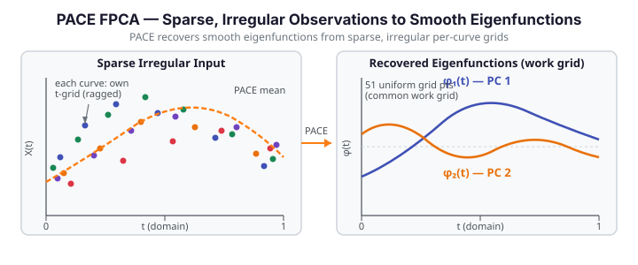

# PACE — FPCA for Sparse, Irregular Data

PACE (Principal Analysis by Conditional Expectation) extends functional PCA to the realistic setting where each curve is observed at its **own sparse, irregular grid** — not on a shared dense grid. Clinical longitudinal studies, sensor networks with missed readings, and ecological monitoring data all produce this kind of input. Standard FPCA requires a common grid and breaks when curves have different numbers of observations at different locations. PACE handles it correctly.

The key idea: PACE first estimates the population mean and covariance surface nonparametrically from all available observation pairs, then recovers individual FPC scores via conditional expectation given the sparse observations. The result is a set of **smooth eigenfunctions** on a common work grid, plus scores and fitted curves for every observation — even those with only a handful of measurement points.

{ .fdars-diagram }

## Theory

Every square-integrable random function $X_i(t)$ admits the Karhunen-Loève expansion

$$
X_i(t) = \mu(t) + \sum_{k=1}^{\infty} \xi_{ik}\,\phi_k(t)
$$

where $\mu(t)$ is the population mean, $\phi_k(t)$ the $k$-th eigenfunction of the covariance operator, and $\xi_{ik}$ the corresponding score. With dense, regular observations we estimate the covariance directly from the data matrix. With sparse, irregular observations we cannot: different curves are observed at different time points, so the sample covariance matrix is largely missing.

PACE estimates the covariance surface $C(s,t)$ by local linear smoothing of all cross-product pairs $(X_i(s_j),\, X_i(t_k))$ at distinct time pairs $(s_j, t_k)$ within each curve, pooled across curves. The diagonal (measurement error) is handled separately. Eigen-decomposition of the estimated surface yields $\hat\phi_k$ and $\hat\lambda_k$ on the common work grid.

Scores are then recovered by conditional expectation:

$$
\hat\xi_{ik} = \hat\lambda_k\,\hat\phi_k^\top \boldsymbol{\Sigma}_i^{-1}\bigl(\mathbf{y}_i - \hat\boldsymbol{\mu}_i\bigr)
$$

where $\mathbf{y}_i$ is the vector of observed values for curve $i$, $\hat\boldsymbol{\mu}_i$ is the mean evaluated at those time points, and $\boldsymbol{\Sigma}_i = \hat\lambda_k\hat\phi_k\hat\phi_k^\top + \hat\sigma^2 I$ is the marginal covariance at the observed locations.

### `irreg_fdata_from_lists` — building the sparse input handle

| Parameter | Type | Description |
|---|---|---|
| `argvals_list` | `list[ndarray (n_i,)]` | List of 1-D arrays — evaluation grid for curve $i$ (ragged; lengths may differ) |
| `values_list` | `list[ndarray (n_i,)]` | List of 1-D arrays — observed values for curve $i$ (must match `argvals_list[i]` in length) |

Returns an opaque `PyIrregFdata` handle for use with `pace_fpca`.

!!! warning "2-D numpy arrays are rejected"
    `irreg_fdata_from_lists` requires **two Python lists of 1-D arrays** — one list per curve for the grid and one for the values. Passing a dense 2-D numpy array `(n, m)` raises a `ValueError`. Build the lists explicitly before calling the function.

### `pace_fpca` — fitting PACE-FPCA

| Parameter | Type | Default | Description |
|---|---|---|---|
| `data` | `PyIrregFdata` | — | Handle from `irreg_fdata_from_lists` |
| `ncomp` | `int` | `3` | Number of principal components to request |
| `bandwidth` | `float` | `0.1` | Kernel bandwidth for covariance surface smoothing; increase for sparser data (≥ 0.15 recommended for data on [0, 1] with few points per curve) |
| `sigma2` | `float` | `0.01` | Measurement error variance; increase if observations are noisy |
| `work_grid` | `list[float] \| None` | `None` | Evaluation grid for mean and eigenfunctions; `None` → 51 uniformly spaced points on [0, 1] |
| `alpha` | `float` | `0.05` | Significance level for pointwise confidence bands |

### Returns

| Key | Shape | Description |
|---|---|---|
| `mean` | `(m,)` | Estimated mean function on the work grid |
| `eigenvalues` | `(ncomp,)` | Eigenvalues $\hat\lambda_1 \ge \hat\lambda_2 \ge \cdots$ |
| `eigenfunctions` | `(m, ncomp)` | Estimated eigenfunctions; **column $k$ is the $k$-th eigenfunction** $\hat\phi_{k+1}(t)$ |
| `scores` | `(n, ncomp)` | Conditional-expectation FPC scores $\hat\xi_{ik}$ |
| `fitted` | `(n, m)` | Fitted curves $\hat\mu(t) + \sum_k \hat\xi_{ik}\hat\phi_k(t)$ on the work grid |
| `fitted_lower` | `(n, m)` | Lower pointwise confidence band for each fitted curve |
| `fitted_upper` | `(n, m)` | Upper pointwise confidence band for each fitted curve |
| `argvals` | `(m,)` | Work grid used for all function evaluations |
| `sigma2` | `float` | Estimated measurement error variance (may differ from the input if re-estimated) |
| `ncomp` | `int` | **Actual** number of components retained (may be less than requested if the covariance estimate has fewer positive eigenvalues) |

!!! note "Actual component count"
    The `ncomp` value in the returned dict is the **actual** count of components retained and may be less than the requested `ncomp` parameter. Always read `res["ncomp"]` to determine the true length of the `eigenvalues` array and the number of columns in `eigenfunctions` and `scores`.

## Example — synthetic sparse irregular data

```python exec="1" html="1" source="above"
import numpy as np
from docs_fig import fig, render
import fdars.pace_fpca as pf

rng = np.random.default_rng(42)
n = 15  # sparse curves; each has only 5-8 observations

# Build ragged per-curve grids: different number of points, different positions per curve
argvals_list = [np.sort(rng.uniform(0, 1, rng.integers(5, 9))) for _ in range(n)]
values_list  = [np.sin(2 * np.pi * av) + rng.normal(0, 0.15, len(av))
                for av in argvals_list]

# IMPORTANT: pass Python lists of 1-D arrays — NOT a 2-D numpy array
handle = pf.irreg_fdata_from_lists(argvals_list, values_list)
res = pf.pace_fpca(handle, ncomp=2, bandwidth=0.2, sigma2=0.05)

ef = np.asarray(res["eigenfunctions"])   # shape (m, ncomp) — column k is PC k
argvals_out = np.asarray(res["argvals"]) # common work grid

f, (a0, a1) = fig(1, 2, figsize=(11.0, 3.8))

# Left: scatter sparse observations per curve + PACE mean
for av, vl in zip(argvals_list, values_list):
    a0.scatter(av, vl, s=18, color="#3f51b5", alpha=0.45)
a0.plot(argvals_out, np.asarray(res["mean"]), color="#e8710a", lw=2.4, label="PACE mean")
a0.set(title=f"Sparse irregular observations (n={n}, ragged grids)", xlabel="t")
a0.legend(fontsize=9)

# Right: recovered smooth eigenfunctions on common work grid
a1.plot(argvals_out, ef[:, 0], color="#3f51b5", lw=2.4, label="PC 1")
a1.plot(argvals_out, ef[:, 1], color="#e8710a", lw=2.4, label="PC 2")
a1.axhline(0, color="#ced4da", lw=0.8, ls="--")
a1.set(title="PACE eigenfunctions recovered on work grid", xlabel="t")
a1.legend(fontsize=9)

print(render(f))
print(f"actual ncomp={res['ncomp']}  scores shape={np.asarray(res['scores']).shape}")
print("FDARS_FENCE_OK")
```

## PACE vs standard FPCA

Standard FPCA (`fdars.regression.fpca`) assumes every curve is observed at the **same dense common grid** — it operates on a full $n \times m$ matrix. When curves are sparse or ragged, the matrix cannot be formed, and `reg.fpca` fails or requires imputation that distorts the covariance structure.

PACE recovers the population mean and covariance surface directly from pooled sparse observation pairs, then extracts scores by conditional expectation — it never requires a complete data matrix. The table below summarises the trade-offs:

| Aspect | `reg.fpca` (standard) | `pf.pace_fpca` (PACE) |
|--------|----------------------|----------------------|
| Input | Dense `(n, m)` matrix (common grid) | `PyIrregFdata` handle (ragged grids) |
| Minimum obs. per curve | All $m$ points | As few as 2–3 per curve |
| Covariance estimation | Direct from data matrix | Local linear smoothing of pooled pairs |
| Score recovery | Truncated KL projection | Conditional expectation (BLUP) |
| Key parameter | `n_comp` | `ncomp`, `bandwidth`, `sigma2` |

### When PACE helps vs basis smoothing

PACE is the right choice when curves are observed at **sparse, irregular, ragged** time points and the measurement error is non-negligible. It can fail if:

- **Too few points per curve** (fewer than 2–3): the conditional-expectation formula becomes ill-conditioned and scores are unreliable.
- **Bandwidth too small for the sparsity level**: the covariance surface smoother cannot see enough pooled pairs, producing a noisy covariance estimate. A bandwidth around 0.15–0.3 of the domain width is a safe starting point for data on $[0, 1]$ with 5–10 points per curve (see bandwidth guidance in the `pace_fpca` parameters table above).

When curves are **dense but observed on non-uniform individual grids**, consider basis smoothing (e.g., `fdars.smoothing`) to interpolate to a common grid first, then run `reg.fpca`. The PACE kernel smoother adds bandwidth-tuning overhead that is unnecessary if the data is merely irregular rather than sparse.

### Example — comparing PACE and standard FPCA on the same data

The fence below builds one small synthetic dense dataset, runs `reg.fpca` on the full matrix, then subsamples each curve to a ragged sparse set and runs `pf.pace_fpca`. It compares the leading eigenfunction (correlation, up to sign) and leading eigenvalue from each method to show that PACE recovers a consistent estimate from sparse observations.

```python exec="1" html="1" source="above"
import numpy as np
from docs_fig import fig, render, fast
import fdars.regression as reg
import fdars.pace_fpca as pf

rng = np.random.default_rng(7)
n, m = 15, 40
t = np.linspace(0, 1, m)

# Dense synthetic dataset (two-component KL model)
phi1 = np.sqrt(2) * np.sin(2 * np.pi * t)
phi2 = np.sqrt(2) * np.cos(2 * np.pi * t)
scores_true = rng.normal(0, 1, (n, 2)) * np.array([[1.5, 0.8]])
X_dense = scores_true[:, 0:1] * phi1 + scores_true[:, 1:2] * phi2
X_dense += rng.normal(0, 0.1, X_dense.shape)

# --- Standard FPCA on the full dense matrix ---
res_fpca = reg.fpca(X_dense, t, n_comp=2)
ef_dense = np.asarray(res_fpca["rotation"])    # (m, 2) — column k is PC k
sv_dense = np.asarray(res_fpca["singular_values"])  # (2,) singular values

# Eigenvalues from standard FPCA (singular_values are sqrt(n*lambda_k))
eig_dense = sv_dense ** 2 / n

# --- PACE-FPCA on the sparse subsampled version ---
# Subsample each curve to 5-8 irregular points
argvals_list = [np.sort(rng.choice(t, size=rng.integers(5, 9), replace=False))
                for _ in range(n)]
values_list  = [np.interp(av, t, X_dense[i]) + rng.normal(0, 0.1, len(av))
                for i, av in enumerate(argvals_list)]

handle = pf.irreg_fdata_from_lists(argvals_list, values_list)
bw = fast(0.25, 0.25)
res_pace = pf.pace_fpca(handle, ncomp=2, bandwidth=bw, sigma2=0.05,
                        work_grid=list(t))
ef_pace = np.asarray(res_pace["eigenfunctions"])  # (m, ncomp)
eig_pace = np.asarray(res_pace["eigenvalues"])     # (ncomp,)

# Leading eigenfunctions: correlate (up to sign) — both should be close to phi1
ef1_dense = ef_dense[:, 0]
ef1_pace  = ef_pace[:, 0]
sign = np.sign(np.dot(ef1_dense, ef1_pace))
corr_pc1 = np.dot(ef1_dense, sign * ef1_pace) / (
    np.linalg.norm(ef1_dense) * np.linalg.norm(ef1_pace)
)

f, (a0, a1) = fig(1, 2, figsize=(12.0, 3.8))

a0.plot(t, ef1_dense, color="#3f51b5", lw=2.2, label="Standard FPCA (dense)")
a0.plot(t, sign * ef1_pace, color="#e8710a", lw=2.2, ls="--", label="PACE (sparse)")
a0.set(title=f"PC 1 comparison  (corr={corr_pc1:.3f})", xlabel="t",
       ylabel="eigenfunction")
a0.legend(fontsize=9)

a1.bar(["PC 1", "PC 2"], eig_dense[:2], color="#3f51b5", alpha=0.7,
       label="Standard FPCA")
a1.bar(["PC 1", "PC 2"], eig_pace[:2], color="#e8710a", alpha=0.55,
       label="PACE", width=0.4, align="edge")
a1.set(title="Leading eigenvalues", ylabel="eigenvalue")
a1.legend(fontsize=9)

print(render(f))
print(f"Standard FPCA  eig1={eig_dense[0]:.3f}  eig2={eig_dense[1]:.3f}")
print(f"PACE           eig1={eig_pace[0]:.3f}  eig2={eig_pace[1]:.3f}")
print(f"PC 1 alignment: corr(dense, pace)={corr_pc1:.3f} (close to ±1 when PACE recovers well)")
print("FDARS_FENCE_OK")
```

## References

1. Yao, F., Müller, H.-G. & Wang, J.-L. (2005). Functional data analysis for sparse longitudinal data. *Journal of the American Statistical Association*, 100(470), 577–590.
2. Hall, P., Müller, H.-G. & Wang, J.-L. (2006). Properties of principal component methods for functional and longitudinal data analysis. *The Annals of Statistics*, 34(3), 1493–1517.
