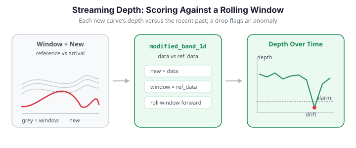

# Streaming Depth Computation

Functional [depth](depth-functions.md) is a batch computation: you hand it a fixed sample and it scores every curve against that sample. But many applications produce curves *over time* -- sensor traces, daily load profiles, per-request latency curves -- and you want to know, as each new curve arrives, whether it looks like the recent past or has drifted out of distribution. This page describes a **streaming pattern** built on the existing batch depth primitives: keep a rolling *reference window* of recent curves, and score each incoming curve's depth against that window. A sudden drop in depth flags an anomaly.


!!! warning "No streaming binding in fdars"
    `fdars` has **no** streaming-specific depth function. Every depth routine in `fdars.depth` is batch. What follows is a **usage pattern** implemented in numpy on top of those batch primitives -- specifically by calling `modified_band_1d(new_batch, reference_window)`, which is exactly what the `data` / `ref_data` split is designed for.

{ .fdars-diagram }

## The key idea: `data` vs `ref_data`

Every `fdars.depth` function takes two arguments: the curves to *score* (`data`) and the reference sample to score *against* (`ref_data`). In the batch setting these are usually the same array (self-depth). Streaming simply keeps them **different**:

```python
from fdars.depth import modified_band_1d

# score the newly arrived curve(s) against the reference window
depth = modified_band_1d(new_curves, reference_window)
```

| Argument | Streaming role |
|----------|----------------|
| `data` | The just-arrived curve(s) to score |
| `ref_data` | The rolling window of recent "normal" curves |

Low depth means the new curve sits at the edge of, or outside, the distribution described by the window.

## What the depth statistic actually measures

To reason about *why* a depth drop signals drift, we need the definition of the score. Both primitives used here reduce a whole curve to a single number in $[0,1]$ that is large near the "center" of the reference sample and small at its edges.

**Modified band depth (MBD).** Given a reference sample $W = \{y_1,\dots,y_n\}$ observed on a grid $t_1<\dots<t_m$, band depth looks at every *pair* $(y_i, y_j)$ and asks how much of the query curve $x$ lies inside the band they trace out. Let

$$
A(x;\, y_i, y_j) \;=\; \bigl\{\, t_k \;:\; \min(y_i(t_k),\,y_j(t_k)) \le x(t_k) \le \max(y_i(t_k),\,y_j(t_k)) \,\bigr\}
$$

be the set of grid points at which $x$ is *contained* in the band of the pair. The **modified** band depth averages the *fraction of time contained* over all $\binom{n}{2}$ pairs:

$$
\mathrm{MBD}(x \mid W) \;=\; \binom{n}{2}^{-1} \sum_{1 \le i < j \le n} \frac{\bigl\lvert A(x;\,y_i,y_j)\bigr\rvert}{m}.
$$

The original band depth (BD) uses the all-or-nothing indicator $\mathbf{1}\{\lvert A\rvert = m\}$ instead of the fraction, which makes it far more conservative; the "modified" version is smoother and almost never zero, which is exactly what a streaming threshold needs.

**Fraiman–Muniz (FM) depth.** FM builds a curve score from *pointwise* rank depth. At a single grid point $t_k$, with $F_{m,t_k}$ the empirical CDF of $\{y_1(t_k),\dots,y_n(t_k)\}$, the univariate depth of the value $x(t_k)$ is

$$
D_{t_k}(x) \;=\; 1 - \left\lvert \tfrac12 - F_{m,t_k}\!\bigl(x(t_k)\bigr) \right\rvert,
$$

which is maximal ($=1$) at the pointwise median and shrinks toward $\tfrac12$ in the tails. Integrating over the domain gives the functional score:

$$
\mathrm{FM}(x \mid W) \;=\; \int D_t(x)\,\mathrm{d}t \;\approx\; \frac{1}{m}\sum_{k=1}^{m} D_{t_k}(x).
$$

Because FM aggregates rank *height* pointwise, it is sensitive to **magnitude** shifts (a curve lifted bodily out of the pack ranks near an extreme everywhere). MBD, counting band *membership*, reacts to both magnitude and moderate **shape** departures. This distinction is what makes the choice of primitive matter for what kind of drift the monitor sees — see [Swapping the depth measure](#swapping-the-depth-measure).

## The streaming loop

The pattern is a loop with three moves per arriving curve:

1. **Score** the new curve against the current window.
2. **Decide** whether it is anomalous by comparing its depth to a threshold derived from the window's own depth distribution.
3. **Update** the window -- append the new curve and drop the oldest, so the reference tracks slow, legitimate drift. Crucially, curves flagged as anomalies are **not** folded in, otherwise the window would be contaminated and future anomalies would look normal.

```python exec="1" html="1" source="above"
import numpy as np
from docs_fig import fig, render
from fdars.simulation import simulate
from fdars.depth import modified_band_1d

t = np.linspace(0, 1, 80)

def new_curve(seed, shift=0.0):
    """One incoming curve; `shift` injects an out-of-distribution anomaly."""
    return np.asarray(
        simulate(n=1, argvals=t, n_basis=5, efun_type="fourier", seed=seed)
    ) + shift

# Seed the reference window with recent-history curves.
window = np.asarray(
    simulate(n=25, argvals=t, n_basis=5, efun_type="fourier", seed=1))
MAX_WINDOW = 25

depths, flags = [], []
for step in range(60):
    shift = 4.0 if 30 <= step < 34 else 0.0        # anomaly burst
    x = new_curve(200 + step, shift)

    # 1. score the new curve against the window
    d = float(np.asarray(modified_band_1d(x, window))[0])
    depths.append(d)

    # 2. threshold = low quantile of the window's own self-depth
    self_depth = np.asarray(modified_band_1d(window, window))
    threshold = np.quantile(self_depth, 0.05)
    is_anomaly = d < threshold
    flags.append(is_anomaly)

    # 3. update the window only with in-distribution curves
    if not is_anomaly:
        window = np.vstack([window, x])[-MAX_WINDOW:]

depths = np.asarray(depths)
flags = np.asarray(flags)

f, ax = fig()
ax.plot(depths, "-", color="#3f51b5", lw=1.6, label="streaming depth")
ax.scatter(np.where(flags)[0], depths[flags],
           color="#dc3545", zorder=5, s=40, label="flagged anomaly")
ax.axvspan(30, 34, color="#e8710a", alpha=0.15, label="injected anomaly")
ax.set(title="Depth over time drops sharply during the anomaly burst",
       xlabel="arrival index", ylabel="depth vs reference window")
ax.legend()
print(render(f))
```

The depth trace hovers in a normal band, then collapses during the injected burst; the low-quantile threshold catches every anomalous arrival while the window stays uncontaminated.

## Choosing the threshold

Two simple, robust rules work well:

- **Quantile of window self-depth** (used above): compute `modified_band_1d(window, window)` and flag any new curve below, say, the 5th percentile. This adapts automatically as the window's spread changes.
- **Depth boxplot rule**: with $q_1$ and $\mathrm{IQR}$ the first quartile and interquartile range of the window's self-depth, flag curves below $q_1 - 1.5\,\mathrm{IQR}$ -- the same rule the [functional boxplot](../analyze/outlier-detection.md) uses.

$$
\text{flag if} \quad D(x \mid W) < q_{1} - 1.5\,\mathrm{IQR}\bigl(D(W \mid W)\bigr)
$$

Recomputing the window self-depth every step is $O(\lvert W\rvert^2 m)$; for a modest window (a few dozen curves) this is negligible, which is what makes the pattern practical online (see [Computational cost](#computational-cost) for the full accounting and the caveat about what these numpy loops do *not* achieve).

## Window size and drift

The window length trades responsiveness against stability.

| Window | Behavior |
|--------|----------|
| Short (10--20) | Tracks drift quickly; noisier thresholds, more false alarms |
| Long (50--100) | Stable thresholds; slower to accept legitimate regime changes |

Because the loop refreshes the window with accepted curves, slow legitimate drift is absorbed -- a curve that would have been anomalous against last month's window becomes normal once the window has migrated. Sudden shifts still spike because the window has not yet caught up. The panel below contrasts a short and a long window on the same stream with a permanent regime change at step 30.

```python exec="1" html="1"
import numpy as np
from docs_fig import fig, render
from fdars.simulation import simulate
from fdars.depth import modified_band_1d

t = np.linspace(0, 1, 80)

def new_curve(seed, shift=0.0):
    return np.asarray(
        simulate(n=1, argvals=t, n_basis=5, efun_type="fourier", seed=seed)) + shift

def run_stream(max_window):
    window = np.asarray(
        simulate(n=max_window, argvals=t, n_basis=5, efun_type="fourier", seed=1))
    depths = []
    for step in range(60):
        shift = 2.5 if step >= 30 else 0.0          # permanent regime change
        x = new_curve(300 + step, shift)
        d = float(np.asarray(modified_band_1d(x, window))[0])
        depths.append(d)
        window = np.vstack([window, x])[-max_window:]  # absorb everything
    return np.asarray(depths)

short = run_stream(12)
long = run_stream(60)

f, ax = fig()
ax.plot(short, color="#e8710a", lw=1.6, label="short window (12)")
ax.plot(long, color="#3f51b5", lw=1.6, label="long window (60)")
ax.axvline(30, ls="--", color="#6c757d", lw=1, label="regime change")
ax.set(title="Short windows re-normalize faster after a permanent shift",
       xlabel="arrival index", ylabel="depth vs reference window")
ax.legend()
print(render(f))
```

The short window's depth recovers quickly as it fills with post-shift curves; the long window stays depressed far longer because it still remembers the old regime.

## Process monitoring: a depth control chart

The same pattern powers a functional statistical-process-control (SPC) chart. In **phase 1** you establish a reference from an in-control process and set a control limit from a low quantile of the reference self-depth. In **phase 2** you score each incoming curve against that fixed reference and raise an alarm whenever its depth falls below the limit. Unlike a univariate control chart, this monitors the *entire curve shape* at once.

```python exec="1" html="1" source="above"
import numpy as np
from docs_fig import fig, render
from fdars.depth import modified_band_1d

rng = np.random.default_rng(42)
t = np.linspace(0, 1, 100)
m = t.size

def in_control(k):
    return np.sin(2 * np.pi * t) + rng.normal(0, 0.2) + 0.05 * rng.standard_normal(m)

# Phase 1: reference from an in-control process; control limit = 2nd percentile.
ref = np.array([in_control(i) for i in range(60)])
d_ref = np.asarray(modified_band_1d(ref, ref))
control_limit = np.quantile(d_ref, 0.02)

# Phase 2: monitor 50 curves; the process mean shifts up at curve 35.
n_new, shift_point = 50, 35
depths = []
for i in range(n_new):
    x = in_control(i)
    if i >= shift_point:
        x = x + 0.8                                   # out-of-control shift
    depths.append(float(np.asarray(modified_band_1d(x[None, :], ref))[0]))
depths = np.asarray(depths)
alarm = depths < control_limit

f, ax = fig()
ax.plot(depths, color="#6c757d", lw=0.8, zorder=1)
ax.scatter(np.where(~alarm)[0], depths[~alarm], color="#3f51b5", s=22,
           label="in control")
ax.scatter(np.where(alarm)[0], depths[alarm], color="#dc3545", s=36,
           zorder=5, label="alarm")
ax.axhline(control_limit, ls="--", color="#dc3545", lw=1, label="control limit")
ax.axvline(shift_point - 0.5, ls=":", color="#6c757d", lw=1, label="true shift")
ax.set(title="Streaming-depth control chart (shift at curve 35)",
       xlabel="curve index", ylabel="depth vs reference")
ax.legend(fontsize=8)
print(render(f))
```

Depth stays comfortably above the limit while the process is in control, then drops below it once the mean shifts, generating a run of alarms. The same $q_1 - 1.5\,\mathrm{IQR}$ rule from the [functional boxplot](../analyze/outlier-detection.md) can replace the fixed quantile for the control limit.

### Smoothing the alarm: an EWMA depth chart

A single low depth can be a fluke; a *sustained* depression is real drift. The classic fix is a Shewhart chart's exponentially weighted moving average (EWMA). Let $D_i = \mathrm{depth}(x_i \mid \text{ref})$ be the raw streaming depth of the $i$-th curve. The EWMA statistic with smoothing constant $\lambda \in (0,1]$ is

$$
Z_i \;=\; \lambda\, D_i \;+\; (1-\lambda)\, Z_{i-1}, \qquad Z_0 = \mu_0,
$$

where $\mu_0$ is the in-control mean depth. Under independence with in-control variance $\sigma_0^2$, the EWMA variance settles to

$$
\sigma_{Z_i}^2 \;=\; \sigma_0^2 \,\frac{\lambda}{2-\lambda}\bigl[1-(1-\lambda)^{2i}\bigr] \;\xrightarrow{i\to\infty}\; \sigma_0^2\,\frac{\lambda}{2-\lambda},
$$

so a **one-sided lower control limit** (we only care about depth *dropping*) is

$$
\mathrm{LCL}_i \;=\; \mu_0 \;-\; L\,\sigma_0\sqrt{\tfrac{\lambda}{2-\lambda}\bigl[1-(1-\lambda)^{2i}\bigr]},
$$

with $L$ (typically $2.5$–$3$) setting the false-alarm rate. Small $\lambda$ integrates over a long memory and catches slow drift the raw chart misses; $\lambda=1$ recovers the plain Shewhart chart above.

```python exec="1" html="1" source="above"
import numpy as np
from docs_fig import fig, render
from fdars.depth import modified_band_1d

rng = np.random.default_rng(7)
t = np.linspace(0, 1, 100)
m = t.size

def in_control(shift=0.0):
    return np.sin(2 * np.pi * t) + rng.normal(0, 0.2) + shift + 0.05 * rng.standard_normal(m)

# Phase 1: reference + in-control depth moments (mu0, sigma0).
ref = np.array([in_control() for _ in range(60)])
d_ref = np.asarray(modified_band_1d(ref, ref))
mu0, sigma0 = d_ref.mean(), d_ref.std()

# Phase 2: a *small, slow* drift that the raw chart barely notices.
n_new, shift_point = 60, 30
depths = []
for i in range(n_new):
    creep = 0.35 if i >= shift_point else 0.0          # gentle regime creep
    depths.append(float(np.asarray(modified_band_1d(in_control(creep)[None, :], ref))[0]))
depths = np.asarray(depths)

# EWMA recursion with a one-sided lower limit.
lam, L = 0.25, 2.6
Z = np.empty(n_new)
prev = mu0
for i, d in enumerate(depths):
    prev = lam * d + (1 - lam) * prev
    Z[i] = prev
idx = np.arange(1, n_new + 1)
lcl = mu0 - L * sigma0 * np.sqrt(lam / (2 - lam) * (1 - (1 - lam) ** (2 * idx)))
ewma_alarm = Z < lcl
raw_alarm = depths < np.quantile(d_ref, 0.02)

f, ax = fig()
ax.plot(depths, color="#c7ccd6", lw=0.9, label="raw depth $D_i$", zorder=1)
ax.plot(Z, color="#3f51b5", lw=1.8, label=r"EWMA $Z_i$ ($\lambda=0.25$)")
ax.plot(lcl, ls="--", color="#dc3545", lw=1.2, label="one-sided LCL")
ax.scatter(np.where(ewma_alarm)[0], Z[ewma_alarm], color="#dc3545", s=34,
           zorder=5, label="EWMA alarm")
ax.axvline(shift_point - 0.5, ls=":", color="#6c757d", lw=1, label="true creep")
first_raw = np.argmax(raw_alarm) if raw_alarm.any() else None
ax.set(title="EWMA catches a slow creep the raw chart lets through",
       xlabel="curve index", ylabel="depth statistic")
ax.legend(fontsize=8)
print(render(f))
```

The raw depth wanders around and only dips below its 2nd-percentile limit sporadically after the creep; the EWMA, integrating the persistent downward pressure, crosses its limit cleanly and *stays* alarmed. This is the standard trade-off: EWMA adds detection *latency* (a few steps of averaging) in exchange for far fewer missed slow shifts.

## How good is the detector? Threshold and ROC

The threshold quantile $\alpha$ is the one knob that trades false alarms against misses. Treating each arriving curve as either in- or out-of-distribution turns the streaming monitor into a binary classifier whose operating point is set by $\alpha$: the flag rule is $D(x\mid W) < Q_\alpha\bigl(D(W\mid W)\bigr)$. Sweeping $\alpha$ from $0$ to $1$ traces a receiver operating characteristic (ROC) curve, and the **area under it (AUC)** summarizes how separable in-distribution and anomalous curves are by depth alone — independent of any single threshold choice.

```python exec="1" html="1" source="above"
import numpy as np
from docs_fig import fig, render
from fdars.simulation import simulate
from fdars.depth import modified_band_1d

t = np.linspace(0, 1, 80)
window = np.asarray(simulate(n=40, argvals=t, n_basis=5, efun_type="fourier", seed=1))

def stream(shift, n=120, base_seed=500):
    """Score n curves; return depths and a boolean 'is anomaly' label."""
    depths, labels = [], []
    for k in range(n):
        anomalous = k % 2 == 0                       # alternate normal / shifted
        x = np.asarray(simulate(n=1, argvals=t, n_basis=5,
                                efun_type="fourier", seed=base_seed + k))
        x = x + (shift if anomalous else 0.0)
        depths.append(float(np.asarray(modified_band_1d(x, window))[0]))
        labels.append(anomalous)
    return np.asarray(depths), np.asarray(labels)

def roc(depths, labels):
    """ROC by sweeping the depth threshold; low depth = anomaly."""
    order = np.argsort(depths)                        # ascending: most anomalous first
    y = labels[order]
    tpr = np.concatenate([[0], np.cumsum(y) / max(y.sum(), 1)])
    fpr = np.concatenate([[0], np.cumsum(~y) / max((~y).sum(), 1)])
    auc = np.trapezoid(tpr, fpr)
    return fpr, tpr, auc

f, ax = fig()
for shift, color in [(1.0, "#c7ccd6"), (2.0, "#e8710a"), (3.5, "#3f51b5")]:
    fpr, tpr, auc = roc(*stream(shift))
    ax.plot(fpr, tpr, color=color, lw=1.8,
            label=f"shift = {shift}  (AUC = {auc:.2f})")
ax.plot([0, 1], [0, 1], ls=":", color="#6c757d", lw=1, label="chance")
ax.set(title="Depth separates anomalies better as the shift grows",
       xlabel="false-alarm rate", ylabel="detection rate", xlim=(0, 1), ylim=(0, 1))
ax.legend(fontsize=8, loc="lower right")
print(render(f))
```

Bigger out-of-distribution shifts push the ROC toward the top-left corner (AUC $\to 1$): the depth of a badly displaced curve is unambiguously low, so almost any threshold catches it. Faint shifts hug the diagonal, where depth alone can barely tell drift from noise — the regime where the EWMA memory above earns its keep.

## Computational cost

The reason this pattern is viable online is the asymmetry between building a reference and querying it. A full self-depth over $N$ curves on an $m$-point grid is $O(N^2 m)$ — every curve is compared against every band. But **scoring one new curve against a fixed, pre-processed reference is much cheaper.** For rank-based depths (FM, and the pointwise machinery under MBD), the reference values at each grid point can be *pre-sorted* once in $O(N m \log N)$; thereafter locating where a query value $x(t_k)$ falls in the sorted column is a binary search in $O(\log N)$, so a single query costs

$$
\underbrace{O(m \log N)}_{\text{per query curve}} \quad\text{vs.}\quad \underbrace{O(N^2 m)}_{\text{full batch self-depth}}.
$$

Over a stream of $T$ arrivals this is $O(T\, m \log N)$ — the $O(T \log N)$ scaling (for fixed grid $m$) that makes continuous monitoring practical.

!!! warning "The Python pattern does not achieve $O(T\log N)$"
    `fdars.depth.modified_band_1d(x, window)` recomputes depth from scratch on each call; there is **no** incremental/pre-sorted binding exposed in Python. The loops on this page are therefore $O(T \cdot \lvert W\rvert^2 m)$ in the worst case — perfectly fine for the few-dozen-curve windows shown, but *not* the asymptotically optimal streaming algorithm. The $O(T\log N)$ figure describes what a purpose-built streaming implementation achieves, not what these numpy loops do. Recomputing the window self-depth every step (for the adaptive threshold) is the dominant cost; cache it and refresh only when the window changes to cut the constant factor.

## Swapping the depth measure

Any 1D depth from `fdars.depth` slots into the loop -- just replace the call. `fraiman_muniz_1d` is a common alternative that is sensitive to magnitude shifts:

```python
from fdars.depth import fraiman_muniz_1d

d = fraiman_muniz_1d(new_curves, reference_window)   # same data / ref_data split
```

For shape anomalies rather than magnitude, `random_tukey_1d` or `modal_1d` are better choices; see the [depth comparison table](depth-functions.md#comparison-table).

!!! note "This is a pattern, not a primitive"
    Nothing here is special to `fdars` beyond the batch depth call. If you need genuine online efficiency (incremental band-depth updates, sketched references), you would implement that yourself; the value of the pattern is that a handful of numpy lines around a batch depth function already gives a usable out-of-distribution detector.

## API summary

| Component | Where | Role in the pattern |
|-----------|-------|---------------------|
| `modified_band_1d(data, ref_data)` | `fdars.depth` | Score new curves vs the window |
| `fraiman_muniz_1d(data, ref_data, scale)` | `fdars.depth` | Magnitude-sensitive alternative |
| rolling window + threshold | numpy (this page) | The streaming loop itself |
| `simulate(...)` | `fdars.simulation` | Generates the example stream |

## References

- Fraiman, R. and Muniz, G. (2001). Trimmed means for functional data. *Test* 10(2), 419-440. *(The FM pointwise-rank depth $D_{t}(x) = 1 - \lvert \tfrac12 - F_{m,t}(x(t))\rvert$ used above.)*
- López-Pintado, S. and Romo, J. (2009). On the concept of depth for functional data. *Journal of the American Statistical Association* 104(486), 718-734. *(Defines band depth and the modified band depth MBD used as the default streaming primitive.)*
- Sun, Y. and Genton, M. G. (2011). Functional boxplots. *Journal of Computational and Graphical Statistics* 20(2), 316-334. *(The $q_1 - 1.5\,\mathrm{IQR}$ depth rule adapted here for the control limit.)*
- Roberts, S. W. (1959). Control chart tests based on geometric moving averages. *Technometrics* 1(3), 239-250. *(Origin of the EWMA chart and the $\sigma_Z^2 = \sigma_0^2\,\lambda/(2-\lambda)$ variance used for the streaming EWMA depth limit.)*
