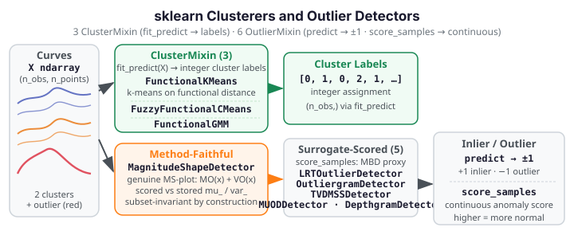

# Clusterers & Outlier Detectors

<div class="fdars-section-hero" markdown>
Three `ClusterMixin` and six `OutlierMixin` estimators wrap functional-data grouping
and anomaly-detection methods as standard sklearn estimators, composing naturally
in `Pipeline` and `cross_val_score`.
</div>

{ .fdars-diagram }

All estimators follow the plain-ndarray contract: input `X` is `(n_obs, n_points)`;
`argvals` (default `None`) sets the evaluation grid at construction. See the
[coverage / EXCLUDE list](coverage.md) for excluded functional clustering and outlier
methods (`cluster_optim`).

## Clusterers

`ClusterMixin` estimators perform unsupervised grouping of functional curves.
`fit_predict` is the primary interface — it returns integer cluster labels directly.

| Estimator | sklearn mixin | fdars source | Key constructor params |
|-----------|--------------|--------------|----------------------|
| `FunctionalKMeans` | `ClusterMixin` | `fdars._native.clustering.kmeans_fd` | `n_clusters=3`, `max_iter=100`, `tol=1e-6`, `argvals=None` |
| `FuzzyFunctionalCMeans` | `ClusterMixin` | `fdars._native.clustering.fuzzy_cmeans_fd` | `n_clusters=3`, `fuzziness=2.0`, `max_iter=...`, `argvals=None` |
| `FunctionalGMM` | `ClusterMixin` | `fdars._native.clustering.gmm_cluster` | `n_clusters=3`, `nbasis=5`, `max_iter=200`, `argvals=None` |

### FunctionalKMeans

k-means clustering on functional data using the fdars-native functional distance.
Cluster centres are functional curves, not scalar vectors. Converges when the
maximum centre movement falls below `tol`. This estimator passed the full
`check_estimator` battery at zero failures without fixes (Phase 55 baseline).

### FuzzyFunctionalCMeans

Fuzzy c-means clustering where each observation has a soft membership degree to
every cluster (not a hard assignment). The `fuzziness` parameter (default 2.0)
controls the degree of fuzziness: higher values blur cluster boundaries. `n_iter_`
is set to `max_iter` at fit time (the native method does not expose an iteration
count; this follows the same convention as `LogisticFPCClassifier`).

### FunctionalGMM

Gaussian mixture model for functional data, represented in a B-spline basis of
`nbasis` elements. Cluster membership is probabilistic. `n_iter_` is set to
`max_iter` at fit time (native exposes BIC/ICL but no EM iteration count).

## Outlier Detectors

`OutlierMixin` estimators label each observation as an inlier (`+1`) or outlier
(`-1`) via `predict`. The continuous anomaly score is available via
`score_samples` (higher = more normal / more inlier).

| Estimator | sklearn mixin | fdars source | Key constructor params |
|-----------|--------------|--------------|----------------------|
| `LRTOutlierDetector` | `OutlierMixin` | `fdars._native.outliers.detect_outliers_lrt_with_dist` (fit-time provenance); depth surrogate at score time | `contamination=0.1`, `alpha=0.05`, `argvals=None` |
| `OutliergramDetector` | `OutlierMixin` | `fdars._native.depth.modified_band_1d` (surrogate score); MEI/MBD stored as provenance | `contamination=0.1`, `factor=1.5`, `argvals=None` |
| `MagnitudeShapeDetector` | `OutlierMixin` | `fdars._native.outliers.magnitude_shape` (method-faithful MS-plot score) | `contamination=0.1`, `argvals=None` |
| `TVDMSSDetector` | `OutlierMixin` | `fdars._native.depth.modified_band_1d` (surrogate); TVD/MSS arrays stored as provenance | `contamination=0.1`, `emp_factor_mss=1.5`, `argvals=None` |
| `MUODDetector` | `OutlierMixin` | `fdars._native.depth.modified_band_1d` (surrogate); MUOD index arrays stored as provenance | `contamination=0.1`, `factor=1.5`, `argvals=None` |
| `DepthgramDetector` | `OutlierMixin` | `fdars._native.depth.modified_band_1d` (surrogate); shape/magnitude outlier indices stored as provenance | `contamination=0.1`, `outliergram_factor=1.5`, `argvals=None` |

!!! warning "Method-accuracy honesty"

    **`MagnitudeShapeDetector`** is the only method-faithful detector in this module.
    Its `score_samples` uses a genuine MS-plot decomposition:

    - Magnitude outlyingness `MO(x) = mean_t(|x(t) − μ(t)|)` against the stored
      pointwise training mean `mu_`.
    - Shape outlyingness `VO(x) = mean_t(|(x(t) − μ(t))² − σ²(t)|)` against the
      stored pointwise training variance `var_`.
    - Combined score `−(MO² + VO²)` (higher = more inlier).

    These statistics are computed against **fixed stored training statistics**
    (`mu_`, `var_`), so scoring a subset of test curves returns the same values as
    scoring them individually — `check_methods_subset_invariance` passes.

    **The other five detectors** (`LRTOutlierDetector`, `OutliergramDetector`,
    `TVDMSSDetector`, `MUODDetector`, `DepthgramDetector`) rank by a
    **subset-invariant modified-band-depth surrogate** in the sklearn layer. Their
    eponymous batch-relative native methods (LRT bootstrap, outliergram MEI/MBD,
    TVDMSS, MUOD, depthgram) are whole-batch statistics with no per-row
    decomposition — they cannot satisfy `check_methods_subset_invariance` directly.
    The sklearn wrappers compute `modified_band_1d(X_new, X_fit_)` (depth of new
    curves against the stored training population) as a subset-invariant proxy,
    while retaining the original native-method outputs as provenance attributes
    (e.g. `mbd_train_`, `mei_train_`, `tvd_train_`, `mss_train_`).

    **Use `fdars.outliers` directly** when you need the exact batch-relative scores
    from these methods.

## Typical Usage

**Clustering (unsupervised):**

```python
from sklearn.pipeline import Pipeline
from fdars.sklearn._skeletons import BSplineSmoother, FunctionalKMeans

pipe = Pipeline([
    ("smoother",  BSplineSmoother()),
    ("clusterer", FunctionalKMeans(n_clusters=3)),
])
labels = pipe.fit_predict(X)
```

**Outlier detection:**

```python
from fdars.sklearn._skeletons import MagnitudeShapeDetector

det = MagnitudeShapeDetector(contamination=0.05)
det.fit(X_train)
labels = det.predict(X_test)   # +1 inlier, -1 outlier
scores = det.score_samples(X_test)  # higher = more normal
```

For the five surrogate-scored detectors, `score_samples` is available and returns the
modified-band-depth values; use `fdars.outliers` for the method-exact scores.
