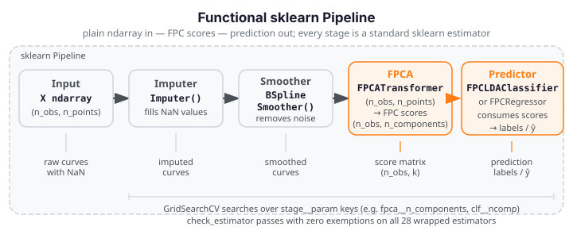

# scikit-learn API

<div class="fdars-section-hero" markdown>
`fdars.sklearn` wraps functional-data methods as standard scikit-learn estimators
so they compose directly in `Pipeline`, `GridSearchCV`, and `cross_val_score` —
no fdars-specific glue code required. Every wrapped estimator passes the full
`check_estimator` battery with **zero exemptions**.
</div>

## What the Layer Is

`fdars.sklearn` is a thin compatibility layer that exposes `fdars` functional-data
methods as scikit-learn-conforming estimators with the standard `fit` / `transform`
/ `predict` interface. This means:

- **Pipelines just work** — chain an `Imputer`, a `BSplineSmoother`, an
  `FPCATransformer`, and an `FPCLDAClassifier` in a single `Pipeline(...)` call.
- **Grid search just works** — `GridSearchCV` can search over smoothing bandwidth,
  number of FPC components, and classifier hyperparameters simultaneously.
- **Cross-validation just works** — `cross_val_score` treats the pipeline as a
  black box and handles train/test splits internally.
- **Native sklearn estimators compose freely** — the `FPCATransformer` output
  (an `(n_obs, n_components)` score matrix) feeds directly into any sklearn
  classifier or regressor without adaptation.

## Plain-ndarray Contract

Every estimator in `fdars.sklearn` operates on plain NumPy arrays:

| Parameter | Shape | Meaning |
|-----------|-------|---------|
| `X` (fit / transform / predict) | `(n_obs, n_points)` | Functional data matrix — each row is one observed curve |
| `argvals` (constructor param) | `(n_points,)` | Evaluation grid; default `np.arange(n_features)` |
| `y` (classifiers / regressors) | `(n_obs,)` | Labels or scalar targets |

`argvals` is passed to the estimator constructor, not to `fit` — this keeps the
sklearn-required signature `fit(X, y=None)` clean and makes pipelines work
without wrapping. Internally, estimators call `fdars._native.*` directly
and **never construct an `Fdata` object** — keeping the boundary clean and
avoiding dtype side-effects that would break the `check_estimator` battery.

## Installation

!!! info "Optional extra"

    `fdars.sklearn` is an optional extra. The base `fdars` package imports with
    scikit-learn entirely absent — the subpackage gates itself in its own
    `__init__.py`, mirroring the `advisor` and `mcp` pattern. Only install the
    extra when you need the sklearn layer.

```bash
pip install "fdars[sklearn]"
```

This pulls in `scikit-learn>=1.3` alongside the compiled `fdars` extension. The
`[sklearn]` extra is compatible with Python 3.9 – 3.14 and the full sklearn 1.3 –
1.8 release line.

## Full check_estimator Compliance

Every wrapped estimator in `fdars.sklearn` passes the **complete**
`parametrize_with_checks` battery (sklearn's internal `check_estimator` suite)
with **zero exemptions** — no `expected_failed_checks`, no `_xfail_checks`. This
is an unconditional guarantee, not a best-effort target.

The compliance rule is strict: if a functional-data method cannot satisfy the full
battery, it is **excluded** from the sklearn layer and stays in the functional API
— it is never wrapped with exemptions. Every excluded method is reason-coded and
documented on the [coverage / EXCLUDE list](coverage.md) (added in Plan 02).

**Verified on:** sklearn 1.8.0 / Python 3.14 — 28 estimators, 1 379 checks total.

## Pipeline Data Flow

{ .fdars-diagram }

## Five Estimator Families

`fdars.sklearn` organises its 28 wrapped estimators into five scikit-learn
families, each of which composes naturally into a Pipeline:

### Transformers

`TransformerMixin` estimators that map `(n_obs, n_points)` → `(n_obs, n_out)`.
Place these in the early stages of a `Pipeline` to preprocess raw curves before a
downstream predictor.

| Estimator | What it does |
|-----------|-------------|
| `Imputer` | Linear-interpolation imputation of `NaN` values in the curve matrix |
| `BSplineSmoother` | Per-curve B-spline / Nadaraya-Watson smoothing (removes measurement noise) |
| `LocalPolynomialSmoother` | Per-curve local-polynomial kernel smoothing |
| `BasisRepresentation` | Projects curves onto a B-spline basis; returns expansion coefficients |
| `SplineInterpolator` | Resamples curves onto a new evaluation grid |
| `DepthTransformer` | Maps each curve to its modified-band-depth scalar (1D depth feature) |
| `FPCATransformer` | Functional PCA: maps `(n_obs, n_points)` → `(n_obs, n_components)` FPC scores |
| `ElasticFPCATransformer` | Elastic FPCA: amplitude/phase-aware FPC scores |

**Pipeline role:** `Pipeline([("smoother", BSplineSmoother()), ("fpca", FPCATransformer()), ("clf", ...)])` — the transformer chain converts raw curves to FPC scores that feed a standard sklearn classifier.

### Regressors

`RegressorMixin` estimators that predict a scalar `y` from functional `X`.

| Estimator | What it does |
|-----------|-------------|
| `FPCRegressor` | FPC regression: OLS on FPCA score matrix |
| `GLMRegressor` | Gaussian FPC-OLS regression (Gaussian GLM on FPC scores) |
| `KNNRegressor` | k-nearest-neighbour regression on functional curves |
| `NonparametricRegressor` | Nadaraya-Watson scalar prediction from functional X |
| `RobustFPCRegressor` | Robust FPC regression (resistant to curve outliers) |

**Pipeline role:** `Pipeline([..., ("fpca", FPCATransformer(n_components=4)), ("reg", FPCRegressor(n_components=3))])` — regressors accept the `(n_obs, n_components)` score matrix from `FPCATransformer` directly.

### Classifiers

`ClassifierMixin` estimators that predict class labels from functional `X`.

| Estimator | What it does |
|-----------|-------------|
| `FPCLDAClassifier` | LDA on FPC scores |
| `FPCQDAClassifier` | QDA on FPC scores |
| `FPCKNNClassifier` | k-NN classifier on FPC scores |
| `DDClassifier` | DD-plot classifier (depth vs depth) |
| `ElasticMultinomialClassifier` | Multinomial logistic via elastic FPCA + OvR |

**Pipeline role:** `Pipeline([..., ("fpca", FPCATransformer()), ("clf", FPCLDAClassifier())])` — classifiers receive FPC score matrices or raw curve matrices and output class labels.

### Clusterers

`ClusterMixin` estimators (unsupervised).

| Estimator | What it does |
|-----------|-------------|
| `FunctionalKMeans` | k-means on functional curves (fdars-native distance) |
| `FunctionalGMM` | Gaussian mixture model on functional data |
| `FunctionalFuzzyCMeans` | Fuzzy c-means on functional curves |

**Pipeline role:** Typically used standalone or as the final stage of a preprocessing pipeline; `fit_predict` returns integer cluster labels.

### Outlier Detectors

`OutlierMixin` estimators that label observations as inliers (+1) or outliers (−1).

| Estimator | What it does |
|-----------|-------------|
| `MagnitudeShapeDetector` | MS-plot detector: separate magnitude and shape outlyingness |
| `LRTDetector` | Likelihood-ratio test detector |
| `OutliergamDetector` | Outliergram detector |
| `TVDMSSDetector` | TVDMSS detector |
| `MUODDetector` | MUOD detector |
| `DepthgramDetector` | Depthgram detector |

!!! warning "Scoring honesty"

    `MagnitudeShapeDetector` uses a method-faithful MS-plot score (joint magnitude /
    shape outlyingness from `fdars.outliers.magnitude_shape`). The other five detectors
    rank by a **subset-invariant modified-band-depth surrogate** in the sklearn layer
    — their true batch-relative methods remain in `fdars.outliers` and are available
    there. The sklearn wrappers are designed to pass `check_estimator`'s
    `check_methods_subset_invariance` test; use `fdars.outliers` directly when you
    need the exact batch-relative scores.

## Worked Example: Pipeline

The fence below builds a four-stage classification pipeline, fits it on a small
synthetic dataset (40 curves × 20 points, two Gaussian-shifted classes), and
plots the FPCA score space coloured by predicted class label.

```python exec="1" html="1" source="above"
import numpy as np
from docs_fig import fig, render
from fdars.sklearn._skeletons import (
    BSplineSmoother,
    FPCATransformer,
    FPCLDAClassifier,
    Imputer,
)
from sklearn.pipeline import Pipeline

# --- Synthetic dataset: 40 obs × 20 points, two separable classes --------
rng = np.random.default_rng(7)
half = 20
t = np.linspace(0, 1, 20)

X0 = rng.standard_normal((half, 20))           # class 0: baseline
X1 = rng.standard_normal((half, 20)) + 3.0     # class 1: mean-shifted +3

X = np.vstack([X0, X1])
y = np.array([0] * half + [1] * half, dtype=int)

# Inject sparse NaN so the Imputer stage does real work
X_nan = X.copy()
X_nan[::5, 2::7] = np.nan

# --- Four-stage Pipeline -------------------------------------------------
pipe = Pipeline([
    ("imputer",  Imputer()),
    ("smoother", BSplineSmoother()),
    ("fpca",     FPCATransformer(n_components=3)),
    ("clf",      FPCLDAClassifier()),
])

pipe.fit(X_nan, y)
y_pred = pipe.predict(X_nan)

# --- Visualise FPC scores coloured by predicted class --------------------
# Extract scores via an intermediate transform call (up to the fpca step)
preproc = Pipeline([
    ("imputer",  Imputer()),
    ("smoother", BSplineSmoother()),
    ("fpca",     FPCATransformer(n_components=3)),
])
scores = preproc.fit_transform(X_nan)

f, (a0, a1) = fig(1, 2, figsize=(11, 4.5))

# Left: raw (NaN-injected) curves coloured by true class
colors = ["#1a73e8", "#d62728"]
for i in range(len(X_nan)):
    a0.plot(t, X_nan[i], color=colors[y[i]], lw=0.9, alpha=0.55)
a0.set(title="Raw curves (NaN → imputed)", xlabel="t", ylabel="value")
for cls, lbl in [(0, "Class 0"), (1, "Class 1")]:
    a0.plot([], [], color=colors[cls], lw=2, label=lbl)
a0.legend()

# Right: FPC score space (PC1 vs PC2) coloured by predicted class
for cls in (0, 1):
    mask = y_pred == cls
    a1.scatter(
        scores[mask, 0], scores[mask, 1],
        color=colors[cls], s=40, alpha=0.8,
        label=f"Predicted class {cls}",
    )
a1.set(title="FPC score space (PC1 vs PC2)", xlabel="FPC 1", ylabel="FPC 2")
a1.legend()

print(render(f))
print("Predicted labels:", set(y_pred.tolist()), " FDARS_FENCE_OK")
```
