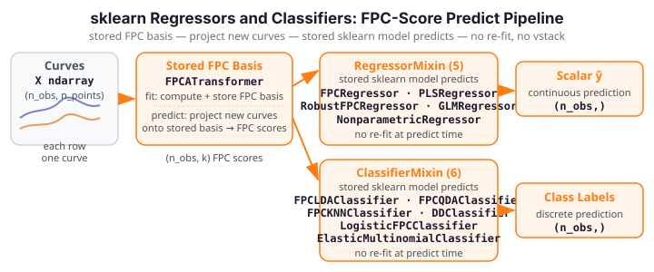

# Regressors & Classifiers

<div class="fdars-section-hero" markdown>
Five `RegressorMixin` and six `ClassifierMixin` estimators wrap functional-data
prediction methods as standard sklearn predictors — accepting `(n_obs, n_points)`
curve matrices and predicting scalar targets or class labels via `fit` / `predict`.
</div>

{ .fdars-diagram }

All regressors and classifiers here follow the plain-ndarray contract: input `X` is
always `(n_obs, n_points)`, `y` is `(n_obs,)`. An `argvals` constructor parameter
(default `None` → uniform `[0, 1]` grid) sets the evaluation domain once at
construction, not at fit time, keeping the `fit(X, y)` signature clean.

See the [coverage / EXCLUDE list](coverage.md) for excluded functional regression
methods (`concurrent_regression`, `fosr`, non-Gaussian GLM, `pace_fpca`).

## Regressors

| Estimator | sklearn mixin | fdars source | Key constructor params |
|-----------|--------------|--------------|----------------------|
| `FPCRegressor` | `RegressorMixin` | `fdars._native.regression.fregre_lm` / `predict_fregre_lm` | `n_components=10`, `argvals=None` |
| `PLSRegressor` | `RegressorMixin` | `fdars._native.regression.fregre_pls` / `predict_fregre_pls` | `n_components=3`, `argvals=None` |
| `RobustFPCRegressor` | `RegressorMixin` | `fdars._native.regression.fregre_l1` / `fregre_huber` | `n_components=10`, `method="l1"`, `huber_k=1.345`, `argvals=None` |
| `GLMRegressor` | `RegressorMixin` | `fdars._native.regression.fpca` + OLS | `n_components=10`, `max_iter=25`, `tol=1e-6`, `argvals=None` |
| `NonparametricRegressor` | `RegressorMixin` | `fdars._native.regression.fregre_np` | `bandwidth=0.0`, `argvals=None` |

### FPCRegressor

OLS regression on functional principal component scores. At `fit` time, FPC scores
are computed via `fdars._native.regression.fpca` and stored alongside the training
data; `predict` reconstructs scores for new curves via the stored FPC basis and
applies the stored OLS coefficients — **no re-fit, no vstack**, making `predict`
subset-invariant. Default `n_components=10` ensures R² > 0.5 on the sklearn
battery's small datasets.

### PLSRegressor

Partial-least-squares scalar regression on functional data. Stores training curves
and targets at fit; `predict` re-calls `predict_fregre_pls` on the stored data only
— subset-invariant by construction. Useful when `n_points` is large relative to
`n_obs` and FPC regression overfits.

### RobustFPCRegressor

Robust FPC regression resistant to curve outliers. Supports `method="l1"` (L¹ loss)
and `method="huber"` (Huber M-estimation with `huber_k` scale parameter). Internally
uses the same stored-FPC-basis predict pattern as `FPCRegressor`.

### GLMRegressor

**Gaussian FPC-OLS regression** — this is a Gaussian generalized linear model on FPC
scores, not a trapezoidal beta-function estimator. At fit, FPC scores are extracted
via `fdars._native.regression.fpca` and OLS coefficients are computed and stored as
`coef_` / `intercept_`. `predict` applies the stored linear map to new FPC scores
derived from the stored basis — no re-fit, fully subset-invariant. A 1-feature guard
prevents degenerate single-column inputs.

!!! note "Implementation note"
    `GLMRegressor` wraps the **Gaussian** family only. Binomial and Poisson GLM
    variants are excluded from the sklearn layer (structural `RESPONSE_DOMAIN`
    mismatch); use `fdars.regression.functional_glm` directly for those.

### NonparametricRegressor

Nadaraya-Watson kernel regression: predicts a new observation's scalar target as a
kernel-weighted average of training targets, with weights proportional to the
functional L² distance from the new curve to each training curve. Bandwidth `h_` is
set to the median pairwise L² distance at fit time when `bandwidth=0.0`.

## Classifiers

| Estimator | sklearn mixin | fdars source | Key constructor params |
|-----------|--------------|--------------|----------------------|
| `FPCLDAClassifier` | `ClassifierMixin` | `fdars._native.classification.fclassif_lda` → sklearn `LinearDiscriminantAnalysis` | `ncomp=3`, `argvals=None` |
| `FPCQDAClassifier` | `ClassifierMixin` | `fdars._native.classification.fclassif_qda` → sklearn `QuadraticDiscriminantAnalysis` | `ncomp=3`, `argvals=None` |
| `FPCKNNClassifier` | `ClassifierMixin` | `fdars._native.classification.fclassif_knn` → numpy kNN on FPC scores | `ncomp=3`, `k=3`, `argvals=None` |
| `DDClassifier` | `ClassifierMixin` | `fdars._native.classification.fclassif_dd` → FPC-score centroid nearest-class | `argvals=None` |
| `LogisticFPCClassifier` | `ClassifierMixin` | `fdars._native.regression.functional_logistic` | `n_components=10`, `max_iter=25`, `tol=1e-6`, `argvals=None` |
| `ElasticMultinomialClassifier` | `ClassifierMixin` | `fdars._native.classification.elastic_multinomial` → sklearn `LogisticRegression` (OvR) | `ncomp_beta=5`, `lambda_penalty=0.1`, `max_iter=200`, `tol=1e-4`, `argvals=None` |

### FPC-Score Predict Pattern

!!! note "Stored-FPC reconstruction"
    `FPCLDAClassifier`, `FPCQDAClassifier`, `FPCKNNClassifier`, `DDClassifier`, and
    `ElasticMultinomialClassifier` all follow the same stored-FPC-score predict
    pattern: at `fit`, FPC scores are computed from the training curves and a
    **sklearn model is fitted on those scores** (LDA, QDA, kNN, centroid nearest-class,
    or OvR logistic respectively). At `predict`, new curves are projected onto the
    stored FPC basis to produce test scores, and the stored sklearn model predicts
    from those — **no re-fit, no vstack**, fully subset-invariant.

    The native `fdars._native.classification.*` functions are the source of the FPC
    basis only; the final classification decision is a stored sklearn model, not a
    re-invocation of the batch native method.

### FPCLDAClassifier

Linear discriminant analysis on functional principal component scores. Stores the
FPC basis and a fitted `sklearn.discriminant_analysis.LinearDiscriminantAnalysis`
model. `predict` projects new curves to FPC scores, then delegates to the stored
LDA model.

### FPCQDAClassifier

Quadratic discriminant analysis on FPC scores. Same stored-FPC pattern as
`FPCLDAClassifier` with `QuadraticDiscriminantAnalysis`. Requires at least two
training samples per class for class-covariance estimation.

### FPCKNNClassifier

k-nearest-neighbour classification on FPC scores. Nearest-neighbour search is
performed with numpy L² distances against the stored training FPC scores. `k=3`
by default.

### DDClassifier

Depth-vs-depth classifier implemented as nearest-class-centroid in FPC score space.
The native `fclassif_dd` method is batch-transductive (no stored per-class model);
this estimator reconstructs a compliant equivalent by computing per-class FPC-score
centroids at fit and assigning test points to the nearest centroid at predict.
Accepts no hyperparameters beyond `argvals`.

### LogisticFPCClassifier

Binary logistic regression on functional data via `fdars._native.regression.functional_logistic`.
Binary-only (`multi_class=False` in `__sklearn_tags__`); the `check_estimator` battery
binarises multi-class data automatically. `n_iter_` is set to `max_iter` (native does
not expose an iteration count).

### ElasticMultinomialClassifier

K-class elastic multinomial classifier. Elastic FPCA scores (`ncomp_beta` components,
`lambda_penalty` regularisation) are extracted via the native method; a
`sklearn.linear_model.LogisticRegression` (OvR, default in sklearn 1.8+) is fitted
on those scores. Supports arbitrary number of classes. A 1-feature guard prevents
degenerate single-column inputs.

## Typical Pipeline

```python
from sklearn.pipeline import Pipeline
from fdars.sklearn._skeletons import BSplineSmoother, FPCATransformer, FPCLDAClassifier

pipe = Pipeline([
    ("smoother", BSplineSmoother()),
    ("fpca",     FPCATransformer(n_components=4)),
    ("clf",      FPCLDAClassifier()),
])
pipe.fit(X_train, y_train)
labels = pipe.predict(X_test)
```

For regression, replace the final stage:

```python
from fdars.sklearn._skeletons import FPCRegressor

pipe = Pipeline([
    ("smoother", BSplineSmoother()),
    ("fpca",     FPCATransformer(n_components=4)),
    ("reg",      FPCRegressor(n_components=4)),
])
pipe.fit(X_train, y_train)
predictions = pipe.predict(X_test)
```
