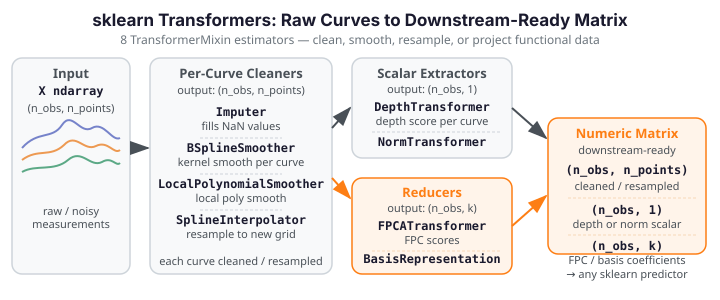

# Transformers

<div class="fdars-section-hero" markdown>
Eight `TransformerMixin` estimators map raw functional data `(n_obs, n_points)` to
preprocessed or reduced representations — cleaning, smoothing, re-representing, and
projecting curves so downstream predictors receive well-conditioned numeric matrices.
</div>

{ .fdars-diagram }

The transformers are the workhorse of any functional-data `Pipeline`. A typical
chain starts with `Imputer` to fill measurement gaps, follows with a smoother to
reduce noise, and ends with `FPCATransformer` to project curves onto their leading
functional principal components — producing an `(n_obs, n_components)` score matrix
that any sklearn classifier or regressor can consume directly.

See the [coverage / EXCLUDE list](coverage.md) for the full 28-estimator wrapped set
and all structural exclusions.

## Estimator Reference

| Estimator | sklearn mixin | fdars source | Key constructor params |
|-----------|--------------|--------------|----------------------|
| `FPCATransformer` | `TransformerMixin` | `fdars._native.regression.fpca` | `n_components=3`, `argvals=None` |
| `BSplineSmoother` | `TransformerMixin` | `fdars._native.smoothing.nadaraya_watson` | `bandwidth=None`, `kernel="gaussian"`, `argvals=None` |
| `LocalPolynomialSmoother` | `TransformerMixin` | `fdars._native.smoothing.local_polynomial` | `bandwidth=None`, `degree=1`, `kernel="gaussian"`, `argvals=None` |
| `BasisRepresentation` | `TransformerMixin` | `fdars._native.basis.fdata_to_basis_1d` | `n_basis=5`, `basis_type="bspline"`, `argvals=None` |
| `Imputer` | `TransformerMixin` | `fdars._native.fdata` (interpolation) | `method="linear"`, `constant_value=0.0`, `argvals=None` |
| `SplineInterpolator` | `TransformerMixin` | `fdars._native.represent.spline_interpolate` | `output_argvals=None`, `order=3`, `argvals=None` |
| `DepthTransformer` | `TransformerMixin` | `fdars._native.depth.fraiman_muniz_1d` | `depth_method="fraiman_muniz"`, `scale=True`, `argvals=None` |
| `NormTransformer` | `TransformerMixin` | `fdars._native.fdata.norm_lp_1d` | `p=2.0`, `argvals=None` |

## Estimator Details

### FPCATransformer

**Role in a Pipeline:** the dimensionality-reduction hub. Maps
`(n_obs, n_points)` → `(n_obs, n_components)` functional principal component
scores. The `fit` call computes the FPC basis via SVD with sign canonicalization
(the largest absolute value in each eigenvector is made positive), making `fit`
idempotent across re-runs on the same data. The output score matrix feeds any
sklearn classifier, regressor, or clustering estimator without adaptation.

```python
from fdars.sklearn._skeletons import FPCATransformer
fpca = FPCATransformer(n_components=4)
```

### BSplineSmoother

Per-curve B-spline / Nadaraya-Watson kernel smoother. Applies smoothing
row-by-row so each observed curve is smoothed independently against its own
evaluation grid. `bandwidth=None` activates automatic bandwidth selection via
the native heuristic.

```python
from fdars.sklearn._skeletons import BSplineSmoother
smoother = BSplineSmoother(bandwidth=0.2, kernel="gaussian")
```

### LocalPolynomialSmoother

Per-curve local-polynomial kernel smoother. A polynomial of degree `degree`
is fit locally at each evaluation point using a kernel-weighted neighbourhood.
Useful when curves have local trend features that B-spline smoothing over-smooths.

```python
from fdars.sklearn._skeletons import LocalPolynomialSmoother
lps = LocalPolynomialSmoother(degree=2, bandwidth=0.15)
```

### BasisRepresentation

Projects each curve onto a B-spline basis of `n_basis` elements and returns the
expansion coefficients as the transformed matrix. Output shape is
`(n_obs, n_basis)`. A 1-feature guard prevents the native call from receiving
degenerate single-column inputs.

```python
from fdars.sklearn._skeletons import BasisRepresentation
basis = BasisRepresentation(n_basis=8, basis_type="bspline")
```

### Imputer

Linear-interpolation imputation of `NaN` values in the raw curve matrix. Each
curve is imputed independently; boundary `NaN`s are forward/backward filled.
Place `Imputer` first in any Pipeline when measurement gaps are expected.

```python
from fdars.sklearn._skeletons import Imputer
imp = Imputer(method="linear")
```

### SplineInterpolator

Resamples each curve from its current `argvals` grid onto a new `output_argvals`
grid using spline interpolation of order `order` (default 3, cubic). Useful for
harmonising irregular or mis-aligned grids before downstream estimators that
expect a fixed grid.

```python
from fdars.sklearn._skeletons import SplineInterpolator
interp = SplineInterpolator(output_argvals=np.linspace(0, 1, 50), order=3)
```

### DepthTransformer

Maps each curve to a single scalar: its modified band-depth (or the depth
function named by `depth_method`). Output shape is `(n_obs, 1)`. Useful for
constructing a depth-based feature column that feeds a standard scalar
classifier or for downstream outlier ranking.

```python
from fdars.sklearn._skeletons import DepthTransformer
dt = DepthTransformer(depth_method="fraiman_muniz", scale=True)
```

### NormTransformer

Maps each curve to its L^p norm scalar. Output shape is `(n_obs, 1)`. With
`p=2.0` (default) this is the functional L² norm; `p=1.0` gives the L¹ norm.
A lightweight feature extractor when only global curve magnitude matters.

```python
from fdars.sklearn._skeletons import NormTransformer
nt = NormTransformer(p=2.0)
```

## Typical Pipeline

```python
from sklearn.pipeline import Pipeline
from fdars.sklearn._skeletons import Imputer, BSplineSmoother, FPCATransformer, FPCLDAClassifier

pipe = Pipeline([
    ("imputer",  Imputer()),
    ("smoother", BSplineSmoother()),
    ("fpca",     FPCATransformer(n_components=4)),
    ("clf",      FPCLDAClassifier()),
])
```

The transformer chain is **order-sensitive by design** — the output of each step
must match the input contract of the next. See the concept overview on
[sklearn/index.md](index.md) for the plain-ndarray contract.
